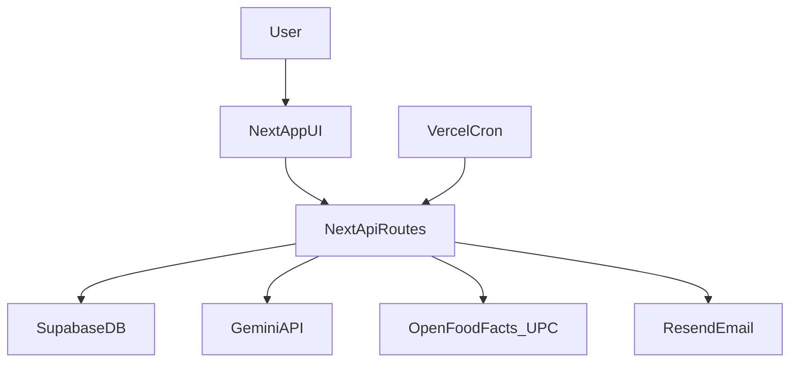

# NutriScan Full Code Dump

Generated for AI context sharing. Includes root config/docs + src + scripts + public.

## FILE: .env.local.example

`$lang

# ── NextAuth ──────────────────────────────────────────────────────────────────
NEXTAUTH_URL=https://your-production-domain.com
NEXTAUTH_SECRET=generate-with-openssl-rand-base64-32

# ── Google OAuth ──────────────────────────────────────────────────────────────
GOOGLE_CLIENT_ID=your-google-client-id.apps.googleusercontent.com
GOOGLE_CLIENT_SECRET=your-google-client-secret

# ── Supabase ──────────────────────────────────────────────────────────────────
NEXT_PUBLIC_SUPABASE_URL=https://your-project.supabase.co
NEXT_PUBLIC_SUPABASE_ANON_KEY=your-supabase-anon-key
SUPABASE_SERVICE_ROLE_KEY=your-supabase-service-role-key

# ── Gemini AI ─────────────────────────────────────────────────────────────────
GEMINI_API_KEY=your-gemini-api-key

# ── Email (Resend) ────────────────────────────────────────────────────────────
RESEND_API_KEY=re_your_resend_api_key

# ── Security ──────────────────────────────────────────────────────────────────
CRON_SECRET=your-random-secret-string

# ── Analytics ─────────────────────────────────────────────────────────────────
NEXT_PUBLIC_GA_MEASUREMENT_ID=G-XXXXXXXXXX
```

## FILE: .eslintrc.json

`$lang
{
  "extends": "next/core-web-vitals",
  "rules": {
    "@typescript-eslint/no-explicit-any": "off",
    "@typescript-eslint/no-unused-vars": "off",
    "@typescript-eslint/ban-ts-comment": "off",
    "react-hooks/exhaustive-deps": "off",
    "react/no-unescaped-entities": "off",
    "@next/next/no-img-element": "off"
  }
}
```

## FILE: .gitignore

`$lang
# See https://help.github.com/articles/ignoring-files/ for more about ignoring files.

# dependencies
/node_modules
/.pnp
.pnp.js
.yarn/install-state.gz

# testing
/coverage

# next.js
/.next/
/out/

# production
/build

# misc
.DS_Store
*.pem

# debug
npm-debug.log*
yarn-debug.log*
yarn-error.log*

# local env files
.env*.local

# vercel
.vercel

# typescript
*.tsbuildinfo
next-env.d.ts
#products open food facts
*.csv
*.gz
off_full.csvAS
```

## FILE: next.config.mjs

`$lang
/** @type {import('next').NextConfig} */
const nextConfig = {
  typescript: {
    ignoreBuildErrors: false,
  },
  eslint: {
    ignoreDuringBuilds: false,
  },
  images: {
    remotePatterns: [
      { protocol: 'https', hostname: '**.openfoodfacts.org' },
      { protocol: 'https', hostname: 'images.openfoodfacts.org' },
      { protocol: 'https', hostname: 'static.openfoodfacts.org' },
      { protocol: 'https', hostname: 'world.openfoodfacts.org' },
      { protocol: 'https', hostname: 'lh3.googleusercontent.com' },
    ],
  },
  async headers() {
    return [
      {
        source: '/(.*)',
        headers: [
          { key: 'X-Frame-Options', value: 'DENY' },
          { key: 'X-Content-Type-Options', value: 'nosniff' },
          { key: 'X-XSS-Protection', value: '1; mode=block' },
          { key: 'Referrer-Policy', value: 'strict-origin-when-cross-origin' },
          {
            key: 'Permissions-Policy',
            value: 'camera=(self), microphone=(self)',
          },
          {
            key: 'Strict-Transport-Security',
            value: 'max-age=63072000; includeSubDomains; preload',
          },
          {
            key: 'Content-Security-Policy',
            value: [
              "default-src 'self'",
              "script-src 'self' 'unsafe-eval' 'unsafe-inline' https://www.googletagmanager.com https://www.google-analytics.com",
              "frame-src 'none'",
              "object-src 'none'",
              "base-uri 'self'",
              "form-action 'self'",
              "connect-src 'self' https://generativelanguage.googleapis.com https://www.google-analytics.com https://analytics.google.com",
              "img-src 'self' data: https: blob:",
              "font-src 'self'",
              "style-src 'self' 'unsafe-inline'",
            ].join('; '),
          },
        ],
      },
    ]
  },
  output: 'standalone',
}

export default nextConfig
```

## FILE: package.json

`$lang
{
  "name": "healthox",
  "version": "0.1.0",
  "private": true,
  "scripts": {
    "dev": "next dev",
    "build": "next build",
    "start": "next start",
    "lint": "next lint",
    "test": "vitest",
    "test:run": "vitest run"
  },
  "dependencies": {
    "@auth/supabase-adapter": "^1.11.1",
    "@google/generative-ai": "^0.24.1",
    "@supabase/supabase-js": "^2.99.3",
    "@tanstack/react-query": "^5.94.5",
    "axios": "^1.13.6",
    "clsx": "^2.1.1",
    "date-fns": "^4.1.0",
    "dotenv": "^17.4.2",
    "lucide-react": "^0.577.0",
    "next": "^16.2.3",
    "next-auth": "^4.24.13",
    "next-themes": "^0.4.6",
    "quagga": "^0.6.16",
    "react": "^18",
    "react-dom": "^18",
    "react-hot-toast": "^2.6.0",
    "recharts": "^3.8.0",
    "resend": "^6.9.4",
    "tailwind-merge": "^3.5.0",
    "zod": "^4.3.6"
  },
  "devDependencies": {
    "@testing-library/jest-dom": "^6.9.1",
    "@testing-library/react": "^16.3.2",
    "@types/node": "^20.19.39",
    "@types/react": "^18",
    "@types/react-dom": "^18",
    "eslint": "^10.2.0",
    "eslint-config-next": "^16.2.3",
    "jsdom": "^24.1.3",
    "postcss": "^8",
    "puppeteer": "^24.40.0",
    "tailwindcss": "^3.4.1",
    "typescript": "^5",
    "vitest": "^3.2.4"
  }
}
```

## FILE: postcss.config.mjs

`$lang
/** @type {import('postcss-load-config').Config} */
const config = {
  plugins: {
    tailwindcss: {},
  },
};

export default config;
```

## FILE: PROJECT_CONTEXT_MASTER.md

`$lang
# NutriScan Master Project Context

This document is the single-source project context for future AI chats.  
Use it as the first message context when starting a new thread.

## 1) Project Identity

- Product name in code/UI: **NutriScan** (also appears as **HealthOX** in several files/strings).
- Purpose: scan packaged foods (barcode/photo), analyze health impact with Gemini AI, log meals, track nutrition, and send weekly email reports.
- Target style: mobile-first, consumer nutrition guidance, India-focused recommendations (FSSAI/ICMR/WHO references).

## 2) Tech Stack

- Framework: Next.js App Router (`next` 16) + React 18 + TypeScript.
- Auth/session: NextAuth (Google provider).
- Database/backend service: Supabase (client + service-role admin usage).
- AI: Google Gemini API wrapper in `src/lib/gemini.ts`.
- Styling: Tailwind + custom CSS variables.
- State/data fetching: TanStack React Query.
- Analytics: Google Analytics helper.
- Email: Resend API.
- Tests: Vitest + Testing Library; very limited coverage.
- Deployment assumptions: Vercel (cron endpoint configured in `vercel.json`).

## 3) High-Level Architecture



## 4) Runtime Entrypoints

- App shell: `src/app/layout.tsx` (providers, error boundary, bottom nav, service worker register).
- Root route: `src/app/page.tsx` redirects to sign-in.
- Main app pages:
  - `src/app/auth/signin/page.tsx`
  - `src/app/scan/page.tsx`
  - `src/app/dashboard/page.tsx`
  - `src/app/history/page.tsx`
  - `src/app/scan-history/page.tsx`
  - `src/app/profile-setup/page.tsx`
- API entrypoints: all `src/app/api/**/route.ts`.
- Scheduled job: `GET /api/cron/weekly-report` (called by Vercel cron).

## 5) Core User Flows

### Scan + Analyze Flow

1. User scans barcode/photo in `src/app/scan/page.tsx`.
2. Barcode lookup hits `GET /api/scan`:
   - cache (`products` table) -> Open Food Facts -> UPC Item DB fallback.
3. Product is analyzed via `POST /api/analyze`:
   - validates payload with Zod.
   - optional user profile personalization.
   - calls Gemini wrapper.
   - optionally caches AI analysis in `products`.
4. If logged in, scan summary is stored through `POST /api/scan-session`.

### Vision/Product-Photo Flow

- `POST /api/scan-vision` and `POST /api/scan-product-photo` extract data from images via Gemini.
- Extracted products may be persisted via `POST /api/products/submit`.

### Meal Logging + Dashboard Flow

1. Scan page sends meal logs to `POST /api/log`.
2. Dashboard page reads profile API + direct Supabase meal logs query.
3. Dashboard widgets call:
   - `/api/streak`
   - `/api/nutrients/summary`
   - `/api/last-scan`

### Email Flow

- New-user sign-in callback triggers `/api/welcome-email`.
- Weekly digest cron aggregates user data and sends emails via Resend.
- Unsubscribe links point to `/api/unsubscribe?userId=...&type=...`.

## 6) Data Model (Inferred from Usage)

The app strongly assumes these tables/columns exist:

- `user_profiles`:
  - identity + profile (`user_id`, `email`, `name`, health fields)
  - preferences (`weekly_report_email`, `email_unsubscribed`, `welcome_email_sent`)
- `products`:
  - barcode/product metadata and nutrition
  - AI fields (`ai_health_rating`, `ai_analysis_json`, `ai_analyzed_at`)
- `food_logs`:
  - per-user meal entries (`quantity_g`, calories/macros, `meal_type`, `logged_at`)
- `scan_sessions`:
  - recent scan snapshots and AI score/rating
- `rate_limits`:
  - request tracking per `user_id` + `action` + timestamp

## 7) Environment Contract

From `.env.local.example` and code usage:

- Auth: `NEXTAUTH_URL`, `NEXTAUTH_SECRET`, Google OAuth vars.
- Supabase: `NEXT_PUBLIC_SUPABASE_URL`, `NEXT_PUBLIC_SUPABASE_ANON_KEY`, `SUPABASE_SERVICE_ROLE_KEY`.
- AI: `GEMINI_API_KEY`.
- Email: `RESEND_API_KEY`.
- Cron security: `CRON_SECRET`.
- Analytics: `NEXT_PUBLIC_GA_MEASUREMENT_ID`.

Notes:
- Code also references Open Food Facts contribution credentials (`OFF_USERNAME`, `OFF_PASSWORD`) in product submit/scripting paths, but these are not listed in `.env.local.example`.

## 8) File-by-File Map (Authored Files)

### Root / Config

- `package.json`: scripts + dependency manifest.
- `README.md`: default Next.js boilerplate; not project-specific.
- `.env.local.example`: environment template.
- `.gitignore`: ignore patterns for local/build/env/data outputs.
- `.eslintrc.json`: relaxed rule set (many safety rules disabled).
- `next.config.mjs`: image domains + security headers + standalone output.
- `postcss.config.mjs`: Tailwind PostCSS plugin.
- `tailwind.config.ts`: theme/tailwind scanning config.
- `tsconfig.json`: strict TS with alias config.
- `vercel.json`: weekly cron schedule.
- `vitest.config.ts`: Vitest + jsdom + setup mapping.

### App Pages

- `src/app/layout.tsx`: global metadata/layout/providers/nav.
- `src/app/page.tsx`: redirect to sign-in.
- `src/app/dashboard/page.tsx`: dashboard composition + daily totals.
- `src/app/history/page.tsx`: meal history by date/meal filter.
- `src/app/scan/page.tsx`: main scanner/analyzer orchestration (very large component).
- `src/app/scan-history/page.tsx`: list of previously scanned items.
- `src/app/profile-setup/page.tsx`: profile and email preferences wizard.
- `src/app/auth/signin/page.tsx`: sign-in + guest mode.
- `src/app/privacy/page.tsx`: privacy static page.
- `src/app/terms/page.tsx`: terms static page.
- `src/app/globals.css`: global theme/layout/animation styles.

### API Routes

- `src/app/api/auth/[...nextauth]/route.ts`: NextAuth config + profile upsert + welcome-email trigger.
- `src/app/api/scan/route.ts`: barcode data retrieval with multi-source fallback.
- `src/app/api/analyze/route.ts`: AI nutrition risk analysis pipeline.
- `src/app/api/analyze/analyze.test.ts`: tests for analyze behavior.
- `src/app/api/scan-product-photo/route.ts`: full product extraction from image.
- `src/app/api/scan-vision/route.ts`: label/vision extraction for not-found products.
- `src/app/api/products/submit/route.ts`: persist extracted product + optional OFF sync.
- `src/app/api/profile/route.ts`: profile read/write and metric calculations.
- `src/app/api/profile/email-prefs/route.ts`: save email preference flags.
- `src/app/api/log/route.ts`: create food log entry.
- `src/app/api/log/delete/route.ts`: delete food log entry.
- `src/app/api/scan-session/route.ts`: save/update recent scan records.
- `src/app/api/last-scan/route.ts`: fetch latest scanned item.
- `src/app/api/streak/route.ts`: compute current/longest logging streak.
- `src/app/api/nutrients/summary/route.ts`: weekly nutrient summary and alerts.
- `src/app/api/welcome-email/route.ts`: onboarding email send endpoint.
- `src/app/api/unsubscribe/route.ts`: unsubscribe HTML + preference updates.
- `src/app/api/cron/weekly-report/route.ts`: scheduled weekly nutrition report sender.

### Components

- `src/components/Providers.tsx`: session/query/theme/toast providers.
- `src/components/BottomNav.tsx`: mobile nav with auth-aware links.
- `src/components/ErrorBoundary.tsx`: app-level React boundary.
- `src/components/ServiceWorkerRegister.tsx`: SW registration.
- `src/components/Skeleton.tsx`: loading placeholders.
- `src/components/Analytics.tsx`: GA integration.

Dashboard widgets:
- `src/components/dashboard/CalorieRing.tsx`
- `src/components/dashboard/WeeklyChart.tsx`
- `src/components/dashboard/RecentScans.tsx`
- `src/components/dashboard/MealStreak.tsx`
- `src/components/dashboard/NutrientAlerts.tsx`
- `src/components/dashboard/LastScanned.tsx`

Scanner widgets:
- `src/components/scanner/BarcodeScanner.tsx`
- `src/components/scanner/AnalysisCard.tsx`

### Lib / Types / Test Setup

- `src/lib/supabase.ts`: browser Supabase client.
- `src/lib/supabaseAdmin.ts`: server privileged Supabase client.
- `src/lib/gemini.ts`: Gemini API wrapper + retry/error mapping.
- `src/lib/rateLimit.ts`: DB-backed request limiter.
- `src/lib/analytics.ts`: analytics helper/events.
- `src/types/index.ts`: shared TS domain types.
- `src/test/setup.ts`: test environment setup.

### Scripts / Public Assets

- `scripts/import-off-india.ts`: import OFF dataset file into Supabase.
- `scripts/scrape-indian-products.ts`: scrape + persist products from OFF.
- `public/manifest.json`: PWA metadata.
- `public/sw.js`: service worker cache logic.
- `public/icon.svg`: app icon asset.

## 9) Current Gaps, Risks, and Missing Pieces

### Correctness Risks (High)

- `src/app/history/page.tsx` uses `totalMeals` but never defines it (runtime error risk).
- `src/app/dashboard/page.tsx` imports default exports from files that export named functions (`CalorieRing`, `WeeklyChart`, `RecentScans`) and passes mismatched props to `RecentScans`.

### Security/Trust Risks

- Unsubscribe endpoint uses raw `userId` query params without signed token validation.
- Several routes rely on permissive logging (`console.log`) with potentially sensitive operational context.
- CSP still permits `'unsafe-inline'` and `'unsafe-eval'` scripts.
- Mixed client-side direct DB access vs server API access increases attack surface and inconsistency.

### Reliability/Scalability Risks

- `checkRateLimit` is count-then-insert, which is not atomic (race condition under concurrency).
- Weekly report cron sends emails in serial loop; may hit timeouts as users grow.
- AI JSON parsing is brittle; structured-output safeguards are limited.
- Scan page is monolithic and state-heavy; hard to maintain and test.

### Product/Data Quality Risks

- Health scoring and nutrient thresholds are heavily prompt-based and may drift per model behavior.
- RDA assumptions in nutrient summary are static defaults and not deeply personalized.
- Client can submit nutrient values when logging meals; route validates ranges but not source authenticity.

### Engineering Process Risks

- Very limited tests (primarily analyze route scenarios).
- Lint safeguards are intentionally relaxed (`any`, unused vars, hook deps disabled).
- README lacks project-specific onboarding, architecture, and runbook.

## 10) Optimization Backlog (Priority Order)

1. Fix dashboard/history correctness issues (export/import/prop mismatches and undefined variable).
2. Standardize data access: move user data reads behind server API routes where possible.
3. Replace non-atomic rate limiting with transactional/DB-native strategy.
4. Refactor `src/app/scan/page.tsx` into feature hooks/components (scan, analyze, logging, UI tabs).
5. Add integration tests for critical API routes (`scan`, `log`, `profile`, `cron`, `unsubscribe`).
6. Harden unsubscribe links with signed expiring tokens.
7. Reduce verbose production logs and centralize error logging.
8. Improve README with architecture diagram, env setup, DB schema assumptions, and troubleshooting.
9. Add observability metrics around AI failures, latency, and parse errors.
10. Improve weekly report throughput (batching/parallelism with retry limits).

## 11) Quick Commands

- Install: `npm install`
- Dev: `npm run dev`
- Build: `npm run build`
- Lint: `npm run lint`
- Test: `npm run test`

## 12) Reusable Starter Context for New AI Chats

Paste this block at the top of a new chat:

```text
Project: NutriScan (Next.js App Router + TypeScript).
Goal: AI-powered food scanner (barcode/photo), Gemini health analysis, meal logging, dashboard tracking, and weekly email reports.

Key architecture:
- Frontend pages in src/app/*
- API routes in src/app/api/*/route.ts
- Supabase clients in src/lib/supabase.ts and src/lib/supabaseAdmin.ts
- Gemini wrapper in src/lib/gemini.ts

Critical known issues:
- src/app/history/page.tsx references totalMeals without definition.
- src/app/dashboard/page.tsx likely has import/export and prop mismatches with dashboard components.
- Rate limiter in src/lib/rateLimit.ts is non-atomic.
- Unsubscribe endpoint uses userId query params without signed tokens.

When editing:
- Keep auth/session behavior intact.
- Preserve API contracts used by scan page and dashboard widgets.
- Prefer incremental refactors with tests for affected routes/components.

Use PROJECT_CONTEXT_MASTER.md as source of truth for full file map and optimization backlog.
```

## 13) Excluded from Deep Code Reasoning

Generated/vendor artifacts should not be treated as authored project logic:

- `node_modules/`
- `.next/`
- `out/`
- `build/`
- `coverage/`
- `.vercel/`
- generated cache/artifact files (e.g., tsbuildinfo, local exports)

```

## FILE: public/icon.svg

`$lang
<svg xmlns="http://www.w3.org/2000/svg" viewBox="0 0 100 100">
  <rect width="100" height="100" rx="20" fill="#16a34a"/>
  <text y="75" x="50" text-anchor="middle" font-size="65">🥗</text>
</svg>
```

## FILE: public/manifest.json

`$lang
{
  "name": "NutriScan — AI Food Health Advisor",
  "short_name": "NutriScan",
  "description": "Scan any packaged food and get an instant AI health rating",
  "start_url": "/dashboard",
  "display": "standalone",
  "background_color": "#f0fdf4",
  "theme_color": "#059669",
  "orientation": "portrait",
  "icons": [
    {
      "src": "/icon.svg",
      "sizes": "any",
      "type": "image/svg+xml",
      "purpose": "maskable any"
    }
  ],
  "categories": ["health", "food", "fitness"]
}
```

## FILE: public/sw.js

`$lang
const CACHE_NAME = 'nutriscan-v1'
const STATIC_ASSETS = [
  '/',
  '/dashboard',
  '/scan',
  '/history',
  '/profile-setup',
]

// Install — cache static assets
self.addEventListener('install', (event) => {
  event.waitUntil(
    caches.open(CACHE_NAME).then((cache) => {
      return cache.addAll(STATIC_ASSETS)
    })
  )
  self.skipWaiting()
})

// Activate — clean old caches
self.addEventListener('activate', (event) => {
  event.waitUntil(
    caches.keys().then((keys) =>
      Promise.all(
        keys
          .filter((key) => key !== CACHE_NAME)
          .map((key) => caches.delete(key))
      )
    )
  )
  self.clients.claim()
})

// Fetch — network-first for API calls, cache-first for static assets
self.addEventListener('fetch', (event) => {
  const { request } = event
  const url = new URL(request.url)

  // Skip non-GET requests
  if (request.method !== 'GET') return

  // Skip chrome-extension and other non-http(s) requests
  if (!url.protocol.startsWith('http')) return

  // API calls — always try network, fall back to nothing (fail gracefully)
  if (url.pathname.startsWith('/api/')) {
    event.respondWith(
      fetch(request).catch(() => {
        return new Response(
          JSON.stringify({ success: false, error: 'You are offline. Please check your connection and try again.' }),
          { status: 503, headers: { 'Content-Type': 'application/json' } }
        )
      })
    )
    return
  }

  // Static assets and pages — cache-first, update in background
  event.respondWith(
    caches.match(request).then((cached) => {
      const networkFetch = fetch(request).then((response) => {
        if (response.ok) {
          const clone = response.clone()
          caches.open(CACHE_NAME).then((cache) => cache.put(request, clone))
        }
        return response
      }).catch(() => cached)
      return cached || networkFetch
    })
  )
})
```

## FILE: README.md

`$lang
This is a [Next.js](https://nextjs.org) project bootstrapped with [`create-next-app`](https://nextjs.org/docs/app/api-reference/cli/create-next-app).

## Getting Started

First, run the development server:

```bash
npm run dev
# or
yarn dev
# or
pnpm dev
# or
bun dev
```

Open [http://localhost:3000](http://localhost:3000) with your browser to see the result.

You can start editing the page by modifying `app/page.tsx`. The page auto-updates as you edit the file.

This project uses [`next/font`](https://nextjs.org/docs/app/building-your-application/optimizing/fonts) to automatically optimize and load [Geist](https://vercel.com/font), a new font family for Vercel.

## Learn More

To learn more about Next.js, take a look at the following resources:

- [Next.js Documentation](https://nextjs.org/docs) - learn about Next.js features and API.
- [Learn Next.js](https://nextjs.org/learn) - an interactive Next.js tutorial.

You can check out [the Next.js GitHub repository](https://github.com/vercel/next.js) - your feedback and contributions are welcome!

## Deploy on Vercel

The easiest way to deploy your Next.js app is to use the [Vercel Platform](https://vercel.com/new?utm_medium=default-template&filter=next.js&utm_source=create-next-app&utm_campaign=create-next-app-readme) from the creators of Next.js.

Check out our [Next.js deployment documentation](https://nextjs.org/docs/app/building-your-application/deploying) for more details.
```

## FILE: scripts/import-off-india.ts

`$lang
import * as dotenv from 'dotenv'
dotenv.config({ path: '.env.local' })
import * as fs from 'fs'
import * as readline from 'readline'
import { createClient } from '@supabase/supabase-js'
 
// Load env manually for script context
const SUPABASE_URL      = process.env.NEXT_PUBLIC_SUPABASE_URL!
const SUPABASE_KEY      = process.env.SUPABASE_SERVICE_ROLE_KEY!
 
if (!SUPABASE_URL || !SUPABASE_KEY) {
  console.error('Set NEXT_PUBLIC_SUPABASE_URL and SUPABASE_SERVICE_ROLE_KEY in env')
  process.exit(1)
}
 
const supabase = createClient(SUPABASE_URL, SUPABASE_KEY)
 
function parseNum(val: string | undefined): number | null {
  if (!val || val.trim() === '') return null
  const n = parseFloat(val)
  return isNaN(n) ? null : Math.round(n * 10) / 10
}
 
function parseSodium(sodiumVal: string | undefined, saltVal: string | undefined): number | null {
  if (sodiumVal && sodiumVal.trim()) {
    const n = parseFloat(sodiumVal)
    if (!isNaN(n)) return Math.round(n * 1000) // g → mg
  }
  if (saltVal && saltVal.trim()) {
    const s = parseFloat(saltVal)
    if (!isNaN(s)) return Math.round(s * 400) // salt g → sodium mg
  }
  return null
}
 
async function batchUpsert(rows: any[]) {
  const { error } = await supabase
    .from('products')
    .upsert(rows, { onConflict: 'barcode', ignoreDuplicates: true })
  if (error) console.error('Batch upsert error:', error.message)
}
 
async function main() {
  const CSV_PATH = 'C:/Users/hp/Desktop/nutriscan/off_full.csv'
  if (!fs.existsSync(CSV_PATH)) {
    console.error('off_full.csv not found in project root. Download and extract it first.')
    process.exit(1)
  }
 
  console.log('Starting OFF India import...')
 
  const rl = readline.createInterface({
    input: fs.createReadStream(CSV_PATH, { encoding: 'utf8' }),
    crlfDelay: Infinity,
  })
 
  let headers: string[] = []
  let batch: any[]      = []
  let total             = 0
  let imported          = 0
  let lineNum           = 0
  const BATCH_SIZE      = 100
 
  for await (const line of rl) {
    lineNum++
 
    if (lineNum === 1) {
      headers = line.split('\t')
      continue
    }
 
    const cols = line.split('\t')
    const row: Record<string, string> = {}
    headers.forEach((h, i) => { row[h] = cols[i] || '' })
 
    total++
 
    // Filter: India only
    const countries = (row['countries_en'] || '').toLowerCase()
    const ctags     = (row['countries_tags'] || '').toLowerCase()
    if (!countries.includes('india') && !ctags.includes('en:india')) continue
 
    // Must have a barcode and name
    const barcode = (row['code'] || '').trim()
    const name    = (row['product_name'] || row['product_name_en'] || '').trim()
    if (!barcode || barcode.length < 6 || !name) continue
 
    const product = {
      barcode,
      name,
      brand:             row['brands']              || null,
      category:          row['categories_en']       || null,
      country_of_origin: 'India',
      image_url:         row['image_front_url']     || null,
      calories_per_100g: parseNum(row['energy-kcal_100g'] || row['energy-kcal']),
      protein_per_100g:  parseNum(row['proteins_100g']),
      carbs_per_100g:    parseNum(row['carbohydrates_100g']),
      fat_per_100g:      parseNum(row['fat_100g']),
      sugar_per_100g:    parseNum(row['sugars_100g']),
      sodium_per_100g:   parseSodium(row['sodium_100g'], row['salt_100g']),
      fiber_per_100g:    parseNum(row['fiber_100g']),
      serving_size_g:    parseNum(row['serving_quantity']),
      ingredients_text:  row['ingredients_text'] || null,
      allergens:         row['allergens_tags']
        ? row['allergens_tags'].split(',').map((t: string) => t.replace('en:', '').trim()).filter(Boolean)
        : [],
      additives:         row['additives_tags']
        ? row['additives_tags'].split(',').map((t: string) => t.replace('en:', '').trim()).filter(Boolean)
        : [],
      source: 'open_food_facts',
    }
 
    batch.push(product)
    imported++
 
    if (batch.length >= BATCH_SIZE) {
      await batchUpsert(batch)
      console.log(`Imported ${imported} Indian products so far...`)
      batch = []
      // Small delay to not hammer Supabase
      await new Promise(r => setTimeout(r, 200))
    }
 
    if (lineNum % 100000 === 0) {
      console.log(`Processed ${lineNum.toLocaleString()} total lines, ${imported} Indian products found`)
    }
  }
 
  // Final batch
  if (batch.length > 0) await batchUpsert(batch)
 
  console.log('═══════════════════════════════════════')
  console.log(`DONE. Total lines: ${total.toLocaleString()}`)
  console.log(`Indian products imported: ${imported.toLocaleString()}`)
  console.log('═══════════════════════════════════════')
}
 
main().catch(console.error)
```

## FILE: scripts/scrape-indian-products.ts

`$lang
import * as dotenv from 'dotenv'
dotenv.config({ path: './.env.local' })

import { createClient } from '@supabase/supabase-js'
 
const SUPABASE_URL = process.env.NEXT_PUBLIC_SUPABASE_URL!
const SUPABASE_KEY = process.env.SUPABASE_SERVICE_ROLE_KEY!
const supabase     = createClient(SUPABASE_URL, SUPABASE_KEY)
 
// ── Top Indian packaged food categories to scrape from OFF ──────────────────
const INDIAN_CATEGORIES = [
  'chips-and-crisps',
  'biscuits-and-cakes',
  'instant-noodles',
  'breakfast-cereals',
  'chocolates',
  'namkeen',
  'health-drinks',
  'juices',
  'dairy-products',
  'snacks',
  'sweets',
  'sauces-and-condiments',
  'masala-and-spices',
  'instant-foods',
  'energy-drinks',
  'packaged-water',
  'protein-bars',
  'bread',
  'cookies',
  'popcorn',
]
 
function parseNum(val: any): number | null {
  if (val === undefined || val === null || val === '') return null
  const n = parseFloat(String(val))
  return isNaN(n) ? null : Math.round(n * 10) / 10
}
 
function parseSodiumFromOFF(nutriments: any): number | null {
  const sodium = nutriments?.['sodium_100g']
  if (sodium != null) return Math.round(parseFloat(sodium) * 1000)
  const salt = nutriments?.['salt_100g']
  if (salt != null) return Math.round(parseFloat(salt) * 400)
  return null
}
 
// ── Fetch products from Open Food Facts API by category + country ───────────
async function fetchOFFCategory(category: string, page = 1): Promise<any[]> {
  try {
    const url = `https://world.openfoodfacts.org/cgi/search.pl` +
      `?action=process` +
      `&tagtype_0=categories&tag_contains_0=contains&tag_0=${encodeURIComponent(category)}` +
      `&tagtype_1=countries&tag_contains_1=contains&tag_1=India` +
      `&json=1&page_size=100&page=${page}` +
      `&fields=code,product_name,brands,categories_tags,image_front_url,` +
      `nutriments,ingredients_text,allergens_tags,additives_tags,serving_quantity`
 
    const res = await fetch(url, {
      headers: { 'User-Agent': 'HealthOX/1.0 (healthox@example.com)' },
    })
 
    if (!res.ok) return []
    const data = await res.json()
    return data.products || []
  } catch (e: any) {
    console.log(`OFF fetch error for ${category}:`, e.message)
    return []
  }
}
 
// ── Transform OFF product to our DB schema ──────────────────────────────────
function transformOFFProduct(p: any): any | null {
  const barcode = (p.code || '').trim()
  const name    = (p.product_name || '').trim()
  if (!barcode || barcode.length < 6 || !name) return null
 
  const n = p.nutriments || {}
  return {
    barcode,
    name,
    brand:             p.brands || null,
    category:          p.categories_tags?.[0]?.replace('en:', '') || null,
    country_of_origin: 'India',
    image_url:         p.image_front_url || null,
    calories_per_100g: parseNum(n['energy-kcal_100g'] ?? n['energy-kcal']),
    protein_per_100g:  parseNum(n['proteins_100g']),
    carbs_per_100g:    parseNum(n['carbohydrates_100g']),
    fat_per_100g:      parseNum(n['fat_100g']),
    sugar_per_100g:    parseNum(n['sugars_100g']),
    sodium_per_100g:   parseSodiumFromOFF(n),
    fiber_per_100g:    parseNum(n['fiber_100g']),
    serving_size_g:    parseNum(p.serving_quantity),
    ingredients_text:  p.ingredients_text || null,
    allergens:         (p.allergens_tags || []).map((t: string) => t.replace('en:', '').replace(/-/g, ' ')),
    additives:         (p.additives_tags || []).map((t: string) => t.replace('en:', '')),
    source:            'open_food_facts',
  }
}
 
// ── Upsert a batch into Supabase ─────────────────────────────────────────────
async function upsertBatch(products: any[]) {
  if (!products.length) return
  const { error } = await supabase
    .from('products')
    .upsert(products, { onConflict: 'barcode', ignoreDuplicates: true })
  if (error) console.error('Upsert error:', error.message)
}
 
// ── Main scraper ─────────────────────────────────────────────────────────────
async function main() {
  let totalImported = 0
 
  console.log('Starting Indian product scraper...')
  console.log(`Scraping ${INDIAN_CATEGORIES.length} categories from Open Food Facts\n`)
 
  for (const category of INDIAN_CATEGORIES) {
    console.log(`\n── Category: ${category}`)
    let categoryTotal = 0
 
    for (let page = 1; page <= 5; page++) {
      const products = await fetchOFFCategory(category, page)
      if (!products.length) break
 
      const transformed = products
        .map(transformOFFProduct)
        .filter(Boolean) as any[]
 
      if (transformed.length > 0) {
        await upsertBatch(transformed)
        categoryTotal   += transformed.length
        totalImported   += transformed.length
        console.log(`  Page ${page}: ${transformed.length} products imported (${products.length} fetched)`)
      }
 
      // Polite delay between pages
      await new Promise(r => setTimeout(r, 500))
 
      if (products.length < 100) break
    }
 
    console.log(`  Total for ${category}: ${categoryTotal}`)
    // Delay between categories
    await new Promise(r => setTimeout(r, 1000))
  }
 
  console.log('\n═══════════════════════════════════════════════════')
  console.log(`SCRAPING COMPLETE`)
  console.log(`Total products imported: ${totalImported.toLocaleString()}`)
  console.log('═══════════════════════════════════════════════════')
  console.log('\nNext step: Run the OFF bulk import for even more coverage.')
  console.log('Download: https://world.openfoodfacts.org/data/en.openfoodfacts.org.products.csv.gz')
}
 
main().catch(console.error)
```

## FILE: src/app/api/analyze/analyze.test.ts

`$lang
import { describe, it, expect, vi, beforeEach } from 'vitest'

vi.mock('@/lib/supabaseAdmin', () => ({
  supabaseAdmin: {
    from: vi.fn().mockReturnValue({
      select: vi.fn().mockReturnThis(),
      eq: vi.fn().mockReturnThis(),
      single: vi.fn().mockResolvedValue({ data: null, error: null }),
      update: vi.fn().mockReturnThis(),
      gte: vi.fn().mockReturnThis(),
    }),
  },
}))

vi.mock('@/lib/rateLimit', () => ({
  checkRateLimit: vi.fn().mockResolvedValue({ allowed: true, remaining: 19, resetIn: 60 }),
}))

vi.mock('@/lib/gemini', () => ({
  callGemini: vi.fn().mockResolvedValue({
    text: JSON.stringify({
      health_rating: 'moderate',
      health_score: 5.5,
      health_score_breakdown: {
        nutrition_score: 6,
        ingredient_safety_score: 5,
        processing_score: 5.5,
        overall: 5.5,
      },
      summary: 'This product is moderately healthy.',
      detailed_breakdown: {},
      safe_consumption: { amount: '1 pack', frequency: 'Occasionally', notes: null, personalized_for_user: null },
      harmful_ingredients: [],
      ingredient_warnings: [],
      positives: [],
      long_term_risks: [],
      healthier_alternatives: [],
      fssai_compliance: 'compliant',
      diabetic_suitability: 'consume_with_caution',
      bp_suitability: 'suitable',
      child_suitability: 'consume_with_caution',
      pregnancy_suitability: 'suitable',
    }),
    usage: { inputTokens: 500, outputTokens: 800 },
  }),
  GeminiError: class extends Error {
    constructor(public type: string, message: string) {
      super(message)
      this.name = 'GeminiError'
    }
  },
}))

vi.mock('next-auth', () => ({
  getServerSession: vi.fn().mockResolvedValue(null),
}))

describe('Analyze API — Schema Validation', () => {
  it('accepts valid product with all required fields', () => {
    const validProduct = {
      barcode: '8901234567890',
      name: 'Parle-G Biscuits',
      brand: 'Parle',
      nutrition: {
        calories: 450,
        protein: 6,
        carbs: 70,
        fat: 15,
        sugar: 25,
        sodium: 400,
        fiber: 2,
      },
    }
    expect(validProduct.name).toBeTruthy()
    expect(validProduct.nutrition.calories).toBeGreaterThanOrEqual(0)
  })

  it('handles null optional fields (null→undefined normalization)', () => {
    const productFromScan = {
      barcode: '8901234567890',
      name: 'Test Product',
      brand: null,
      category: null,
      image_url: null,
      nutrition: { calories: 100, protein: 5, carbs: 20, fat: 3 },
      ingredients_text: null,
      allergens: [],
      additives: [],
    }
    const normalized = {
      ...productFromScan,
      brand: productFromScan.brand ?? undefined,
      category: productFromScan.category ?? undefined,
      image_url: productFromScan.image_url ?? undefined,
      ingredients_text: productFromScan.ingredients_text ?? undefined,
      allergens: productFromScan.allergens ?? undefined,
      additives: productFromScan.additives ?? undefined,
    }
    expect(normalized.brand).toBeUndefined()
    expect(normalized.ingredients_text).toBeUndefined()
  })

  it('rejects negative calories', () => {
    const invalidProduct = {
      name: 'Test',
      nutrition: { calories: -5, protein: 0, carbs: 0, fat: 0 },
    }
    expect(invalidProduct.nutrition.calories).toBeLessThan(0)
  })
})

describe('Analyze API — Rate Limiting', () => {
  it('allows request when under rate limit', async () => {
    const { checkRateLimit } = await import('@/lib/rateLimit')
    const result = await checkRateLimit('user-123', 'analyze')
    expect(result.allowed).toBe(true)
    expect(result.remaining).toBeGreaterThan(0)
  })
})

describe('Analyze API — Gemini Response Parsing', () => {
  it('parses valid Gemini JSON response', () => {
    const geminiOutput = JSON.stringify({
      health_rating: 'unhealthy',
      health_score: 2.8,
      health_score_breakdown: {
        nutrition_score: 3,
        ingredient_safety_score: 2,
        processing_score: 3,
        overall: 2.8,
      },
      summary: 'This product is very unhealthy.',
      detailed_breakdown: { calories: 'high', protein: 'low', sugar: 'high', sodium: 'high', fat: 'high', fiber: 'not listed' },
      safe_consumption: { amount: 'Avoid', frequency: 'Never', notes: null, personalized_for_user: null },
      harmful_ingredients: [],
      ingredient_warnings: [],
      positives: [],
      long_term_risks: ['High sugar increases type 2 diabetes risk'],
      healthier_alternatives: [],
      fssai_compliance: 'concern',
      diabetic_suitability: 'avoid',
      bp_suitability: 'avoid',
      child_suitability: 'avoid',
      pregnancy_suitability: 'avoid',
    })
    const parsed = JSON.parse(geminiOutput)
    expect(parsed.health_score).toBe(2.8)
    expect(parsed.health_rating).toBe('unhealthy')
    expect(parsed.long_term_risks).toHaveLength(1)
  })

  it('strips markdown code fences from Gemini output', () => {
    const rawOutput = '```json\n{"health_score": 5.0}\n```'
    const cleaned = rawOutput.replace(/```json/g, '').replace(/```/g, '').trim()
    const parsed = JSON.parse(cleaned)
    expect(parsed.health_score).toBe(5.0)
  })

  it('handles empty harmful_ingredients array gracefully', () => {
    const response = {
      health_rating: 'healthy',
      health_score: 8.5,
      harmful_ingredients: [],
    }
    expect(response.harmful_ingredients.length).toBe(0)
  })
})
```

## FILE: src/app/api/analyze/route.ts

`$lang
import { NextRequest, NextResponse } from 'next/server'
import { z } from 'zod'
import { getServerSession } from 'next-auth'
import { authOptions } from '@/lib/auth'
import { supabaseAdmin } from '@/lib/supabaseAdmin'
import { checkRateLimit } from '@/lib/rateLimit'
import { callGemini, GeminiError } from '@/lib/gemini'
 
const ProductSchema = z.object({
  barcode: z.string().optional(),
  name: z.string().min(1),
  brand: z.string().optional(),
  category: z.string().optional(),
  country_of_origin: z.string().optional(),
  image_url: z.string().optional(),
  nutrition: z.object({
    calories: z.number().min(0),
    protein: z.number().min(0),
    carbs: z.number().min(0),
    fat: z.number().min(0),
    sugar: z.number().optional(),
    sodium: z.number().optional(),
    fiber: z.number().optional(),
  }),
  ingredients_text: z.string().optional(),
  allergens: z.array(z.string()).optional(),
  additives: z.array(z.string()).optional(),
})
 
const RequestSchema = z.object({
  product: ProductSchema,
  userProfile: z.object({
    age: z.number().optional(),
    bmi: z.number().optional(),
    weight_goal: z.string().optional(),
    is_diabetic: z.boolean().optional(),
    has_bp: z.boolean().optional(),
    is_vegetarian: z.boolean().optional(),
    gender: z.string().optional(),
  }).optional(),
})
 
export async function POST(req: NextRequest) {
  try {
    const session = await getServerSession(authOptions)
    const userId = (session as any)?.userId
 
    const rateLimitKey = userId || req.headers.get('x-forwarded-for') || 'anonymous'
    const rateCheck = await checkRateLimit(rateLimitKey, 'analyze')
    if (!rateCheck.allowed) {
      return NextResponse.json(
        { success: false, error: `Analysis limit reached. Please wait ${rateCheck.resetIn} minutes.`, rateLimited: true },
        { status: 429 }
      )
    }
 
    const body = await req.json()
    const parsed = RequestSchema.safeParse(body)
    if (!parsed.success) {
      return NextResponse.json(
        { success: false, error: 'Invalid product data: ' + parsed.error.issues.map(i => i.message).join(', ') },
        { status: 400 }
      )
    }
 
    const { product, userProfile } = parsed.data
 
    const normalizedProduct = {
      ...product,
      brand: product.brand ?? undefined,
      category: product.category ?? undefined,
      country_of_origin: product.country_of_origin ?? undefined,
      image_url: product.image_url ?? undefined,
      ingredients_text: product.ingredients_text ?? undefined,
      allergens: product.allergens ?? undefined,
      additives: product.additives ?? undefined,
    }
 
    let profile = userProfile
    if (userId && !profile) {
      const { data: dbProfile } = await supabaseAdmin
        .from('user_profiles')
        .select('age, weight_kg, height_cm, weight_goal, is_diabetic, has_bp, is_vegetarian, gender, daily_calorie_goal')
        .eq('user_id', userId)
        .single()
      if (dbProfile) {
        let bmi = null
        if (dbProfile.weight_kg && dbProfile.height_cm) {
          const h = dbProfile.height_cm / 100
          bmi = parseFloat((dbProfile.weight_kg / (h * h)).toFixed(1))
        }
        profile = {
          age: dbProfile.age || undefined,
          bmi: bmi || undefined,
          weight_goal: dbProfile.weight_goal || undefined,
          is_diabetic: dbProfile.is_diabetic || false,
          has_bp: dbProfile.has_bp || false,
          is_vegetarian: dbProfile.is_vegetarian || false,
          gender: dbProfile.gender || undefined,
        }
      }
    }
 
    if (product.barcode && !profile) {
      const { data: cached } = await supabaseAdmin
        .from('products')
        .select('ai_analysis_json, ai_analyzed_at')
        .eq('barcode', product.barcode)
        .single()
      if (cached?.ai_analysis_json && cached?.ai_analyzed_at) {
        const age = Date.now() - new Date(cached.ai_analyzed_at).getTime()
        if (age < 7 * 24 * 60 * 60 * 1000) {
          console.log('Returning cached AI analysis for:', product.name)
          return NextResponse.json({ success: true, data: cached.ai_analysis_json, cached: true })
        }
      }
    }
 
    const prompt = buildPrompt(normalizedProduct, profile)
    console.log('Calling Gemini AI for:', product.name)
 
    const { text, usage } = await callGemini(prompt, undefined, { maxTokens: 12000 })
 
    const cleaned = text.replace(/```json/g, '').replace(/```/g, '').trim()
    let analysis
    try {
      analysis = JSON.parse(cleaned)
    } catch {
      console.error('JSON parse failed. Raw:', cleaned.slice(0, 500))
      return NextResponse.json(
        { success: false, error: 'AI returned invalid format. Please try again.' },
        { status: 500 }
      )
    }
 
    analysis.analyzed_at = new Date().toISOString()
    analysis.personalized = !!profile
    console.log(`Analysis done: ${product.name} → ${analysis.health_rating} (${analysis.health_score}/10) | Tokens: ${usage.inputTokens}in/${usage.outputTokens}out`)
 
    if (product.barcode && !profile) {
      await supabaseAdmin
        .from('products')
        .update({
          ai_health_rating: analysis.health_rating,
          ai_analysis_json: analysis,
          ai_analyzed_at:   analysis.analyzed_at,
        })
        .eq('barcode', product.barcode)
    }
 
    return NextResponse.json({ success: true, data: analysis, cached: false })
 
  } catch (err: any) {
    if (err instanceof GeminiError) {
      console.error(`GeminiError [${err.type}]:`, err.message)
      switch (err.type) {
        case 'rate_limit': return NextResponse.json({ success: false, error: 'AI service is busy. Please wait a moment and try again.', rateLimited: true }, { status: 429 })
        case 'timeout':    return NextResponse.json({ success: false, error: 'AI analysis timed out. Please try again.' }, { status: 504 })
        case 'network':    return NextResponse.json({ success: false, error: 'Network error connecting to AI. Please try again.' }, { status: 502 })
        default:           return NextResponse.json({ success: false, error: 'AI service temporarily unavailable.' }, { status: 500 })
      }
    }
    console.error('Analyze error:', err.message)
    return NextResponse.json({ success: false, error: 'Something went wrong. Please try again.' }, { status: 500 })
  }
}
 
function buildPrompt(product: any, userProfile?: any): string {
  const n = product.nutrition || {}
  const cal     = n.calories ?? 0
  const protein = n.protein  ?? 0
  const carbs   = n.carbs    ?? 0
  const fat     = n.fat      ?? 0
  const sugar   = n.sugar    ?? null
  const sodium  = n.sodium   ?? null
  const fiber   = n.fiber    ?? null
 
  const ingredients = product.ingredients_text || 'Not provided'
  const additives   = (product.additives || []).join(', ') || 'None listed'
  const allergens   = (product.allergens || []).join(', ') || 'None listed'
 
  const userSection = userProfile ? `
═══ USER HEALTH PROFILE ═══
Age: ${userProfile.age || 'Unknown'}
BMI: ${userProfile.bmi || 'Unknown'} ${userProfile.bmi ? (userProfile.bmi < 18.5 ? '(Underweight)' : userProfile.bmi < 25 ? '(Normal)' : userProfile.bmi < 30 ? '(Overweight)' : '(Obese)') : ''}
Gender: ${userProfile.gender || 'Unknown'}
Weight Goal: ${userProfile.weight_goal || 'maintain'}
Diabetic: ${userProfile.is_diabetic ? 'YES — flag sugar/carb concerns prominently' : 'No'}
High Blood Pressure: ${userProfile.has_bp ? 'YES — flag sodium concerns prominently' : 'No'}
Vegetarian: ${userProfile.is_vegetarian ? 'YES' : 'No'}
Calculate ALL safe consumption limits specific to this person's age, BMI, and health conditions.
` : `
═══ USER PROFILE ═══
No profile — provide general limits for an average Indian adult.
`
 
  return `You are Dr. Neha Sharma, a certified Indian nutritionist and food safety expert. Analyse this packaged food product for an Indian consumer using FSSAI, WHO, ICMR, and international food safety guidelines.
 
${userSection}
 
═══ PRODUCT ═══
Name: ${product.name}
Brand: ${product.brand || 'Unknown'}
Category: ${product.category || 'Packaged food'}
Country: ${product.country_of_origin || 'India'}
 
═══ NUTRITION (per 100g) ═══
Calories:  ${cal}     kcal ${cal > 450 ? '⚠ HIGH'    : cal < 200 ? '✓ LOW' : ''}
Protein:   ${protein} g    ${protein > 15 ? '✓ GOOD' : protein < 3 ? '⚠ LOW' : ''}
Carbs:     ${carbs}   g
Sugar:     ${sugar  !== null ? sugar  + 'g ' + (sugar  > 15 ? '⚠ HIGH' : sugar < 5 ? '✓ LOW' : '')         : 'Not listed'}
Fat:       ${fat}     g    ${fat > 25 ? 'âš  HIGH' : ''}
Sodium:    ${sodium !== null ? sodium + 'mg ' + (sodium > 500 ? '⚠ HIGH' : sodium < 120 ? '✓ LOW' : '')     : 'Not listed'}
Fiber:     ${fiber  !== null ? fiber  + 'g ' + (fiber  > 5  ? '✓ GOOD' : '')                                : 'Not listed'}
 
═══ INGREDIENTS ═══
${ingredients}
 
═══ ADDITIVES ═══
${additives}
 
═══ ALLERGENS ═══
${allergens}
 
═══ SCORING RULES — FOLLOW EXACTLY ═══
8.5–10  → Plain nuts/seeds/oats/dal/legumes/plain milk, minimal processing, protein>15g AND sugar<5g AND sodium<200mg
7.0–8.4 → Multi-grain, roasted snacks with good ingredients, good protein + low sugar + low sodium
5.5–6.9 → One concern but otherwise decent
4.0–5.4 → Multiple concerns OR artificial additives OR high sodium/sugar
2.5–3.9 → Sugar>25g OR sodium>800mg OR trans fats OR multiple harmful additives
1.0–2.4 → Nutritionally empty AND harmful additives
 
MANDATORY OVERRIDES:
- Chips/namkeen/fried snacks with sodium>800mg per 100g → score MUST be 2.5–4.0
- Any trans fat present → score CANNOT exceed 4.0
- Sugar>20g per 100g → score CANNOT exceed 5.0
- Instant noodles/cream biscuits → score MUST be 2.5–4.0
 
═══ HARMFUL SUBSTANCES — CHECK EVERY ONE ═══
Flag if ACTUALLY present in the ingredients text:
- MSG/E621 → WHO/FSSAI — excitotoxin, headaches
- TBHQ/E319 → National Toxicology Program — cancer risk (animal studies)
- BHA/E320 → IARC Group 2B — endocrine disruptor
- BHT/E321 → EFSA — possible carcinogen
- Sodium Benzoate/E211 → WHO — forms benzene with Vitamin C
- Carrageenan/E407 → gut inflammation
- Sodium Nitrite/E250 → IARC Group 1 carcinogen
- Tartrazine/E102 → EFSA 2009 — hyperactivity in children
- Sunset Yellow/E110 → EFSA — hyperactivity, allergic reactions
- HFCS — obesity, insulin resistance, fatty liver
- Trans fat/Partially Hydrogenated Oils → WHO — heart disease
- Potassium Bromate/E924 → IARC Group 2B
- Aspartame/E951 → IARC 2023 Group 2B
- Maida/Refined Wheat Flour → ICMR — high glycaemic index
- High sodium (>400mg/100g) — cardiovascular risk
- High sugar (>10g/100g) — diabetes, obesity risk
 
═══ REQUIRED OUTPUT — RAW JSON ONLY, NO MARKDOWN ═══
{
  "health_rating": "healthy" or "moderate" or "unhealthy",
  "health_score": <decimal 1.0–10.0 following rules above>,
  "health_score_breakdown": {
    "nutrition_score": <1–10>,
    "ingredient_safety_score": <1–10>,
    "processing_score": <1–10, 10=minimal processing>,
    "overall": <weighted average>
  },
  "summary": "<2–3 sentences about THIS specific product for Indian consumer. MUST name the product.>",
  "detailed_breakdown": {
    "calories": "<specific comment>",
    "protein": "<specific comment>",
    "sugar": "<specific comment>",
    "sodium": "<specific comment>",
    "fat": "<specific comment>",
    "fiber": "<specific comment>",
    "processing_level": "minimally_processed or moderately_processed or ultra_processed",
    "overall_nutrient_density": "high or medium or low"
  },
  "safe_consumption": {
    "amount": "<specific amount e.g. '15–20g (about 10 chips)'>",
    "frequency": "<specific e.g. 'Once a week maximum'>",
    "notes": "<general note for Indian adults>",
    "personalized_for_user": "<advice specific to this user's profile, or null>"
  },
  "harmful_ingredients": [
    {
      "name": "<exact name from label>",
      "also_known_as": ["<other names>"],
      "found_in_product": true,
      "concern": "<specific health concern backed by science, 1–2 sentences>",
      "severity": "high or medium or low",
      "scientific_source": "<organisation or study>",
      "source_url": "<real URL to health authority>",
      "global_safe_limit": "<e.g. WHO: max 2000mg sodium/day for adults>",
      "amount_in_this_product": "<e.g. 826mg sodium per 100g>",
      "personalized_safe_limit": "<limit specific to this user's age and BMI>",
      "percentage_of_daily_limit": "<e.g. 41% of daily sodium limit per 100g>"
    }
  ],
  "ingredient_warnings": [
    { "ingredient": "<name>", "concern": "<concern>", "severity": "high or medium or low" }
  ],
  "long_term_risks": [
    "<Evidence-based health consequence of eating THIS product regularly. Be specific to its actual ingredients and nutrition. Minimum 3, maximum 5. Example: 'The 826mg sodium per 100g — 41% of the daily WHO limit in a single small pack — significantly elevates blood pressure and cardiovascular disease risk with regular consumption, especially for Indians who already consume excess sodium in their diet.'>"
  ],
  "positives": ["<specific positive about this product, or empty array []>"],
  "healthier_alternatives": [
    {
      "name": "<specific product/food available in Indian markets>",
      "reason": "<specific reason why it is healthier>",
      "availability": "widely_available or supermarket or homemade",
      "type": "branded or homemade or whole_food"
    }
  ],
  "fssai_compliance": "compliant or concern or unknown",
  "diabetic_suitability": "suitable or consume_with_caution or avoid",
  "bp_suitability": "suitable or consume_with_caution or avoid",
  "child_suitability": "suitable or consume_with_caution or avoid",
  "pregnancy_suitability": "suitable or consume_with_caution or avoid"
}
 
ABSOLUTE RULES:
1. Return ONLY raw JSON — no backticks, no markdown, no "here is the analysis"
2. long_term_risks MUST have 3–5 SPECIFIC risks tied to THIS product's actual data
3. harmful_ingredients MUST only list substances ACTUALLY in this product's ingredients
4. healthier_alternatives MUST have 4–5 options available in India
5. health_score MUST follow the mandatory overrides above
6. summary MUST mention the product name`
}
```

## FILE: src/app/api/auth/[...nextauth]/route.ts

`$lang
import { NextAuthOptions } from "next-auth"
import GoogleProvider from "next-auth/providers/google"
import { supabaseAdmin } from '@/lib/supabaseAdmin'

export const authOptions: NextAuthOptions = {
  secret: process.env.NEXTAUTH_SECRET,
  providers: [
    GoogleProvider({
      clientId: process.env.GOOGLE_CLIENT_ID ?? "",
      clientSecret: process.env.GOOGLE_CLIENT_SECRET ?? "",
    }),
  ],
  callbacks: {
    async signIn({ user }) {
      try {
        if (!user.email) return false

        const { data: existing } = await supabaseAdmin
          .from('user_profiles')
          .select('user_id, welcome_email_sent')
          .eq('user_id', user.id)
          .single()

        const isNewUser = !existing

        const { error } = await supabaseAdmin
          .from('user_profiles')
          .upsert({
            user_id: user.id,
            email: user.email,
            name: user.name,
            avatar_url: user.image,
            updated_at: new Date().toISOString(),
          }, { onConflict: 'user_id' })

        if (error) {
          console.error('Supabase upsert error:', error.message)
          return false
        }

        if (isNewUser) {
          console.log('New user — sending welcome email to:', user.email)
          const baseUrl = process.env.NEXTAUTH_URL || 'http://localhost:3000'
          fetch(`${baseUrl}/api/welcome-email`, {
            method: 'POST',
            headers: { 'Content-Type': 'application/json' },
            body: JSON.stringify({
              userId: user.id,
              email: user.email,
              name: user.name,
            })
          }).catch(err => console.log('Welcome email trigger error:', err.message))
        }

        return true
      } catch (err) {
        console.error('SignIn error:', err)
        return false
      }
    },

    async jwt({ token, account }) {
      if (account) {
        token.provider = account.provider
      }
      return token
    },

    async session({ session, token }) {
      if (session.user) {
        session.userId = token.sub ?? ""
      }
      return session
    },
  },
  pages: {
    signIn: '/auth/signin',
    error: '/auth/signin',
  },
}
```

## FILE: src/app/api/cron/weekly-report/route.ts

`$lang
import { NextRequest, NextResponse } from 'next/server'
import { supabaseAdmin } from '@/lib/supabaseAdmin'
import { buildUnsubscribeUrls } from '@/lib/tokens'

export async function GET(req: NextRequest) {
  // Security — only Vercel cron can call this
  const authHeader = req.headers.get('authorization')
  if (authHeader !== `Bearer ${process.env.CRON_SECRET}`) {
    console.log('Unauthorized cron attempt')
    return NextResponse.json({ error: 'Unauthorized' }, { status: 401 })
  }

  console.log('🕐 Running weekly report cron job...')

  // Get ALL users who want weekly reports and have NOT unsubscribed
  // Also handle users who have null values (newly created profiles)
  const { data: users, error: usersError } = await supabaseAdmin
    .from('user_profiles')
    .select('user_id, email, name, weekly_report_email, email_unsubscribed')
    .neq('email', null)
    .or('weekly_report_email.is.null,weekly_report_email.eq.true')
    .not('email_unsubscribed', 'eq', true)

  if (usersError) {
    console.log('Error fetching users:', usersError.message)
    return NextResponse.json({ error: usersError.message }, { status: 500 })
  }

  if (!users || users.length === 0) {
    console.log('No users to send weekly reports to')
    return NextResponse.json({ message: 'No users opted in' })
  }

  console.log(`📧 Sending weekly reports to ${users.length} users`)

  const results = []
  const weekAgo = new Date()
  weekAgo.setDate(weekAgo.getDate() - 7)

  for (const user of users) {
    try {
      // Skip if no email
      if (!user.email) {
        console.log('Skipping user with no email:', user.user_id)
        continue
      }

      // Get this week's food logs
      const { data: logs } = await supabaseAdmin
        .from('food_logs')
        .select('*')
        .eq('user_id', user.user_id)
        .gte('logged_at', weekAgo.toISOString())

      if (!logs || logs.length === 0) {
        console.log('No logs this week for:', user.email)
        continue
      }

      // Get worst products scanned this week
      const { data: worstProducts } = await supabaseAdmin
        .from('scan_sessions')
        .select('product_name, ai_health_rating, ai_health_score')
        .eq('user_id', user.user_id)
        .eq('ai_health_rating', 'unhealthy')
        .gte('scanned_at', weekAgo.toISOString())
        .order('ai_health_score', { ascending: true })
        .limit(3)

      // Calculate stats
      const totalCalories = Math.round(logs.reduce((s, l) => s + (l.calories || 0), 0))
      const avgDaily = Math.round(totalCalories / 7)
      const totalProtein = Math.round(logs.reduce((s, l) => s + (l.protein_g || 0), 0))
      const totalCarbs = Math.round(logs.reduce((s, l) => s + (l.carbs_g || 0), 0))
      const totalFat = Math.round(logs.reduce((s, l) => s + (l.fat_g || 0), 0))
      const daysLogged = new Set(logs.map((l: any) => l.logged_at.split('T')[0])).size
      const firstName = user.name?.split(' ')[0] || 'there'

      const baseUrl = process.env.NEXTAUTH_URL || 'http://localhost:3000'

      // ✅ Token-based unsubscribe URLs (no plain userId in query string)
      const { weeklyUrl: unsubscribeWeeklyUrl, allUrl: unsubscribeAllUrl } = buildUnsubscribeUrls(user.user_id, baseUrl)

      const html = buildWeeklyHTML({
        firstName,
        totalCalories,
        avgDaily,
        totalProtein,
        totalCarbs,
        totalFat,
        daysLogged,
        totalMeals: logs.length,
        worstProducts: worstProducts || [],
        unsubscribeWeeklyUrl,
        unsubscribeAllUrl,
        baseUrl,
      })

      const res = await fetch('https://api.resend.com/emails', {
        method: 'POST',
        headers: {
          'Content-Type': 'application/json',
          'Authorization': `Bearer ${process.env.RESEND_API_KEY}`
        },
        body: JSON.stringify({
          from: 'HealthOX <onboarding@resend.dev>',
          to: [user.email],
          subject: `${firstName}, here is your weekly HealthOX nutrition report 📊`,
          html,
        })
      })

      const resData = await res.json()

      if (res.ok) {
        console.log('✅ Weekly report sent to:', user.email)
        results.push({ email: user.email, status: 'sent', messageId: resData.id })
      } else {
        console.log('❌ Failed for:', user.email, JSON.stringify(resData))
        results.push({ email: user.email, status: 'failed', error: resData })
      }

    } catch (err: any) {
      console.log('❌ Exception for:', user.email, err.message)
      results.push({ email: user.email, status: 'error', error: err.message })
    }
  }

  const sent = results.filter(r => r.status === 'sent').length
  const failed = results.filter(r => r.status !== 'sent').length

  console.log(`✅ Weekly report done: ${sent} sent, ${failed} failed`)
  return NextResponse.json({ success: true, sent, failed, results })
}

function buildWeeklyHTML(data: {
  firstName: string
  totalCalories: number
  avgDaily: number
  totalProtein: number
  totalCarbs: number
  totalFat: number
  daysLogged: number
  totalMeals: number
  worstProducts: any[]
  unsubscribeWeeklyUrl: string
  unsubscribeAllUrl: string
  baseUrl: string
}): string {

  const calorieStatus = data.avgDaily < 1400
    ? { label: 'Below target', color: '#3b82f6', icon: '📉', advice: 'Try to eat a bit more to reach your daily calorie goal and maintain energy levels.' }
    : data.avgDaily > 2800
    ? { label: 'Above target', color: '#dc2626', icon: '📈', advice: 'Consider reducing portion sizes or switching high-calorie snacks for healthier options.' }
    : { label: 'On track', color: '#059669', icon: '✅', advice: 'Excellent work keeping your calories in a healthy range this week!' }

  const totalMacros = data.totalProtein + data.totalCarbs + data.totalFat

  return `
<!DOCTYPE html>
<html>
<head>
  <meta charset="utf-8">
  <meta name="viewport" content="width=device-width, initial-scale=1.0">
  <title>HealthOX Weekly Report</title>
</head>
<body style="margin:0;padding:0;background:#f0fdf4;font-family:-apple-system,BlinkMacSystemFont,'Segoe UI',Roboto,sans-serif;">

<div style="max-width:600px;margin:0 auto;padding:32px 16px;">

  <!-- Header -->
  <div style="text-align:center;margin-bottom:28px;">
    <div style="display:inline-flex;align-items:center;justify-content:center;width:64px;height:64px;border-radius:18px;background:linear-gradient(135deg,#059669,#0ea5e9);margin-bottom:12px;box-shadow:0 6px 20px rgba(5,150,105,0.3);">
      <span style="font-size:30px;">🥗</span>
    </div>
    <h1 style="font-size:28px;font-weight:900;margin:0 0 4px;background:linear-gradient(135deg,#059669,#0ea5e9);-webkit-background-clip:text;-webkit-text-fill-color:transparent;">HealthOX</h1>
    <p style="font-size:13px;color:#6b7280;margin:0;">Weekly Nutrition Report</p>
  </div>

  <!-- Main Card -->
  <div style="background:white;border-radius:24px;padding:36px;box-shadow:0 4px 24px rgba(0,0,0,0.06);margin-bottom:16px;">

    <h2 style="font-size:24px;font-weight:900;color:#111827;margin:0 0 4px;">
      Hey ${data.firstName}! 👋
    </h2>
    <p style="font-size:14px;color:#6b7280;margin:0 0 28px;">
      Here is how your nutrition looked this past week.
    </p>

    <!-- Status Banner -->
    <div style="padding:16px 20px;border-radius:14px;background:${calorieStatus.color}15;border:1px solid ${calorieStatus.color}30;margin-bottom:24px;display:flex;align-items:flex-start;gap:14px;">
      <div style="width:40px;height:40px;border-radius:10px;background:${calorieStatus.color};display:flex;align-items:center;justify-content:center;font-size:20px;flex-shrink:0;">
        ${calorieStatus.icon}
      </div>
      <div>
        <p style="font-size:14px;font-weight:800;color:${calorieStatus.color};margin:0 0 4px;">${calorieStatus.label}</p>
        <p style="font-size:13px;color:#6b7280;margin:0;line-height:1.5;">${calorieStatus.advice}</p>
      </div>
    </div>

    <!-- Stats Grid -->
    <div style="display:grid;grid-template-columns:1fr 1fr;gap:12px;margin-bottom:24px;">
      ${[
        { label: 'Total Calories', value: data.totalCalories.toLocaleString(), unit: 'kcal this week', color: '#059669' },
        { label: 'Daily Average', value: data.avgDaily.toLocaleString(), unit: 'kcal per day', color: '#0ea5e9' },
        { label: 'Days Logged', value: `${data.daysLogged}/7`, unit: 'days this week', color: '#8b5cf6' },
        { label: 'Total Meals', value: data.totalMeals.toString(), unit: 'meals logged', color: '#f59e0b' },
      ].map(s => `
        <div style="padding:16px;background:#f9fafb;border-radius:14px;text-align:center;border:1px solid #f3f4f6;">
          <p style="font-size:24px;font-weight:900;color:${s.color};margin:0 0 2px;">${s.value}</p>
          <p style="font-size:11px;color:#9ca3af;margin:0 0 2px;">${s.unit}</p>
          <p style="font-size:11px;font-weight:600;color:#374151;margin:0;">${s.label}</p>
        </div>
      `).join('')}
    </div>

    <!-- Macros -->
    <h3 style="font-size:15px;font-weight:800;color:#111827;margin:0 0 14px;">🥩 Weekly Macros Breakdown</h3>

    ${[
      { label: 'Protein', value: data.totalProtein, color: '#059669' },
      { label: 'Carbohydrates', value: data.totalCarbs, color: '#0ea5e9' },
      { label: 'Fat', value: data.totalFat, color: '#f59e0b' },
    ].map(m => {
      const pct = totalMacros > 0 ? Math.round((m.value / totalMacros) * 100) : 0
      return `
        <div style="margin-bottom:12px;">
          <div style="display:flex;justify-content:space-between;align-items:center;margin-bottom:6px;">
            <span style="font-size:13px;color:#374151;font-weight:600;">${m.label}</span>
            <span style="font-size:13px;font-weight:800;color:${m.color};">${m.value}g · ${pct}%</span>
          </div>
          <div style="height:8px;background:#f3f4f6;border-radius:4px;overflow:hidden;">
            <div style="height:100%;width:${pct}%;background:${m.color};border-radius:4px;transition:width 0.5s;"></div>
          </div>
        </div>
      `
    }).join('')}

    <!-- Divider -->
    <div style="height:1px;background:linear-gradient(90deg,transparent,#e5e7eb,transparent);margin:24px 0;"></div>

    <!-- Worst products section -->
    ${data.worstProducts && data.worstProducts.length > 0 ? `
      <h3 style="font-size:15px;font-weight:800;color:#111827;margin:0 0 6px;">⚠️ Watch out for these</h3>
      <p style="font-size:13px;color:#6b7280;margin:0 0 14px;">These products you scanned this week scored poorly on health:</p>
      ${data.worstProducts.map((p: any) => `
        <div style="display:flex;align-items:center;gap:12px;padding:12px 14px;background:#fef2f2;border-radius:12px;margin-bottom:8px;border:1px solid #fecaca;">
          <span style="font-size:20px;flex-shrink:0;">❌</span>
          <div style="flex:1;">
            <p style="font-size:13px;font-weight:700;color:#111827;margin:0 0 2px;">${p.product_name}</p>
            <p style="font-size:12px;color:#dc2626;margin:0;">Health score: ${p.ai_health_score}/10</p>
          </div>
        </div>
      `).join('')}
      <div style="padding:14px;background:#f0fdf4;border-radius:12px;margin:12px 0 24px;border:1px solid #bbf7d0;">
        <p style="font-size:13px;font-weight:700;color:#059669;margin:0 0 6px;">💚 Healthier swaps to try</p>
        <p style="font-size:12px;color:#374151;margin:0;line-height:1.7;">
          Instead of packaged snacks try roasted chana, makhana, fox nuts, fresh fruit, or
          homemade snacks this week. Small swaps make a big difference over time!
        </p>
      </div>
      <div style="height:1px;background:linear-gradient(90deg,transparent,#e5e7eb,transparent);margin:0 0 24px;"></div>
    ` : ''}

    <!-- Encouragement message -->
    <div style="background:linear-gradient(135deg,rgba(5,150,105,0.06),rgba(14,165,233,0.04));border-radius:14px;padding:18px;margin-bottom:28px;border:1px solid rgba(5,150,105,0.15);">
      <p style="font-size:14px;color:#374151;line-height:1.8;margin:0;">
        ${data.daysLogged >= 5
          ? `🔥 Amazing consistency ${data.firstName}! You logged <strong>${data.daysLogged} out of 7 days</strong> this week. That kind of dedication is what creates lasting healthy habits. Keep it up!`
          : data.daysLogged >= 3
          ? `👍 Good progress ${data.firstName}! You logged <strong>${data.daysLogged} days</strong> this week. Try to aim for 5+ days next week — consistency is the key to lasting change.`
          : `🌱 Every journey starts somewhere, ${data.firstName}. You logged <strong>${data.daysLogged} day${data.daysLogged !== 1 ? 's' : ''}</strong> this week. Try scanning every meal next week — awareness alone can transform your health!`
        }
      </p>
    </div>

    <!-- CTA -->
    <div style="text-align:center;">
      <a href="${data.baseUrl}/scan"
        style="display:inline-block;padding:14px 36px;background:linear-gradient(135deg,#059669,#0ea5e9);color:white;text-decoration:none;border-radius:14px;font-size:14px;font-weight:800;box-shadow:0 8px 20px rgba(5,150,105,0.3);">
        Scan This Week's Meals →
      </a>
    </div>

  </div>

  <!-- Footer -->
  <div style="background:white;border-radius:20px;padding:20px 24px;text-align:center;box-shadow:0 2px 12px rgba(0,0,0,0.04);">
    <p style="font-size:13px;color:#374151;font-weight:600;margin:0 0 4px;">Made with 💚 for a healthier India</p>
    <p style="font-size:12px;color:#9ca3af;margin:0 0 16px;">HealthOX — AI-Powered Food Health Advisor</p>
    <div style="display:flex;align-items:center;justify-content:center;gap:8px;flex-wrap:wrap;">
      <a href="${data.unsubscribeWeeklyUrl}" style="font-size:11px;color:#9ca3af;text-decoration:underline;">
        Unsubscribe from weekly reports
      </a>
      <span style="color:#d1d5db;font-size:11px;">·</span>
      <a href="${data.unsubscribeAllUrl}" style="font-size:11px;color:#9ca3af;text-decoration:underline;">
        Unsubscribe from all emails
      </a>
    </div>
  </div>

</div>
</body>
</html>
  `
}
```

## FILE: src/app/api/dashboard/route.ts

`$lang
import { NextRequest, NextResponse } from 'next/server'
import { getServerSession } from 'next-auth'
import { authOptions } from '@/lib/auth'
import { supabaseAdmin } from '@/lib/supabaseAdmin'

export async function GET(req: NextRequest) {
  const session = await getServerSession(authOptions)
  const userId = (session as any)?.userId

  if (!userId) {
    return NextResponse.json({ success: false, error: 'Unauthorized' }, { status: 401 })
  }

  try {
    const today = new Date()
    today.setHours(0, 0, 0, 0)

    const [profileRes, logsRes] = await Promise.all([
      supabaseAdmin
        .from('user_profiles')
        .select('*')
        .eq('user_id', userId)
        .single(),
      supabaseAdmin
        .from('food_logs')
        .select('calories, protein_g, carbs_g, fat_g')
        .eq('user_id', userId)
        .gte('logged_at', today.toISOString()),
    ])

    const profile = profileRes.data
    const logs = logsRes.data || []

    const totals = logs.reduce(
      (acc: any, l: any) => ({
        calories: acc.calories + (l.calories || 0),
        protein: acc.protein + (l.protein_g || 0),
        carbs: acc.carbs + (l.carbs_g || 0),
        fat: acc.fat + (l.fat_g || 0),
      }),
      { calories: 0, protein: 0, carbs: 0, fat: 0 }
    )

    return NextResponse.json({
      success: true,
      data: {
        totalCalories: Math.round(totals.calories),
        totalProtein: Math.round(totals.protein),
        totalCarbs: Math.round(totals.carbs),
        totalFat: Math.round(totals.fat),
        dailyCalorieGoal: profile?.daily_calorie_goal || 2000,
        mealCount: logs.length,
        profile,
      },
    })
  } catch (err: any) {
    console.error('Dashboard API error:', err.message)
    return NextResponse.json({ success: false, error: 'Failed to load dashboard' }, { status: 500 })
  }
}
```

## FILE: src/app/api/last-scan/route.ts

`$lang
import { NextRequest, NextResponse } from 'next/server'
import { getServerSession } from 'next-auth'
import { authOptions } from '@/lib/auth'
import { supabaseAdmin } from '@/lib/supabaseAdmin'
 
export async function GET(req: NextRequest) {
  const session = await getServerSession(authOptions)
  const userId = (session as any)?.userId
  if (!userId) return NextResponse.json({ success: false, error: 'Unauthorized' }, { status: 401 })
 
  const { data } = await supabaseAdmin
    .from('scan_sessions')
    .select('product_name, product_image, ai_health_rating, ai_health_score, scanned_at')
    .eq('user_id', userId)
    .order('scanned_at', { ascending: false })
    .limit(1)
    .single()
 
  return NextResponse.json({ success: true, data: data || null })
}
```

## FILE: src/app/api/log/delete/route.ts

`$lang
import { NextRequest, NextResponse } from 'next/server'
import { getServerSession } from 'next-auth'
import { authOptions } from '@/lib/auth'
import { supabaseAdmin } from '@/lib/supabaseAdmin'

export async function DELETE(req: NextRequest) {
  const session = await getServerSession(authOptions)
  const userId = (session as any)?.userId

  if (!userId) {
    return NextResponse.json(
      { success: false, error: 'Unauthorized' },
      { status: 401 }
    )
  }

  const { id } = await req.json()

  if (!id) {
    return NextResponse.json(
      { success: false, error: 'No log ID provided' },
      { status: 400 }
    )
  }

  // Make sure the log belongs to this user before deleting
  const { error } = await supabaseAdmin
    .from('food_logs')
    .delete()
    .eq('id', id)
    .eq('user_id', userId)

  if (error) {
    console.log('Delete error:', error.message)
    return NextResponse.json(
      { success: false, error: error.message },
      { status: 500 }
    )
  }

  console.log('Log deleted:', id)
  return NextResponse.json({ success: true })
}
```

## FILE: src/app/api/log/route.ts

`$lang
import { NextRequest, NextResponse } from 'next/server'
import { z } from 'zod'
import { getServerSession } from 'next-auth'
import { authOptions } from '@/lib/auth'
import { supabaseAdmin } from '@/lib/supabaseAdmin'
import { checkRateLimit } from '@/lib/rateLimit'

const LogSchema = z.object({
  product_name: z.string().min(1, 'Product name is required'),
  barcode: z.string().optional(),
  quantity_g: z.number().min(1, 'Quantity must be at least 1g').max(5000, 'Quantity seems too high'),
  calories_per_100g: z.number().min(0).max(10000),
  protein_per_100g: z.number().min(0).max(1000),
  carbs_per_100g: z.number().min(0).max(1000),
  fat_per_100g: z.number().min(0).max(1000),
  sodium_per_100g: z.number().min(0).max(100000).optional(),
  meal_type: z.enum(['breakfast', 'lunch', 'dinner', 'snack']),
})

export async function POST(req: NextRequest) {
  try {
    const session = await getServerSession(authOptions)
    const userId = (session as any)?.userId

    if (!userId) {
      return NextResponse.json(
        { success: false, error: 'You must be signed in to log meals' },
        { status: 401 }
      )
    }

    // Rate limit
    const rateCheck = await checkRateLimit(userId, 'log')
    if (!rateCheck.allowed) {
      return NextResponse.json(
        { success: false, error: 'Too many requests. Please slow down.' },
        { status: 429 }
      )
    }

    // Validate body
    const body = await req.json()
    const parsed = LogSchema.safeParse(body)

    if (!parsed.success) {
      return NextResponse.json(
        {
          success: false,
          error: parsed.error.issues.map(i => i.message).join(', ')
        },
        { status: 400 }
      )
    }

    const data = parsed.data
    const qty = data.quantity_g / 100

    const { data: log, error } = await supabaseAdmin
      .from('food_logs')
      .insert({
        user_id: userId,
        product_name: data.product_name,
        barcode: data.barcode,
        quantity_g: data.quantity_g,
        calories: +(data.calories_per_100g * qty).toFixed(1),
        protein_g: +(data.protein_per_100g * qty).toFixed(1),
        carbs_g: +(data.carbs_per_100g * qty).toFixed(1),
        fat_g: +(data.fat_per_100g * qty).toFixed(1),
        sodium_mg: data.sodium_per_100g
          ? +(data.sodium_per_100g * qty).toFixed(1)
          : null,
        meal_type: data.meal_type,
        logged_at: new Date().toISOString(),
      })
      .select()
      .single()

    if (error) {
      console.log('Log error:', error.message)
      return NextResponse.json(
        { success: false, error: error.message },
        { status: 500 }
      )
    }

    console.log('Meal logged:', data.product_name, data.quantity_g + 'g')
    return NextResponse.json({ success: true, data: log })

  } catch (err: any) {
    console.error('Log route error:', err.message)
    return NextResponse.json(
      { success: false, error: 'Something went wrong. Please try again.' },
      { status: 500 }
    )
  }
}
```

## FILE: src/app/api/nutrients/summary/route.ts

`$lang
import { NextRequest, NextResponse } from 'next/server'
import { getServerSession } from 'next-auth'
import { authOptions } from '@/lib/auth'
import { supabaseAdmin } from '@/lib/supabaseAdmin'
 
const RDA = { calories: 2000, protein: 50, carbs: 300, fat: 65, sodium: 2000 }
 
export async function GET(req: NextRequest) {
  const session = await getServerSession(authOptions)
  const userId = (session as any)?.userId
  if (!userId) return NextResponse.json({ success: false, error: 'Unauthorized' }, { status: 401 })
 
  try {
    const sevenDaysAgo = new Date(Date.now() - 7 * 24 * 60 * 60 * 1000).toISOString()
 
    const [logsResult, profileResult] = await Promise.all([
      supabaseAdmin
        .from('food_logs')
        .select('calories, protein_g, carbs_g, fat_g, sodium_mg, logged_at')
        .eq('user_id', userId)
        .gte('logged_at', sevenDaysAgo),
      supabaseAdmin
        .from('user_profiles')
        .select('daily_calorie_goal')
        .eq('user_id', userId)
        .single(),
    ])
 
    const logs    = logsResult.data || []
    const profile = profileResult.data
 
    if (logs.length === 0) {
      return NextResponse.json({ success: true, data: null, message: 'No logs in past 7 days' })
    }
 
    const distinctDays = new Set(logs.map(l => new Date(l.logged_at).toLocaleDateString('en-CA'))).size
    const divisor      = Math.max(distinctDays, 1)
 
    const totals = logs.reduce((acc, l) => ({
      calories: acc.calories + (l.calories   || 0),
      protein:  acc.protein  + (l.protein_g  || 0),
      carbs:    acc.carbs    + (l.carbs_g    || 0),
      fat:      acc.fat      + (l.fat_g      || 0),
      sodium:   acc.sodium   + (l.sodium_mg  || 0),
    }), { calories: 0, protein: 0, carbs: 0, fat: 0, sodium: 0 })
 
    const avg = {
      calories: Math.round(totals.calories / divisor),
      protein:  Math.round((totals.protein  / divisor) * 10) / 10,
      carbs:    Math.round((totals.carbs    / divisor) * 10) / 10,
      fat:      Math.round((totals.fat      / divisor) * 10) / 10,
      sodium:   Math.round(totals.sodium    / divisor),
    }
 
    const calorieGoal = profile?.daily_calorie_goal || RDA.calories
    const alerts: Array<{ nutrient: string; type: 'deficient' | 'excess'; avg: number; rda: number; message: string; severity: 'high' | 'medium' }> = []
 
    if (avg.protein < RDA.protein * 0.7) {
      alerts.push({
        nutrient: 'Protein', type: 'deficient', avg: avg.protein, rda: RDA.protein,
        message: `Averaging only ${avg.protein}g/day (need ${RDA.protein}g). Low protein causes muscle loss, fatigue, and weakened immunity.`,
        severity: avg.protein < RDA.protein * 0.5 ? 'high' : 'medium',
      })
    }
    if (avg.calories < calorieGoal * 0.7) {
      alerts.push({
        nutrient: 'Calories', type: 'deficient', avg: avg.calories, rda: calorieGoal,
        message: `Only ${avg.calories} kcal/day vs your goal of ${calorieGoal} kcal. Under-eating causes fatigue and nutrient deficiencies.`,
        severity: 'medium',
      })
    }
    if (avg.calories > calorieGoal * 1.2) {
      alerts.push({
        nutrient: 'Calories', type: 'excess', avg: avg.calories, rda: calorieGoal,
        message: `Averaging ${avg.calories} kcal/day, ${Math.round(avg.calories - calorieGoal)} kcal above your goal. This may cause gradual weight gain.`,
        severity: 'medium',
      })
    }
    if (avg.sodium > RDA.sodium * 1.2) {
      alerts.push({
        nutrient: 'Sodium', type: 'excess', avg: avg.sodium, rda: RDA.sodium,
        message: `Sodium intake (${avg.sodium}mg/day) exceeds WHO's ${RDA.sodium}mg limit. High sodium raises blood pressure and cardiovascular risk.`,
        severity: avg.sodium > RDA.sodium * 1.5 ? 'high' : 'medium',
      })
    }
    if (avg.fat > RDA.fat * 1.3) {
      alerts.push({
        nutrient: 'Fat', type: 'excess', avg: avg.fat, rda: RDA.fat,
        message: `High fat intake (${avg.fat}g/day vs ${RDA.fat}g recommended). Elevated saturated fat increases cardiovascular risk.`,
        severity: 'medium',
      })
    }
 
    return NextResponse.json({
      success: true,
      data: { avg, rda: { ...RDA, calories: calorieGoal }, alerts, daysTracked: distinctDays, totalLogs: logs.length },
    })
  } catch (err: any) {
    console.error('Nutrients summary error:', err.message)
    return NextResponse.json({ success: false, error: err.message }, { status: 500 })
  }
}
```

## FILE: src/app/api/products/submit/route.ts

`$lang
import { NextRequest, NextResponse } from 'next/server'
import { getServerSession } from 'next-auth'
import { authOptions } from '@/lib/auth'
import { supabaseAdmin } from '@/lib/supabaseAdmin'

// ── Silently contribute a new product to Open Food Facts ──────────────────────
async function contributeToOpenFoodFacts(product: {
  barcode?: string
  name?: string
  brand?: string
  ingredients_text?: string
  serving_size_g?: number
  nutrition_per_100g?: {
    calories?: number | null
    protein?: number | null
    carbs?: number | null
    fat?: number | null
    sugar?: number | null
    sodium?: number | null
    fiber?: number | null
  }
}) {
  try {
    if (!product.barcode || product.barcode.startsWith('vision-')) return

    const form = new URLSearchParams()
    form.append('code',         product.barcode)
    form.append('product_name', product.name  || '')
    form.append('brands',       product.brand || '')
    form.append('countries',    'India')
    form.append('lang',         'en')

    const n = product.nutrition_per_100g
    if (n) {
      if (n.calories != null) form.append('nutriment_energy-kcal_100g',  String(n.calories))
      if (n.protein  != null) form.append('nutriment_proteins_100g',     String(n.protein))
      if (n.carbs    != null) form.append('nutriment_carbohydrates_100g', String(n.carbs))
      if (n.fat      != null) form.append('nutriment_fat_100g',          String(n.fat))
      if (n.sugar    != null) form.append('nutriment_sugars_100g',       String(n.sugar))
      // OFF expects sodium in g/100g; we store in mg — convert
      if (n.sodium   != null) form.append('nutriment_sodium_100g',       String(n.sodium / 1000))
      if (n.fiber    != null) form.append('nutriment_fiber_100g',        String(n.fiber))
    }

    if (product.ingredients_text) form.append('ingredients_text', product.ingredients_text)
    if (product.serving_size_g)   form.append('serving_quantity',  String(product.serving_size_g))

    // Credentials — register free at world.openfoodfacts.org/cgi/session.pl
    form.append('user_id',  process.env.OFF_USERNAME || 'healthox-app')
    form.append('password', process.env.OFF_PASSWORD || '')

    const res = await fetch('https://world.openfoodfacts.org/cgi/product_jqm2.pl', {
      method:  'POST',
      headers: {
        'Content-Type': 'application/x-www-form-urlencoded',
        'User-Agent':   'HealthOX/1.0 (healthox@example.com)',
      },
      body: form.toString(),
    })

    const result = await res.json()
    if (result.status === 1) {
      console.log('✅ Contributed to OFF:', product.name, product.barcode)
    } else {
      console.log('OFF contribution:', result.status_verbose)
    }
  } catch (e: unknown) {
    // Non-critical — never fail the main request
    console.log('OFF contribution failed (non-critical):', (e as Error).message)
  }
}

// ── POST /api/products/submit ─────────────────────────────────────────────────
export async function POST(req: NextRequest) {
  try {
    const session = await getServerSession(authOptions)
    const userId  = (session as { userId?: string } | null)?.userId

    const body = await req.json()

    // Vision scans without a real barcode get a time-stamped key
    const barcode = (body.barcode as string | undefined)?.trim() || `vision-${Date.now()}`

    // ── Build upsert payload ──────────────────────────────────────────────────
    const payload: Record<string, unknown> = {
      barcode,
      name:              body.name              || 'Unknown Product',
      brand:             body.brand             || null,
      category:          body.category          || null,
      country_of_origin: body.country_of_origin || 'India',
      image_url:         body.image_url         || null,
      ingredients_text:  body.ingredients_text  || null,
      additives:         Array.isArray(body.additives) ? body.additives : [],
      allergens:         Array.isArray(body.allergens) ? body.allergens : [],
      serving_size_g:    body.serving_size_g    || null,
      source:            'gemini_vision',
    }

    // Nutrition fields
    const n = body.nutrition_per_100g
    if (n && typeof n === 'object') {
      payload.calories_per_100g = n.calories ?? null
      payload.protein_per_100g  = n.protein  ?? null
      payload.carbs_per_100g    = n.carbs    ?? null
      payload.fat_per_100g      = n.fat      ?? null
      payload.sugar_per_100g    = n.sugar    ?? null
      payload.sodium_per_100g   = n.sodium   ?? null
      payload.fiber_per_100g    = n.fiber    ?? null
    }

    // ── Award contribution point (fire-and-forget, no race condition) ─────────
    if (userId) {
      payload.scanned_by = userId
      supabaseAdmin
        .rpc('increment_contributions', { uid: userId })
        .then(({ error }) => {
          if (error) {
            // Fallback: read → write if the RPC doesn't exist yet
            supabaseAdmin
              .from('user_profiles')
              .select('contributions')
              .eq('user_id', userId)
              .single()
              .then(({ data }) => {
                supabaseAdmin
                  .from('user_profiles')
                  .update({ contributions: (data?.contributions || 0) + 1 })
                  .eq('user_id', userId)
                  .then(() => console.log('Contribution point awarded:', userId))
              })
          }
        })
    }

    // ── Upsert into Supabase ──────────────────────────────────────────────────
    const { data, error } = await supabaseAdmin
      .from('products')
      .upsert(payload, { onConflict: 'barcode', ignoreDuplicates: false })
      .select()
      .single()

    if (error) {
      console.error('Submit error:', error.message)
      return NextResponse.json({ success: false, error: error.message }, { status: 500 })
    }

    console.log('Product saved to DB:', data.name)

    // Contribute to OFF in background (never blocks the response)
    if (!barcode.startsWith('vision-') && body.name) {
      contributeToOpenFoodFacts(body).catch(() => {})
    }

    return NextResponse.json({ success: true, data })

  } catch (err: unknown) {
    console.error('Submit route error:', (err as Error).message)
    return NextResponse.json({ success: false, error: 'Submit failed' }, { status: 500 })
  }
}
```

## FILE: src/app/api/profile/email-prefs/route.ts

`$lang
import { NextRequest, NextResponse } from 'next/server'
import { z } from 'zod'
import { getServerSession } from 'next-auth'
import { authOptions } from '@/lib/auth'
import { supabaseAdmin } from '@/lib/supabaseAdmin'

const EmailPrefsSchema = z.object({
  weekly_report_email: z.boolean(),
  email_unsubscribed: z.boolean(),
})

export async function POST(req: NextRequest) {
  try {
    const session = await getServerSession(authOptions)
    const userId = (session as any)?.userId

    if (!userId) {
      return NextResponse.json(
        { success: false, error: 'Unauthorized' },
        { status: 401 }
      )
    }

    const body = await req.json()
    const parsed = EmailPrefsSchema.safeParse(body)

    if (!parsed.success) {
      return NextResponse.json(
        { success: false, error: 'Invalid preferences: ' + parsed.error.issues.map(i => i.message).join(', ') },
        { status: 400 }
      )
    }

    const { weekly_report_email, email_unsubscribed } = parsed.data

    const { error } = await supabaseAdmin
      .from('user_profiles')
      .update({
        weekly_report_email,
        email_unsubscribed,
        updated_at: new Date().toISOString(),
      })
      .eq('user_id', userId)

    if (error) {
      console.log('Email prefs update error:', error.message)
      return NextResponse.json(
        { success: false, error: error.message },
        { status: 500 }
      )
    }

    console.log('Email preferences updated for user:', userId)
    return NextResponse.json({ success: true })

  } catch (err: any) {
    console.error('Email prefs route error:', err.message)
    return NextResponse.json(
      { success: false, error: 'Something went wrong. Please try again.' },
      { status: 500 }
    )
  }
}
```

## FILE: src/app/api/profile/route.ts

`$lang
import { NextRequest, NextResponse } from 'next/server'
import { getServerSession } from 'next-auth'
import { authOptions } from '@/lib/auth'
import { supabaseAdmin } from '@/lib/supabaseAdmin'

export async function POST(req: NextRequest) {
  const session = await getServerSession(authOptions)
  const userId = (session as any)?.userId

  if (!userId) {
    return NextResponse.json({ success: false, error: 'Unauthorized' }, { status: 401 })
  }

  const {
    age,
    gender,
    weight_kg,
    height_cm,
    activity_level,
    weight_goal,
    is_diabetic,
    has_bp,
    is_vegetarian,
  } = await req.json()

  // ── Calculate BMI ──────────────────────────────────────────
  const heightM = height_cm > 0 ? height_cm / 100 : 0
  if (!heightM) {
    return NextResponse.json({ success: false, error: 'Height must be greater than 0' }, { status: 400 })
  }
  const bmi = parseFloat((weight_kg / (heightM * heightM)).toFixed(1))

  // ── Calculate BMR using Mifflin-St Jeor ───────────────────
  let bmr = 0
  if (gender === 'male') {
    bmr = 10 * weight_kg + 6.25 * height_cm - 5 * age + 5
  } else {
    bmr = 10 * weight_kg + 6.25 * height_cm - 5 * age - 161
  }

  // ── Activity multiplier ────────────────────────────────────
  const multipliers: Record<string, number> = {
    sedentary: 1.2,
    light: 1.375,
    moderate: 1.55,
    active: 1.725,
    very_active: 1.9,
  }
  const tdee = Math.round(bmr * (multipliers[activity_level] || 1.55))

  // ── Adjust for weight goal ─────────────────────────────────
  let dailyCalorieGoal = tdee

  if (weight_goal === 'lose') {
    // Deficit of 500 kcal/day = ~0.5kg/week loss
    dailyCalorieGoal = tdee - 500
  } else if (weight_goal === 'gain') {
    // Surplus of 300 kcal/day = lean muscle gain
    dailyCalorieGoal = tdee + 300
  }
  // 'maintain' = tdee as-is

  // ── Safety clamp ───────────────────────────────────────────
  dailyCalorieGoal = Math.max(1200, Math.min(4000, dailyCalorieGoal))

  console.log(`BMI: ${bmi} | BMR: ${Math.round(bmr)} | TDEE: ${tdee} | Goal: ${dailyCalorieGoal} | Weight goal: ${weight_goal}`)

  const { error } = await supabaseAdmin
    .from('user_profiles')
    .update({
      age,
      gender,
      weight_kg,
      height_cm,
      activity_level,
      weight_goal,
      daily_calorie_goal: dailyCalorieGoal,
      target_calories: dailyCalorieGoal,
      is_diabetic: is_diabetic || false,
      has_bp: has_bp || false,
      is_vegetarian: is_vegetarian || false,
      profile_completed: true,
      updated_at: new Date().toISOString(),
    })
    .eq('user_id', userId)

  if (error) {
    console.log('Profile update error:', error.message)
    return NextResponse.json({ success: false, error: error.message }, { status: 500 })
  }

  return NextResponse.json({
    success: true,
    bmi,
    bmr: Math.round(bmr),
    tdee,
    dailyCalorieGoal,
    weight_goal,
  })
}

export async function GET(req: NextRequest) {
  const session = await getServerSession(authOptions)
  const userId = (session as any)?.userId

  if (!userId) {
    return NextResponse.json({ success: false, error: 'Unauthorized' }, { status: 401 })
  }

  const { data, error } = await supabaseAdmin
    .from('user_profiles')
    .select('*')
    .eq('user_id', userId)
    .single()

  if (error) {
    return NextResponse.json({ success: false, error: error.message }, { status: 500 })
  }

  return NextResponse.json({ success: true, data })
}
```

## FILE: src/app/api/scan/route.ts

`$lang
import { NextRequest, NextResponse } from 'next/server'
import { supabaseAdmin } from '@/lib/supabaseAdmin'

// ── GET /api/scan?barcode=<code> ──────────────────────────────────────────────
export async function GET(req: NextRequest) {
  const raw            = req.nextUrl.searchParams.get('barcode')
  const trimmedBarcode = raw?.trim()

  if (!trimmedBarcode || trimmedBarcode.length < 6) {
    return NextResponse.json({ success: false, error: 'Invalid barcode' }, { status: 400 })
  }

  console.log('Scanning barcode:', trimmedBarcode)

  // ── Layer 1: Supabase cache ───────────────────────────────────────────────
  try {
    const { data: cached } = await supabaseAdmin
      .from('products')
      .select('*')
      .eq('barcode', trimmedBarcode)
      .single()

    if (cached?.name) {
      console.log('Cache hit:', cached.name)
      return NextResponse.json({ success: true, source: 'cache', data: formatProduct(cached) })
    }
  } catch {
    // miss — continue to next layer
  }

  // ── Layer 2: Open Food Facts ──────────────────────────────────────────────
  try {
    console.log('Trying Open Food Facts...')
    const offRes = await fetch(
      `https://world.openfoodfacts.org/api/v0/product/${trimmedBarcode}.json`,
      { headers: { 'User-Agent': 'HealthOX/1.0 (healthox@example.com)' } }
    )

    if (offRes.ok) {
      const offData = await offRes.json()
      console.log('OFF status:', offData.status)

      if (offData.status === 1 && offData.product?.product_name) {
        const p = offData.product
        const n = p.nutriments || {}

        const product = {
          barcode:           trimmedBarcode,
          name:              p.product_name || p.product_name_en || p.abbreviated_product_name || 'Unknown Product',
          brand:             p.brands || null,
          category:          p.categories || null,
          country_of_origin: p.countries_tags?.[0]?.replace('en:', '') || null,
          image_url:         p.image_front_url || p.image_url || null,
          calories_per_100g: parseNum(n['energy-kcal_100g'] || n['energy-kcal']),
          protein_per_100g:  parseNum(n.proteins_100g  || n.proteins),
          carbs_per_100g:    parseNum(n.carbohydrates_100g || n.carbohydrates),
          fat_per_100g:      parseNum(n.fat_100g || n.fat),
          sugar_per_100g:    parseNum(n.sugars_100g || n.sugars),
          sodium_per_100g:   parseSodium(n.sodium_100g ?? n.sodium, n.salt_100g),
          fiber_per_100g:    parseNum(n.fiber_100g || n.fiber),
          serving_size_g:    parseNum(p.serving_quantity),
          ingredients_text:  p.ingredients_text || null,
          allergens:         parseList(p.allergens_tags),
          additives:         parseList(p.additives_tags),
          source:            'open_food_facts',
        }

        // Cache asynchronously — don't block the response
        cacheProduct(product)

        console.log('OFF hit:', product.name)
        return NextResponse.json({ success: true, source: 'open_food_facts', data: formatProduct(product) })
      }
    }
  } catch (e: unknown) {
    console.log('Open Food Facts failed:', (e as Error).message)
  }

  // ── Layer 3: UPC Item DB (good Indian coverage, free tier) ────────────────
  try {
    console.log('Trying UPC Item DB...')
    const upcRes = await fetch(
      `https://api.upcitemdb.com/prod/trial/lookup?upc=${trimmedBarcode}`,
      { headers: { Accept: 'application/json' } }
    )

    if (upcRes.ok) {
      const upcData = await upcRes.json()
      const item    = upcData.items?.[0]

      if (item?.title) {
        const product = {
          barcode:           trimmedBarcode,
          name:              item.title,
          brand:             item.brand    || null,
          category:          item.category || null,
          country_of_origin: null,
          image_url:         item.images?.[0] || null,
          calories_per_100g: null,
          protein_per_100g:  null,
          carbs_per_100g:    null,
          fat_per_100g:      null,
          sugar_per_100g:    null,
          sodium_per_100g:   null,
          fiber_per_100g:    null,
          serving_size_g:    null,
          ingredients_text:  null,
          allergens:         [] as string[],
          additives:         [] as string[],
          source:            'upc_item_db',
        }

        cacheProduct(product)

        console.log('UPC DB hit:', product.name, '(no nutrition — photo mode recommended)')
        return NextResponse.json({
          success:          true,
          source:           'upc_item_db',
          data:             formatProduct(product),
          nutritionMissing: true,
          tip:              'Product found but nutrition data is unavailable. Use Photo Mode to read the label.',
        })
      }
    }
  } catch (e: unknown) {
    console.log('UPC Item DB failed:', (e as Error).message)
  }

  // ── Layer 4: Not found anywhere ───────────────────────────────────────────
  console.log('Product not found for barcode:', trimmedBarcode)
  return NextResponse.json({
    success: false,
    error:   'PRODUCT_NOT_FOUND',
    barcode: trimmedBarcode,
    message: 'This product is not in our database yet. Use Photo Mode to read the nutrition label directly.',
  })
}

// ── Helpers ───────────────────────────────────────────────────────────────────

function parseNum(val: unknown): number | null {
  if (val === undefined || val === null || val === '') return null
  const n = parseFloat(String(val))
  return isNaN(n) ? null : Math.round(n * 10) / 10
}

function parseSodium(sodiumVal: unknown, saltVal: unknown): number | null {
  // OFF stores sodium in g/100g — convert to mg
  const s = parseNum(sodiumVal)
  if (s !== null) return Math.round(s * 1000)
  // Fallback: derive from salt (sodium ≈ salt × 0.4)
  const salt = parseNum(saltVal)
  if (salt !== null) return Math.round(salt * 1000 * 0.4)
  return null
}

function parseList(tags: unknown): string[] {
  if (!Array.isArray(tags)) return []
  return (tags as string[])
    .map(t => t.replace(/^en:/, '').replace(/-/g, ' ').trim())
    .filter(Boolean)
}

function formatProduct(p: Record<string, unknown>) {
  return {
    id:               p.id,
    barcode:          p.barcode,
    name:             p.name             || 'Unknown Product',
    brand:            p.brand            || null,
    category:         p.category         || null,
    country_of_origin: p.country_of_origin || null,
    image_url:        p.image_url        || null,
    source:           p.source           || 'cache',
    nutrition: {
      calories: (p.calories_per_100g as number) ?? 0,
      protein:  (p.protein_per_100g  as number) ?? 0,
      carbs:    (p.carbs_per_100g    as number) ?? 0,
      fat:      (p.fat_per_100g      as number) ?? 0,
      sugar:    (p.sugar_per_100g    as number | null) ?? null,
      sodium:   (p.sodium_per_100g   as number | null) ?? null,
      fiber:    (p.fiber_per_100g    as number | null) ?? null,
    },
    serving_size_g:   p.serving_size_g   || null,
    ingredients_text: p.ingredients_text || null,
    allergens:        (p.allergens  as string[]) || [],
    additives:        (p.additives  as string[]) || [],
    ai_health_rating: p.ai_health_rating || null,
    ai_analysis:      p.ai_analysis_json || null,
  }
}

async function cacheProduct(product: Record<string, unknown>) {
  try {
    await supabaseAdmin.from('products').upsert({
      barcode:           product.barcode,
      name:              product.name,
      brand:             product.brand,
      category:          product.category,
      country_of_origin: product.country_of_origin,
      image_url:         product.image_url,
      calories_per_100g: product.calories_per_100g,
      protein_per_100g:  product.protein_per_100g,
      carbs_per_100g:    product.carbs_per_100g,
      fat_per_100g:      product.fat_per_100g,
      sugar_per_100g:    product.sugar_per_100g,
      sodium_per_100g:   product.sodium_per_100g,
      fiber_per_100g:    product.fiber_per_100g,
      serving_size_g:    product.serving_size_g,
      ingredients_text:  product.ingredients_text,
      allergens:         product.allergens,
      additives:         product.additives,
      source:            product.source,
    }, { onConflict: 'barcode', ignoreDuplicates: false })
    console.log('Product cached:', product.name)
  } catch (e: unknown) {
    console.log('Cache write failed:', (e as Error).message)
  }
}
```

## FILE: src/app/api/scan-product-photo/route.ts

`$lang
import { NextRequest, NextResponse } from 'next/server'
import { getServerSession } from 'next-auth'
import { authOptions } from '@/lib/auth'
import { callGemini, GeminiError } from '@/lib/gemini'

export async function POST(req: NextRequest) {
  try {
    const session = await getServerSession(authOptions)
    const userId = (session as any)?.userId

    if (!userId) {
      return NextResponse.json(
        { success: false, error: 'Authentication required', tip: 'Please sign in to scan product photos.' },
        { status: 401 }
      )
    }

    const { imageBase64 } = await req.json()

    if (!imageBase64) {
      return NextResponse.json(
        { success: false, error: 'No image provided' },
        { status: 400 }
      )
    }

    console.log('Scanning product photo with Gemini...')

    const prompt = `You are an expert Indian food product analyst and nutritionist.

A user has taken a photo of a packaged food product. Your job is to extract ALL possible information from this image — front of pack, back of pack, nutrition label, ingredients list, barcode number, brand name, everything visible.

Look carefully at:
1. Product name and brand (usually large text on front)
2. Barcode number (the number printed below the parallel lines)
3. Nutrition facts table (per 100g values)
4. Ingredients list
5. Allergen information
6. FSSAI license number (14-digit number)
7. MRP (Maximum Retail Price in rupees)
8. Net weight / serving size
9. Any health claims on the packaging
10. Additives and preservatives mentioned

Return ONLY valid JSON with no markdown, no code fences, no extra text:
{
  "found": true,
  "barcode": "<barcode number if visible, or null>",
  "name": "<full product name>",
  "brand": "<brand name>",
  "variant": "<flavour or variant if mentioned, or null>",
  "net_weight_g": <number or null>,
  "serving_size_g": <number or null>,
  "mrp_rupees": <number or null>,
  "fssai_number": "<14-digit number or null>",
  "country_of_origin": "<country or null>",
  "nutrition_per_100g": {
    "calories": <number or null>,
    "protein": <number or null>,
    "carbs": <number or null>,
    "fat": <number or null>,
    "sugar": <number or null>,
    "sodium": <number or null>,
    "fiber": <number or null>,
    "saturated_fat": <number or null>,
    "trans_fat": <number or null>
  },
  "ingredients_text": "<full ingredients list as written on pack, or null>",
  "allergens": ["<allergen>"],
  "additives": ["<E-number or additive name>"],
  "health_claims": ["<any health claims on the pack>"],
  "certifications": ["<veg/non-veg mark, organic, ISO, etc>"],
  "confidence": "high" or "medium" or "low",
  "image_quality": "good" or "blurry" or "partial" or "dark",
  "what_was_visible": "<describe what parts of the product were visible in the photo>"
}

If the image does not show a food product at all, return:
{
  "found": false,
  "error": "No food product visible in the image"
}

IMPORTANT: Extract whatever is visible. Even if only partial information is available, return what you can see. Do not make up or guess values — use null for anything not clearly visible.`

    const { text } = await callGemini(prompt, imageBase64, {
      temperature: 0.1,
      maxTokens: 8192,
    })

    if (!text) {
      return NextResponse.json(
        { success: false, error: 'AI returned no response. Please try again.' },
        { status: 500 }
      )
    }

    const cleaned = text.replace(/```json/g, '').replace(/```/g, '').trim()

    let extracted: any
    try {
      extracted = JSON.parse(cleaned)
    } catch {
      console.log('Parse failed:', cleaned.slice(0, 300))
      return NextResponse.json(
        { success: false, error: 'Could not read the product. Please try again.' },
        { status: 500 }
      )
    }

    if (!extracted.found) {
      return NextResponse.json({
        success: false,
        error: 'No food product found in the image',
        tip: 'Make sure the food product is clearly visible and takes up most of the frame.',
      })
    }

    console.log('Photo scan success:', extracted.name, '| Confidence:', extracted.confidence)

    return NextResponse.json({
      success: true,
      data: extracted,
      message: extracted.confidence === 'low'
        ? 'Some values may be inaccurate due to image quality. Please verify before logging.'
        : null,
    })

  } catch (err: any) {
    if (err instanceof GeminiError) {
      console.error(`Gemini Photo Error [${err.type}]:`, err.message)
      if (err.type === 'unavailable') {
        return NextResponse.json({ success: false, error: 'Gemini AI is temporarily overloaded. Please wait 30 seconds and try again.' }, { status: 503 })
      }
      if (err.type === 'timeout') {
        return NextResponse.json({ success: false, error: 'AI timed out reading the photo. Please try again.' }, { status: 504 })
      }
      if (err.type === 'rate_limit') {
        return NextResponse.json({ success: false, error: 'AI rate limit reached. Please wait a moment.' }, { status: 429 })
      }
    } else {
      console.error('Photo scan error:', err.message)
    }
    return NextResponse.json(
      { success: false, error: 'Something went wrong. Please try again.' },
      { status: 500 }
    )
  }
}
```

## FILE: src/app/api/scan-session/route.ts

`$lang
import { NextRequest, NextResponse } from 'next/server'
import { getServerSession } from 'next-auth'
import { authOptions } from '@/lib/auth'
import { supabaseAdmin } from '@/lib/supabaseAdmin'

export async function POST(req: NextRequest) {
  const session = await getServerSession(authOptions)
  const userId = (session as any)?.userId

  if (!userId) {
    return NextResponse.json({ success: false, error: 'Unauthorized' }, { status: 401 })
  }

  const { barcode, product_name, product_image, ai_health_rating, ai_health_score } = await req.json()

  const yesterday = new Date()
  yesterday.setDate(yesterday.getDate() - 1)

  const { data: existing } = await supabaseAdmin
    .from('scan_sessions')
    .select('id')
    .eq('user_id', userId)
    .eq('barcode', barcode)
    .gte('scanned_at', yesterday.toISOString())
    .single()

  if (existing) {
    const { error: updateError } = await supabaseAdmin
      .from('scan_sessions')
      .update({
        ai_health_rating,
        ai_health_score,
        scanned_at: new Date().toISOString()
      })
      .eq('id', existing.id)
      .eq('user_id', userId)

    if (updateError) {
      console.log('Scan session update error:', updateError.message)
      return NextResponse.json({ success: false, error: updateError.message }, { status: 500 })
    }

    return NextResponse.json({ success: true, action: 'updated' })
  }

  const { error } = await supabaseAdmin
    .from('scan_sessions')
    .insert({
      user_id: userId,
      barcode,
      product_name,
      product_image,
      ai_health_rating,
      ai_health_score,
    })

  if (error) {
    console.log('Scan session error:', error.message)
    return NextResponse.json({ success: false, error: error.message }, { status: 500 })
  }

  return NextResponse.json({ success: true, action: 'created' })
}
```

## FILE: src/app/api/scan-vision/route.ts

`$lang
import { NextRequest, NextResponse } from 'next/server'
import { z } from 'zod'
import { getServerSession } from 'next-auth'
import { authOptions } from '@/lib/auth'
import { callGemini, GeminiError } from '@/lib/gemini'

const RequestSchema = z.object({
  imageBase64: z.string().min(100, 'Image data is too small — please try again'),
  mode: z.enum(['barcode_only', 'full_label']).optional().default('full_label'),
})

const FAILURE_REASONS = {
  no_barcode: {
    message: 'No barcode visible in the photo',
    tip: 'Make sure the barcode lines and the number below them are clearly visible. Try moving closer.',
  },
  blurry: {
    message: 'The image appears blurry',
    tip: 'Hold your phone steady and tap the screen to focus before capturing.',
  },
  dark: {
    message: 'The image is too dark',
    tip: 'Move to a brighter area or turn on your flashlight.',
  },
  no_label: {
    message: 'No nutrition label found',
    tip: 'Point the camera at the back or side of the packet where the nutrition table is printed.',
  },
  generic: {
    message: 'Could not read the label',
    tip: 'Try a different angle, better lighting, or use manual barcode entry instead.',
  },
}

export async function POST(req: NextRequest) {
  try {
    const session = await getServerSession(authOptions)
    const userId = (session as any)?.userId

    if (!userId) {
      return NextResponse.json(
        { success: false, error: 'Authentication required', tip: 'Please sign in to scan product labels.' },
        { status: 401 }
      )
    }

    const body = await req.json()
    const parsed = RequestSchema.safeParse(body)

    if (!parsed.success) {
      return NextResponse.json(
        {
          success: false,
          error: 'Invalid image data',
          tip: 'Please try capturing the image again.',
        },
        { status: 400 }
      )
    }

    const { imageBase64, mode } = parsed.data

    const prompt = mode === 'barcode_only'
      ? `Look at this image carefully. Find the barcode — the parallel black vertical lines with numbers printed below them.

Your task: Extract the exact barcode number printed below the barcode lines.

Also assess image quality and return this JSON only, no markdown:
{
  "barcode": "<exact number below barcode lines, or null if not clearly visible>",
  "confidence": "high" or "medium" or "low",
  "image_issues": null or "blurry" or "dark" or "no_barcode" or "no_label",
  "visible_elements": ["describe what you can see in the image"]
}`
      : `You are a food label reader for Indian packaged food products.
Examine this image carefully and extract ALL visible information from the packaging.

Also assess image quality. Return ONLY valid JSON, no markdown, no code fences:
{
  "barcode": "<barcode number if visible, or null>",
  "name": "<product name>",
  "brand": "<brand name>",
  "serving_size_g": <number or null>,
  "ingredients_text": "<full ingredients list or null>",
  "nutrition_per_100g": {
    "calories": <number or null>,
    "protein": <number or null>,
    "carbs": <number or null>,
    "fat": <number or null>,
    "sugar": <number or null>,
    "sodium": <number or null>,
    "fiber": <number or null>
  },
  "additives": ["<additive name>"],
  "allergens": ["<allergen>"],
  "fssai_number": "<14-digit FSSAI number or null>",
  "mrp": <price in rupees or null>,
  "confidence": "high" or "medium" or "low",
  "image_issues": null or "blurry" or "dark" or "no_barcode" or "no_label"
}`

    const { text } = await callGemini(prompt, imageBase64, {
      temperature: 0.1,
      maxTokens: 8192,
      model: 'gemini-1.5-flash',
    })

    if (!text) {
      return NextResponse.json(
        {
          success: false,
          error: FAILURE_REASONS.generic.message,
          tip: FAILURE_REASONS.generic.tip,
        },
        { status: 500 }
      )
    }

    const cleaned = text.replace(/```json/g, '').replace(/```/g, '').trim()

    let extracted: any
    try {
      extracted = JSON.parse(cleaned)
    } catch {
      return NextResponse.json(
        {
          success: false,
          error: FAILURE_REASONS.generic.message,
          tip: FAILURE_REASONS.generic.tip,
        },
        { status: 500 }
      )
    }

    // Give specific failure reason based on image issues
    if (extracted.image_issues && (!extracted.barcode && !extracted.name)) {
      const reason = FAILURE_REASONS[extracted.image_issues as keyof typeof FAILURE_REASONS]
        || FAILURE_REASONS.generic

      return NextResponse.json({
        success: false,
        error: reason.message,
        tip: reason.tip,
        image_issues: extracted.image_issues,
      })
    }

    // Low confidence warning
    if (extracted.confidence === 'low') {
      extracted._warning = 'Low confidence — some values may be inaccurate. Please verify before logging.'
    }

    console.log('Vision extracted barcode:', extracted.barcode)
    console.log('Vision extracted name:', extracted.name)
    console.log('Vision confidence:', extracted.confidence)

    return NextResponse.json({ success: true, data: extracted })

  } catch (err: any) {
    if (err instanceof GeminiError) {
      console.error(`Gemini Vision Error [${err.type}]:`, err.message)
      if (err.type === 'unavailable') {
        return NextResponse.json(
          { success: false, error: 'Gemini AI is temporarily overloaded. Please wait 30 seconds and try again.', tip: 'This is a temporary issue — just retry in a moment.' },
          { status: 503 }
        )
      }
      if (err.type === 'timeout') {
        return NextResponse.json(
          { success: false, error: 'AI timed out. Try a clearer photo.', tip: 'Make sure the label is clearly visible and well-lit.' },
          { status: 504 }
        )
      }
      if (err.type === 'rate_limit') {
        return NextResponse.json(
          { success: false, error: 'AI rate limit reached. Please wait a moment.', tip: 'Too many requests right now.' },
          { status: 429 }
        )
      }
    }
    console.error('Vision error:', err.message)
    return NextResponse.json(
      {
        success: false,
        error: FAILURE_REASONS.generic.message,
        tip: FAILURE_REASONS.generic.tip,
      },
      { status: 500 }
    )
  }
}
```

## FILE: src/app/api/streak/route.ts

`$lang
import { NextRequest, NextResponse } from 'next/server'
import { getServerSession } from 'next-auth'
import { authOptions } from '@/lib/auth'
import { supabaseAdmin } from '@/lib/supabaseAdmin'
 
export async function GET(req: NextRequest) {
  const session = await getServerSession(authOptions)
  const userId = (session as any)?.userId
  if (!userId) return NextResponse.json({ success: false, error: 'Unauthorized' }, { status: 401 })
 
  try {
    const since = new Date()
    since.setDate(since.getDate() - 90)
 
    const { data: logs } = await supabaseAdmin
      .from('food_logs')
      .select('logged_at')
      .eq('user_id', userId)
      .gte('logged_at', since.toISOString())
      .order('logged_at', { ascending: false })
 
    if (!logs || logs.length === 0) {
      return NextResponse.json({ success: true, streak: 0, longest: 0, lastLoggedAt: null, loggedToday: false })
    }
 
    const dates = [...new Set(logs.map(l => new Date(l.logged_at).toLocaleDateString('en-CA')))].sort().reverse()
    const today     = new Date().toLocaleDateString('en-CA')
    const yesterday = new Date(Date.now() - 86400000).toLocaleDateString('en-CA')
 
    if (dates[0] !== today && dates[0] !== yesterday) {
      return NextResponse.json({ success: true, streak: 0, longest: calcLongest(dates), lastLoggedAt: logs[0].logged_at, loggedToday: false })
    }
 
    let streak = 1
    for (let i = 1; i < dates.length; i++) {
      const prev = new Date(dates[i - 1])
      const curr = new Date(dates[i])
      const diff = Math.round((prev.getTime() - curr.getTime()) / 86400000)
      if (diff === 1) { streak++ } else { break }
    }
 
    return NextResponse.json({
      success: true,
      streak,
      longest: calcLongest(dates),
      lastLoggedAt: logs[0].logged_at,
      loggedToday: dates[0] === today,
    })
  } catch (err: any) {
    console.error('Streak error:', err.message)
    return NextResponse.json({ success: false, error: err.message }, { status: 500 })
  }
}
 
function calcLongest(dates: string[]): number {
  if (!dates.length) return 0
  let max = 1, cur = 1
  for (let i = 1; i < dates.length; i++) {
    const prev = new Date(dates[i - 1])
    const curr = new Date(dates[i])
    const diff = Math.round((prev.getTime() - curr.getTime()) / 86400000)
    if (diff === 1) { cur++; max = Math.max(max, cur) } else { cur = 1 }
  }
  return max
}
```

## FILE: src/app/api/unsubscribe/route.ts

`$lang
import { NextRequest, NextResponse } from 'next/server'
import { supabaseAdmin } from '@/lib/supabaseAdmin'
import { verifyUnsubscribeToken } from '@/lib/tokens'

export async function GET(req: NextRequest) {
  const token = req.nextUrl.searchParams.get('token')
  const type = req.nextUrl.searchParams.get('type') || 'all'

  if (!token) {
    return new NextResponse(
      buildHTML('Invalid or missing unsubscribe link.', false),
      { headers: { 'Content-Type': 'text/html' } }
    )
  }

  const userId = verifyUnsubscribeToken(token)
  if (!userId) {
    return new NextResponse(
      buildHTML('This unsubscribe link has expired or is invalid. Please use the latest email link.', false),
      { headers: { 'Content-Type': 'text/html' } }
    )
  }

  try {
    const updates: Record<string, any> = {}

    if (type === 'weekly') {
      updates.weekly_report_email = false
    } else {
      updates.email_unsubscribed = true
      updates.weekly_report_email = false
    }

    const { error } = await supabaseAdmin
      .from('user_profiles')
      .update(updates)
      .eq('user_id', userId)

    if (error) throw error

    const message =
      type === 'weekly'
        ? 'You have been unsubscribed from weekly nutrition reports. You will still receive important account emails.'
        : 'You have been unsubscribed from all HealthOX emails.'

    return new NextResponse(buildHTML(message, true), {
      headers: { 'Content-Type': 'text/html' },
    })

  } catch {
    return new NextResponse(
      buildHTML('Something went wrong. Please try again.', false),
      { headers: { 'Content-Type': 'text/html' } }
    )
  }
}

function buildHTML(message: string, success: boolean): string {
  const baseUrl = process.env.NEXTAUTH_URL || 'http://localhost:3000'
  return `
<!DOCTYPE html>
<html>
<head>
  <meta charset="utf-8">
  <meta name="viewport" content="width=device-width, initial-scale=1.0">
  <title>HealthOX — Unsubscribe</title>
</head>
<body style="margin:0;padding:0;background:#f0fdf4;font-family:-apple-system,BlinkMacSystemFont,'Segoe UI',sans-serif;min-height:100vh;display:flex;align-items:center;justify-content:center;">
  <div style="max-width:400px;margin:0 auto;padding:32px 16px;text-align:center;">
    <div style="font-size:56px;margin-bottom:16px;">${success ? '✅' : '❌'}</div>
    <div style="background:white;border-radius:20px;padding:32px;box-shadow:0 4px 24px rgba(0,0,0,0.08);">
      <h1 style="font-size:20px;font-weight:800;color:#111827;margin:0 0 12px;">
        ${success ? 'Unsubscribed Successfully' : 'Something Went Wrong'}
      </h1>
      <p style="font-size:14px;color:#6b7280;line-height:1.6;margin:0 0 24px;">
        ${message}
      </p>
      <a href="${baseUrl}/dashboard"
        style="display:inline-block;padding:12px 28px;background:linear-gradient(135deg,#059669,#0ea5e9);color:white;text-decoration:none;border-radius:12px;font-size:14px;font-weight:700;">
        Go to HealthOX →
      </a>
    </div>
    <p style="font-size:12px;color:#9ca3af;margin-top:20px;">
      Made with 💚 for a healthier India
    </p>
  </div>
</body>
</html>
  `
}
```

## FILE: src/app/api/welcome-email/route.ts

`$lang
import { NextRequest, NextResponse } from 'next/server'
import { supabaseAdmin } from '@/lib/supabaseAdmin'
import { buildUnsubscribeUrls } from '@/lib/tokens'

export async function POST(req: NextRequest) {
  try {
    // ✅ Only allow internal calls (from our own server during sign-in)
    const host = req.headers.get('host') || ''
    const origin = req.headers.get('origin') || ''
    const referer = req.headers.get('referer') || ''
    const expectedHost = new URL(process.env.NEXTAUTH_URL || 'http://localhost:3000').host

    const internalSecret = req.headers.get('x-internal-secret')
    if (internalSecret !== process.env.NEXTAUTH_SECRET) {
      if (!host.includes(expectedHost) && !referer.includes(expectedHost) && !origin.includes(expectedHost)) {
        return NextResponse.json({ success: false, error: 'Forbidden' }, { status: 403 })
      }
    }

    const { userId, email, name } = await req.json()

    if (!userId || !email) {
      return NextResponse.json({ success: false, error: 'Missing userId or email' }, { status: 400 })
    }

    console.log('Welcome email request for:', email)

    const { data: profile } = await supabaseAdmin
      .from('user_profiles')
      .select('welcome_email_sent, email_unsubscribed')
      .eq('user_id', userId)
      .single()

    if (profile?.welcome_email_sent) {
      console.log('Welcome email already sent to:', email)
      return NextResponse.json({ success: false, reason: 'already_sent' })
    }

    if (profile?.email_unsubscribed) {
      console.log('User unsubscribed:', email)
      return NextResponse.json({ success: false, reason: 'unsubscribed' })
    }

    const firstName = name?.split(' ')[0] || 'there'
    const baseUrl = process.env.NEXTAUTH_URL || 'http://localhost:3000'

    // ✅ Secure signed token URLs instead of raw userId
    const { weeklyUrl: unsubscribeWeeklyUrl, allUrl: unsubscribeAllUrl } = buildUnsubscribeUrls(userId, baseUrl)

    const html = buildWelcomeHTML(firstName, baseUrl, unsubscribeAllUrl, unsubscribeWeeklyUrl)

    const resendApiKey = process.env.RESEND_API_KEY
    if (!resendApiKey) {
      console.log('RESEND_API_KEY is not set')
      return NextResponse.json({ success: false, error: 'Email service not configured' }, { status: 500 })
    }

    const res = await fetch('https://api.resend.com/emails', {
      method: 'POST',
      headers: {
        'Content-Type': 'application/json',
        'Authorization': `Bearer ${resendApiKey}`
      },
      body: JSON.stringify({
        from: 'HealthOX <onboarding@resend.dev>',
        to: [email],
        subject: `Welcome to HealthOX, ${firstName}! 🥗 Your journey to healthier eating starts now`,
        html,
      })
    })

    const data = await res.json()
    console.log('Resend response:', JSON.stringify(data))

    if (!res.ok) {
      console.log('Welcome email failed:', data)
      return NextResponse.json({ success: false, error: JSON.stringify(data) }, { status: 500 })
    }

    await supabaseAdmin
      .from('user_profiles')
      .update({ welcome_email_sent: true })
      .eq('user_id', userId)

    console.log('✅ Welcome email sent successfully to:', email)
    return NextResponse.json({ success: true, messageId: data.id })

  } catch (err: any) {
    console.error('Welcome email exception:', err.message)
    return NextResponse.json({ success: false, error: err.message }, { status: 500 })
  }
}

function buildWelcomeHTML(
  firstName: string,
  baseUrl: string,
  unsubscribeAllUrl: string,
  unsubscribeWeeklyUrl: string
): string {
  return `
<!DOCTYPE html>
<html>
<head>
  <meta charset="utf-8">
  <meta name="viewport" content="width=device-width, initial-scale=1.0">
  <title>Welcome to HealthOX</title>
</head>
<body style="margin:0;padding:0;background:#f0fdf4;font-family:-apple-system,BlinkMacSystemFont,'Segoe UI',Roboto,sans-serif;">

<div style="max-width:600px;margin:0 auto;padding:32px 16px;">

  <!-- Logo Header -->
  <div style="text-align:center;margin-bottom:32px;">
    <div style="display:inline-flex;align-items:center;justify-content:center;width:72px;height:72px;border-radius:20px;background:linear-gradient(135deg,#059669,#0ea5e9);margin-bottom:16px;box-shadow:0 8px 24px rgba(5,150,105,0.35);">
      <span style="font-size:36px;">🥗</span>
    </div>
    <h1 style="font-size:32px;font-weight:900;margin:0 0 4px;background:linear-gradient(135deg,#059669,#0ea5e9);-webkit-background-clip:text;-webkit-text-fill-color:transparent;">HealthOX</h1>
    <p style="font-size:14px;color:#6b7280;margin:0;">AI-Powered Food Health Advisor</p>
  </div>

  <!-- Main Card -->
  <div style="background:white;border-radius:24px;padding:40px;box-shadow:0 4px 32px rgba(0,0,0,0.06);margin-bottom:20px;">

    <!-- Greeting -->
    <h2 style="font-size:28px;font-weight:900;color:#111827;margin:0 0 8px;">
      Welcome, ${firstName}! 🎉
    </h2>
    <p style="font-size:14px;color:#6b7280;margin:0 0 28px;">We are so glad you are here.</p>

    <p style="font-size:15px;color:#374151;line-height:1.8;margin:0 0 20px;">
      You have just taken a small but meaningful step towards understanding what goes into
      the food you eat every single day. At HealthOX, we believe that
      <strong>knowledge is the first step to better health</strong> — and you now have
      that knowledge at your fingertips.
    </p>

    <!-- Divider -->
    <div style="height:1px;background:linear-gradient(90deg,transparent,#e5e7eb,transparent);margin:28px 0;"></div>

    <!-- Our Mission -->
    <h3 style="font-size:17px;font-weight:800;color:#111827;margin:0 0 14px;">🌱 Why We Built HealthOX</h3>

    <p style="font-size:14px;color:#374151;line-height:1.8;margin:0 0 14px;">
      India is home to over 1.4 billion people, yet most of us eat packaged food every day
      without truly knowing what is inside it. Hidden sugars, artificial preservatives,
      excessive sodium, harmful additives — they quietly affect our health while we remain
      completely unaware.
    </p>

    <p style="font-size:14px;color:#374151;line-height:1.8;margin:0 0 28px;">
      We built HealthOX with one heartfelt intention — to make food transparency
      <strong>free, accessible, and easy for every Indian family</strong>. Just scan a product
      and instantly know if it is good for you, your children, or your parents — powered by
      Google Gemini AI and FSSAI standards.
    </p>

    <!-- Divider -->
    <div style="height:1px;background:linear-gradient(90deg,transparent,#e5e7eb,transparent);margin:0 0 28px;"></div>

    <!-- Features -->
    <h3 style="font-size:17px;font-weight:800;color:#111827;margin:0 0 16px;">✨ What you can do with HealthOX</h3>

    ${[
      { icon: '📷', title: 'Scan any packaged food', desc: 'Point your camera at a barcode or nutrition label. Works on all Indian products — even ones not in any database yet.' },
      { icon: '🤖', title: 'Instant AI health rating', desc: 'Gemini AI checks every ingredient, flags harmful additives like E621 and TBHQ, and gives you a clear 1–10 health score.' },
      { icon: '📊', title: 'Track your daily nutrition', desc: 'Log meals, monitor calories, and see your protein, carbs and fat breakdown. Your calorie goal is personalised based on your BMI.' },
      { icon: '📧', title: 'Weekly nutrition reports', desc: 'Every Monday morning you receive a detailed email showing your week — total calories, macros, and which products to watch out for.' },
      { icon: '🇮🇳', title: 'Help build India\'s food database', desc: 'When you scan a product not in our database, Gemini reads the label and adds it for every Indian family.' },
    ].map(f => `
      <div style="display:flex;align-items:flex-start;gap:14px;padding:16px;background:#f0fdf4;border-radius:14px;margin-bottom:10px;border:1px solid #d1fae5;">
        <span style="font-size:26px;flex-shrink:0;">${f.icon}</span>
        <div>
          <p style="font-size:14px;font-weight:700;color:#111827;margin:0 0 4px;">${f.title}</p>
          <p style="font-size:13px;color:#6b7280;line-height:1.6;margin:0;">${f.desc}</p>
        </div>
      </div>
    `).join('')}

    <!-- Divider -->
    <div style="height:1px;background:linear-gradient(90deg,transparent,#e5e7eb,transparent);margin:28px 0;"></div>

    <!-- Quick tips -->
    <h3 style="font-size:17px;font-weight:800;color:#111827;margin:0 0 14px;">💡 3 things to do right now</h3>

    ${[
      { num: '1', text: 'Complete your health profile to get a personalised calorie goal based on your BMI, activity level and whether you want to lose, maintain or gain weight.' },
      { num: '2', text: 'Try scanning Parle-G, Maggi or Lay\'s to see the full AI analysis — you might be surprised by the score!' },
      { num: '3', text: 'Enable weekly reports in your Profile settings so every Monday you get a full nutrition summary in your inbox.' },
    ].map(tip => `
      <div style="display:flex;align-items:flex-start;gap:12px;margin-bottom:12px;">
        <div style="width:28px;height:28px;border-radius:8px;background:linear-gradient(135deg,#059669,#0ea5e9);display:flex;align-items:center;justify-content:center;flex-shrink:0;color:white;font-size:13px;font-weight:900;">${tip.num}</div>
        <p style="font-size:13px;color:#374151;line-height:1.7;margin:4px 0 0;">${tip.text}</p>
      </div>
    `).join('')}

    <!-- Divider -->
    <div style="height:1px;background:linear-gradient(90deg,transparent,#e5e7eb,transparent);margin:28px 0;"></div>

    <!-- Personal message -->
    <div style="background:linear-gradient(135deg,rgba(5,150,105,0.06),rgba(14,165,233,0.04));border-radius:16px;padding:20px;border:1px solid rgba(5,150,105,0.15);margin-bottom:28px;">
      <p style="font-size:14px;color:#374151;line-height:1.8;margin:0 0 10px;">
        ${firstName}, every scan you make, every meal you log, every product you add to
        our database — it all adds up to something bigger. You are not just tracking
        your own health. You are helping build a healthier future for millions of
        Indian families.
      </p>
      <p style="font-size:14px;color:#374151;line-height:1.8;margin:0;">
        We are genuinely rooting for you. <strong>You have got this. 💚</strong>
      </p>
    </div>

    <!-- CTA Button -->
    <div style="text-align:center;">
      <a href="${baseUrl}/scan"
        style="display:inline-block;padding:16px 40px;background:linear-gradient(135deg,#059669,#0ea5e9);color:white;text-decoration:none;border-radius:14px;font-size:15px;font-weight:800;box-shadow:0 8px 24px rgba(5,150,105,0.35);">
        Start Scanning Now →
      </a>
      <p style="font-size:12px;color:#9ca3af;margin:12px 0 0;">
        Takes less than 30 seconds to get your first AI health rating
      </p>
    </div>

  </div>

  <!-- Footer -->
  <div style="background:white;border-radius:20px;padding:20px 24px;box-shadow:0 2px 12px rgba(0,0,0,0.04);text-align:center;">
    <p style="font-size:13px;color:#374151;font-weight:600;margin:0 0 4px;">Made with 💚 for a healthier India</p>
    <p style="font-size:12px;color:#9ca3af;margin:0 0 16px;">HealthOX — AI-Powered Food Health Advisor</p>
    <div style="display:flex;align-items:center;justify-content:center;gap:8px;flex-wrap:wrap;">
      <a href="${unsubscribeWeeklyUrl}" style="font-size:11px;color:#9ca3af;text-decoration:underline;">
        Unsubscribe from weekly reports
      </a>
      <span style="color:#d1d5db;">·</span>
      <a href="${unsubscribeAllUrl}" style="font-size:11px;color:#9ca3af;text-decoration:underline;">
        Unsubscribe from all emails
      </a>
    </div>
  </div>

</div>
</body>
</html>
  `
}
```

## FILE: src/app/auth/signin/page.tsx

`$lang
"use client"
import { signIn } from 'next-auth/react'
import { useRouter } from 'next/navigation'

import { useTheme } from 'next-themes'
import { useEffect, useState } from 'react'

export default function SignInPage() {
  const { theme, setTheme } = useTheme()
  const [mounted, setMounted] = useState(false)
  const [loading, setLoading] = useState(false)
  const router = useRouter()

  useEffect(() => setMounted(true), [])

  async function handleSignIn() {
    setLoading(true)
    await signIn('google', { callbackUrl: '/dashboard' })
  }

  const features = [
    { icon: '📷', title: 'Smart Scanning', desc: 'Camera or photo mode for any Indian product' },
    { icon: '🤖', title: 'Gemini AI', desc: 'Instant health ratings and ingredient warnings' },
    { icon: '📊', title: 'Track Macros', desc: 'Personalised calorie goals based on your BMI' },
    { icon: '🇮🇳', title: 'Made for India', desc: 'FSSAI standards, Indian product database' },
  ]

  return (
    <div className="min-h-screen bg-[var(--background)] flex flex-col">

      {/* Background blobs */}
      <div className="absolute top-0 left-0 right-0 h-72 overflow-hidden pointer-events-none">
        <div className="absolute -top-20 -left-20 w-96 h-96 bg-emerald-400/10 dark:bg-emerald-500/5 rounded-full blur-3xl" />
        <div className="absolute -top-10 -right-20 w-72 h-72 bg-sky-400/10 dark:bg-sky-500/5 rounded-full blur-3xl" />
      </div>

      <div className="relative flex-1 flex flex-col items-center justify-center p-6 max-w-sm mx-auto w-full">

        {/* Logo */}
        <div className="text-center mb-8">
          <div
            className="inline-flex items-center justify-center w-20 h-20 rounded-2xl mb-5 shadow-lg"
            style={{
              background: 'linear-gradient(135deg, #059669, #0ea5e9)',
              boxShadow: '0 8px 32px rgba(5,150,105,0.35)',
            }}
          >
            <span className="text-4xl">🥗</span>
          </div>
          <h1 className="text-4xl font-black tracking-tight mb-2"
            style={{
              background: 'linear-gradient(135deg, #059669, #0ea5e9)',
              WebkitBackgroundClip: 'text',
              WebkitTextFillColor: 'transparent',
            }}>
            HealthOX
          </h1>
          <p className="text-sm text-[var(--muted)] leading-relaxed">
            Your AI-powered food health advisor.<br />
            Know what you eat. Live better.
          </p>
        </div>

        {/* Sign in card */}
        <div className="w-full bg-[var(--card)] rounded-3xl p-7 shadow-xl border border-[var(--card-border)] mb-4">

          <div className="text-center mb-6">
            <h2 className="text-xl font-bold text-[var(--foreground)] mb-1">Get started for free</h2>
            <p className="text-xs text-[var(--muted)]">No credit card required · Always free</p>
          </div>

          {/* Google sign in */}
          <button
            onClick={handleSignIn}
            disabled={loading}
            className="w-full flex items-center justify-center gap-3 py-4 px-5 rounded-2xl font-bold text-sm transition-all duration-200 relative overflow-hidden group mb-3"
            style={{
              background: loading ? '#9ca3af' : 'linear-gradient(135deg, #059669, #0ea5e9)',
              color: 'white',
              boxShadow: loading ? 'none' : '0 8px 24px rgba(5,150,105,0.35)',
              cursor: loading ? 'not-allowed' : 'pointer',
            }}
          >
            {loading ? (
              <>
                <svg className="animate-spin w-5 h-5" viewBox="0 0 24 24" fill="none">
                  <circle cx="12" cy="12" r="10" stroke="white" strokeWidth="3" strokeOpacity="0.3"/>
                  <path d="M12 2a10 10 0 0110 10" stroke="white" strokeWidth="3" strokeLinecap="round"/>
                </svg>
                Signing you in...
              </>
            ) : (
              <>
                <svg width="20" height="20" viewBox="0 0 24 24">
                  <path d="M22.56 12.25c0-.78-.07-1.53-.2-2.25H12v4.26h5.92c-.26 1.37-1.04 2.53-2.21 3.31v2.77h3.57c2.08-1.92 3.28-4.74 3.28-8.09z" fill="white" fillOpacity="0.9"/>
                  <path d="M12 23c2.97 0 5.46-.98 7.28-2.66l-3.57-2.77c-.98.66-2.23 1.06-3.71 1.06-2.86 0-5.29-1.93-6.16-4.53H2.18v2.84C3.99 20.53 7.7 23 12 23z" fill="white" fillOpacity="0.9"/>
                  <path d="M5.84 14.09c-.22-.66-.35-1.36-.35-2.09s.13-1.43.35-2.09V7.07H2.18C1.43 8.55 1 10.22 1 12s.43 3.45 1.18 4.93l2.85-2.22.81-.62z" fill="white" fillOpacity="0.9"/>
                  <path d="M12 5.38c1.62 0 3.06.56 4.21 1.64l3.15-3.15C17.45 2.09 14.97 1 12 1 7.7 1 3.99 3.47 2.18 7.07l3.66 2.84c.87-2.6 3.3-4.53 6.16-4.53z" fill="white" fillOpacity="0.9"/>
                </svg>
                Continue with Google
              </>
            )}
          </button>

          {/* Guest mode */}
          <div className="relative flex items-center gap-3 my-4">
            <div className="flex-1 h-px bg-[var(--card-border)]" />
            <span className="text-xs text-[var(--muted)] font-medium">or</span>
            <div className="flex-1 h-px bg-[var(--card-border)]" />
          </div>

          <button
            onClick={() => router.push('/scan')}
            className="w-full flex items-center justify-center gap-3 py-3.5 px-5 rounded-2xl font-bold text-sm border-2 transition-all"
            style={{
              borderColor: 'var(--card-border)',
              color: 'var(--foreground)',
              background: 'var(--card)',
            }}
          >
            <span className="text-lg">👤</span>
            Continue as Guest
          </button>

          <div className="mt-3 p-3 rounded-xl text-center"
            style={{ background: 'rgba(5,150,105,0.06)', border: '1px solid rgba(5,150,105,0.15)' }}>
            <p className="text-xs text-[var(--muted)] leading-relaxed">
              <strong className="text-[var(--foreground)]">Guest mode:</strong> You can scan products and get AI health ratings without signing in. Sign in to save meal history, track calories and receive weekly reports.
            </p>
          </div>

          <p className="text-xs text-center text-[var(--muted)] mt-4">
            By signing in you agree to our terms of service
          </p>
        </div>

        {/* Features grid */}
        <div className="w-full grid grid-cols-2 gap-3">
          {features.map((f, i) => (
            <div key={f.title} className="bg-[var(--card)] rounded-2xl p-4 border border-[var(--card-border)]">
              <div className="text-2xl mb-2">{f.icon}</div>
              <p className="text-xs font-bold text-[var(--foreground)] mb-1">{f.title}</p>
              <p className="text-xs text-[var(--muted)] leading-relaxed">{f.desc}</p>
            </div>
          ))}
        </div>

        {/* Dark mode toggle */}
        {mounted && (
          <button
            onClick={() => setTheme(theme === 'dark' ? 'light' : 'dark')}
            className="mt-6 flex items-center gap-2 text-xs text-[var(--muted)] hover:text-[var(--foreground)] transition-colors"
          >
            <span>{theme === 'dark' ? '☀️' : '🌙'}</span>
            {theme === 'dark' ? 'Switch to light mode' : 'Switch to dark mode'}
          </button>
        )}

      </div>

      <div className="text-center pb-6 relative">
        <p className="text-xs text-[var(--muted)]">Made with 💚 for a healthier India</p>
      </div>
    </div>
  )
}
```

## FILE: src/app/dashboard/page.tsx

`$lang
"use client"
import { useEffect } from 'react'
import { useSession } from 'next-auth/react'
import { useRouter } from 'next/navigation'
import { Scan, Plus, Sparkles } from 'lucide-react'
import { useQuery } from '@tanstack/react-query'
import CalorieRing from '@/components/dashboard/CalorieRing'
import WeeklyChart from '@/components/dashboard/WeeklyChart'
import RecentScans from '@/components/dashboard/RecentScans'
import MealStreak from '@/components/dashboard/MealStreak'
import NutrientAlerts from '@/components/dashboard/NutrientAlerts'
import LastScanned from '@/components/dashboard/LastScanned'
import { SkeletonDashboard } from '@/components/Skeleton'
import { event, AnalyticsEvents } from '@/lib/analytics'
// ✅ No supabase import — data fetching belongs in the API route

interface DashboardData {
  totalCalories:    number
  totalProtein:     number
  totalCarbs:       number
  totalFat:         number
  dailyCalorieGoal: number
  mealCount:        number
  profile:          any
}

export default function DashboardPage() {
  const { data: session, status } = useSession()
  const router = useRouter()

  useEffect(() => {
    if (status === 'unauthenticated') router.push('/auth/signin')
  }, [status, router])

  const userId = (session as any)?.userId

  // ✅ Single API call — no direct Supabase access from the client
  const { data, isLoading, refetch } = useQuery<DashboardData>({
    queryKey: ['dashboard', userId],
    queryFn: async () => {
      const res = await fetch('/api/dashboard')
      if (!res.ok) throw new Error('Failed to load dashboard')
      const json = await res.json()
      if (!json.success) throw new Error(json.error)
      return json.data
    },
    enabled: !!userId,
    staleTime: 1000 * 60 * 2,
  })

  useEffect(() => {
    if (userId) {
      event(AnalyticsEvents.VIEW_ANALYSIS, { page: 'dashboard', user_id: userId })
    }
  }, [userId])

  if (status === 'loading' || isLoading) return <SkeletonDashboard />

  const isNewUser = !data?.profile?.profile_completed
  const hasNoLogs = (data?.mealCount ?? 0) === 0
  const userName  = session?.user?.name?.split(' ')[0] || 'there'

  return (
    <div className="min-h-screen bg-[var(--background)]">

      {/* Gradient Header */}
      <div className="bg-gradient-to-br from-emerald-600 via-emerald-500 to-teal-500 px-4 pt-14 pb-20 relative overflow-hidden">
        <div
          className="absolute inset-0 opacity-10"
          style={{ backgroundImage: 'radial-gradient(circle at 80% 20%, white 0%, transparent 50%), radial-gradient(circle at 20% 80%, white 0%, transparent 50%)' }}
        />
        <div className="relative flex items-start justify-between">
          <div>
            <p className="text-emerald-100 text-sm font-medium">
              {new Date().toLocaleDateString('en-IN', { weekday: 'long', day: 'numeric', month: 'long' })}
            </p>
            <h1 className="text-2xl font-black text-white mt-0.5">
              {isNewUser ? `Welcome, ${userName}! 👋` : `Hello, ${userName} 👋`}
            </h1>
            {isNewUser && (
              <p className="text-emerald-100 text-sm mt-1">Let&apos;s set up your health profile</p>
            )}
          </div>
          <button
            onClick={() => refetch()}
            title="Refresh data"
            className="mt-1 p-2 rounded-lg bg-white/10 hover:bg-white/20 transition-colors text-white"
            aria-label="Refresh dashboard"
          >
            <Sparkles className="w-4 h-4" />
          </button>
        </div>
      </div>

      <div className="px-4 -mt-12 pb-8 space-y-4">

        {/* Profile Setup CTA */}
        {isNewUser && (
          <div className="rounded-2xl p-4 bg-white dark:bg-gray-900 border border-emerald-200 dark:border-emerald-800 shadow-lg flex items-center gap-4">
            <div className="w-12 h-12 rounded-xl bg-emerald-50 dark:bg-emerald-900/30 flex items-center justify-center flex-shrink-0">
              <Sparkles className="w-6 h-6 text-emerald-500" />
            </div>
            <div className="flex-1">
              <p className="text-sm font-bold text-gray-800 dark:text-gray-200">Complete your profile</p>
              <p className="text-xs text-gray-400 dark:text-gray-500 mt-0.5">
                Get personalised health scores and calorie goals
              </p>
            </div>
            <button
              onClick={() => router.push('/profile-setup')}
              className="flex-shrink-0 px-3 py-1.5 bg-emerald-500 text-white text-xs font-bold rounded-xl hover:bg-emerald-600 transition-colors"
            >
              Set Up
            </button>
          </div>
        )}

        {/* Calorie Ring */}
        <div className="rounded-2xl p-5 bg-white dark:bg-gray-900 border border-gray-100 dark:border-gray-800 shadow-sm">
          {hasNoLogs ? (
            <EmptyCalorieState onScan={() => router.push('/scan')} />
          ) : (
            <>
              <CalorieRing
                consumed={data?.totalCalories ?? 0}
                goal={data?.dailyCalorieGoal ?? 2000}
              />
              <div className="grid grid-cols-3 gap-2 mt-5 pt-4 border-t border-gray-100 dark:border-gray-800">
                <MacroPill label="Protein" value={data?.totalProtein ?? 0} unit="g" color="text-blue-500" />
                <MacroPill label="Carbs"   value={data?.totalCarbs   ?? 0} unit="g" color="text-amber-500" />
                <MacroPill label="Fat"     value={data?.totalFat     ?? 0} unit="g" color="text-rose-500" />
              </div>
            </>
          )}
        </div>

        {/* Meal Streak */}
        <MealStreak />

        {/* Last Scanned */}
        <LastScanned />

        {/* Nutrient Alerts */}
        {!hasNoLogs && <NutrientAlerts />}

        {/* Weekly Chart */}
        {hasNoLogs ? <EmptyWeeklyState /> : <WeeklyChart userId={userId} />}

        {/* Recent Meals */}
        {hasNoLogs ? <EmptyMealsState onScan={() => router.push('/scan')} /> : <RecentScans userId={userId} />}

      </div>
    </div>
  )
}

function MacroPill({ label, value, unit, color }: {
  label: string; value: number; unit: string; color: string
}) {
  return (
    <div className="text-center">
      <p className={`text-lg font-black tabular-nums ${color}`}>
        {value}<span className="text-xs font-medium">{unit}</span>
      </p>
      <p className="text-xs text-gray-400 dark:text-gray-500">{label}</p>
    </div>
  )
}

function EmptyCalorieState({ onScan }: { onScan: () => void }) {
  return (
    <div className="flex flex-col items-center py-6 text-center">
      <div className="w-20 h-20 rounded-full border-4 border-dashed border-gray-200 dark:border-gray-700 flex items-center justify-center mb-4">
        <Plus className="w-8 h-8 text-gray-300 dark:text-gray-600" />
      </div>
      <p className="text-sm font-semibold text-gray-600 dark:text-gray-400 mb-1">No meals logged today</p>
      <p className="text-xs text-gray-400 dark:text-gray-500 mb-4">Scan a product to start tracking</p>
      <button
        onClick={onScan}
        className="flex items-center gap-2 px-4 py-2 bg-emerald-500 text-white text-sm font-semibold rounded-xl hover:bg-emerald-600 transition-colors"
      >
        <Scan className="w-4 h-4" /> Scan a Product
      </button>
    </div>
  )
}

function EmptyWeeklyState() {
  return (
    <div className="rounded-2xl p-5 bg-white dark:bg-gray-900 border border-gray-100 dark:border-gray-800 shadow-sm">
      <p className="text-sm font-bold text-gray-700 dark:text-gray-300 mb-4">Weekly Overview</p>
      <div className="flex items-end justify-between gap-1 h-24 opacity-30">
        {[42, 28, 55, 35, 62, 20, 48].map((h, i) => (
          <div key={i} className="flex-1 bg-gray-200 dark:bg-gray-700 rounded-t-md" style={{ height: `${h}%` }} />
        ))}
      </div>
      <p className="text-xs text-center text-gray-400 dark:text-gray-500 mt-3">
        Log meals to see your weekly trend
      </p>
    </div>
  )
}

function EmptyMealsState({ onScan }: { onScan: () => void }) {
  return (
    <div className="rounded-2xl p-5 bg-white dark:bg-gray-900 border border-gray-100 dark:border-gray-800 shadow-sm">
      <p className="text-sm font-bold text-gray-700 dark:text-gray-300 mb-4">Today&apos;s Meals</p>
      <div className="flex flex-col items-center py-8 text-center">
        <p className="text-2xl mb-3">🥗</p>
        <p className="text-sm font-medium text-gray-500 dark:text-gray-400 mb-1">Your plate is empty</p>
        <p className="text-xs text-gray-400 dark:text-gray-500 mb-4">
          Scan a product and log it to see it here
        </p>
        <button
          onClick={onScan}
          className="flex items-center gap-2 text-sm font-semibold text-emerald-600 dark:text-emerald-400 hover:underline"
        >
          <Scan className="w-4 h-4" /> Start scanning
        </button>
      </div>
    </div>
  )
}
```

## FILE: src/app/favicon.ico

`$lang
 (F   (n00 (-– ¾F(  $]ºº]$  òÿÿÿÿò  8àÿÿÿÿÿÿÿÿà8âÿÿÿÿÿÿÿÿÿÿâ¡ÿÿÿÿÿÿÿÿÿÿÿÿ¡#ôÿÿOOOÿ®®®ÿ«««ÿ«««ÿ«««ÿ«««ÿ­­­ÿgggÿÿÿô#Yÿÿÿÿíííÿÿÿÿÿÿÿÿÿÿÿÿÿÿÿÿÿýýýÿ555ÿÿÿÿY»ÿÿÿÿkkkÿÿÿÿÿÿÿÿÿÿÿÿÿÿÿÿÿŽŽŽÿÿÿÿÿ»»ÿÿÿÿ			ÿÍÍÍÿÿÿÿÿÿÿÿÿäääÿÿÿÿÿÿ»YÿÿÿÿÿJJJÿýýýÿÿÿÿÿkkkÿÿÿÿÿÿY#ôÿÿÿÿÿ¶¶¶ÿÕÕÕÿ			ÿÿÿÿÿô#¡ÿÿÿÿÿ111ÿDDDÿÿÿÿÿÿ¡âÿÿÿÿÿÿÿÿÿÿâ8àÿÿÿÿÿÿÿÿà8  òÿÿÿÿò  $]ºº]$( @ ,UèèU,*…ÒùÿÿÿÿÿÿùÒ…*–óÿÿÿÿÿÿÿÿÿÿÿÿó–QáÿÿÿÿÿÿÿÿÿÿÿÿÿÿÿÿáQrûÿÿÿÿÿÿÿÿÿÿÿÿÿÿÿÿÿÿûrrÿÿÿÿÿÿÿÿÿÿÿÿÿÿÿÿÿÿÿÿÿÿrOûÿÿÿÿÿÿÿÿÿÿÿÿÿÿÿÿÿÿÿÿÿÿûOäÿÿÿÿÿÿÿÿÿÿÿÿÿÿÿÿÿÿÿÿÿÿÿÿã—ÿÿÿÿÿÿÿÿÿÿÿÿÿÿÿÿÿÿÿÿÿÿÿÿÿÿ—(õÿÿÿÿÿÿÿÿÿÿÿÿÿÿÿÿÿÿÿÿÿÿÿÿÿÿô'†ÿÿÿÿÿÿ888ÿ‹‹‹ÿˆˆˆÿˆˆˆÿˆˆˆÿˆˆˆÿˆˆˆÿˆˆˆÿˆˆˆÿˆˆˆÿˆˆˆÿˆˆˆÿˆˆˆÿˆˆˆÿ‰‰‰ÿ___ÿÿÿÿÿÿÿ†ÔÿÿÿÿÿÿÿîîîÿÿÿÿÿÿÿÿÿÿÿÿÿÿÿÿÿÿÿÿÿÿÿÿÿÿÿÿÿÿÿÿÿÿÿÿÿÿÿÿÿÿÿÿÿÿÿÿÿÿÿÿÿSSSÿÿÿÿÿÿÿÔ+úÿÿÿÿÿÿÿhhhÿÿÿÿÿÿÿÿÿÿÿÿÿÿÿÿÿÿÿÿÿÿÿÿÿÿÿÿÿÿÿÿÿÿÿÿÿÿÿÿÿÿÿÿÿÿÿÿÿ®®®ÿÿÿÿÿÿÿÿú+TÿÿÿÿÿÿÿÿÿËËËÿÿÿÿÿÿÿÿÿÿÿÿÿÿÿÿÿÿÿÿÿÿÿÿÿÿÿÿÿÿÿÿÿÿÿÿÿÿÿÿÿôôôÿ,,,ÿÿÿÿÿÿÿÿÿT‚ÿÿÿÿÿÿÿÿÿGGGÿýýýÿÿÿÿÿÿÿÿÿÿÿÿÿÿÿÿÿÿÿÿÿÿÿÿÿÿÿÿÿÿÿÿÿÿÿÿÿÿÿÿÿÿÿÿÿÿÿéÿÿÿÿÿÿÿÿÿÿ­­­ÿÿÿÿÿÿÿÿÿÿÿÿÿÿÿÿÿÿÿÿÿÿÿÿÿÿÿÿÿÿÿÿÿäääÿÿÿÿÿÿÿÿÿÿÿééÿÿÿÿÿÿÿÿÿÿ+++ÿóóóÿÿÿÿÿÿÿÿÿÿÿÿÿÿÿÿÿÿÿÿÿÿÿÿÿÿÿÿÿjjjÿÿÿÿÿÿÿÿÿÿÿéÿÿÿÿÿÿÿÿÿÿÿ‹‹‹ÿÿÿÿÿÿÿÿÿÿÿÿÿÿÿÿÿÿÿÿÿÿÿÿÿÌÌÌÿÿÿÿÿÿÿÿÿÿÿÿ‚TÿÿÿÿÿÿÿÿÿÿÿÿãããÿÿÿÿÿÿÿÿÿÿÿÿÿÿÿÿÿýýýÿIIIÿÿÿÿÿÿÿÿÿÿÿÿT+úÿÿÿÿÿÿÿÿÿÿÿhhhÿÿÿÿÿÿÿÿÿÿÿÿÿÿÿÿÿ¯¯¯ÿÿÿÿÿÿÿÿÿÿÿÿú+ÔÿÿÿÿÿÿÿÿÿÿÿÿËËËÿÿÿÿÿÿÿÿÿôôôÿ,,,ÿÿÿÿÿÿÿÿÿÿÿÿÔ†ÿÿÿÿÿÿÿÿÿÿÿÿGGGÿýýýÿÿÿÿÿÿÿÿÿÿÿÿÿÿÿÿÿÿ†'ôÿÿÿÿÿÿÿÿÿÿÿÿ±±±ÿìììÿÿÿÿÿÿÿÿÿÿÿÿÿõ(—ÿÿÿÿÿÿÿÿÿÿÿÿ333ÿ___ÿÿÿÿÿÿÿÿÿÿÿÿÿ—ãÿÿÿÿÿÿÿÿÿÿÿÿÿÿÿÿÿÿÿÿÿÿÿÿäOûÿÿÿÿÿÿÿÿÿÿÿÿÿÿÿÿÿÿÿÿÿÿûOrÿÿÿÿÿÿÿÿÿÿÿÿÿÿÿÿÿÿÿÿÿÿrrûÿÿÿÿÿÿÿÿÿÿÿÿÿÿÿÿÿÿûrQáÿÿÿÿÿÿÿÿÿÿÿÿÿÿÿÿáQ–óÿÿÿÿÿÿÿÿÿÿÿÿó–*…ÒùÿÿÿÿÿÿùÒ…*,UèèU,(0` -	(Lj³ø÷³jK(	V ØøÿÿÿÿÿÿÿÿøØ U%‹áÿÿÿÿÿÿÿÿÿÿÿÿÿÿÿÿá‹&‹ïÿÿÿÿÿÿÿÿÿÿÿÿÿÿÿÿÿÿÿÿï‹QÜÿÿÿÿÿÿÿÿÿÿÿÿÿÿÿÿÿÿÿÿÿÿÿÿÜRŠþÿÿÿÿÿÿÿÿÿÿÿÿÿÿÿÿÿÿÿÿÿÿÿÿÿÿþŠ­ÿÿÿÿÿÿÿÿÿÿÿÿÿÿÿÿÿÿÿÿÿÿÿÿÿÿÿÿÿÿ­¸ÿÿÿÿÿÿÿÿÿÿÿÿÿÿÿÿÿÿÿÿÿÿÿÿÿÿÿÿÿÿÿÿ¸®ÿÿÿÿÿÿÿÿÿÿÿÿÿÿÿÿÿÿÿÿÿÿÿÿÿÿÿÿÿÿÿÿÿÿ®ŠÿÿÿÿÿÿÿÿÿÿÿÿÿÿÿÿÿÿÿÿÿÿÿÿÿÿÿÿÿÿÿÿÿÿÿÿŠPýÿÿÿÿÿÿÿÿÿÿÿÿÿÿÿÿÿÿÿÿÿÿÿÿÿÿÿÿÿÿÿÿÿÿÿÿýOßÿÿÿÿÿÿÿÿÿÿÿÿÿÿÿÿÿÿÿÿÿÿÿÿÿÿÿÿÿÿÿÿÿÿÿÿÿÿß‹ÿÿÿÿÿÿÿÿÿÿÿÿÿÿÿÿÿÿÿÿÿÿÿÿÿÿÿÿÿÿÿÿÿÿÿÿÿÿÿÿ‹#ñÿÿÿÿÿÿÿÿÿÿÿÿÿÿÿÿÿÿÿÿÿÿÿÿÿÿÿÿÿÿÿÿÿÿÿÿÿÿÿÿñ#Œÿÿÿÿÿÿÿÿÿÿÿÿÿÿÿÿÿÿÿÿÿÿÿÿÿÿÿÿÿÿÿÿÿÿÿÿÿÿÿÿÿÿ‹äÿÿÿÿÿÿÿÿÿ$$$ÿhhhÿeeeÿeeeÿeeeÿeeeÿeeeÿeeeÿeeeÿeeeÿeeeÿeeeÿeeeÿeeeÿeeeÿeeeÿeeeÿeeeÿeeeÿeeeÿeeeÿeeeÿeeeÿPPPÿÿÿÿÿÿÿÿÿÿäUÿÿÿÿÿÿÿÿÿÿÿëëëÿÿÿÿÿÿÿÿÿÿÿÿÿÿÿÿÿÿÿÿÿÿÿÿÿÿÿÿÿÿÿÿÿÿÿÿÿÿÿÿÿÿÿÿÿÿÿÿÿÿÿÿÿÿÿÿÿÿÿÿÿÿÿÿÿÿÿÿÿÿÿÿÿÿÿÿÿÿÿÿÿÿÿÿÿsssÿÿÿÿÿÿÿÿÿÿÿU¡ÿÿÿÿÿÿÿÿÿÿÿeeeÿÿÿÿÿÿÿÿÿÿÿÿÿÿÿÿÿÿÿÿÿÿÿÿÿÿÿÿÿÿÿÿÿÿÿÿÿÿÿÿÿÿÿÿÿÿÿÿÿÿÿÿÿÿÿÿÿÿÿÿÿÿÿÿÿÿÿÿÿÿÿÿÿÿÿÿÿÿÿÿÿÌÌÌÿÿÿÿÿÿÿÿÿÿÿÿ¡	ÚÿÿÿÿÿÿÿÿÿÿÿÿÉÉÉÿÿÿÿÿÿÿÿÿÿÿÿÿÿÿÿÿÿÿÿÿÿÿÿÿÿÿÿÿÿÿÿÿÿÿÿÿÿÿÿÿÿÿÿÿÿÿÿÿÿÿÿÿÿÿÿÿÿÿÿÿÿÿÿÿÿÿÿÿÿÿÿÿýýýÿHHHÿÿÿÿÿÿÿÿÿÿÿÿÚ	(ùÿÿÿÿÿÿÿÿÿÿÿÿEEEÿüüüÿÿÿÿÿÿÿÿÿÿÿÿÿÿÿÿÿÿÿÿÿÿÿÿÿÿÿÿÿÿÿÿÿÿÿÿÿÿÿÿÿÿÿÿÿÿÿÿÿÿÿÿÿÿÿÿÿÿÿÿÿÿÿÿÿÿÿÿÿ®®®ÿÿÿÿÿÿÿÿÿÿÿÿÿø(Kÿÿÿÿÿÿÿÿÿÿÿÿÿÿªªªÿÿÿÿÿÿÿÿÿÿÿÿÿÿÿÿÿÿÿÿÿÿÿÿÿÿÿÿÿÿÿÿÿÿÿÿÿÿÿÿÿÿÿÿÿÿÿÿÿÿÿÿÿÿÿÿÿÿÿÿÿÿÿÿÿôôôÿ,,,ÿÿÿÿÿÿÿÿÿÿÿÿÿÿLjÿÿÿÿÿÿÿÿÿÿÿÿÿÿ)))ÿòòòÿÿÿÿÿÿÿÿÿÿÿÿÿÿÿÿÿÿÿÿÿÿÿÿÿÿÿÿÿÿÿÿÿÿÿÿÿÿÿÿÿÿÿÿÿÿÿÿÿÿÿÿÿÿÿÿÿÿÿÿÿŒŒŒÿÿÿÿÿÿÿÿÿÿÿÿÿÿÿj´ÿÿÿÿÿÿÿÿÿÿÿÿÿÿÿˆˆˆÿÿÿÿÿÿÿÿÿÿÿÿÿÿÿÿÿÿÿÿÿÿÿÿÿÿÿÿÿÿÿÿÿÿÿÿÿÿÿÿÿÿÿÿÿÿÿÿÿÿÿÿÿÿÿÿÿãããÿÿÿÿÿÿÿÿÿÿÿÿÿÿÿÿ³øÿÿÿÿÿÿÿÿÿÿÿÿÿÿÿÿáááÿÿÿÿÿÿÿÿÿÿÿÿÿÿÿÿÿÿÿÿÿÿÿÿÿÿÿÿÿÿÿÿÿÿÿÿÿÿÿÿÿÿÿÿÿÿÿÿÿÿÿÿÿiiiÿÿÿÿÿÿÿÿÿÿÿÿÿÿÿÿøøÿÿÿÿÿÿÿÿÿÿÿÿÿÿÿÿeeeÿÿÿÿÿÿÿÿÿÿÿÿÿÿÿÿÿÿÿÿÿÿÿÿÿÿÿÿÿÿÿÿÿÿÿÿÿÿÿÿÿÿÿÿÿÿÿÿÿËËËÿÿÿÿÿÿÿÿÿÿÿÿÿÿÿÿÿø³ÿÿÿÿÿÿÿÿÿÿÿÿÿÿÿÿÿÉÉÉÿÿÿÿÿÿÿÿÿÿÿÿÿÿÿÿÿÿÿÿÿÿÿÿÿÿÿÿÿÿÿÿÿÿÿÿÿÿÿÿÿýýýÿHHHÿÿÿÿÿÿÿÿÿÿÿÿÿÿÿÿÿ´jÿÿÿÿÿÿÿÿÿÿÿÿÿÿÿÿÿEEEÿüüüÿÿÿÿÿÿÿÿÿÿÿÿÿÿÿÿÿÿÿÿÿÿÿÿÿÿÿÿÿÿÿÿÿÿÿÿÿ®®®ÿÿÿÿÿÿÿÿÿÿÿÿÿÿÿÿÿÿjLÿÿÿÿÿÿÿÿÿÿÿÿÿÿÿÿÿÿªªªÿÿÿÿÿÿÿÿÿÿÿÿÿÿÿÿÿÿÿÿÿÿÿÿÿÿÿÿÿÿÿÿÿôôôÿ,,,ÿÿÿÿÿÿÿÿÿÿÿÿÿÿÿÿÿÿK(øÿÿÿÿÿÿÿÿÿÿÿÿÿÿÿÿÿ)))ÿòòòÿÿÿÿÿÿÿÿÿÿÿÿÿÿÿÿÿÿÿÿÿÿÿÿÿÿÿÿÿŒŒŒÿÿÿÿÿÿÿÿÿÿÿÿÿÿÿÿÿÿù(	ÚÿÿÿÿÿÿÿÿÿÿÿÿÿÿÿÿÿÿˆˆˆÿÿÿÿÿÿÿÿÿÿÿÿÿÿÿÿÿÿÿÿÿÿÿÿÿãããÿÿÿÿÿÿÿÿÿÿÿÿÿÿÿÿÿÿÿÚ	¡ÿÿÿÿÿÿÿÿÿÿÿÿÿÿÿÿÿÿÿáááÿÿÿÿÿÿÿÿÿÿÿÿÿÿÿÿÿÿÿÿÿiiiÿÿÿÿÿÿÿÿÿÿÿÿÿÿÿÿÿÿÿ¡UÿÿÿÿÿÿÿÿÿÿÿÿÿÿÿÿÿÿÿeeeÿÿÿÿÿÿÿÿÿÿÿÿÿÿÿÿÿÌÌÌÿÿÿÿÿÿÿÿÿÿÿÿÿÿÿÿÿÿÿÿUäÿÿÿÿÿÿÿÿÿÿÿÿÿÿÿÿÿÿÿÉÉÉÿÿÿÿÿÿÿÿÿýýýÿHHHÿÿÿÿÿÿÿÿÿÿÿÿÿÿÿÿÿÿÿä‹ÿÿÿÿÿÿÿÿÿÿÿÿÿÿÿÿÿÿÿEEEÿüüüÿÿÿÿÿ®®®ÿÿÿÿÿÿÿÿÿÿÿÿÿÿÿÿÿÿÿÿŒ#ñÿÿÿÿÿÿÿÿÿÿÿÿÿÿÿÿÿÿÿ¬¬¬ÿûûûÿ,,,ÿÿÿÿÿÿÿÿÿÿÿÿÿÿÿÿÿÿÿñ#‹ÿÿÿÿÿÿÿÿÿÿÿÿÿÿÿÿÿÿÿ222ÿ}}}ÿÿÿÿÿÿÿÿÿÿÿÿÿÿÿÿÿÿÿÿ‹ßÿÿÿÿÿÿÿÿÿÿÿÿÿÿÿÿÿÿÿÿÿÿÿÿÿÿÿÿÿÿÿÿÿÿÿÿÿÿßOýÿÿÿÿÿÿÿÿÿÿÿÿÿÿÿÿÿÿÿÿÿÿÿÿÿÿÿÿÿÿÿÿÿÿÿÿýPŠÿÿÿÿÿÿÿÿÿÿÿÿÿÿÿÿÿÿÿÿÿÿÿÿÿÿÿÿÿÿÿÿÿÿÿÿŠ®ÿÿÿÿÿÿÿÿÿÿÿÿÿÿÿÿÿÿÿÿÿÿÿÿÿÿÿÿÿÿÿÿÿÿ®¸ÿÿÿÿÿÿÿÿÿÿÿÿÿÿÿÿÿÿÿÿÿÿÿÿÿÿÿÿÿÿÿÿ¸­ÿÿÿÿÿÿÿÿÿÿÿÿÿÿÿÿÿÿÿÿÿÿÿÿÿÿÿÿÿÿ­ŠþÿÿÿÿÿÿÿÿÿÿÿÿÿÿÿÿÿÿÿÿÿÿÿÿÿÿþŠRÜÿÿÿÿÿÿÿÿÿÿÿÿÿÿÿÿÿÿÿÿÿÿÿÿÜQ‹ïÿÿÿÿÿÿÿÿÿÿÿÿÿÿÿÿÿÿÿÿï‹&‹áÿÿÿÿÿÿÿÿÿÿÿÿÿÿÿÿá‹%U ØøÿÿÿÿÿÿÿÿøØ V	(Kj³÷ø³jL(	‰PNG


IHDR\r¨fsRGB®Îé8eXIfMM*‡i  D"8sIDATxí]	°Õ™n”]<QVA–èÄh$	ÊNŒŽ13*ˆq°Âdªč©I¡ˆ˜D“L2“ª(Î(Ô˜2ÖÄ™ÑG	‹Áq_@å±ˆà†ŠxÈ›ï»Ð¾{o÷½½ÓýýUß{}»OŸå;çÿûôùÏ9Ý‘d®(Dg Ð8	èôNº]€î@ hx¥?v
ÀNà3à=`;ð6ð.ð&°àuâà  ±”6‰P©Ð½€Á@ÿàRÓPùiZqÊ^DNãà€wp¼
Ø¼ÐXÐhИHg@ÀÌ
:Ùâ|ð5` p"@À'¼É²™s{
ëpü*ð2Àލ…Ä dÒ¯Œ–È|(0ø
0à“>Kò
³xX¬6IJȤC|?$KENØ}Ï“|ŠÂòµáàöh $	2 Ù|/§Â.Nz’#¼ÃW€eÀ
à5€ã
’ˆÜ¶ˆúà;Ày•¾ ñgàs©h^IÄÈDL(¢;¸8 ÒHjg€cH|x 1 ËR"Œa€ïôӁ•GÁÙ@…è9`/`%0è
HÄ@jð½~,° ÛK
Ÿ,t).ÎèI‘ˆDèT¦Oû)~º°Vìu$b 誛
ÐU%¥7“ƒ¨›ù_É$b 8Aç×À€ßøJö3` 510wQñ?¤øvrðÑá:ü2þKÄ@ ¤øv*{%#í‚AZ€咁^(õÏ=ñ³g\ãÀWƒÛ€É!:àß,`à6ýÏ643:@’c.FÙŸ¤ðùä€u?Ð<'áÝ€ƒ€”_܏vp: É8Q¾›
IñŁ·
p{3ÎóÐkHÈ¢ŒG¡ž¼•®cñѼ
<62&‹
×2uCÁÿàÚòæ•­ßâ¤Tø3Ú
½ê
€›…;î¼”ªd/~m€½.ø’XÆ@{äw.°ð«d]G•Ú{lKÜàEbœÿý(P©RuMüTÛC›ÒÚÃ
Àdäï])¿Œ_Lmà=Äû=@bœÍ÷K€ÛGUkÙ^œUÓØÆØÖøš)1€È»gÕT¢ÂŠ¯°m`9Ú\Ú®³ÀQþÍ@ØÊÔýâ°–6ð:ÚžÕ^›w¬òï¸E—D¤Áç	ü5°àºëÄFÐ,ßÜ
ðX"Òd€mð<€nB~òì@´¸÷µt×tx‹»
ü;ÚfÞ>ñ“ªíI8µˆ»¿8Ó¸C1Ûª$B¸•§e†©Ý+þ’jl«ÜEZÃÇ& ©ÊS:â:Š6°möë´ÿ\G1¥ç`¢¨Å!“nl»lÃÆŠÉ^€Q`í·@OcÙSÆÄ@e¸Í·º¹ç¤qbªp•ÿãS†Ä@upšº±FÀD@å¿Г¿º†¦Ðæ2@#À¹ÆõL3£A’”$H2Ç_hž¶FH#rq(íÿOàDƒò¤¬ˆ¨àrunGOWaêbŠ&–SgDñ3ÀEDçto§*Ǥšú¡Ä9kŠÝ~)¿•¡,$Âx¿RŸ1˜vàK áÀ9€D䍁U(ðw®&LEÒäê©»€S)¹é3ÐY8x8$.i€(íŒÄK¬Å€YœŽìðaÈ]­—´À4”ôÇ€	c‰“®Å@3¸fà€ó•4ÆÆ¢„ÿ
Ð/*bàüþÇþ˜$!I€~‡Ø7ÉB*-1`	o Ÿº	‘$»àÇ¡D‹¾‰”L‰ˆûàòßêJ"’äÀOQ¢Ë)•ö2@#Ðx4‰"$e¨ø·Iö8’àOiˆ8ø"ݼGäÞ8[xÄt<ñ.´´7&‚m&ØŽR^‹³tq÷Ø•á.¾§ÅYÅ-2Ƚd§ûã*_Üà&d|j\™W¼b ãôGùö«â*gœ¯£‘釁ÄF4ã"IñŠ؃´/b1q€NÈðãÀY€Dˆp¼ŒÛ9îãpÑ}w\¯ó‘Ô¤£“Ó1 j`€èOûŸî­xK=€ÑHñ÷÷A“ˆ1
Ÿ#¾
D:U8jÀõýtù©ë$b bžA||ØU¼Q¿ü26%ªÌ)1 Šè…_
Àꢳ!~DÙàºæ•¿à+b >A´Ü:]ÑE$ˆ£50òGDhRÑtèÐÁéÝ»wRÉ)ðPÇ‘èn$‘ 3ÜÖë@bS§Nu–,Yâ´jÕʲœç:»¡ôÜ;ÀáÀßó@£`Ç|ã–-[)“'OVýÙÕ†©sFxÚ®“âÛ¥øn}Í›7¯ üü³~ýúƺº:»ŒÀQ—©J_¤ÎUKj8–q0xðàÆ;v4Ìž=[õhW=¾	Ýë	¤&·!e5Ë8hÑ¢EãÝwß]¤üüñá‡6öïß_õiW}þSZÚ?	¿/`Ÿ;vlã¾}ûŽ2<±hÑ"»À§ÐA¸ÜÕX,ã mÛ¶+V¬(©ü<¹wïÞÆ#F¨^íª×;“ÖþaHðcûà”)SÊ*¿{aùòåpÊØc89(Ñ^€žþö4Ž&E¦ÛoÆ
®žWü/· uÆ=±^€žþ*?{k^·_EíÇÅúúz¹íªgö†UI-‹è{WU*
œ:pû9.tÚ·o(/ݺus>ûì3ç‰'ž^Rg€ßäÚžGâÌI_D®‘»žåÜ~~½¹­{
øúÙ?N0‘7½SêØ.ƍ׸ÿ~?}/y]nA;êØ£‹³ã2]ñFOB2C?·_I­÷œ”[Ð:°:Ú=#ÀOzKé-ã ˆÛÏ£ï%å´®Ý?jÐþIÀ®†PÛ¯¤æ{NÊ-hUÝÿt•:™œƒ˜øõ,â ·ŸG×KÊ-hUÛç¢cƒhP7 ÿÎ¡Â˜Á@µn?¿\Ó-¸k×.¹ýˆ2ã:õú ð`ÙáF„Û=ý-á V·_ÉG¿ç¤Ü‚VéÝõ}¢0WIù­ªøFºýÊ­öóèsM‡rZÕ8pJ¸QÜ*@OK8ëöó³
rZ¥ÔÝ–a,ßûwËØSéW^y¥Ÿ‡¾.· 5íat7ÔØݏ¤üÖTv#Ý~7n­àA"¸üòËÕ+´£WøèpMÂÅ/ªhK8ˆÒíçgä´F/^„·«ÅŒÀM{eì¨èR›|ú)qØë7Ýt“æ?8'ീKùíP~ºýî¹çž°ú\õýrÚÑ> Ç·UkØeP÷ß|ë^xÇéöó³
‹/V/Àüvòô™¯ôå„ä¢*×pâvûù¹­Ð¾ÊŸ]JûË}óˆk8(•ˆÎÅÇÀĉÑ£GÇ—€OÌmÚ´q,X oúð”òe.â˜^ ¡QxÐÓßp’tûùõä4^_ƒN—{à†¾øÅyÄ2†s¤ÛÏÏÐ-عsgµsÛÌÐiêv‘”Z
8
!~PJ?Œc€«ýîºë®À›|Æ]®ܽ{·³zõ긓Rüµ1pnãÔàzïí¥º¼tlpû9³fÍrºvíjT殿þzß4*OÊLã‹~•øÑçžÔ•3˜ƒ4Ý~~¯r­;ÔmêxYŒ+üÀ€€¡¤íöó3r­;Ômêx“4à÷Å:7]ՁqLš4)U·Ÿ!rú1”êuê6¿ìÕ$Í
À7›®èÀ8ºwïîÌ™3Ǹ|5Ï>?î\zé¥ÍOë·œë͆×ðø,ïE›ÅÀŒ3œš•©2¹¹å–[œººº2Wu:E¾‚´›¼^p.H1cJºtû]}õÕB˜uéÔSOu®ºŠ»ÉIc€Ož¥òÄ%ƒ
ÆAZ«ýüüü®kµ ‘ºD?Ç5Þ@Q×À
 ÿé3Àwê+®¸"ýŒT™ÎSÀžUÞ¥à13Àî?ûâ5M'Ý‹úŸ>pûþZµj•~fjÈ
׈×¡Ô‚n©¦±>×ðÿi5D¤[bf íÕ~a‹'·`Xc¹Ÿã-¼1ók¢›½ÿāI«ýüÞ÷ý®kµ QºÅ¯|ókßMËé(92È@’t°ÉíçÇÝ‚X-èLדa€úN4€“qÜž'$f0@·
@V„nA›Ü˜Yá½L9:â|/^sÇú—	¨Ó)0`êj¿°T\wÝuZ-–Äèî¨\ 	@Ñ:¦±cítûùœ{È-èÇRb×û1%×ôI,Y%T‘ÛÝ~‡‹rú1”ØõÂCŸ€,¼$–´*Ë€é«ýÊf<à¹0zþŽ¥èhÕFü„û¦·Ÿ«ý| 8Z-èCRü—¹Tg×ÐHRf€‹glYí–ª¹sçÊ-–Äp÷Ó'+ŽÃèî¶mµ_Ø’gÍÍ–îçC¿{ô	òÃ’”ȪÛϏΙ3gÊ-èGR|×¹7`G€Þñ¥¡˜ƒ0U·Ÿ_ÙµZЏ¡Ø¯ŸD )À±ó\>¬»ýÊ—üйýŠõzN–¤Ä@ÖÝ~~´Ê-èÇP¬×{rs€¿´@¬<—Žœ›|.]ºÔ¸|”Îm|gûõëç¬_¿Þyå•WâKD1—bàM½”¢%¡s\“·Ÿ¥rú1Ëõnì\–Æ’„"-ÉÝ`.4æÛ~%3™àI}[0A²$µ“=-Ò>BH"G®Û^r„­<ÂEBGÝiÚ%”˜’9Ì@^Ý~~
@«ýŠüú1Ü쀆@’tû-[¶ÌèÏ{%@CÙ$ðmAgüøñΚ5kʆхÈøœŠ/双OÿˆlßäÓ¿„áBÐ@.X°À±uäp¥Oüî6œ—x²9MPn¿`ß·o_§¾¾^nÁ`t…
¥§(úª»™ƒ\rûùsÆAÒyóæéÛ‚þT…¡@h
ƒE0lØ0çÎ;ïtÚµÓ˜kƸN ¡¡ÁYµjUà
S#ì|^㽺- |¢ÝpÃ
N—.…­ØÞ¥`×^{­zLñ6ƒƒ4ŸÄ›†bç¨öe—]&"ªd€sÎœ9UÞ¥àU0ð!
ÀÁ*nPÐ*`—ÿæ›oÖ¨v•¼¹Ái8GåþÔÿhh ØmœŠÍËÀäÉ“sÏ=×{JÇU0ÀÕ‚óçÏwZ·æþ’ˆø”ƒ€ì›ö8bEzôèá,Y²Dïþ![CŸ>}œ7:k×®
“noÆÀfö>jvR?#b€ƒXˆ(¶üFÃAT¾FÕÕióêˆ[Á{ì°zvÄç>º¡C‡Êía+[0B2Dµœ=€íG~ë(
øĺñÆÕõ‚LO×\sÜ‚>"8|‹`[)
&Lp8ø'‰–ö䌔Óí4oGeÎ#£ÛÀlÙ’_\“D̀܂‘2ZØl¢Üi´9ŽŒ
täÈ‘9f Þ¢Ë-¿œ¼‹=€‡YÌyˆn?uQã¯}XͬÍsAïi>=ŒÐ1æ=RÉí+à +
­Ü‚¡¸.2šŠKì«·ßôéÓCÆ¢Ûƒ20hÐ ‡Ë«%53À5@…MA¹%˜¦×Ì£ãÈ킼·j[õä9Î;¸û_(¯ú§¿µ0ÀÕ~rûÕÂ\¸{ômÁPüÜÿ®x#TT9¾™n?¾Êí—N# á•×¥&î}׬¯)
ÝTVL¯!¸ßÔjÁªë`ïp
ß8@RrûUAVŒA嬚Ü=¸ã-Þå€÷pLHª`@n¿*ÈŠ1¨Ü‚U“Ëõ?}w
]ìH2@·ß´iÓ†V°¸ [Ë¯%àôÿ‚ëß58±)Э
T`€›|rZbZ-¸.Ö!da+@×ðÎçßžó€Zígf[0p½¼æ†ôžä¤ I´Égr¸$· o%PÇ_rCy
ÀVœ|ß½ ÿ¥à"mòYšÎÊ-è[lÚÄkxAãø“Û¯9]¢[pÒ¤IåȨ¬pP“ÇÏkŠºFeِÌÈígHEødƒnAm"Z–$Žõ5}„›‚zå8üéô2røX›|– ÅàSÜ»w¯³råJƒs™JÖ~T›fþz{ÌÍ«÷xÐj?jµàQ•EÝnòðjsÀùÁ|Gxзý<dXt(·àQ•EÝ.¬p¯47Üð)÷¢þ;…Ïysµ_«V­D‡…È-XTiÔí¢ý?›†~¼è–œÿÛÏî ·`Qý=Vô?šòú^à
€‚¹ºý–.]ª|XÞ
ômÁB~€¿?ŠÆøJõÞD —·äüÜ~Ùhrê‘óÿ©ÛERªÀ…AÝ€óŠBæìÝ~wÜq‡Ó¾}ûœ•<›Å•[й5ûdóÚ-Õ`˜5?KqÝ~l4’ì0@·à)§œ’/I‚®(¼œà‡Ø‹ü…¥nÎê9¹ý²Y³4èœ!˜CÙˆ2×—*w9ÀÀGKݐõsî&Ÿrûe³¦súé¶? 6Ù8JÊ|(òuwO䴁d°&K)‡nA¾Ê?RšÒn@7,·º8Á=‘õÿrûe½†•nÁM›69k×òM7óÂéý·J•´R€]†e¥nÊê9¹ý²Z³Ååâ /?áž“o>ŒÒ󕾤”rzrÒÀ óó`åöóV{ö»uëæ4448«V­Êra÷ p³îõQRZ”<{ädK.F9•½#~Tâ¾ûîs.¾øâìN%*Ë
ÀðáÝuë8G&“²¥ì/W:*x%á{Ã}@¦
»‚lõõõNc#çAIòÀÀ±Ç›õiÞ÷£Ë*?ëدÀ0}€g€ãùC"Ä€pÛ¯³€Šßû¨4è–’ҏ(bÀ8€_QùY” €áîr7'€—ˆ`·ÿî ùj¸6à… *Œ©3ÀWögƒä"¨àl¢
¡Âˆ1:ì±Sg}%È  	¹¥P?÷„þ‹1`›£¯ÉYÐãâŽ"‹‚Dª0b@¤ÆÝö”Ÿ9¬¦Àðý¾[tá‰F1À‡ôp`kÐ\UÓ`œÜRø·A#W81 e`)RÛZMŠÕö÷€[uæ‰F0ð	rq.ÀՁ¥Ú#^ð=C"Ä€9P'«R~f½–ï
pn€zdC"Òe ¦§?³\K€÷½¨@&$b }jzú3Ûµöx/{èÄ1 Ra€#ÿ|÷çÆŸUK­=&Ä^€æTM¹n‘2À9ÿ5)?s¦Àû{O'ó‡DˆDà’ßo[kMÕoK0¿xÿŒÜTd‚_@]b ræ ÆGÃĶÀ´;«€¯ò‡DˆDàêÜ1ÀgaRÛ`ÚÜ'`0ˆÂ  ‰>\ë/ù„ñ½fÐùƒøñ÷„ŽÅ€ˆß!fn÷Z¢|bŸ†ÜðU .t®åटÑÀÚrª9Å+€›ý‘­€±î	ýb rnEŒDk”=æé8àÀÙü!b RžClã€PÞEÙ`¼ÜŒK†'~ß@‰ Ë}*°!`ø@Á¢6Lô
 ;À	$b@DÃÀ?#šÈgÞFý
àµV”ˆ1ŽvýÇ;ÃEsôÝQ¹›ÇÌ=É®ö4¿ ßb@TÅÀn„þ!¹ò3q¼0^ÊV€ãc‰µ1ðܶ´¶[ýïŠëÀM¹=8IˆÝ‰Õ1@Ú…@Cu··`N¸oÀãWJÄ€ÆWúÑåÇe÷±Iœ¯n¦¹Nàmீ¸ÆÜ´ô_d(Ä4`EÜ…I°¯œ"̵Ë1 *3ð+\þEå Ñ\MâÀÍ)g	rÁ¦
»Œè¿8š>õ¿pô?vIÒ°0€Ç€~ü!b ˆ­øÅ$'Ó%"I¿“¿ŽRýÀi1 Ž0°‡?S~&ÔÓr…ä’Æ€¤{ nô_˜ÄÀÈÌLà?’ÎT€eäÔÆŽÀ7ùC"rÎÀOQ~"qIË° O8?$b §Ü‹rÿ#@×_â’v¼JÌ™‚£/¹é3ð'dá/ÈÖ÷W[¤¤›ço'Nü
ðlóú-2ÎÛüå@jÊO~Óî0”À2`HÄ@ÆØ„òÐ+–ª¤ÝpOB®ÞuOè¿È(lãS€Ô•Ÿü¦9Èô½ò~ðcß:x/èXd„.ðù°Æ”ò˜dÈÉVày@F$H2Å•Ÿïü+M*•i€Ül8O@F$H2Á•Ÿå®2­4&r´
POÀ´Ö¢üÔ€ûä7NùYS
ó¶ øÀYƒ1`ðã;ÿJS3n² g['‘@W@"la`32Ên?'ûHB2p
îhām€mu ‰“×j@F@˜ÜV ²­Z!¦¿xIä”ÉÿH®y™Ñ±)üù>ÀåZ!6ºà”aÎ`äþ‚¦ÌdDV$9f€ëù	pM¿6»I¨!LG:\LdrwPyË~ýPá§%Ôæ•L3Æá7çTKÑÄAm€mo|³6©Ÿ	3Ðé-ÒhJ3¿¼?Ž67 á¶yr¶”"€ûþàgÈÎ4.$±1À÷ý_¼[*Š¸&¸¤˜S/õdq´Îìãä‰ÁCÞâhŠ3¿¼>Š6Ŷ%±€¶Èã\€#´RZq¦
ð=lK|Å”XÆÀXäWSˆej5/¡ýÐÓ$±˜:äýv@½‚ †€Î8Ð×
d„1(‡z2~Fà)´ùö3¢ôÍ‹ÁÞÀl€®C¿† ëùâè#´‰›í=².\Lt? %ÑN$9b %Ê:àþƒ2ùä€u	 É1|-˜	ldòÁ÷œœt$b À@?ü¥·@† »FàcÔïρ^€D”d€[9ýࠐzÙà€ŠÏ:
HÄ@ ¾ŒP2v)~ ¦®@•àüïŸz5°Ç|€úÒ¿R«ÖµªàÁ|`# W39Ø‚ºá<î"-±0Àï\<ìdÒå€uÀoGLz1œGp°à—e’倯d‹.øj
HÄ@jôFÊ3€•@ c{s<ÿùJ&	É@‹÷ëöb¸ÙÀw‹ ²§ ©nÁµàvðœ²û< ‰ˆ€ˆˆ,M;œû*p>p!0hHüà{=•ž»ðüxà]IÄÈDLh™èÚâ<'¡Œh8Ç@V Á#ïã˜Jÿ°àfûIŒÈÄHn…¨ûãWŸ}àNÆt[uò$Ÿ¢°›§åþ
@’ 2	’]&)Ž†#€3ˆ“,	=%¯TôÕÀkÀ&à I‰€”ˆ÷I¶®Ó³ðÙ[8	è	´L–]È]tïTðgõÀ6à-@b2U†OVºã:

A?€¯
}.iî|	àxCœÂ÷rvßw;ÎÀ#ê>éi8_b82†WP€ìÑõ聎{'n¯áÓ8ðz;€Æ¤yÝŽsŸœÃ@¥¦¼P¡·o|ÂSùih$3ðÿ@ß¹jìŠáIEND®B`‚
```

## FILE: src/app/fonts/GeistMonoVF.woff

`$lang
wOFF	î$GDEFñøÀŒ‘$GPOSô¸Ƭ2p€@GSUB€ô
„Ր#cOS/2c<R`â?STATtq¸øäÔëavarè..@
@cmapcì::šfvarw´\~‘w¡glyf€WجÄóÕ"\gvarxyåÐ:Ì
-Fhead_œ56.©²¥hheac $Chmtx_ÔE¾V±ýUlocaYx!t@ÐmaxpYX  bÿnamei|àÔTÂpostkœ·“öþx¤|`GÖÿÎ"ƒ-Ë’I¨X@HB
HPA P_!	!÷&÷DZŸíôĉ¯·Ú—ê8×Ò˵T;¹/ñuÇgûr)×Kz¿hõ;³-6rrß%†…Ÿfß{óæ½7ïÍ̤3£ÓëЕ
=£`TÌBFÇ”0åLSÏø˜.†	ÔE®Ã©âœŽr¸:r9'×ò\òîÀWø$ý£(Ü©?ºNt¥ð+Tó—›Ê–,i5”-)»©lßM7ùýKüKÊÊü7ùûàÍS{ûMË¥_W<<µkýúhõÓμêèúõ;ü†%Me\Y{™‡Ó¯ÐvÃgø7å.«.ƒË2ëg1Jè3äÐr
§5èïì85úøã£×¡ÌRáaöØ”‡Ý5u5Êd¦§É=ŠÒŒp?è9L%ó ÅS¼€a(.oŸOñäö:Àfñ=WÏAG;}J†o¤xñé6Æ“p…ÂÀüŠ™•ÿaÚ¾púE"ŸÓŽ²-èÈ ~œœŠCjNñê9zûíßþ}sërçnfñüÿ³Ÿ¡R4"ܼ™8аl¦€1Šš¶çåæ(•œ_9Îär6X8 ª™ùnû%•ÑºñÉ[^EU==áC‡ì¡P×Νì±Õ	[ȪLô&Ö
úÜžÖ7P«Çån~ac™~øœ[db‹³ÁåN:•Å•ÊÜœ¼<‡ÝåÖãÓû|ó‹/ÏK¨›{­ÖÞÆ–á¬ñœ+WfÇïÚ¶ýîøžMÊîþÀÄøþÀèм‹®`°î0}¬£,iìm̃)ð|†•p“(„³
½ §s˜¶×1HFgÅ5"ΰXvÐ_:£%ÚÃê£zS;âG×tw_“8‚2¶m›ìéa
ýÏ–-·^wÅ•‡¦^ž„–1—ÈHxNøØ	Ë䮘ù£–	^Í¹m
Žé¨UxâºsØ¢«#èêdÎð¼5@s!¶ úý@¸õ
÷£åB{lðσÄúÁí±~
$={™‡RàùŒF†‘â:F-Ã÷R\
íSáÚžÒ—|ìï2|Å‹gÚƒ5²ÇŽ}ìÁ”ò‰|a‹a|½ìIâ`¡åå†lSUîg©Žý¬ÛPÊ:Ní°=;Ï>ØàäÕã9]ˇ¾
ïï³Gí·Òm¡Úìømkí‘m­}þùí˝‹ïÙ°æèrÞ½>]ï&z_	rƒÞ3ˆÞÝêrüέD
Ûl6´W¸ÜÅW
ÛmÂm3>T	2š.àC.7„i5W.ºÒË;Û[.\r0?®é÷¹{+*û뺫أŸô§ç/íϾëâmGâ{×*ƒÄŸ\Kš…oI§¾P‰ue&qSŒ_¿âùOn¯›$¼R”[ÂYEé4#£¿‡¶×Ðö"¾‘âÅ"c”xôßÈX.¤˜¨$†JÏîïêÚ?°ôè`Ü×<R]=Òìê«ü>JoÛ5€ŒÂËÙˏ®^stÅ¥+”m½—÷öìuL´ð¶U_øWDÔyœƒc,x7’J
ÚUëÄ¡êˆÁ0Ùb1*ánƒMyЄÁ ÜÎ0i¢×²­p/™‡BÜ‹à¥ÁðBwÇbƒ±X6:(ìb­S§ðŒ/ôU™yÐæuZ=;\ý€Ï'~{1P„®rjˆüý÷݇½ï>¡k5N½ŒçE܏WÝì¼Hñç´)¾‡â0Ï¥Ä5³í)}:ÿQ|#Å‹gÚƒoV²Ç0N|ó.&•œdžCŒuú-$à9
{¦³&¨'=,¯ˆDº#±/lÈömŽÌŠñè”`Ýy5Ðïe»1Í&©ï?žP¦¸Ž¹óò‚uD¯0Þȁ§P©9oé×	ï ãº÷Zű>†<ÂIa%ZÚ!üËŽïÃ|¼’Oü
óñ‚í=	Û+Ùÿ•˜èü+cUèz1ØN-¯Ä±–´Á4[ˆìÓ×cšÒ½Î*òÒxÉñÒ\F¼NÿÞ*°BÆ0ëæi	ÇBÔ`^XCø¢í_Œ~ÝB˜=S»ÛÒrZ|Up×Ώ<h=x06o”Ý9u-Hü(Û5åÏ§qßBÒœ²gn¢Ã(Ô\h—ƒÐø;,?å×w@fÒ÷1(³Íópš›… @[¡ð~>š#AûuÒüÊŠvãtàÄFA%C‹Ö”éG‚kŽÛKJV,oëU$d’Š¼p\²³'A'e4þÈægƒ,ºÈ终çñ»»Çjíq“÷ìØ];/·¿ûâwÅøöý‰ÄßÄþv¥\ {V?Œqê«߃qê«)è€O¦Äs«߈qê«Œ‚öYù
'F0ÄÙ/ÜstvPˆò÷ÏÑöäTáœ*H!Gˆ €÷cÝ1åçkß…“£(C+Ë„¿š¨¯O´¶&êê­>·ÛçklôíDèÞ;îøð‰”PÆïÞ¾í®8ÿ•ë}õ«‡®ý*{'ÉRngÁstnRn§æšÝŠlòz7EƐa``h×.ö˜cY °Ì!ü­ëhkë ic$Z. ¥Z±í„€ˆJ֨涀ÿŽ¿øŠ+.>^‹ý­#ÐÖÆo]µf[?åÁcñ¸|,VOÖ°Š´¥·.}aŽ‘ø…ðw×…Œ‘Å>•2ç2¥³•ª</O§ãʁ\¡S[Vw–Ïë(5#êyž–¯‚Fúú²Ƕ®¨ë«Qd¦y;^xÒ^-¼‚¶|þA˜ñÛ<<Þ£’½3¦Àó§ß¡þ2I8ø‰§6©¾¨“æˆR§
ðyVG:•˜ÓaÝèJY¬±]RÆUµÝöú §ŒŽU4­ïêœôϏ+ËÛkÛ{K:C£«jü›»²}›º”Έ¥ Þhª·éòìÎæ„óº]i˜[ÆJ}NAó ×=R‡ýØF뎄ԯ
ÿ<œæN6Z$H=ò&#£sXÂiNxeRûR†èÁ_Z`Ì3èrrU®«uJ
Q©œnQ	ÌMˆ;Û·;àß½òJ{¤|ElõK÷»›cllKâ)T¿Ø׶²‘7x­­a„†Üê¢÷	«4Oª &ìƒCèwìüßÅؐxe—Ú€Œ+à¥Bœ—(:<)¶[A´=ՁˆWÊqÚW/è¦ûŒ9Îd‰ÁöÇúº»ûbû·dß°ì##âu÷
@“Ü‹eX;g)~˜âP%¤ÂIü¥øŠ«i{JŸÆß8‰¿ßHñbJ¿F죄³
ƒ.´ýô}aJ¾4‡¢¹¨Š¬¦haÏO<“ÿLâ옒·±7Ly’Æ5Kj'µUÀËoLïíOoŒwŒGÂ}ØŽ©±_…I²nêçŒíŽY½Rü0Æ©þ(¾‡àTÉt¨þ@>;à)?ƒ)dÃKC<±ò+_YþÄ3+¿ñåhZ&¼ŠÊ„›…'üžÄic>Ø+¹–=¹üæ›—ÿ&†Œèá	Ô*$„—7n‹yïžíÅS÷â{(Žû‚ô!NLjömÌÈN… I³£C•贰}UȈ±¥ƒ±©×±
ö˜Î~¹œI8õ/Šï¡¸†ÔˆA»Ñ(𝺁ìHÅ!f4ÓËú¯¾ú™”yeY.\Räbe™ë:á­RZS¢ó¦
Æɘ4etžìÛêíß³ä6¥r™x¾wÿ~<FÖh…ߢRá5´­ÝçL“ÐÅýºJꯞy0ž?ýÁqÝyLÂ!nà¹á:ҍëÈÏSE^¨‚œ»zy	l/×I±ÖuRà:x'x¥(—„ƒ¼.´ýÚ^#¶§øFŠ'­¤ë…`³kX—Ð5,“¸F×D.£k"\ÒšËnŠ›È
©Ï13Á“êÀƒ´~ã’ðK(n’稸}7mOcÆ×RœÆŒï 8õ'Œï¦8µwÌw?åKõ†ñë$œ¬å¹¦ßÿ+e8¦vÆ2ÜnœVªÊ±äŠé¥#WÉ-å’n9UØdö×ôÞïõ¸Z2Ʋ¶.]—¥6f;Pvúú /lºÍYå¨Î0µW¢jS PW«êß¾ê¬&3Â6x:"æöê}ºÕh® cNd9
2ÞŒm!§PŽŸ¡xÁ[©Û瞪½îM9~œâê9èhŸ“ãQ¼˜Ò©a»ØR‚ãZþ™Ùö
–¶/œƒ~‘ˆ3iÌ"À£ û\¦šiãL¨Ÿ$m:nvuØ”bP`T.×ÌH¸ü7t„,
ôqšÍRbHÖv„ûzºÛ†Ë8}Éü¡EÝ­‘nó‚®Æ«¯¼R_ˆ†L‹Uõ?‡¯¼òpóEc–Á±Š:Õh„z†³óºÛ`Ìx~óæ‡C½ìPW´0kA}™±‚EÁ`°ŸÄ½~Ü·cà%zQþr•¸$s^‘B“óŒ˜Nåsc
Á5n÷š ¿'Ú^2›ƒuu¶~Xc0Ù;.åùK;ú׍'&kÇ|Þ±:†Ô×À§tU,_RÚTYooöz7‡›Þ…£ŽðÐPØÎU_2šÑ±ohh_GÕ`³²Á3™HLú=ʱI<>˜6Ÿ{‰Ý¹™”xþ¢Ü$ÊBqý§òög(®ËãÇ)®É º³>_ҝ<*ãÅLZÙHýûVXC,—*t1·3h6‡êÛ£=¢1»I˜òôÛêúëƼ¾±ÚÉÄø:ày\çƒû°­æ!«xÅx¯ä‰ùsÔŽìgH€º¦¦vÍ%ûåÈÔw攄ػxÖ²¿ž‹˜œ~ÖeòHå’[Î^ ¼ý²ç'~é»tYΞouü]¬?ÃÁÍ~ïÆp¤°+20a{7´n¸êŽáù‘E{Ž_>_ø—G_ßÏ×Ð%-ý‹'zÇÃÃ	¬÷vÉ–tLirUk˜õ:
v)Ã?657oè
®oö¥
„ÌxîŃWD}þ¾tdU6Õ¶o¤€©­T…ÇÐáîhô.ñ8z×9u“
ÏWÊñßQ\7OŽ?Kqµ25®™—š¾öe9þÅ‹iû¨Šøü”tŠ$¾^Àó }ó;ÊjžÀ53ÝOɘ#WªµTËý5ùú×Ëümè)ÁÏîéŽXŒS/°
Æö ·î-eʘꤕN'1É s`LÀ&\Ôßžð/]äoGs†“Íž5ícšþ½«:,Ȭ	ööuÜf	Õ(­V'Vio»¨»û¢¶/h&&QfU¿ËÕ_µdpp	ô‹È}÷I2Çp¡øiŠçžª½nJ†+æQ¼d¡¼ýqŠk¦äøc/qFñ[
Ÿ8¦ü4ÉþGÚAå¨LxÕõ9t„Z"ÂäçÒYÃÅ1+‡¬ábþâPW…½>=3ÞÆOðîƶ(ý%¶µeÓ¸p/òE»û»„g`Ì$
&_¤’˹SQ*„îdb_Žì;Ÿ营kúÏK5ÊršƒÕa¿Ht^BtKp
Ù£ ;âÒ°^ÈÌó¿E¯útQ{¬fêH„Õˆ¶J靦ôrºäøŠëD>)ø«KSã WJúÚäøc/žiyÈ ¥c:$9Á¤¦W$ñßg%Å÷½Dø/%¾Hp
ñã‘Ùe¼w³é‡Ez>ØöL:*þ­2ˆº	°G"”&«^„¦ê”ë(žÏž¡¼tKg÷`+e{P*•«r¹8Ø-¿<³ú{kEÛ©E%¯
?ÿhÓµ˜ÇôÇ´æ9-Õ<c$—§5ÏiRC, ý!ý—âR+^z$&¦À#mÒ_z ÜM†›5EºÃS'ØFA¡ºÃ¼~ŸTgJ4%æSæÒXTÎât½Fý¥Û:9±àÖ©4çHòúke¯¹å íkk‘U&‘|ý©”±ˆ:ӏÑqÉŽ£LúdíQ¤/ðV×4(Ó´ÔµzøR}ž^×ÄwV³“mv´û»â«…Ûl.öØ„ï!¾Ã‹?`ž0\lðÌ¡<“½t)pÈœhçÍ-=@óª¡-c¢ƒvGûº„§A7˜¶×‰ßÔÁ%ž¯”pÐ%ð¤x©2uû"Àá
í׉íaœõçìw¤’••ùàÀ“EšËV,oïaœÛÌCÌ]J¬Å_x%þõ^ÈJºÄ¥+<0_RŠ&¥¶bò¹vbb-ûô7¢›JF†Ÿ¡¸nZŽ§¸šaRÒÑžJçZåøc/ž&öÊÞ€ç-SF÷>æì-úýˆy"EŸÙÒ©“)»Z®"†äˆé€÷ášÈó^ã\5‘þ2ÍCñTÅÐ/»­Ön»£»¢¢Ûa±Ù,f›ÍŒ:*8£Uy^DÅ'ÉøºõñøzÔ
¯R|»³`Y9â2Œâd­æLIåO/›¡ðGWÛí«£õ2xTÛ׬é0™µ¬f—Ò×Ö½/Ý×]ì0d
õU=ÚÚ:Z=ËïØ?íËï˜ð›0„úøÍŸé_P­ËdåI‡
fmÖ;5†3ÔwVvþ	mÛûÀÉÔQž_Gó3
Žb­ͧÜ55zšp"F!Ë*f58Rê¨F¹¸?dŽV÷?†æÏOooÚ¸¡ÜUÄ_‹®v?
³Ö•l -Zæ­ž 3¶´–Cê·ˆo
À%ž_.áxÍOCñÒWIÜ…ëÁ&ÏPÏÛf!j Û,Ü»«<i£ó»üÞÖ¼ææ船v¼¥eÜ9tA ¡ÑSèvÆM;µ¥ÝÍqù%¹é‹*!T‡+ª{ꔶ›©¨L»`‘µ¹&8²a°ÌŸ¾Øà’Ïggp“(3ÅõoËÛŸ¡¸Íà•IíKYÒ÷(|ÑCÍV™=57Uy)›¼Á"î°èòďtŠº—ûüKœCaÔ4înëhmµEªk{ëÀ鼆 »Ü£f=+ª]iê´ú˜»%^Ó_ÜTaó– 4€P‰ËXçÓ·TéèR/ã¼ñf2Ÿ/•v?Dû@â|^åÜ
7¢“BeW„͘zÏÌIÉ›bæ^:ÃyçPhG?ÿSÌø}9%Ц£(N3"„뢼Ý1².õ}³„ƒ¾
Œ„W&á¥v)ÿ™~}¶žsÞ>çÜ£‹yw“¿‹ï_”ïÈX¿
Oõ„:‘wêËTm@[¢c”Ä&8¸PüÅ>Në>’ãÇ)®†ö©èk™Ï5ÈñÇ(^Lé×°…¬†à8Cýúl{KÛÎÁ·èc¢3|1‚ÎÂÛœ+ñío'ž„ÓBúÑÔÐ&GÌ· MiCš)\N"G‰µëB¡IhB[„/¢Ç§Þ@áaà‰ïÃ<5³ó0ÅÏP\7-ǏcœÎÃ)èhO%ËNöptn‡BLx¹[~ÝÕ+}rùW¾²e#ö¹ç„O…wNž$÷àx¯a²I6îvsdGt¼k}EEóµ%Ï&þ牗²¼Î`T­µ³ó…ôéÞ*+–ߏeÉ'}ªfdøŠëX9~œâj“’ŽöLj¼HAú:_”¬&yOgõ£Û„ Q!Ê£^8DjÒÓ)%rV¥Æó‘?Nq
Ñ=ÙÓÁgG/O™“—1©óË2)ì…Ø8SHÏځÎ-òeW˜„’—À1X×?ú8jó6úŽ©·Ž.ßQæ$Z›¢åG­Îªc[5,~›ÛöjUßØ֍ƒVWÄÜå0VMxœ_ÜOóì8QüÅLÊöùŠÔíu¬?Nqu
:t\)þÅ‹)1ßÁ8ñãÛfÛ+XÚ¾0}jdÏ!ƒ-ý|ëž/¬ª¯_ñèø¨"oØêõÁ†žh´'ƒ¤•ÖÐÔÑÊš~w¼Á5Þ¸=ÆoÞ„æ]Gt*š
ÅÏP¼à=Š'µÏ<U{Ý»rü8ÅÕsÐѾ Ç£x1¥SÃÖ`Îœ<:Û^ÁÒö…sÐ/\V릘ÅW4—Ýr‹ðÓO>élcýSOéK#챈¼ÎEÍ©ë\ÀIû8õ)ŠËêÜ>øR{n›,Ž¯é_Û?+®r…_Èå¡{%'è^	÷¦|
ýYº†nZÄÈÖ)_ ë”\Ò:èÓ7)Ùz›HçIBG­•`üE‚—ÊñçJænO×d(nœ®Éе—§ñß_"÷-“×C'h=ÄMËçBÀ‘’àÉæŒkh{“1žOpV3Ÿ¥1Ó„d>ŠÛ›i{jg¯#ø»ÄΣ­èyö|6wð³·]®ÙXÙæ¬[[VZlPv.7¶t¤/Ô¤çp´`ž·²®:¦ÓèÐÖ†J‹==—ã
òçÕ{ºÚve¤{Y“Ùhk®àòÕór4Ú\"Ç—@ŽcìsøY"‡t¬L^	þyx8ŒÅ‚åUUå–ª*Úº¸·gñâžÞÅ­»½©Én÷ÐgPð¼ÁÒõÁblËx7ŸœU—…ÓÂÌ¥ýPÆ’ãp§b»†à8{Œç…¿’qPa}]ø@<Gëæ“IÏÃZñÌC<ÿŒðåP˜Âçuðß±oÆ$ßì÷l1nW,ù3¾Å„«1	Ų7y mµhK¸hq[-úº°n·EÛxt½f€ýt@ûÌ™3{n-.ºœ`£æ ÷PeT˜­óPÍhLØC×^S=O›Í·ÑS7üýë_ÿ;[*$¬Þ<©¿Üß‚äçÐxŠçöR?ZQ> ;KŽŸ6Qà3¹Øáó9®ß›¸{â“X,
—ô‰›&„gà
­nÂgÊñU¸I¼b`ÜÉždì´–;¿‚±$?¡rKÕÎë»:cóVD`s«»<Ñ·TZ‚6ߐ*®ì˜ôwljᇐ7f^ҝíˆ{”îvƒÏZí+Ah¡wUYu£RYßk«å]>K½Ð5àð-u1çž^¦Vp8¡›èG®˜°K<;s†˜î·(C[¼5GVHDÇ“î~UxÒª8®*Í£ˆúä¤YÁf£^ol‚†EÂNªkÐ3§ö\¯ÙŒ|[…±Ú¿UxqóŒjEµ’XïÅvº\²Só ”‹sø\µ$›Çåx
K5hCìY«²µ¥“/7²@r›`õгåÅØvˆïHÏ$À÷jü]:£ß»eú#g½D6ð
¡bÂ+1,ë6°ojƒLg˜Ò±a:Y³g¹ðßW`º
ô\éƒ<¿Þ—S *0>¹ä–o/~-ËSäÕ9AÈÁ»Ð£SדœÜm~ÖM6“†Ïö3‹x=òҝXÏÏÉžÚìâ/
.åc+WÃË‹…ƒ_ˆÅ¾$ïüºDbøU‰kOÚ×Kp_ì’ŽÀjÚÜÒ¢^*%>éXM¦{Âå›hˆœÎX=Œùæ’ªpeãdðwÚû-Ê·4ÙŸZdž±¾qÆ1
wÀKœçËáõe¤	
è‘Xìæ£Gan€ðˆ×¿ÿÇë|nÅpÎs"$ŽaïIþ¢Ùôw!/ûY"Ï»Ã"@ÈdñAw>³$È"§‡”±ØÐ=÷$“åA:Ùùy…è	«à^ÅLïP,¶
÷Lÿ°"1Ó)†9ïÜtÊÙâçN)¦	²+ùbúÌ:˜ZšÛ$³}“©ÛyÅ;¯:Õß?PW‡œ¢’„îX³jßÞ€SØ¢x"½R ç–ÍgУÔóYéwÜþ¹f3…8g±CØ~nÆ¿Ô¿!.Ÿ'ó¼â¢R¶ðÃXŽ¢½µib¨xéääÒíw8­V‚½¤#«·òmí8NžFò¬“L˜Š’´¢ÀCË¥ÍpzeIJcûö—¾‹yNœ@|KKoI‰HsÛäÚÍxZ¸ÿsKG¨
H‹g©hHÐgªðs›†¤ú„£§åh”UÀ¼H{˜<˜“Èâ[É9óV>{\{Ùäß‘Nzöáª#äy³‰‘ýW£.^´³jÃ()zÓˆ“ÅqŸèéË´ãÙ³²9'y̻鄿e_½xìO®"Üэül¾:ÇÈçæ~Þ‰<w„Û5Ââqm\'é\EÏJp3k}¹Xº]±Ìš¾Z1r„›ª–Øv4.Ü	:ÿ­ƒ–öª·Á¢q<¡ïÐwâ·]çÇ#Šè€º’Ïö—$«VML¬¾#ûã£xunnµÅ\“Smξïɧî¿ÿ©'ïcOÂ_Ï¿ßtéÚÉK=Mû&'÷’¾ÔÀ›Z:£	ó&gä ™†×¡V¨g–±¸_©¼mÉ=á>ïÖ¾“±ý½<ß‹fVi×DÀ€ú6Äü¾vI?½@³˜Ñ'ë‡<Pì:OI¶hu`7t`$±¶·Í<GQÍë:Â<üPW°_R®¨ ?ý<ùhšnì^Í?˜2ÐÌcкeð,Ä‘Ó`éZò¬¡ŠÓºa4äL4îÄž&ã½\£f21š‘¯Ý¯-\]ùf,öäÊgVþ@|‰¢¡!»Ý.üá#}Aþ#dX)ìÇ~µÀë+<#{Æ&fÜFàëv‰ëæn—˝«T)-À^<âæÔ\ø¹›-ùeý†¶&S~VQFN¡u„ë)YT˜qɏ ï²i‹
´°X¡œ7¦R(²ô™
¤œº.ôXh*“Ä;zF|fcB¥à2ÇŸ«½EÓYU“i°dß±âËf6Ûä­
SÇó”
æ“ÞäyŠÌ+(E6‹>‚yêûc·Ž½58†KzücÂ/â_E§JjÓ˜: ß"£OhË28ô7 ùõä4Ž“%r,ã¤ó©v†FòÓŸè] Ó.4tV‘H~TŒ§´ÎٍéVÁ[•H—>ù;s}5:"Œþ¿™éM¼oöL:Ù¢{çd–~GoÄbÉNÀCþ}ÞxV–#I4Rf>¤o¡ääzÇÎK‘þàõ)·ÊB[XXs|"UŒ•ž¯†ï½G#ž]FKç~ÞŒhè3ìÞ‰N–Ûç²òëyá‘9Í™æ¤iNZœ¤k/¥ ïÍdÏä*a?†Ù©ÏOD&7(t¨ÊduP#¥’P	~:`†oÝ-sÌîmqXXµÚÙUݶÆÓ²1h•[U¶N+‚ò)Ûlµä—î*ɯ®DÞ½Ñ<γÕ~CËÖ®è6¿­×^­ªŠÖÛ{mÒaÞ#Ìgô	­óºÁ5ó!~6±¡/Ð3¾vìcdml¬½óÎ\¯×~õÕ¬¦?àð¦ux‚‘
Îb»ù¯•œ±ü뢯
#Ùg O¨
m­àYMÄ(äá±Ämð:Ü7Éúb#^%ü» i:­Í±ëÜ®óºD滊B,SAxáö´>‡öÈ.œØ@Ú#{UŠ7ày|‚_Y9I±n0Ã5§¶Ì¤ªCõü—*v‡jyžÍšzåùH­…½ç„Ó]Ûï^‰D^¡kfâø?”|Ý”â,á³Çg™yb¶Ìö°šÏª×,½ié‡0§ÂE¹ôK…'á
->O‘«ð¡x¥{¯
¶TÔSL¶õJŠu§lå‰Têعç/JU„ššCmP°Õ¸½ŽOÚ¸jŸXnA¡¡‹VfÄ"i–›¹ÊŽP?BF½ÙX2¯5Ò¬ò§/Êèkìâ÷bàßdfvœÝ*¸ÅüŸWð¯®!7¡/ƒÀ×
;A'¤-^'¾¬+#¸Pü4ŵ¿#9þ8Ž‘šTõöÑ­H½KçE};…oQ¨L“Ü‹iÞI÷KD]àúN“ªÞ.¨/(I³¢Õü³†ù­oæÐN<þÿ	Ógèè¾™ÔW³5›¿öÕMüîÉKçó À0ºîîF‹…Ûfú¦äý Oú‹}{C·ËP”çñØVGPíÔ²õNlk›9†VCëwø?Žîà?Åw‚œxmuŸÞ%ñ”Ú뽘F?»©Iz>ý)úõO‡Ñs‘ˆÐ8»>ªIcQþ9{aßǺÌVñÑÞúùëó3ûB¡}ýâû@lÕªØðªUÃÃÃþM›ü䝏…Ã1ñÅŽ}zæMöA–?(é ÖççMRG3ª{jùVg]ÈÂó¨Lœžö®»á†à€¹£æzQ»#Aö. CksGRmþ½Oy!¾ÍóKvî„1mDÏaãj|å•9ƒÓr•ÉüXUS´RMÝœÿ"<?<ü32´‘ˆø.¾Ä|§ç;ò8 ;Ÿ†›H“L«VJN1"ÉÅŠýÂú‘ÕåRÏXžçÅ^•<À™é¹gÞ
à‹ô[5¹Žs'ŠþЖ]»¶¼‚¬]]]‡±š§GúGºkjjk§µ8¹_—DÎ0¸çûD*·ÿˆôõ¡"žO"„Žc»'Qžµâ>dJô8w
©Òoº)v®`‘ˆ\4Zƒkæ¬ÁSÈ:oÞçy1䢅|ÓèâÅ£×?^__ÝÔ”f䯳U×7FªÁŸ­ÁÛf9($ÇO£ZQJ´ßÀI8‹Žb&]ìÖõ‘1yz.|™œ?a|ð½-½/E
ž›C+ðrð¿àçâ{sâYÝ®0äÍ®HV<gOü7ÿ”NÞM&}â1#¯k|Í[‘Ð÷ý"‰>­½Aöó+o¡{€r„PîÊ{ãaÌ1ÿŸÿÌX3îòŠ¤}‰IÂy"Éç|Y慝¦çqYæ$þ^@óÈŸ½ƒ¬¶”x©•“£­—å'óªÇkkÇÛÚµµ‰6á.žÏ¾ùftÐëmt{½îŒÖ½cc{[É;[
CQ¹uÍâÅkV/Y²Zò‹‰Ñh'®ÍEæTœÛí”X|³eÓê_òû.Y~àÔ¥Í--Ío÷:z†¦ÞxñųÍ÷×TUÕˆ6Z€ÏfŠçÅ
ŒyŽ3ã:Ð<=³)F©%|Fö„opßØÔåÿY¡)Êâƒmá„ ˆ'ʳšš6&à|¦;Ú
ç3Ÿjy~ìUX#³>Ö•rýŒúSÝ?ã`æîîà¡CÂQ±<‹¡Dl8Ñí¬·»N°E<3×~ŽäuòNR'ëdu²›ÔÉ:ðg®“7·—)oÏZê›_Vx  l¾oéЭ±ØÉÕ/®þ…øbSSŸZ,æ—îËW«óï{©[x=wúôid’ú!Í‘ÀµœqÈjd·Nœ¤¹\s©isuq[¡Ý^œWeUÔèË\¢–¢|[^ÚM)l¢‚]˜¡Ó¦!T>T–Yºh!Bº¼aáÅ9Nq"Æ,µÉ$9ƒ¬$6ÇoÜšÃ7éҍµ™×­ÃÇmÚ=þˆÙ,„ùa!>O=ü	ÏßK‘2F^A·¤JÓðüGÏ÷§¬‡ÏÍ“Ó,‰M´€Î8Ði?Ž,ÃAo²4'ò
{Džè°8¿ g–Òé©%1EwÅo¼1þ/ÎÂúîԵϊcNÛ+p”e.NŠÙ»‰&›¹ÕaÝôf‰Äפz™ž4BâùÊNAïJ:oÄ2A¸?€ï/”îŸ#ÍÅ`r"Ô:/Á{˜4–=Ÿb2ÅóD4g~ŒæÌÅŒÜèÙdr†onã_Š..½,•¥×DÞJiÔ4|ŒæƒÅÒ9HúÛŒô—¥_eÄ+({¦®`X'àßê*çâä_)Q‰U™=y9 …——ûŒ‘ˇ‡/}å—l‹T9OÂQ±}ÌÆ7¹&ïL$îœtmŠò|÷þž}ûzöw‹ëÇÍd
‚ԁKa7³®\a‘.ÐiuÀACøÑ즬…×,(*lil	é®I[P ãŒ7?0ªµYè'%E_XhÏÐåB˜kªñJ#ÆX
ñÏsO”¨q|C/uóœA_&Äx~=ëšúYOP\‘2Z"è!¼DŒCZÛ¨£³¸[—òùs·;·Ü’ü³ˆ½¨µrÈ‹š';Ú˜õ+ªmm\e»Éå²÷TTFí
Û8Wù
‘l×RŸcÀµP5Ôáâk]•As]a­¾ª©¡>„ŒþÊ
?ç¬ì¬ñ;²ƒLé7¸ÏüU#­•ÿa‹Ï·5Ýêómé±wY,áúú°ÅÒe_Ù/üµ?{ìîmð›rñ#Û¶Ý=ÆŒŽ…ŽŽ²ú4Mþ%íg¯n“ÎÍJ¡âÇ—ZjsC±Wð£(™‘¼:ë”gpPڳòŠ5èd£5/µ-øTìuO:›ŠÂÁÈèÂxÆ5Ûº&ݦ¡èÄj”¨½»64WÕ›;zÂÊu»&|îžkýd%Ï ª[rM,ÉuC•SRÔCûæ)]‹+µÞh¨½=¤Š§ï^Õ±Æ=40²º}G${c\éon	ÔøJyW“»©¡^9¸¬vÄÓ>¥Y¸¦7°ÔÁ°dÏëfăÌF­@—w X"‹½÷í^ô²`å¿ýâ…ï$ýŠ‘îåÏŠ‹c´B~BþÏk}óâªÞ–Ð`¨*ªNÔ¢ÝÂoõÙyãõµMþM¡l{¼YÙìEºG*Íè0/|’m«kÙêÜìgXª£¦Jä–lÀT;)y~ør÷ÞUñ
yñE¾ÆæáV£ÞNzü[Ãáá@]ÔV®Ë¾ã›{²e¬o~umકiM=¬z¶ùøxoxþë_¤¿Ô†˜·x°RÉærO]¾K؇^¹jÏèí(x-ßûmá·$Ù9~ÖÖ)Ù9u?z¸!EäÔÈ>ÿqk[¼—mír¯ðûW¸»ZÙÞxÛÖ®ðÈ`oïàH¸9Ðáñttx²ë—¢«59ê¾V÷˜Ã1æníSçhVGKêù@[k8ÜÚ@žF‡×ëhô@œ•dƒõÓ×éúi`ÀÊY5Ì
‹!úº9n¿3*V#þ5®…•öñx´_’ϝƒNÞíu€O¤Àóçh_0GûÂóðFŒã^§À5©ñýmLÕ_ŠçÎA'oŽöº9äÌŸ£}AŠö´¿Ìø€[?çoÉýa›Ï·­§¿×‡­Öp=yÏŽß½•Û­wÇyØF#Ávä@ˆÌÓAØn¼ÞŸ]BòBÞßgÒpœifã|ÎÌÔŠ-œ
²u,ºÎ_MTáyÛ Pá0(&>/÷^×{+¼ÐB{‡¾HgÌ/3«¼ª°ÛÙ^WS\Ê¡Ÿ
ݸ"¿ª¦ÖÇ›fŽO»&ªs5¦<hÆ)<-õ\¨D“S¡mbÈVS%ì%uµôÒ&ÉUÏ4ÏÊ•&jIÁ˜Ê(i¥qt@áckËÊ*«
ESA¡™õ)õ
!®Œ«1µ˜…ßËeÍn«Uä-E%•M†±@“VáöÚJìzMzw;DD–önƒìIIÞ¾ÿ‹¼Ì5>Û‡ÄgöadΑø\ÝB×Í1D̼${Ñ0¹LÙlOÍœ
n2K9U©,ä菎9l6ߦrGíH9ݽâË_F?‘Ô	|Ô˜ÏIʧe.>¦Ï«ßrL£ÏRå¹"þàš›µÝzIGåL}*[ "â?‘s.‹DÓZæU•VT”æ³¼e'¾µ(KŸëêä|Vá_I¶ê¯Wèk8c:ÿµ¦ÕY™}kGM”QŠrѱ+ƒ9ÛÍ´ÉdÃ!@2µ%ρòÏ©d
÷[MÅ%Ž†PI±ÉÚïãªlF£­Š+4
Å—ð×$[]æÆÌkI­ß_[bÍÈj4¹Z›L%z«U_bú©¾PWR¢+Ô£q 9çõaäÿÞÓ…Çã?éÙÃsÓÔÛHÊQ$}W㾟”õ}Ùß÷ûͨ…G>Ÿ?}N]ô|–³Q›>&ÓIû¡—[\‡éö?éôYÓó(ÇßùŸ™õG"M¶þû¦Óo£§Ñ—Òp¶#üçw®¢!t9`À~Œ±[;‚Ûii»[álÒCË¡ØåÐî|o.½÷Nh÷ º°<À~B±ÐaÀt€=†±»¦§Ñãè2Àòé½·@»Çp»Úî`c¬`ÿ¿´ï€ªØ¾gî–Ò·¥n²-›¶©[’Mï
nBªDä)‘þEŸÏ×í¾bW¬ð·ák‚Ø{CÑç³¾÷ìÝ${÷;3³7Ù%Äòû s÷–sÎœ93s¦9ƒ9p)xáaf¿„£ï™-Н:“øÞ¼y--ò‹Šòi8ãæò[Á»~é²
–-]_)µ´IR[‹”³âåÏiæÿ zÉfÝ=¥yŒ!}¢t@ø4Ã-ü|žïmOÿ2c	[fjþ}Ü‹ôs‘þ®A_þPµÏ·+DØ…2¸•ácÂúˆVêBMüz²­b}¿¡îA$ÑóÚî«™U”ž\-¤ïƒÿCy¤ÓžAÝ´YF>²Òi5ØxÕæ̆ҼÆØJ­Å”’mT%¸Ò­Ysü–l»Åœ“	¾Ò¾ÒÚ5u%.ÁhñZõ&[mnÝÜŠ"‡ÃUhwñ¾íMÐòñ_ÏTíýV©’pu¨šÑòùgäu?òjâžÝz~¢vøäø~\Ígyyòrò’&8ÃrƧø°	9û¼
ßqyÙ‹´ñ…L\5f{ƒ+;—
,E>&®ú
—Š°emùCE6G•/G[A¯rÃr¦3™r.ì“¥Àì•»`¹$I|¼¼ôšŸ‡`g+Ð<¨þ
‡eÿøðˆ\IRé•â1L"ÔÞh+©›Úcá€2mMÔ¾o¤¨ÍòÄ0¨ä‰DÈÁ›qy8Žæ1ÄQ³ZÎà15Ëð±·5CßÝU!(À¨8žêÌéxª(/P©"ãò	xbD|ñᘜ×ðxÕ;Æ~®n“ÇClW‚Z¡Á¿ï>l”š(‚j!Ô#>1sâ-†=!C>—1śƇm’›z¡‚ÿÝ›ª_ŒŸ­jõZú<FÉÉïXxRøP|îd¶@,T¼Fòª_¦çë$¼&jl–'¡3Ñ«/(pæLI©æÞ†ö‚}¬!1É”`ÈsÊ÷‚ß`²bÙJ6Õx;F³­&ƒ)ÙB}Fþ2x“x±HØ©Blýmñà†¼ã+Ù­X#Ûå͔=®¬&¯·)ËÕã>¶¿­ºÉëk¬nÛ–õô¡uÓ¼’ªtè…ôª’n4q’ ¯l°qál˜½¨i¨4$qÑÄ
ØN],ê­Â¨ÊFÜÂÕ˜rü%¨D‰[¥í%•êàªˆ¸ƒ	Oõ–	xٝHßåp¸kóJq"7¬|…/Ù·—…Bñ(ÉQeïû…ìýCŒ6ÎZâ»—0þJÚr„T˜y~
X²§|)‰ÜúÙÚûPüs•{ü	HvàØˤK¢P<,
^ü¦'Ä;Шùåw?S¥pµô‘ôqOÇ$ÔâÉÅxªtÐ÷tp)¾·’JlÇè×¥LR•ªï%üî&‡¯ž2YÖ«’D=íw0[¦<¤½.Âf“q(Z´þêð—–Z¸¶mWÛûð@ŒÜ¶ï4ìŠÉ‡=³ÔœÝBäù M·ÜHüêÂh!–ùEO¡­÷Êl¶–«Ûp’8Ô)]]¥Õ­­«¥@æŒÑ11q
'‹SqZðw˜O+ù´‰Yb›%ý\Ü9±sO·üL÷KbñÄ3ci˜¸x%óé¤x_¨_˽•á©/—H=âù(Ÿâe0*ˆˆƒ5áÓQüÇÞW²÷´À¶qÇ»ÙÞÑÚÒÑa¾ï•áÁ杛ÍáÎÅ÷ß;ùƒgûHx½¶"†Y­h?pz,9'^gÈôU‚–òeUš~(Š¾ÑÑ/meg8ß{ϱ¡Ìf8~p	âÛ9~=ö?LFSÈú•ÖŒ.@T$ Eb}Öf+[ŸýÞ{Î3(	Âl’l“ÅãOšqß`ûht4ÑåÎÉŽk®lŸ5½k¤n…/ÕãÊÉè…„ù–d‡3ËÓØÙ®YµÍ½¸2·¦Ìœêçrh.Áxܪx,íˆû!.Ë/Pf#*&Eá–/GàR¸‚æåÊp‹{¨©É/¨®É?R?ÕùÕ{.l‡—ÈS4å½>z4šÏä3Ñ•,“Ö©½¯qÓ¦FwC£»iÓ¦&wcüåÔºS­##Vú3<Lew-¤ÀýðV¨íÅ1Š-ª¯Z4To=z”éfVצ״;NRì#:¦–Uø•U>÷w
-›äã‰"¿5Ó–æüÅë¨vx¹Ãry&ƹA‡¶s)4ìÊ•ÁÂËXF›XÅ+¬
•ÑaÀùköf%-£„•Ñà±
gbm
•Ñ&À2ŠP†ÊØ+£±Ôò£.¢|Ãy‰eMU^â
blK²ß?{I­öy…Å©r›ÇiÖG”Y/£fe”¡U¥u+4jOJ”u˜_O@>ùˆÃ¹Y’äH¶…œB³Ó
]uÕÝxÂ@ÝêêæÓªRËí–ž$%JÍÒlSF½¬®§*q÷¤­ª23¥9*ú ý·Ë£Ëx1N–ñÏ0/ÖªX.Üfô2aB‡ òÞØeP ¿RhÏm¾„NåÛJø¼:ù·!@Š§¾å¨À·Ê·îà>Å4¢°¿uÃr›„ï5Â7¤nÒi}r:ýE˜x7ÄGý&Á/k¬&s©.ßæÏX\šZcÕ›ÝúŒŠt¿ÎWoùÆ`ŒKHÈËñ—ú
ƘÄD¼³”¤²xoÞDB{Yh‡­I2Ùýý[Û6̝»¡ÍÅP¼ý<ùEùÅóüå¿—Ãx“Ú5%íåv+b
ùÞvùù™í~iðZøá3ôjNèÔlpnËÒZUÕjÁþLy3íÎ4÷—/ÅžLïdO¦—ödÄ<Ï¢POf‘;p9c|ßñø<FÏÃ#¦C]
ÆC—‚Ù˜`¸¿¹ÑçmÂ(Üa/•Hžé"õ…‹<y¢4-~>fºåñƧÅøùQ·‚åÙg‡ÄER Žóô+„¹+ì-¿zöY°ÈoƐ‡$ª @¸-ø+Ø'zØ^m¶á¶û»ï¿¿–Ãó²K.àã3„¹ƒÃèÐjC¼é~
t&¼ °?xqv™ñ£I0퇤ݻkÅÑ—dÏËøýüþgþ}e‚9ýnH’?¾iâBž¦=ÂÿàUÑÏxaV®{ èy¢_
Y[°#x%Ü	`=Y„mÁóÌGk_ðW„0Þf+)Ùµ¥#!"5
ÃH«ñT¢uÝàÒ!ƒws7Å*³M‰Ø*$š´wç>þ¦»›ØÞ¬8,g<ZÁàÎA¸[8Ü€/[Dí9ow7>ø(¼}¸âÍÀñ#Á4ý'”¦ÙJªp“Ç–ˆiûõ_Îùõ¿Dÿ_ä®ØÛN¥ñ¿˜ÆåJ™l2ÙÍV¤›àÃ,ßÑ»wß¹æê«Crþ.}tâïe“òž­H­ï	ZÈØMí‰ÞºzÍ.û1çQyä1ŒûkÔóë°ÏAˆGCyù>ÿ
Ÿ­äÔ[¨ŒN•xÿô¸$ÇÕÈ£ã!‹-âßÈ㨯V#h/ƒûÂàN%!¸¯nƒ;u®K˜C¢áuŒgÝ…4žu=¬¢¼4l®ÄYf2`SËàá=«/ºhu»‚þèõ×¥–7G„9p?ÃV9=h¶f‚nÛ³gc0×"ÌoŒB:ȱøoƒp¶_*Æî¡Ö[ó˜ªï\ Â¹Âîo¾é¦gžäÜ…Ís指|bËdVhOš°ÑCõg˜a™Fã©©ÃÚ´,±$ª³qxÞ”â	~%ŸÙ‘žÿllìÈH“qÿ+]Èžy(x#)¨»õØves[dñ‡Oýüº³óš™þ;EË‡Ò½?Â,ì7?ƒyE'´ZÉÞ`ŠÐW'¸_8‚7©ìÊX²ÙSv‚´TÒÈÀñ#Õ†tüèWÊRϐù¥C!8X–T#vOjÄy¨Yg'Ÿ DmfãŸÍªaän5ÙKBã®…ìu³;„;/x“úß"A¸½ì4‘œCÊCcM hlœ¡¥x¥
žÇÊ{oy°×Û-ÔÑÒº·¯t®W•Ú7.¬x0ÐÝ…äÙ@‘?ñ™$Ô†0ôÉÏ
ËϱÕ[ŒË╪x8„q>N´l¼÷ø<>Ñ<ßâ6üLO†šðñ#|Ûõ©ôÑôùXe>D¹F̆|8¦§arä‘ÐVäs13ÑŸ‘ÿ0q
Óh¨†ùhÑНHE=}v&eì}:•wPNµ)ô€ÃçZØhS™o™¤^fBí¨œuy{<ƒ…ÝÏŒ†
ÐÊßÉòaJ|çaý0K{äø]Ø¢èÀz?)s‘N°!ÿӁc'ÎmÊŠ3©Ô¡¤ì3} æ“LÇ%‰ÆãÀ|ú/Ù6o55_¶S‘Âø]ʤ©çÝ6)kÐDL…	TÁwÅ{‰'T‡GmPŒ™lüšì
tÑðÊÅ1¿è»~øú¹×õ žcòôžTžZG™V«CYš¦•Ÿñ[†Š}׌}HÃT8dÖ#;©xÂËcx:u“é$fyb-EÎSHÃ'ª?Ž¯8i2Ož÷\â”8
€ú^‡}JúPÃó~¬ã‘áC‹öáy?*IOI’üàáÃÐòðÃÓç!WMR†¤ÃË’ü°Šø@EÉËcoH\ö<?€§:où8?šD
üý)B/«?Kšš	UhBAˆ¦i¾=ISáfŠ'ë$)Õÿ&o¿ûz>c‰ŽC$ŸLîB4Ër¹gòydõ$UÓ´9ñYõ¼±»¦?DbׇOLÀré¸%ÆtÍ´y
ïìÍ?5^í­ßüÅKè|™Pôy¯‡+tºUü/b| ˆ< CaŸü¿ùܹ|™~>„‰I[ºwðëzN$²çyÛ±ÜIºéThx/ŒÒ
=ðçiÄ”ò»zí	F“QTZ(Qf{àß%·Èû”	¼âÝ­þZ¬i	&Â8êœÛ‰G‘*š)žq²UΪr gøú¾_Ä\Ü+ö\×;½âåÓÉêoDyš·Q“¥r«®B¨}ñE[LF¬p†·/¶Eý¯Ð^ÿíb^•'"çÿQEUÇïUd}k·ŒúLÕò)uË؃4L©.…qÞ,Πk•ú‰:‹ê.õt9¨ö~D~5×Øk\ÝNUÔC@ó#<Å$Ãü‡	U&ˏø©6Àʲ.’7Á¹B®Àë&¸èâ»cîî|øqü맷Ó×TÂó‡×º0Ζ«wŒ÷ò§qÐøÂêÔqEƒLï(}¡”F“H¢*Þïš|SYä”g>f»uvò[ƒ””´)|ÁdúâIäêIؽ¾Â„°•™|\91æ9ÃWQ\…†xCbª¹/­¶4§À˜hÒ…/º$êâ-éÞPžƒ)ÙjS–Yèo×5Xe·¤•u}ršUËù¿Û´Aä/Ŧp–¿ÿÞçdËLÎéI™1‰&Û],»T‰˜œBWˆ{ž’|C\2ÞÇé]ù“ïã3Óöò&ÔQ9LŠX˜ˆò>1ü½ŽÞÛïU1PR¬üü7!QŸªÞÇjŠ**1)%ËËŠÆa\nü9ÓNîår:€å²•É‰• ­qºP~z¾ÏpoÓfeaoZfüdÈwéãð>9ΐÿSÊ" Dxþ>'
Ô¬ÒìS§êxšFþ;sÙÁ/(#+—hZJRb­	¢ðßà°&3äßIš+Õ|_H¨’й¼‚Xå\xù3xYÎ%ÖÀäðÄ
pYHô‡t“ùÓ¸ù6_‡\)%”h¤-rExijoè5§†—èüP)£Þ%y¬?¼+ø*¬J„Na€ÍÙùj%Œ*QÃãQ¬h™ÿÅÆyÉv"?ö0FáŒzTøE±Y w–›´š‚:GJv´Ø–¤ŠIHÍP‰j*qø›aÁ½Î½çT‰ê•§GÅ—›ÿ«áÅœœW Ñ¦›Í…ZM¦9Ƴ´ºz©'Ù`¯¢b`Ñ¢Kº<KªN9Eª¬˜·³uÙg\¸-³ÉYü%ï$¥tK{zûúziú·a£VFÌl7aî¤Or;úV)¼Ì1;“MµD»êÏê(ž[‘ãp7åº{‹z›FçK9v|,í*èÕŠ÷Mtп,MLÖëLñf¯µ"ì^þ’¶MÓôèÊ+Çô|¿÷±ÖÒ'Zât'(…DcANimZŸ9uºæáu#_<ø5-Y¯cŠÅ^5èòÖ„kZþ!ÔÐ>Èù?†eõE¸“í)üÉjÀ`;vÒºËëôIë:¤DVKVO#+î‰z«þ'¨jEØ?±9ЪÏ¬¦gΑŸÚTΨ²§g×ÌŠŸÍàÙªKغöF:óágVGᥛ´a$IÎĝZ¸öb¡[lQX¢XëóåÁyx•7Ã/½8õ”çÛ
åK†ÏÙn@XMý)6¡L#Íów®ÖÉ·Z­¢q"ìöKqIø˜2Ø-9[ÏllýÕªÖuÕö:§¥D;+®ÜYZck)I¶ë`–¶=I›”’™?·L:ÍSØëñ7˜wØãÓSÒ³“Ì©¥úžkFÖÙ¾ðú5[[ÝÅEÞ…¾³»
ÓìÞ÷üåÃKçïj_{ÓÐà¶ZGý̓Ye•õVw
ßá~A‰ìB‘P9µÿŒïÌC•Ášy¯×iÒã/ó<M‹OŸÄi&½ÑôÔ†Ú¬Ò
“9®´ÛU27+!¶±ì†Äxq-cþ©vó ÛQ•pG¡?§£TSžm±—@rjLáP]icažÙïK-•rTjÿPIÎܬg“û
¢*×ÛW»Ò3$£þµÌº‡Ï×[l…„”ØS*íPÛø–­
=ÊÎköÿŽóÎ[ÿZGK'”ž¾xñé8lÙ¸JCg‘üžD‘[…
¡9r7Tè
ß´CÃΪPl÷Âöý˜ÆN­U/ÐJž†š–ŽgQqa¡oq…kq“¶?ªÕo.I7z˺dççÚ+—zʸ««O/œçÖWäXÍI‰¹Þì¼zƒÞc/iuäÎuk\eIYzCzr¬® ºÈáK4Öä5X¡6Û’—ë4[´˜g*̳ÞБÊÜ%ò}'A¾xAgçýý»;;w÷7¯./_ÝÌÏœl_VÐåq¶ª›5%v–UG©¶9zQMÌ’[FFnY¯Íí.\´»½}÷¢…¶·oYÝ´ºÜÑìRç¹æ͝3¯¤PÝ6@ýn	¯OîgqÑU쳿Ÿ[>åÌÊšÍ0å“áýMM››ÙÕ3ä™ü[¹ÐS•Þê¯Ë/Ûž‘‘V\üzÓYÍM?k¿泚*<=žAú‡70mr´†‡/5êu윓øËÊ~,¶ÃÜü…î¿7¯l›Ùœúýœ:sò¶ÔB"¬&õäp¤ÇNî[Ží+¥þ0 	5k³Fj65ÊÇ++{þõ¯@eå·•hÿ,ÿêåk©XZ^ŽwKåkùZ\É>~FSÝ÷Z¤jÎÍmÎÉa×L—+“¸€¿â×vWV–‹„7àJØLÞævÈgÆâ¡ò¶|ÕÉ¿Âo“·Q'ßu7ò@îb²qMq¾H8¦Eìé	³5  C/·wà_
B-á?ê~à2tÇÆÒ3‚„>
‡c»n5’t5œ+ogóIøué1¸Èóì1PªWQhhïõ“N¢êTÌwHó7¬œÅY¦K¤Qp©Þï‘žzã9}glëƒ3žy¦Å—™é³ZÙUŸ’¢×¥¤è0	ø_À_Ê1’tI¾ävKyyôš?ÇSPàöäxx?$;Ø@P{ÑÔmD+e†ì.X×ørýú°u­V’LÎb˜
-'»ÚÄð˜óÄfó]w™KO<™y×]™eðÛóå©%©×“¢Ð
ÖîÇ!ÜΤeäÀY"Ÿ-Z0Ä‘ªÀ!øF–Z?ò}T^þq9•q3}y_|„/X½R±ö–¯wÅ2ë'$êœ!Jª«¨…)œ.ܶ-ù#ï‡ååùàXÅÈÉoÉoOT±ö»/œÞÆD‹NÔ‰HBô¢`ßUWIÛäƒP#åå¸(è«å?ÃrÈD¦G}ù|—, 5Uð[æ7[òÔbR³`E>Á õ˜˜Ü˜™ýÅ ¸ä¡RUAÞW_ÕÖÖÒM¶GÖÖnÆò#I[€BpÈkƒ#GÎú‡ôô³ —r@7ñæ•óÊŽy¥er
Õh#Ÿhs{†2=«¼ß-ýli9[~ŠåûÜ%%òû¬œ·àú\:9‹ÙH±æý>½ٝµ³f:æ—œ(îšá¨_æ›Hð’L’Á½Ž²¸¢éz‘JüD݈¯LèïW‹¼^åï‹ížoùm6¿ÕZIÿ¾pïðÜçÙîޱýýo`ôÏöŸqþµîíºÃ
kœÊ¡åPÄÖ)ݼ§l¦Ÿ6UH"N›B±ÌêèH=«E3¤-ê,-i¶eÍï™3˜[1ÒÖº¶Ínœ
E
RFkË‚U…5g´ÑÕËÎêumOGvJ‰Õ^R`2–¶z*•ùOmÐ4:jˬyYú”Êž*ß@1ó©‚{O¼¡ý8ZspË9ãLgɳ¬šgËWÀÒÙòíÇ6UWoê[²Ë¸(±§¢\ÊÉ‘ÊkçÇ/Ô_°žîèîºé̍7mY§éìæ~rôªÏ:ŸëA#ö	0îT¡ŒÆ|Ríe!Ÿ‰>V²Ší®Šq4æ•v%/‰oZZѹ¾zVtià…£gÔÄ8I¼0)»)ß7¨_žÐ¾¶žŽÍÔ[<ÕåÑ•ýE%CU	Ö¸ùŒÒÁŠcGGraV^å릾-Ü7®â—u«JJ
?õß211÷î•õÜ~° WÖÑÑCd÷Ê*ÃÔ'«ü5[ïH	ÒLy”厔Íø
mn2ÍÜüô´Ùímžƒ¥
UU¤9PtŽü=²ŠÐ÷™«\ù•}UÓ
·ü!Iêv„ùrjd}Lî×7ì´OqÊ=&b_ÿÍ閁yÍãšhš×oI¿y€äË9–â	<ÓŒZf^³<W¥[—0^„t0¯
±V!ßžl·wž´÷i2ÒE	#s_ ö¬õœyŠ&fvù)þ¦ååQ+b›]¿M5ñ{¯U›*áF9þœ¥5Mttt‡ÞæOñ
¹‹:´yE¿}vr\ZqGÉ`«¡ODÅ)jÃÌ¡^ñ8êÉ
HÈëè
ð'y9Ö)ç£Ç¥7&׫I*ÉŒhƒY«z^—í$S¶ƒAÂt×@&I…ÓÛ±úN—ظm»ÐG4ðšj79¼ô®úçþéªwÕ‡æû~=óÙ’ÆqÍçHØ=£ùbÈdN	ÇãÊœ¥Ü)gÂ\I¢àãQ6(–k,’~-…λÈ'Q$7܆[ACßÜkæ®QPH®LàJŽ†in<$x˜
PhÞ¬]™8W&Ì)\ÂÅs8e壍O«ƒ Ì§sY(ghDY—eÒÄüa¥A³.æôž]ûVKÓpBÔéÚJ‹å+â@Åð®žÓcÖÍ»W’¸Ì툓~âÚ5íwÖ(±‘¤3%8KzV¾=dcÓK¢á?¨ƒ<´o©Ì…°Ì1…í7ÐÌü	–&ÒŒéiRk¥½Ð•˜ÎïsStézv›•Ÿ¨K
½†Â,sZ²¯¤kEFÚ¬d“¯XZñš5+Ùä-‘VuÉ)¦òbi%ËIøy»“ê ž¶?lRC;Ÿ´a»”¹™^ðŽÒ©e·C—ùb\
oÁf£C+‹
~/ÝÌ’¾£ñm„¹ðn謅§¦o†wõÄŒÐC{wC¥Ì|á÷¤ncû~"F¦È‰>ðÆNÙ™ÈGÞ8*õ­kp8rózRRz
rꎺœü¾ääÞ<sNWg6gg›¡ÝîH7×
õæy­ùù­y>W¡'—ÝyŠŠ<s\6«\6^p@Ýî&·uÁµðrDÐQÛ4“‘Y™°¿•Í-Öi‹Ñº¨>ª³©P[„w
xwi'sékl`·ÛñV`§G0?ÃjÚ›Û„¬tæ%þÝõïÃØñã;Hk`ÿ‰”žfq'‡Ikèücî«’ýÿùzâ=Mú‡DpÉ}âs1nâóÐÙV‹”EæDQÄKË}÷aIÝ}ï½pŽlïƒxˆGoTŸÉŸQÿÚŒ~[ø˜@ä>¼ŠæÝÔ}μ•ÝB²ü›Ò~ONuÐrnÅv¾|&ÙhlvÙd&&6¡DgL°Íõ”(6šŽx4šæ
íöê¢8rÙyú£×¹z=ù…]¥*M^³ Ý%ª3ë]š–-Ã¥1½(ëü›cæä÷å}íYéªöâ%5ÙåY¢ÊÞV\:§PÍmR™ŸGv’BÄÁˆ¼¸Pÿp^_ºOÑueûc©­Csæô´Ð³z­ò5ÄXì7t†ü*g²9 6×oÿÞ³cgþ/.•k–Â¥NgyFF¹Ó”–fJNII–ϝìSrjj²)5-¥æWWI‰ärI%%]®9e……¥%EE¥`å/øÇ9¥…E¥ô“ hÙüÇ|Æs|¨ÞÔ
!¾gØcjœá½0Ã{ض@Þ½2üþ’"§(-9gfM†•nwQ	¾‹OI1ñŸ¼ªªÊí­ªòC,=ƒMCóÛÛúš]yy…®ü<<ô¤­}þPSã`sa.mƒMMƒƒMÍšóò\·GB©$÷){Æ<¶C*_þœ–^ù1I"säχ!NþlZ¿Â¶3Yx‚!´›ü+Øw…µGJ^2/r/kßWVŸ%±/Â7°1Û5ÖÇÊ„1J¢È?ŸÃÿ”îÉx¤LŠX1I%­Y	H`¡wÃŒé|zÅ«ÀKŒq¼SpH™¨Ö`¿¼³vÉÍ>ø+ìè”Ïeˆ£Eþ[Ob3;Â"#|µ˜Ë±eRÇtM4;yÅdÕàƒ–úø¸³SÞYõÉͨõé‡ï„XÄÂÉ[®¤ãÆX‹ÉF®[»J7¯½îúµ[䧶¬…ë¶l¹î†mÛ8ÞÎà7ðŠ¨£x›<hÀëñá2ÑgÐî¼à‚;nÛµë¶ë‡Ï‡±ó‡o¿mx—¬Ù5|Æ”$\Má9ìÅf²UüÏt:Î9aóÄþØÁ‰coP¥ª€¨bS<q½Ñ­‹³­Éj1V—\–Ò”»¡Ìó’ñ±¢Ì˜Ùx‚sœ#Ï-¥õîl‹cvœ½ §ÕcÞ»â#Yvn"MHÈÓžOG‹–‹ÃÖ ¿$Iw²Yÿµò?`¥¼ù¿Òtœzá¡šaYvààëRà8^»öZ+=cøIâeîl̳+ó½í±(½sl'¡uRSÚ&p:ëŽz§ü*8«WVV®¬þ¿›o¹éæ¯%[•Ý^m“Ê—ùýË|;o¾éF´žF[i-1ʨ
o},ÏîfäIó(èݧ7Üxóð×>J´\²UÛíU6)çÆ›næ´“ØXe	kŸX«Žõeô¡|:¼%ÉÙ.“ätø;ʇÁ›ñÒ¢Ào¤Ý£D0iÍð"¤8ïHò0YríµXŸv
¢/|ò	÷å„øqÌÞ#áñ9ÕZØ-]ç@ýµd“8w`¼­aã(›HÁé#~9;ï8ˆŠt	.\‡ÑÑ1<AÚýH;l~ñ€m/bn¿”	Dê~¸ wø•ÒWG~%òÓIúT’ä77nïð0yD>òÁòA‰vZy¨¬¬ä2»XH‚'É}´|°
Hóâk¯=*IðՁƒ[×Ñó£°.f1ýôUð”iú鑈ÈñëM̨.9pP>¾‘£‰HIq}$Æ)
ÔG)úh:«œªŒ àZhØ,%a¦ý;pYÂõ2çp›°N*LïA¹×wÀØÛp;»£°³¯VΫ)ÔdeÖØ
ßÀrÌÿÍŠž)Ç´•’Ã!8“–*™òIJä°é Üá“{0çî%Ýð
ÓH>C™Ç¤õØQ<pú¯Ý¼ùZîâàWð¤¨c ´‚2Ô‹ù÷kW@¸¡‹´“-BüôÙ™ãçvvžÛÝE¯]]­;ººw´µíèîÚÑŠ<‡áeþà|w8!ÿ¯w‰ß¿Ôë]êïjÛ®ÝÞÖé^ä¯\ìÆívþEn*—Œ¥Ûè‹™íS¢`Â6Ã&äâl»W¨p´#	}؇^†z5œÖ©rú託]üûæ8Gˆ_mÁ^þîá÷xµâÑ¶ì
ÿ-IHÉ•¯IÎÑÍkâ¼³ãŠn²ҍÑßú5Ð`˜mːÿ=Ë­öï’ge™¬y¿)G[²Öª7™²à÷ê
í,¯<a‡”ôÙP¬©ÐúoÎŒ6géÏŽ+ÑÏò4¥˜ÍÆÜg
™©)ù
¦Ü¤˜²S­Æ´$Ûúo´è·§¦ÆÜ¢*×VB}²AoŽ–Çb´%ñq^øƒ1O§Ï\덎/‘K‹ÎN1ÂvR©®å”˜Û[j¿*Ö»"Éš™j\_šdÈãc,æt“+±‹¡=*°oÏÀ­·ì¿u`Ïžh€ùò?”_ÞFEQ}ƒmAL°@>Øûá;YK÷=&4ÀÃä"ÕnQ>F~+Q‹tïIÔS‡9.ùuù8ê-’bß/żþ¹H ¬…&¿¢_À6¶îºq❚bÓ(â£7Þ@ÊÚȐßæ}Ž¤ã`<h#y`t6"ÓBt¢‰ÎÂùۍòýä4¥|%d0Ø2¤SÀøQ#GÑDH
Æ—|üFhgt‚Ñd\:5wAÕ8=Ãä[áÒÀÏÈ/qà
ÁW 6'4²}o;;áÒ~Nƒ~¿˜¢á	£!~˜ÓOá€Æâ—Êz…¿7LñßNÊ…B>˜²@_üDLøó*æÛ*&ý…ó¼L`q	ø~9Âã2Ð$ø´œç×ëd¶’cl-²__ÒÐBŽíœöîFó’!þãº¿$Ç0.ýƒ4.}Çù^€Uäð$NR¯÷³|N¿!ý”_>6±æ'°dq‹” µ×Î_¹’ÃÌG˜c†»†v¾G/YLŽ­\yþù(éfë½g8~yvãÂÉó‰ðé€EÂÏ?­›©§¯öxœNIÉÉI4öŒ¡”½À@÷¿aü!É“3!è¦)V ßš¤ÓÅåŠnðämºcŒN/ºEw>YŸ0«¶¼:!!vv†£¢–ï…#`ٯ̇Ý1ò—dßãMæÁQ­ŠÍd)zˆï¿Íƒ5Á7hKӬ췮¬+ß:Ô¿„áðïX6ÌÜV$h‡+„Y4õMa‹Ýl±Dñh¥wgæ&e)Yéž|k¾7Õ•öz¦=Û”ŽV…Æ(‡–£4'5/…Ò{!X»ž!´ÿׇt4˪b½!«Ù–›“•S˜þ\¾#¥$5g–+Ù¯Õ–Ç(çº~_BCäÓ†¾'Œ,¿“§TE¤)øw²²r·Oš„uôŽá~Ma9ömfGæ*³0!Y™&2Hi"êé3¯ì9‰>+eŸu'<ë#Ê=
!zý¡:hâϼüâs²p’:ª”C|NeϬ,1ø4ú¬”|N§ÏJ¾ás{frgÏ–ùÑFŸyೝ=÷ÃZÜGÈÈxdzr¸n€ÛfØ_Ææ]ß”´_Ñtâér»~ÞÜüót%‰n%†nÙ°á–!~Çû‘¾+_bµú¥n÷²ºúeeeËê#hv´]°páííôÚ†¬ý?ˆQAÒ9dxxÁÝ0À4Î¶mÛ¶ýfÛ¶m³mÛ¶mßbÿcÀ°lÛÀ!pÜÏÀ§ ~P9èŒ
¦‹‚uÁ–àZð(xãÃì°0,kÃæ°ì‡ÁIp¼_…iÃœaÑ°bX7lvW…‡Â'áÄP\”eEQYT5EmÐ(4
-B;Ðt=BïÐ/Ìpj\×Ç1Ü	÷ãð|¿À_$†$&éIsÒŽ¬ 'È+š–Ö§1Ú‰ö£èzƒ>¡è–›•e5YSÖ†õ`ÓØ"¶ŽmaØvƒ=aØ.xr^œWæõyŒwâãø¾oã‡ø9~‹@(‘PdyEIÑAô#ÄqHœ·Ä3ñI©dB™Væ”EeEYW¶”d9BN‘äùFþPDE*¹Ê¬ò«Òªºj¬v©w:¹Î¬óëÒººn¬'è9ú‚‰o*šº¦¥é`ú˜fŠY`Ö˜Mf¹eSÚ¬¶ -kkÚ¦¶Ýd¯Ø?N¸ø.·+î*»ú.æ:¹~nœ›å–¹}î”»æ>¸?^øŒ>¯/é«ún~ƒ?ãoø'þƒÿ匚Fm¢ѐhB4'Zý#€è¢ÖvϹ?xµÍAmÛ¶mÛ¶mÛ¶mÛÆîõtÓçMß1ýÊôQ2D…2¢ö¨7Ž&£ùh5úˆÓàì¸0.«ãžx(žˆçâ•x+>ˆÏâ›ø)þHƒÉMŠ“ò¤%I¦’…d-ÙIŽ’»ä%ùJãÑd”P‹Ö¥-iW:Ž¥3éRº‘î¥'éU–„!f0`¹YqVžÕfÍYgÖŸÍfËÙf¶Ÿ=fïÙož„#npà¹yq^™×ç­yw>˜ç³ùr¾™šðDEQS´]Åh±XœÅ]ñRAJ}¥«2_Ù«œTž+ï•ï2ŽDRJG‚,-«Ë‘r¢Ü.¯ËŸª§V›ªcÕíê{MÓ<­¦6^›®-ÖVk×õtz~½­>S¿nd6Ê}…ÆQã¬ñÒLaæ6‹š%ÍŠf]sª¹Ð\i~¶<+·Uܪmu¶Z+­­ÖAëµÚ…íÒvu»«=ОoﶯÛ÷íöO'žƒéøNM§¡3ÔYêu>º)\p+»=ݍî}÷¹Ç¼’^E¯®×Ôkë-÷NÇÅ2ÆZÆvÆ®ú‰üÐ/í7öúýÓþeÿ¶ÿÔÿ8Aæ hÐ3XœIX>lÎ
ï†?£ÌQÇhdt=z½~B"H„ŠBY¨	M¡#ô…‘0ÂZØ	Gáb†ÒýoåÈ€öjÛ¶1F†kŒ’­mÛ¶mÛ¶mÛ¶m÷Þ«T§Ò–Êå+ש¼«JÚ*-ª<#:—ˆ;Ä3âñ‹LMf%ó“%Éʤ@6!{+ÈgTrŠ¢:Pè3tÆÿ§Uº݉Go£/Ñ¿‚iÇ`¦0‹˜uÌ.æóƒMÍæf˲ˆÇ®b±—ØGì;ö—‘«È™\?n7‰[ÁàîðÉù¬|Qžãý¼Í×á‡ñøü/!µS(.‚,´	³„KbF±°Hˆ~‰Ä.âqœ¸JÜ&žï‰ß@rPp@q€@Ðt}À°
ì—À#)³•Òi…´M:"]’>Hä¼2kÉ#ämòù•’[¡”zÊ0e›rIy§æWƒj?u—zMý¡•Ô\­…6JÛ¦=Óóê@o OÐ?ø†øsûu'ÿ§˜xììœJjêzááK‘ä‘Ê9$"-"}"Ó"7"/¢Ù£\´NtHt_ôN,g¬Al]ìMÄŧÅiŠ†nØF-c„1ÇØaœ1¿ÌÜ&aö1—˜[ÌV~K·ªYm¬aÖ"뉝Þnd_°_Ù?œÜNIGwj8]œ	Î瘛ÌÍï2nwœ»ÌÝãsï¸_¼òžìŽ:^+¯Ÿ7Å[áíó.yÏ’R&qI`2˜„!€.¬;Áp\÷Á3ð|¿ ”(;*Š*"€LTuCsÐ1tÝCïÐ7\‡1p/<Â“ð,¼¯Â›ð.|ŸÂ—ð-ü¿ÂŸð¯DÊDΑhðÖDwxc`d```46òÓ9Ïo󕁙ù<R—„Њ
ÿOýçä®bþä²30DBS¿x­ÔŒ$yÇñªÛ¶*kLº»®ÏkÔî¹öl38Û¶m›áÙ¶£sp6¿=ù%yéKuz‘É'ÿWõŸ.¹9[Ƕv´¯†r„ð"„À¿¿äùéÄ®ðrhÄ&hUò0Åð]EþýBýy¼<” ó²Ìˆ0ˆ)–ø«¡5âÃ9öq]y˜Ÿ¥1B»½ïÊñàcŠÙ¯c«¡
æE6’Ø(O>æ)æ²+ÚC§ý-½¿g¢Ö­]1;FHæ0 XŽ@†Z9þÏ%+\
chk,‡•–ž»;bÙj[
A–åêϳÏDĽL"4¿k¥Ùÿœ‡v͇ØÕh@%B£}˜'Ii„MÌ÷#T>#Ò†añ1Ž3?€n¡3àa¦ý.šõYÊkàj¶%˜ƒQÌÀt›½tšïãÆÌõºÈ˜ŠFldT ÀöÆ*iàò$BóØcÒ¢¸)BLHˆ@¹ù­ÖC:ë·¡+”—£I¡!VaÌØ»"€í‘ÄÚQ†j7÷lX¦¨Îî׬csP…)Ò¨Xg{¦¾àZ97É͸·®ÆœSx¯sdI©sJÙŽNš˜¦ÎŽ¯àÌ’R÷ÄȯÇ{…÷ºÕffOâ‘x—|s#Ä}©÷eï²Œ›|cùOáx\‡1ì+QÇnÀ÷û_å›ov€bÜ‚K°öÆm8wàf<†³p;ŽÁæØ÷â0Óã\+¿Vo¹<‡ëp‡¾Ã¹\«¡²Ýq®Ë	¥Î\ŸpëæzT1[øÿ>€îÌ}«xt²-õçÔ_}ê?33ÔöØóL~2ñ<o¨_É8
'ãÃÌ1ó®–¢ݘ†…˜#u¸Ÿ‚kì ˆ|)‚‡å¨F!JG0˜ríÕ‡!4ª?i9Z1…X€´±Ëâ”`Ô óû±ªPˆ.´jmHuBÇÏCÇ¢R'õè–jÕ1œÏœó$PŽ	”ªW+1,ý_ÔúEŠ3ã\c—õ÷'£8Žs-àœåbü„k×q6nÆwÆx»âJüÂ^׺œ‡¿‹92ó÷:GÞÌäÛLüâ|ï|ÌzSóh¿oxc`d``žñ_…!…{ÇÿSÿx¸«€"(€Y
¬ixc`aÚÌ8•ƒ©‹)‚ÁB3Æ11r2 …Lÿ×þ†ñÂœ}0(üøÏ<ã¿
C
óF&†é 9&!¦c@JÑT7xlЀ1ÐdòŸmO“ÙÉ^ÝóÕ¶mÛ¶mÛ¶mÛv»·¨m·;Í™ß(Næ!„$ññx‹7Nø‚½!l/*vÈåCÐP´{á\8Ç⢸<®‚‡âix&¾Š_IAR¬Ô@: –ÎKÄž8O¢'ÙI4YD6Cä88C è DB4€‚P
šA+è}`̃E°
vÁ>8Çá<€'ð
>¸“™<F^*‘¿È¿¨7
¤2U¨ž†ÑHZ–¦Ýé:n¤›énz€av̏)¬kÊ°%l#ÛÁö°gì…")¶Š›â©*²’K)¯4WÚèBu¹tWUgU§¶W_sÄ%î̽y0ßÅ÷ñ#ü¿Ì¯…
#aa~aÁë&ÿÔ4MÈP†
¢åh+öÅyq.€KàŠ¸z‚ÄüTòO‘8+Ý'ˆØljÐ4\!Tƒ(ˆ… 4´„ŽÐ¦Ã\X+a+ì…ƒ	÷Á/ὐ òp!qXþ,ÿ¤^ÔŸSš A$Hô¦ÃÓIø
‰Z¬›.$6°íl{š"á‘F¢µNŸ á$$š«¯U-Eb'ßËóãü¢è+$ìü…ĤD	¼eëldJ*-·¶EƒQÿ4NÚOí—öÎZÄfÍf
B"ÿ*ˆ§x:Š§3Ê2¯ÿƒäòרø·ùtbÍR(éëiÙfb‰6ï7¯×8K ÅÛâbq´Ø˜îˆÑ“2­ß*æÒæbæ¢f;³‹é¡é¦é¢h?aÚoÚlšhJØÛ85îBq³3
vâëlÐ¿_PJa{Þ,_ºý¿¯r€B[¢è>3Ù¶mÛ¶mÛ¶ëûgÛ¶m׳²mÛvo_ï⁠³‚€hvØ [c›l‡ýdGí4€gó^ˆwx/â弚×â^Y›÷ñn
ó=¾Ïðßü ö£~Ü/úe€×§_õëà×ý&øCìOÁŸ @þ¿ún]ç+>µùy¿øö|÷>Í;Þü㤟ö³ï=~ü!²¬ÖÆòÚf;n³­­•³ò–Ûv[F+i,Ÿe²Ìö“í·-»ÍÂEh"•$$%iÈJrS€‚§"•©B
êÓ„öt +Ýèc•,¿U¶?­Œ'fó˜ÏRV²…­ìåþâ0Ç8Í.q‡{Ü籤@
«pŠ¬(Šel©U´ß-ºe³¶Ó6Ù.[fs=¡ÍSYkaØ|Om‹ìWo<‰³9–ÓÓX8•³–†ž™,Ap‚À'$áˆM4b“Œ¤%é‰BQJS‚’”§”í¥-iJsZНJ‚Lfs˜Îl沈õ¬b
kùŸø™_XÁ®q™+Üâªí㦂+°‚*˜¢rWÑ	ÊL0…`Ì"Ïb"°„°,$ˈÌrⰁX¬#.‰Îj’°ƒDl#»HÊNR³ŸTì#’‰ßÉÌdàG²sˆ\%ÇÉÇIòr‚üœ¢g)Ây
sŽb\¤,7(Ãu*p›ª< :¨ÆCjò„:<§6ϨÅS)
å4ÑNah­4SÚ*4­‚6
E'E ‡¢Ñ“¾ŠMÅ¥Ÿâ©¤`‰ÙNNŽP—4V@OæÉ=“§ðDžÒÓz*Oêá=‚Göèãz8ëÑ<¢GQ
ÕTUVwuSOõRouQWõQ}µT•WUT%USuÕRmÕQ]ÕS+µV[µQ;µWguRGõP_õÓMÔL-Õ2­Ðr­Ô*­ÓZ­ÑfíÐNMÒdíÒXmÒFmÑVmÓzmÐvÍÒ-Ñj
ÐnýC{ôOíÕ¿´OU4NU5^ÿÖ~ýG?è¿úQÿÓOú¿~Ö@ý¢AúUƒõ›†ê
ÓŸ®¿4BHÎnº(žÎŠH<6ÑK1è­˜ÖÌš[#kbM­±-·–ËVÚ=×3;o'í´µ‹vÉ.Ø);cçì°í±_ìg[gklƒ­Öáîßèv@úF³ÌqY«jµ¬¶Õ°šVÏê[5«nu¬®5°†P¼—o§ù'xLÍ%T%P…áÿÞûÜww‹$a}-¤à–yéhC2­hOô@qíkºiß±}€:ó‡ñ1dl‰‘%;Ú©=ÿíxédDöQÁŽ`‹K9ȘÃ´™C9òŸdœüïo>)sûjóW6Ì?ÙRd‘Y¶HöPgÛd/!;$û(±²Ÿˆ]‘”Ù59HÂË!ªìµ&`ïåEö§%ä<rŒ“ãd¹&9Aë–“DÜœœzºÍÈiRnIÎzêoÉÙOÞ“sž¼/ç>ùTÎ#˝Ëù丹€<÷™^¦™gÌc!dÛJá9Š…eæ>Á+3s…Ã’Âɍ{‹~²"—¬¬Ló˜dt¥T	㮪®"Yµ´¢E­j™öOÏhºùœO-üÊ=Sµpԝn~ìs‚g¨L5t£5¡°NƒVµ®Í(ÿ}æ6LÌHð-
7jɝ8/3¾A‘9rõ¾̇;u_-œUY‘áàÔ.¨¤|ìÒ-æ!³uú•,Þ²ÓßÁðªRdóî“~Îþ5uhÙ]-Ñ
Ï[
üà‹cªn§Gæ:làŸ½ö¤¾%«KŸùC¾‰	¯Â¡–¨ºŠƒÎïú8ï£D°ÿoÏD¯÷0[Õ»¼êß™“ùÎ`,UêWL•èd„¬ö\ö;Š<º÷è䛯EKÕWÛíÛU¢’û3ÃHñ<à´¨µ1;b%ñ	Ã*Øxl„Âgv³m·¶mÙXÛÊ}Bã¤{­sö9ûÜ{3Cÿöë$	ügéC×0+4pÞqŽ§‘#˜~ð‹&'8‘P'9™·„Ñì®rÝ©ÜpšÓáL‰ೳœíç:ÏùDºÀ…Dq“[Üæ+w\äb—íR—ãrWëJW¹šgÄï×D‹Á$p—{´òÀC9ÎE.‘ÈG’H6Ìp#H1’|3ÊhcH5Ö8ãM ‡&òˆ6›d²)¦šF:¦›a¦Yd’Å{³¹lŽ¹d›Ç+ó-°Ð"‹-±Ô2Ë­°Ò*«­±Ö:ë]çz7¸ÑMnv‹[ÝævŠhw‡;餋w¹›º9K1%üzÝã^JmPÞQFŸ0hý6Ûb«m”SÁÛí°Ó.»í¡Ò^û¨â	CŒ0j?Ã8èÕ;â(5Ž¹Z÷{Àƒ<§ŽzyØ#Œy”ßÁAAQÁÝŠà>€›®ú8A`&F‰
UÊ[œ¨q&ΓIÛv쒲Ǖ·}D¤:rL†ºšN9wá’,9W®Ý¸%O»;.î=PôÈŸ xÀª ¸sÿdÛ¶mÛÚ¾íê5ª× Q“f-ZµiסS—n=zõé7`Аa#F7aÒ”i3fÍ™·`Ñ’e+V­Y·aÓ–m;víA“}9vâÔ™s.]¹vã֝{=yöâÕ›w>}	}‹ˆŠ‰KHJIËÈÊÉ+(*)«¨ªùñëïŸ x@Œ6›ÚX£¶mÛ6ÎÅ£úØ^’ø(S®B¥*ÕjÔªS¯A£&ÍZ´JJIËÈÊÉ+(*iÓ®C§.ÝzôêÓoÀ !ÃFŒ3n¤)ÓfÌš3oÁ¢%ËV¬Z³næ-ÛvìÚ³ïÀ¡#ÇNœ:sîÂ¥+×ñå&’‘Štd"¹ÈG!ŠQrëνž<{ñꇟ~ù폿þyóîçÿÁƒ®@ᳳ욑Ÿ#¾G³í®ÿkÛ¶mgÛ¶íÖ÷­¥›/®s=_ùæ7ºÉÍnq«ÛÜîwºËÝîq¯ûÜïzÈÃñ¨Ç2ØC
3ÜFe´1Æg¼	&šd²)¦šfºfše63™ÎlæPÅŠX@!C„3ÕÆ1‹%æšg¾Zd±%–2ƒFšXn“™ÂJV³˜¥–[a¥UV[c­uÖÛ`£M6ÛÂ0#4ÓB+mTPI/}Œe¥¶Úf»vÚe·=öÚg¿:ä°#ŽzÜžô”§=ãYÏyÞ^ô’—½âU¯yÝÞô–·½ã]ïyß>ô‘}âSŸùÜ,d"„E¤/‰&ØW¾f/bÐ7¾õïýàG?ù™zï¿úÍïþ ”T¦ñž´38æ3—’I¢Œ5³ŒD²ýI&”î/&0êoÿø×þ'.¬ ~=»»»›î~Ìû°	
N¢w‚E,Y¶bÕšu6mÙ¶cמ}9vâÔ™s.]Eϵ·îÜ{ðèɳ¯Þ¼ûðéË·	I)iY9yE%eU5õèÆ8ÚщYôã7F1‰Acs
M-ÿd“Gw£0€öoM\¶üŽ<#÷››ÒãôzS°³Kà=JÚ¯_3£€DNL/b¾ymQ[Ö8Ìžbù"­,ô»ÎbiÍž…G¡5‹¼(”ÿì…ëÇnöü'oÅ:J…ëÊ0…¥+¶QÛO‰8j
^ø-®Êp*“—wø|AmÆ{°ö~Y\Œ5ö‹*”źäâýúÁ“ˆí-çPµ9¤6p˜úÁZÚy|·?ëöºŽ}TmÁÇôí
áD¸Y*á‡QÖ9¬ÈºÒ¬ýA‡^ól“…žˆ³ç@d©uFÍá’â/µøÁ®Ðj_UÚ3gLkMxýz»\kiC¦bfpƒ¿¥yct¼QëÞкßnb?ôà—†;jxW6ü~·öe,?;//Ò~(ð€&fo˜Þx4^6ÏÛê]vƒÈ
Ng¤÷Ÿ:\î&I·oÓ3LoòŽzT`?ÿí}ÜåŽvh ÆPi—×@Nu¨´fŸûå긽0bÇ-nº¹é¦ÒZø¡~XqŸî֍©Þ™êƒYëѬõ»²Aè$rK¨Ÿ-‰®F¢[’¸&%!(Ëß'U¾4\Ò…
&à‚Þ{
¯Š £ÐÔ79‚íÆ|¼ƒëËcËW
}£wIýz#‚rHPþýåDá7‚€p
t(’5Ô¡ÖäÊÈ@$RPÆëPŽ !F’/PNêicªÃØS¾9dcftÊÔº™‚1C3‚ñ•½jõZÀøJ0¾k0¾ë0Nàƒ`ü¨Â¸P0.*0E~KŽ-F’Øœu\¨t„IžÓÅÕR"E‰ê•B+£ÒùÞ*—G™aÚ L„郰ê Ì„iƒ0}¦ÂÊA˜6ƒ ÿôl:+’é¶PÞQªI ’
Ê-a"ìš·¤é–¦»í™:ø”åY­Tÿ³U×èmD…;U鲑ÇP>¬¼CšpÞ¼ûƒ`ÿw†QzÇ“£%>i–ïÇKü<ÎßÇù÷x§þïÄûãë{aœ{üÒÿc°-:ôÒ`5è¤
¥1h¥M˜±`Å&Í ;œ¸pKgТC/Í¢F̘°`•fÓ;6i*6Œ¤›tÂŒ»t·4N¦g›Ìƒ¬	›l—ì&lr9‹\.é
ZtèeÄj‘ö£Œ­ô	3¬2NºÑƒî8pâÂ-ƒA‹½Œ‹1c‚UÆMìØd¬Ø0baÒ	3ì2,Ü2:™<v™=FY3vÙ<nÙ-zÌØåØrV¹<V܇«›¯·nžÒ·zøò’ΚüdØûÉœf,X±aǁדa5™Ztè1`Ä„Y>Ôa^Ë­ã0Þ~6=qÍö~›Q/—–ËìxTxlÍ‘%J©O¿+âW:rÚ'ü(ÃÐzÁÉ‹U»ßQ¦kƒèžT¥ùfÛlÏ›­x®Ï>æÝóy-D	C做 Ú º ú`†DŸÖ¯… Úð; z  ògÆ`û¼ßŠrM¸+òMüƒ&qϐtl¤ˆ!UďÇ]Ãí']Ó|×𢮕0f›:×iN§L%§¢›uKš×^ȼÊÖ”çV÷ˆÏ÷q¡7ï”ë´*ª’	#ñ”ñnýù^ÔM^•”G"›r…é“.Oà7.÷øÿ)ïw‰u¾)×}õ#sÝ—ÙÿOi%©?÷ºÖûXŠ²íMVxµL`r»˜lðÏÐÓöàpªEG‘Zìò7óBE¾ï&gÔ:¤ÐsV="s&릳^ýCz_{¨RÐ{©sNìl#„n€&ô9¸g`„8t¡/Át¤
si¯¦I,{—««E)Û‚֝Òð˃ù:ë‹»Ôc®™Ÿ„wˍ	L¾å²VÈ{éGMÒ\#rüƒ’x¸”†HäûËOº¦Wƒ
ñ£&±h6’>¢žòªÒYì”	\¿å:ñ}ëúU©´º{Fû稛G]¨¨n7»é,(x5”>•—y¥TLQ°™úË¡ÊÆ@ozôÓÑ”ÛÓ)Ö.–¬Uñp‡ÿù@ÔÿíЩ%£v¬Iž7a)¬ª©¡ò™Ä¶ù#õüx¼”?{]zG÷B¶›Ü|ÝtWÎT¦é·ËËöš£iUfPqÒ±l¢1W´-Œ@8_".úfy/+e‘.À8›)Z†‡Cˆû!–²z¼ßÓËCÿTÙj¿ƒœ(©ÝÁ¡„¤´Ÿ9P<R’ªÙž`À¬‹^—èg!8#Fh‚6è\¦±”y¼R4÷²Ä0þ9^Ô~„øç(_WosàÎ@—¯³á¾>ÌKËó:fÓ¤aTQî|õ]{R˜óM[8ºëFÙY	¿Ý}p¿I4æ âM¶{~ªÎð†w—> ÇôOÔåKZí’“ö
E=ÁçwqÑ@³À9聳µÆY¶C4‘ayW`w™ÝQ‘힣Bº4A™txЯC´ëJ·¢9çÁyRÄ駹ê{6àÆ¿¬>‰ÿ»Ыx%̱Aaá/?À@z À@0Þƒ2IîcEÌut¯ûÃÉ†Ü©Ý ~]I
OROƒ,ISù¿5Ó"/ÒN‡²"Ýô(ÒÏ€Ú‚3ú»3®UP´x$ƒÜ0@ã†×¤mÛ¶­§Ù¶mÛ¶mÛ¶mÛöö F°Á8'øþ¤™@NPT5A3Ð	ôÃÀˆaQX	Ö‚Í`g8®‡{þøY¥CyQT
5E]Ð4ÝÅWƵqÜÄãðlü™Ä#9HQRƒ4%H?2šL'KȲ<$ï( 	hZš“–§ÕicÚžŽ£ÛèEz¾¢b™Yw6„MdsÙJ¶•ò¢x±½vÞBï
OÆ›ó.| Ë¿!O¤ÙE1QÌKĆ?^OÄkñC
U&”éd.Y\–“
ä9U.’ëä.yS~TXYG¥PéUqUEUSU/5LU§Ô5õX½×…ty]]7Öt_=LOÖ‹ôF½O×ôMýH¿Ö_2¾élú›af¬™i˜åf³ÙoN›K‘Z‘E‘'‘>ôÓOê·ð»øGmRÛÂv·Ãìd»È®·ûìi{˾´/]×Ó
uÝ\·Òmuƒ,Aý`F°4Øœ
nOƒ!
E5L¦s…uÖáo–àÊn `m'{É*øŒQÛ¶mÛ6jÛ¶mÛ¶m[{˜éËÍä–q›¸[Üsî3÷‹7ùÁü:~Œ¿Äß!д=Á0ŒÓÀp%¦rÌü˜wB!¡·0\/ÌþŠiÄÌ"uѧ‰ÄO0	Ì,k°
ì‡À1p\7Àíðüÿ Ô(PnÔu@}Ð4ÍA[Ðt]fo¡g¸.‡káf¸â±x&^€×àï$ÉDÑHv’”"ÕH#ÒŽL&Èö.yI¾Ò䔧
µhnZœV¡
hsÚŽv¥é:Î‘’IyÙîìi¢´\Ú+}>ȉ䌲-O“7Ê/•DJz%[Â	;*ý”ìU壚FµÕRj_uú"3ЕÝÌÀ"¶VpvðFH	Õ
­	káŠá.áÑámìµðŸHž„%#Ó"‹#‹£™£u¢¢ý¢“¢«¢¯ØŸZjÍ×FiKµ5Úfí¼v[Oª‡ôBl¸­ÙîúNö‘Ö0ZFGcžqÅÌ`Ö3'±×-‰5âö°–Y¿lÃîo?sÒ;ùœÎg¦³ßyæâê®çvuºÝ—žîÕóú¼ŸÇâ?ôÿý'আ€fÛ¶]gÌ:k·‡ï¿Ë¶mÛ¶mÛ¶më‡\Ë®÷jxj,©qHC|êø¥_ÖHšZꆚšöŸîÐÓV×ÎÒºžúÔúºúû†1Æ°ñÒŸš²›*™ê˜6šÎ™‹™ÛšG™ßXXuMKGËË:ËkZki+g%ƒ2C…¡r‚ 0Ô¢í„SÃ¥aöµáæp'¸¼¾TU›‘Ò™€lEŽ WÐähf´ ZM ÓÐwX,7V«Ž!˜†-Àvã…ñæx/|>_ƒïÆOá·ñGD*"#QŠ€/ÁMˆ~êQÄTb±šØF"‘)É|¤–tÝÉ“ä
ý”¡Xª)Õ‘N­¥.ÓyhžnB¤×Ч˜ÌÄ´gÆ0+™Û¶6Á6ǶËvߞݎÚ{7ûJûcG‡×ÑɱÂ	¹r¸n»ó¹k{Š{ZyÞ{›ùŸGýÈßÔ?(P&0!ðšõ²mÙìv{Š½Ã¾
f6
ö®	^äÒqÕ¹6Ühî"oâgó/CµCÓBÃÅÃ}ÂËÂ;ÂÇ—##U"ÎH­H×ÈøÈÊÈþ(íË³Æ"±¦±a±ñTq]|±àê	-…Âda£p^x%æQ±¶¸L<*>‘ÊK@ê$R/“öÉäâre™–ýr]¹›<^^!—ŸÊO“2'Ozú5H¥ÎÊ°ƒ8¨:¨û‚Ñ`Øv3๒EÑ*5•iÊe½rB9‘Èš Á„’èùŸCÔ3էѼ{WXKÖ`U'µZ­ÜJ€„˜d8±w<÷¿arÚœsÞ}ßðº­F÷ÎÓæ¼û¼/›ÓÜãïI¾ƒ1`Y!„$Z­ÔêÞS؃%Ùwüï7¥¯Nu¥S'Ÿº‹f)$¢Â(ˆFÖ2hË_¶–lŠ‚&e:ŸV„Œ_¼>P7Ó!EùÄü+2½±ñ“Ÿ(;,ôå¡ï,¢”Ä,¢•Y¤)³Æ4Ñá×å^zÁÛ¥¶Ùb*‰fô¼Þ×H<i±(‰7{Àä­Ëû†Šì"¢šcUì±ÞµÜµj/~ZÑÊ÷g¹™TÏCËÔÍ›i±ÊÏÀ_¹VÃÎÉYnÙŸ™@™ŒL-?õ·æþ.ÂPŠ	Õj¹\VO³Ù¼¦i+ôLNNzðò2åžššr––—9%.0ªUH)—ãî‡[eJ’¤‡“*ž™™I&•ØF
‚àv†>ùÒÆöÇ·Õ`PM—d1,Â0<ÇZ-ˆÒk55îž;ôT*5=íg´ƒÅÅE¿ÿ“¿…0ºƒ
Û0–ÃFáBqâj€ªï?}út¿NyF¯uJ™e0…3îaYKß­[·†TÚ˜ŸŸß-WôD×a?uÌøžÕí:¸+½`J+K¢ÓÅžM3áÉ®½X…A“Ed€}GûûÄÄgôÎN£#1Î9GZªíçL8Û>V{Ë(ÂPò
¹R6R)å¬Ð~º¼|ªÄ‘G8ÎÏ¢lk~^ñn ‹
°e³ `<eƒfë9*ÎOp0<=ÝF«2¯õõ¼×¡eAdIè87Éøýíð[|>Ë&æE›Í&òx3ýèÑ£4
…æhŽ+—ÛҚ́0Tı˜"…Õ–á%Ì2·öóˆnÀK›eƒ‡Ó­uó¯Ö­)-†©5—þf«zÞZîØZ:o­tl=û]ô=ýÊ}Û¥‰]IŽ‰¯²—ï@ë÷	÷‚Åk§nŽû¬h{Ù.:VªZ*•tÎê»öÁôÒ£šUq`Vt¥ÓzX$ꘄë
Œ§íá°=ýø±£Lãÿû³•“n~M¯6ÎÂ`Œ9+§®ù¿ýÑdèßAYÝ^/Þ[ZZJ«ŒiÄšAÕºÌOEÍý}3:5Õ:Ó„¡"$
šV]^®6ßE¶ÌÌxQ6‹}&j‚ÀݸÁ5ß5hY\4QOO&óYkw?„¾Göb(œÑ(Ɔ½†¶¬ºY0¸@,&[ŠÅ¡a€&b€åP]KÅÄ`TN‚Ø„1÷÷e*6H„«&å–¼Ï6Î(Ï8Píx@¬¼\XÐuAPó•F•¡À°	©šÚÝ„™6òÈ1dï-¤R¢(S‡¹Ê›²¡ÞU6toÑIß.5Îy‘
èÞã-a¨
3"h‘¡K©t4d¥+鍍t…漑MœÔhZUiÀ]¥„lÖx€6q/ànª¥w[t(´·W®5ä&»+ÄB°Ñ@g½¿£¤Ÿ~úé
‰Ê.ÜýY­FhÅBÕL³Ö+ˆçâ#½·¤²[E–0(’A‡iÚl֐i›Íí>§ã~„¡"ä”’IlÄb„<œLJŠL³Ù,«ÐB,&$œÙÑÑ›WW%iuõñÍÑÑ,4;$É¡ÐÅýýb½’%N„xÑ’4TöʸÏÕd…>è=èµ,»òtƒ«)ôƒ©þ²»Îî,™zí@؇3hæ!bw5!"hìô"ZœF]­÷·0º÷xÛC‚Ò
u°0á©!€¸h^VW
×ÄÄ0L£¡È<EÇ@9—Œ]lÂ¥k%탙0}´°° @´rþ¡¡q`•^‡ŒÔ›\â#3Ÿ¶cä|M'¯[BCEÈôðµÒŠvÇhÒúmUde6 „…à7„»R“
PTFEß[hã¹Ñ	VÒ¢_p™³E5ˆ–—ËšrŠÊ>|˜à´7NAƒŸxzºmôÃßiô,i™„Ñ߀ën^Àƒv®ÿÿÞl|ùeæ訡ÐÇ?WûZÓµý1†ÿַ̾>ˆ<`®ÿê:"ç§åÜìH?Sŏßeü
þÆ7¼»K>Π(ÛgPû„m’|EùÔü‘ù‡”OÑgè3øþ‡Ìç…ñ|!«p—œú'Mqþ“‚þ@ªI䔳M9ý	úŸ`t§
B‹â;Û»çTÚ¢9ÜzºëS>ð«÷IŽàÕ«WUUEéWVƃu³•¹wï¨4×Z£Ïµ½â-úƒ®_Y/ïv»EÎíÆÔÜå•a¨E,)TÕH©"‘Ø€"R·@üo©s³ÃÍÂèuÄ2²s~£„Ä!biŠMKS‰¤kÕ@”…D¡ü*¬n5\£ _F]0Í\ŒÀвszÐŽÎ6ÁÚ<CöA0ƒÞ_z¼Ò‚k_Qv€•¡X ³i{®æÞ…«XÒ1¤¾_sïÆW»ôºÐz#»%Œqiwmñÿü—ÿò_þÏâZòðð0¹¶–èòÚ‰i~ñE£ñŦyBÔ^Yù8Ã[Q¹"ÛæwP?,µmÏÏC%•êé6a±išˆœR œBamm­ B4cPÐ)êúõVÕaÀFÑtœ¡(d4dÛl´_		SS²eyÙïÏd&&Îéo<ŠÑ$j:t˜&ªŠ¸s%CÓŒ¤“dds„ÐA9rëÖÁ/K!0Æ"
˜zp¶Y­)qK9{œÙ^]]•y¡qB%çç:0Tà#|JŒŒP§ŸfOO¡bð‘{sstÿàààÉÉ	|ñz½ŸûJÌ>~À”J6+Ìgµ•‡†7œuÐHÁI+À$Xù]¦‘žd²çwO#¿½ð^4ÒÎSŸ Œ>&\îâb±¨ÓûÉ““ìàА$®¯»ãããAn}¼[+/ò,Òu8
™áí Hd~Wa:¥á"/BqXê:ã÷KÏW×2•ÉÉâ¨Ä499·FµZ­Tôª&3ét2™”yÎoÁŠ¥“¬ä:ñ7ßUŠÖHKåBwüe„¡"4Í°¼ãùÂjÑ`‚°—+!¯Çëä±®×ÕìÐxLÐ3ËËËk»é¼û/”eÖG¡Jél–¾–ÓiW èw»<—tƒ·y‡á$Â"UÊåNr%]7ÓEµ®ß¼9(T3Ïîß¿ÿø€æLèK[Dñéò¶ÊoÞ¼9ºd†6ªd
‹ÍÑ3?ö(¿¿¹“S«F\2ëZéø%¡f06¤×ë²±‰ŽòÏö:r›Nr¬Òò¿嘵³¤lÅ_.ÓѨ׿xž-@)Õ¡°=£££•ß®×ÿ°‘ÚÚÚòùÔ·LäOÏÊM; W2%{0Ô“"¹‘QX8ÑýùGƒp£‹•3+ yŽ¹X,㏍œ(¨·ü¼ttPÔõFÜIÌb'u‡TY‘LÉ(u¾G+ÂPº‰õ)ãƒ^ìN$ãÈ.
&çe<$Î7¼Õ./í½Ú²ˆÎ÷Þ2è
jšË˜Ilá¤dÞËÖf¹:šŸGuäƒì =(Õ²õ¬s³Ž’Žq^„ãóë¥ÄWŽ½ý¦µY÷ü¤åì׍ÂKÑ
‹°PáohëÊŒ××?·hw(ãžàÉ)ò§èÿùkÏf°éÙ¬ë¨'…˜áìÓa®¶>	½’IR|çx6ÿAerëoTxªBFI¡Të]Áÿú_'~sBÀ·Exº¸­Í˜ó‚‚X½%£©„m%3ŸúÇ¥s:« ,£¯Ï¡/¯ð#ŠêÐ
m¿G‰£»?I:ƒ
‘È®6<º–|â7²£ö|åÓ!Lt.+Ü´y½?ƒ>ŸNûŸšð¡³O÷¾Tí.s!ÂÈ&¤ƒ‡‡.šCœ—Íç].Ï©‚Îdê,“Qº{ívóÂP
y)0èÁÚAÌí¤67½àÊ|¡”8‹Y·¹dº'
ÉüžÆG@Píí)¡‚“g9Žó^ùk×
;÷îÝÛÁ×®aèU;+–«U™Þ†"óN*ŸÁät*è+ú«®^×yKâèóWˆS¼;F‘ˆu‰Nœ.½ŽNtLDŒL¦™è­mf§˜0ÕiŸt«%ÞÑ£sÀ^QR'üR—Gé%¬¼5ZjµvŠU±ÝVðb´AðûC:ŒÜÿæëÝþhù+Ð2Es$×@G£ÎÚáâ’•oÔÔ”BMÓjÈŽøíƒ=ÑhT?{#
æ¹Ãl¥³¼u¢M:ÎY¾šwŽr8Ù¶¼U¬õ}L%µ¼¬LQ:ð•žYY96œWÀ­V·$U>Jd\N®¬¬p1/F^”²ºlQ(õwj6muݺ‰t]^¶MDøZ¦Xf\‘‰‰ÎO_æx°û.ÿj—u€ÌË}ª—ú”º÷éêd5˜ï°’¿¿æ੏ibòPf£^)¿xž¢Üc×õF•ÒxžÇÁàÔ̳e««§GGV'¥BX¶§¸¸ßS¯÷P¹g+“p¼udÆźªz½‡`kìªU:.V´³l®êi3á›	7Г34ò°ÚÖãà(V>.ÂÑKªaa»€JÇ©=Æ¢–0ãÜaºD9‚}õñVk6Uč|\‰HÔïÜÏ–(ѹ£Ìzx–"f½lš>ˆ|]éõúä1S.©Gj©I÷‹{´g q_õ¤ ÒŽ¾kh+8ç§ù1Âè[¡hÀ„°¶ŽË¥"Ø”ÅRÙ ³VJCKZ‚ıßßS9g_8B>ØÌ€€Ô…%Ïf‡‡G£a‰ÛŒ—ÂÉ_üâ›yªgxx¸‡.B÷†¡X-Nb“q,ƒeû¤Ä–ˆì¬².ˆY·øåë£B}”
¤¬ÂõB67uâ<YÀŽ¡l¦
ÌÈpªÕâî²Ø"°?ÊÀ€–è+峐,U»¢H'¸ŽJöù²ËË€¬	ašµOÑȦöw`Ø"¢‰ô¹$c£Â0×ÞÉë)·Ã©¥v‡_>›Ãét:lVß@+¼“¬B>B6®ðâÅ‹<£À(xﾂgb²}aCE Á‡ŽÈYd+†aT²{Û«ëë’´òbu{¯‘Z__O®Á?ü0¼oÅË8-
(!8‹A[%š¬Ä‚3ÿ¦†Ø½!üÀð¡ÓTêôÝkmEã߲ࡅ?^(a‹Å‚KÙ£½½pxk{ç(˝îííZBßþö·¯M‹èo­ð ŒþBhÌ#èÌ`ÌÇÔà!²v¯ÙYSWs¹\±f:4]æ)HNAd‹æàPݝDÀ(¨òcZtÛ²È×\é1¬tlyqñùÿz¸w* ²ªÞ-ž—£cJ±øü'?ùÉ‹¢kzzÚUTćõPÝ^]A¸¦ó²¾dá³hò<+ÛÆœùõŸýìg/5à²óUzã£x‡ÃaÁ˜5A¦¯<Ëaïø5øV/­\'Ôo!Ô/Vê¼ÏWÂßS«ºÌñx‰hy/ùJ]gAŒMxËéågv•꞉kKʬhä­Ž2M?ÿ`¯d•¹" RµÛßÔÔXi©ðTܦ©ÍóÖi}C#žëþ:izsTã=ûÕÞ³__ˆÈ_iƒQŸNBÍA꿯O !wäŠ3€µ‰Q
ÉϹ½¯
‚èE±½­I’¦ FœU¾w(3AØØ8óÏ#¡k:}›ÏNê|8Š†Á6Oƒ²ûB¡t:]¨³¾p¸ÏK×2$þ«òR4edá°ËoÜQT§—eìµÉöGn²Åš¢ððÑ#åZ­ª×oßèÃéE(;›{9ØÁÉîÖêýùE
Ö’‹‹O€kÈ-„^°¤l¦7pn0_ŠÛÍFƒ 8EA˜öÈöˆk¨@§
[$¢tÔ¹îï )ípÀ=ï~¾3ü¯#àÓš†~Mü‰˜B¿Žg§-tz|òª¯¶ýÊúÊFâ•©—«K?ýåJíôŃ÷Ÿçßµk×$CqÕj™z\žçˆ’ÞßÈ”H€">~ó”hnE¦öwOâÀS¬¬NH*çõ±pd	.‡UЫªÈG¯æ²ó2‡	»ª‰W·(nÜwçhIò¶‰‚¹?÷çrÌG}øé×®D"‘ýýýŠ5öÑG1
ì¿Pè8ãe«¹z‘›¢ßÔ<\ËÎO Dà¾(Fþ(ñ†[ÙÒÞƒ¬t Éè©Œ&_¥=Ã{RgYM"auÊWÃê8O;œ!pæmÏÃ^?ûÖQ9€sŽ9Aùl³¬òÙ›ã²]泜[oFjŽm1¢w³Ç»’`µ

M®)¨:×”IÙÿõdØRægÙ=]ßSx ©á‘8Ý’In{Uß6ÿ¥œgpw÷NqUÿ¨±»TdôXF
y¶T4º!ù<óÅh4¥ÈôïCTÆBÇ{½R/i)]Ì8€0TØqoÀ
va	üìÞ^)›¢$IÜ8v
ËÔÐÓ§	çæ~:›=¡!ù±¹™•¤¬B¯Nâ8»"S““m+ðwagIËØå3Žì<ã!ïíÛƒƒßýæo}òÉïãâ»ßý$üD±{½—×åý_ñ/ž¬¬…]²Z­Ož$9.©X\öºÑi}?B¬„†…µÕõÍÍÝ£\.{ªÖ4(ÀuWlb —¯mw“ðöv)Ng——sql2²Eè{X*Î9àKˆ¡ÃYÈã{£Á¾PÐtÜxR§=p±¸öŒBCCCYÅ%+È"Á9~ˆ²…"øA…oùÖ·ó•çl$ÇæÆÎzê4—mšÎú¤x°®Röìs†$睟I•ñ‰á+Ñ ÇãÖcƒø¶‘rÑ$ó	2× ÃžµQ Ù…CN½/üÀ¿Ù´¹9w‹“*œ­óNxÀóIâjs¿º§hãå:º`h‰ŽFçýñÐrZ}>†wÜê«Ü××B=¬H’À,ÒUÐ$ªŽ\	s¡<X©ù¹¿g[È ÿ+{´Ç(ƒ„.ˆ¶‚”·Òètý
€˜›ÏmåsË6d‰ø-°¡v¿-ìèé´ùëæ%½~éèï®#øôE†/™SoÛé?º¼ÓÈ©à)¿m·sïÞíß„¹ÿ6BèÆn·ó42ôjeu%M{Æo4Œ­aâük…ã-8έã‚	³°CN½0áóÏ_Luvú[©Áx+Q({öQ	± =H@À,òòÖÍÁè )äöŽöv(¶P¤xjˆb8DÏ1e00ËŒ³¿¿ßÉìd5$Ø·Ú=ý!ðôãâ…kµ°4–=«Ž.³Þ‰	¾¨¯<üïŸß»VVÖÖRÅÃ}°~ŽÔ“ä‹5"L&ÔŠÛd›%ØõÁý8cáQ¥§}7?ú:¸kÇM(ÛÛ…£ˆiÓ7¯ß:HŠ18<vãÖÄô´Füïr^Ó¸âšéÁ@­/²FC¡hÁ
¾šŸU‰ìÐXiåõú¾÷_Ÿüîå]ÆÞÄÄÈXÌ+z—û‚Žž‘‘ñqM³õÁDœ¶³³£2Ê,ýõnúâLµ‚xKœÚ¹ÿ n_Øꈼ"äØââòü‹õÃ"q××æŸ<ƒ<ÿhùe¡Iñþ¹YÊ*ÐJoÃ`E»Ed0g†áŒ‰U¨²þWØ›>·Ú¡ãÃý“³z6«ªÇà6‡„lVjµ¦bH©q”QXàeüô©‚¡·”ªèµJÔ$Ô%M\Mþ%r¼å°{ªçFîl+äºØ*ÙKß-“ù§þgn§X«°4„C€ÊQIî³s‹œYS…ñ«”AºžÑË%P}7¨QV‹ûÄçÕÁxl<OÇ=´`·÷*àͳÌÑq®X©$& ¸êÒkd¹+j¹Ô”ØæHÉÝ
Ó3ŽŽm„À#9?{Eª¢ª•zC7&¨z­F,àSƒw¹€ªl"÷¦”3:ÄBõ6Yhv‰'5:HYî¼÷Ÿ‹bô—ˆÄ#L‘¬
Åàfaà'0a_+œl¾8<>>Ϋ8000¤UßÀ@­¸»æÀº.‡T.—ÊušEá|{Y>4=µ¢©­·zàAO__¤>û#`p4ÃCl—${c¾f
‹ÖÂÖ–‚WŠ€ÈŸ‚ð.¨ÕºnƉ¶óq¥­çÏŸƒ44À‚sšð¥ŒîžSOìâëóù M:%KhâƒjRfÖמžS¨óðåË—ðP°G’*M‡z–w5ÓÓ“oPäx´eØÅ&&h¨MbÞ“\LÁgüHM’áãhÒ[ôz‹mãÛu=›Eís\Ž€DFY¨ÔÚx¢HN2ÕÅ>º€_ØLlǺ¯\nh 4°)sœvÐS¡>1!¥€ôAlõRÙæe™•Å—{Ûk°ªT¡{/,5›LL:G-ïòSpÛÊìÂáõ.p­#¼ûø"×»ÌKw^µµò“\dEv“1EF÷>ç²£hUÜT€]¿'‰W^Jž…3²‹oh1”oäÃÜSÐIˆÚD Â-B9J
„OÐ?ÇCÞ¡èß$þZI—nšÛúCëæpjkoô)¨Öôau
&l;»ær_ßSóê¾B$ñG e4á	û~.6oÚ¥à•à=œÙ*gnJª
º'cÚø̵~ŽÐáffØ\÷ö±åuÅNBV“‘ˆ üA°·yŸÖ.çÇw±¥¹.’žê·\À;æ¶ù|e¡Â>œD3O›ûo9×<ì䆰1Ùq|æ2}àÎTMuòߺû$rü‡>ÌÙÀ†Ú†Gz(¸AçiA&ë9+Ii05Џ' ò&iº3¢¹{hÓ ÿÁCNÙ¹"-ôs•CÈÏ
×IÞ»–Yx’Ñ]ÃWÕ3bÀṲ̈ŽOëê*HÉfZ®×ús¸x‡h=OËYš­ŒÕ*dãÂ8wX,Ó°:Ô)WÁwã½îðŽ¸å.cmÚþÖÞípW=9ô-€àQÎ"àwºG®\9=½r%êt0Z†¡Â)¨ º­`rYXˆØ­ßƒC¿l¡:{.ãö ]ø¿Hô¤LÊÉÎêâÓ§6Û“'k;Å—Ïž={Ydúoß¾Ý'i»°·,4á~*nŸˆØØÆ1˜\ë”w¢fHBvŒá¸¿:œëódZÏ_ÂüüŠ½í®wÕõ®ÕÅÎe§ÓÚTL¹B9›-KÅ¢zúpMfÖž½ÒÓÄi‰B	K’7gá	é–ÌŒNLB+Ø›o¿/Üžgê¿XÃ8ÂPò‚Ï\¶ÏžUs¹ª_Uý
Gb,èòZ¼?¸yÿlww·JÈår†B‡
G‚,¨}MmqdÜ…K*ï’-¨¿5#R!­cå¶.'@u³]Ÿo‹.²Íè"ÑÅŽ”¦¶ËÍKœþV™jé SÍÎ|ÌuXñ%Z…»PºF$¡•ïë³7ò›¼7Êy(gåJ¥lZü~¯ƒ¥ µOϳC&¤¿^-—Ô²î{(×c”Û6m^©¡iZ6‹¦ße7Ë™ÍMåZžÐ«ÅblÕuÑ,ÎBÓ7ª•rÍÔkàP„#NÉ†atðÐ겇‚)ävA!î:ô„ñ¬îb…W7n’ø|¡Ñ7ÎÎÎØ	F¸ÁÐ-’t”aâ8…MC¶­åL7D;ÜfnmM±‹ˆbˆ]ë÷Y›N³T%_Á¼›‡_G!§¤åt¶æºÅè6áN<~c¨Ýö²~vVw¿Ä®«WÝx–™I§‹5™#1µöö†4‹®GŠ‚Œ{§ jðƒIƒ­™fYXZBíú}’Uá‰Å9襵7næÐM¤ºÈÍâXõdq/¡Žn¼æpa¨ˆe0…©N‘þÍû¡sŸŒA/!¥Ó³gnx–9è%ÏŽax–	Á³oÜçŠUס\¿¾¸È]¿¾²´t÷…!ÿ»H˘ü;æáÌLzóˇŠÏxñòèðÐédÙîÜ1ž=]R¸Wu{JÆSS	njiijzjê×ü¯äY‡ÖÀùýDïð?¢{!d›ùOÛ·ÿ)C?òÿåŸyÿÝލú.\4ÿvá¹øGÂêÕ½§ü³Vß¿}ÿÙ!z\+«Yï!Øo«ÈÑŠ8Ô¶™êΆp³f£!´Ãôþ|ª50I¹¬îÀ¹¯æØݍf2ÇeŒäÆt¿hµ²	Ž©4hŽ6|ƒ1jµï„Pa.Ö­åò†‘?^ýòË/_L÷ÔÍâYQì6ÈÏ×jµ
Ÿ‚((rDðù¢€´+^K=>'øRýdî©m«ý4
½^•YG[Xœ¸ü¿‰‰»ÄõùDA@Aÿé3ë‚Dè1+ü¿æÞ°$ë¯j–ZÌ’™ØA'™ì$;;3ü™™qÏRÛ3»ÇÌÌÌ÷ñÎÎì†Áq3[¶˜¥ôÿW;òdàø*)«Õê.®W¯Þû½WØZÁòEƒÌäH7u‘I9Žß¢V%z˜+×%%º*·ÓˆXí
Ï뉳T05}Çi–³Y‹Ê“z¢1e®“AÄËÕëz3æb1­ËÂJÝü»¹—ü››þɍ¿»©ýõô¯s=Mž>\výºÓÚ_èõêjnv~·¥ 9Q¬ŽIî?xðxÓÜ—ke¿r…Ôß°Wc)P«õþý±SB®ª	ßó=ßóÕ¯iüãÇSÁ7N «›–‚®äèJóV‚ëCazÿÄΠ¶WR=SÁq4ºµ±¶Vkeˆ1ù^˜*ÂŽ­ÝX2µ¿¶3f<
ž=ínliÒ9„0Å'¿"L{¬o<Ï溂kæ
Ô?HT3D^æ(g¦b­:cܾmôìjBà’ÿàVØlx‘§<gªR‘î¾×óòö€ÆŸ;¼ï·r9KZ¶%þá€×¡*‚ØÚ*ξ¦H~Xãz
Cã*©DXN<@}1®¿)¿»üt+´ÝPË„.o&ïj¼Úcå#\5Ë“S bÓm„³³…‡Æõ‚¼w¶Ü[œž¼JnDøä‘í·MŏVWȹŽœ#G{NkËN³EÿäA¦
ÝèÙ
“sòjðþ¹ý‘˜pã¹æó>B‰Eí<Ï#ª—Ó§óç*ÅéâUö^3CuÑòÁ•ÌDÜ!~tó#–@3×f{ÐÆîÁc{ÎÝž•Ñ¤‹K¡¬GÐ큡u”¥m•têÈN‡>».XÖ˜ŽgMpŸ=ëø®5Á;9yd©‡­¢Þ²ÕÑfåç-Ý=f~øðÒ4`bÓ—Ì_ùµ¿ö×~徟-!„ŒëåÆvQ„Ìôƍ7ýñ‰	‚™¤BüÉ¿ûwÿïÌ@OƒËñ
åÜ0äG…¹so~ÖJ—p”Gàl¹ÿÌ×¾v¶ÿc+]f|<sêO%UU%Ê'§NU×0vÖªŸµÒul,f‡Ù¼„ÌfÛ|pq“Øž<Ζ°Æ”²6Æœ¯úøqµµÆ´ærmŽÕ:UÔQ띢Ьµ6Rߍ&âëÓÓé´wdÌHÔÓÓSCI’Céd›µ‘©©‘æ”ÿZkʇæXkz´Æ Wn¶F»d—Û8ê7ôvûØPî'ÜÌ0
"¿¨úÂ/¨ElU´°€Rß´är§NÝØ+r­‚ôçÏ9
uÈ(NN¯f³Ws(@À`«z½–7,~4Šn[waŸ‡dcÕd’OçÎLØ Pƒ@j-Ee:—Ê]ÇN«c€è’Üî¡–T~²‹•ÃÍ%Pê˜KAû~¢c%E÷nšM<áù\®e!_Ñ#.0a»XR`(e
ʲæ£(¤FºËfqZ–²x
Ý9l!Ù§­©”˜
™‘¤èRʱ³³_ηŒ¸†Ün©cÚÅ£h([½T¼|Þ}dÁå>7SÌ׎»¬õºÉ(²DaMn…ÛE!#‚^Á\
ó¬ý>}þB§³ˆÆ2År­ÚRìöre·ô0Cré Tãd§;,»Oc“zÚ-as{E3aEëéëqÙÌBÄ
ª·žWF!=(’óççÂ|a7[p¢Ý–Ÿ<Fÿ,<~ªÑû÷{òò !#EpØÅ\ÙfrÍ!ôÎ;QaM7(ä6ßûoÿí¿½·™Ã+
©D¸
Qæݬun­•ˆ2‚v6‘2ÚQs9a§bKèŠ?`¡E¹úBüG³Kwï.É—¯]»<¯ÎMzcOî?Žù&I·MÀÈH#“Zë™èa’¡‘HàÆvt` yÝPXĪ`©¦lcœô+Efðð¡Ãn;u°šOR-gìö‡—^ziXË@„—˜lN×;³TJƒy>¶²C$d°ÙúΤ#Ôæó±¡ÓkªtwÁŒÄª°ùƍ튕?ÕÕ
½Á¾€9âR¼ýý™·ß~{½¬Œ<Û9ðA‚,	\f•>Â,Ðïß¿Ûìc
wå¹î&½µaZºW¥¢¸æé¦pâÄ„86fÔ9pd\Ý88+-k[*i«UןKâ:èDŒ—;dA¢vle/l/ßÜlŠÊïßs¾TI—+Y“Š	„"6E²wÁ+‡9c{›ž9Ãb˜µÆȝ۫£.\$Ô©Q‘(^$wk«¿¬ÿÂûÒW%]’tM:ÐÀÈ?÷Ý›ßý¹0wK×Ãòýû7o²>n™?@("!/$™-`*•LUTŸD÷ã`7÷¶Ö×?Ëx³?;ØßÛÙÚX_ßOz½¾`OïÀ B”|†UçÞþ€Íq¸]]ÙÙMí&K[Š:tvÂc>ËÔ³Ÿw¸=®Á±ññ‰_Wòùtjc}uuéÝŸ)“Ïe:Øá¥;qéòù€½Z-6ˆô$¤…ù¥¥+ƒù¼öËæåÚKnËãÕŒ),6·£íë__ÊFŒöG›-n»iõ³uúJ_ø©¡»üX.7VzÇû=ßãy§$Üú)íïøÀlýû3Õ5ŸoÍó•ÊwŒ¯x
ãÿ^£““ëˆg÷±1á[ìŸ×_ŠÅ†.þó˜öWìa5øÓÊݝÁÁûÊO²·þÒvro¹-‹‹Øë:¬.°í™Õ®Í?ë+Ã
C½;Haê½{÷,–{÷Þ›Bj,%íY—Gû©&Óç——ùõ.)±…@f¹eYp8Ž­·ÂÜýû®Þ; òvÙŒuÙY‰nmŒ—>´šß-Œo±Ò„ŒÇŽwü/0*Îè煉сßíÁÂê[ñN_hÖW{.óJÞ
ÞýöâÂj,‘aÖîagmñÛßþvµúíf^ŸÈÅvã溭}¾—PDB†¡ýLëw£è䳬›/nm]ü¬!oRÕ•òßé5@9üú
øå·4±›…
`Qf«ËæñùÖ×7׶?ºý`óÉ–.puÐŽ'x&@a'=Š¾öe»K[³Íë’I»š¼6Ù<ÞÐþÍǏV³ó ¨aûå,±á1ÉB%©]¨FØ(—ª¹ƒímŸÏ·/ž8M¼¡8Ý*_Ú‚­Ìf®n‚¬ýÌ Ü¯º|6©&ûܼÛ
;[™í´nëGÃöé!› Ga£~PlƒG2úW[ŠÛEx*r¼À}+pÔåI ‰	²FÜØÓ»éå$3 çj:ÀšzñDbHÜ/€ÉP  ÂÇÞ
ñÉ;ï¼óxïÕW÷Öp±š~õÕ´fiÂâM6…«q|-â¼8²ÀÊûâE7ÉEÑRn÷ñîÖ1HˆäŽÇ
ØàašR6/ð”­äæêéÞ¼¨<WÚ‘'wûš¡œERîYá<™î'¢ù&KE´¬ ç?ïŸ
L™®‰ùÁæóþJóyiáèùÚv =æÝ4`.…ÂÔÔÒ£ÅG»f6×ÒqºX˜Òxl³sÊô4©,/‡áŽÅù5ü®ª>xà95åw«ÕW/U«>_õ–(ÞÒ$ðW Uƒ4}éªÏç{é¥zýÒ¥0éR½þYhóÏÆ°ûÛR)÷n
l5þ‡ÚååÿUî~2Ÿ÷gË;}};î—•w„—ݵ‹‰÷4*ŠaŠ"±OL3QdñØWÄO2k[_ßî~¶jb¸¿"‚‚s#»³Õׯ6Ò ;»ÛÛ{øHA*
Àa¥ýšˆ¿D<Vä™zÞO†Fy#‚ž~óTywwdÈ)ä!1?LSš>ÄE–ªÁ^ Y$'7>»ÝÉ«CÖfÇñ},êPÀ\­Õmv‡XgÄ´Þô¢§Z$^”§‘å<>Œ1“{uu„Áè0ÌÈ?ÓÈožg{W6Äøؾg9(š½™üóOÖœêÚ±­n/“Éìü烁ÀàÒ?܁LÆõƒÎÅUguÑùƒ®£Vä;­×¥³ê’åt¥./€Ø™ÌÄD"‘*I-aɾÆOOW…7ìtgwggÃn_\t‚Õ$˜Mžf™,.òR[Rl—nVý™êõRé̙Ƿš.i~I#*LþؼåÐWÝ°X>¬écgòLOý’ =Lþò|g·ŒmÆñ¬m÷
ÇÃôÐ>’®óC¢JúcfÒ|Ë>ÈærG.ä‰ÃN{ºm„Ïø×x3YlKKÍ„"v~tÇwzøiT¾`îÝáo™o}º¶öZ›k୐[yÚȃpå´Eµ’Í'iÏÞ^ϱcž'õzX½±O‚X(‚dB€,#¼	,
n(õÜV¬„2”Ùh9èNOÏŽÖ£—ª¢Ý
Y¼Û.VKº>ìuLo]t¿y$÷eÿ|)5]jaI’ºá~V`D‹lÉ]Ç$XNëoúS‰8:ð’Ð
ö¸êÛ ðèVÍãrË©Ÿ˜b(ýÉÁ¹ƒTv '׳#qm8îùn%L"üY 2ÿÈvCºýþûò%31_"3­~ñ£_zŸ•y×ãÞÞÝá8Þœ;NNØëÝönËfH8Íø×zïOž” uÒØ
°tX	ðåŽÀ«¥ÕÆbé}òÁÛo«D/ÕgŽ¥ë6ò¬L‰Õ‡+¢:bߎÿ`xM¤„ÕäH7Å(vJ‰Vð`Ë1&&ð"ÆÔ ãy«YÑòiîô©SAôlp"(ç<uÊ© A)"ðð\ìU²Þ\¼x,IºÀ8TÐu‹ÊÊo1¾þúë£|ŸÆž¸•‹^«=“Ë›þÌéÓ¥ˆUº”yÿŸý³öþæéÓ›¬3Û9©|#b¾Ð£08ß…èÌ£ÖL{§…<íx±±åμ@“_ûÚ¤ƒ:f­ÓÆ´uò(feùÍúü~R½téâ(LIF/VØ^6`7Ó«©f ŸW¹g$Il·-öôOMM2:×”Ä.B¥ºŸß—ÙµÀ‰eß»èÎÜqÛÔì­¶õyI³¼ˆ\«øë­Š…ý±xhêÜpobÜP#õèѸéôé‰Óf"%†M("–V²+­ñu…É	‰ÓAZ{€Qž]:B;«{™Ìjp[æNq«;«³Ê‚¢ÈÅáGvV›•43çYö¸²¶2½T­©,ck+33™N²›-ñâ`˶ÑåÚnvð6çtU’£$½´Ä¼N$+ÕxØ.[ú™Œ1ŒmA'‡¾£«Ô’aˆ.ÇÂãDÓfÍg$Ÿ,8]¢ápHPÛxYä‹
ShfÎ
è/CgB-憇´âû¨$ä¨ÍI"ç”]OW³Ä³@²òÔ%'EϬE/l¡1/ ½™Ñãj25=é¢Ìp萺OM§“UJM°ƒ4Qª§Ó:Šbƒn„ÁîEfnGó5a¢Ì‡y”ä@ût;6n¾ÄVÏTÊõh*WnD|rSPCŸ>¥Ž«W¯:rþý¿ÿ÷˜¤Ì¦¾ŠjÁñ “LÃjÑs‘1~	p»7å›ÿ8„ve9j
ù<¾ÞsÅëdNù单•Æ‹¿ì—½èæ$Ŭ1“ø´¨â‚wºYª	´Ü›>„Ò–”¢5‹¬ÜÛßÎ"›L[7LR p»@Ëú¼ OMÅlº¢xÉ¡s¹äÊ—¾¤„ÝL’É°¨?~¬[ýh2»‡Ñ~H>vÓ„6UzÌe¨ûûí£pOû1Eç Ÿyt!µˆ$5­4¥°‰m÷‰ÃA
‘–åé˜õ+_¹þÂ…+£è ü¤iô+_ùŠuoyé	¾á­î1&ÍeµÖïî1+xéË_Þ¸¹Ú½°ãB3D£Buˆþl¢¾6-1)„“EŽÍ %°•9•Á® ½ÓÝ ~}f¦\B³”ÊúÒÛ¢33´úâ‹UM¶Zrx1b¹Ð+ešd
“†o‹ïíÈglvO"›+ÐëS#ŽfV½C,}»»}ž…Ä™3‰Y“’	„d&"šýæ—I`回æyÃ;‘‘§¾ñQîn*£WdÑæ8__fË-=­n=jôåi£A5)Á!$vÂòÒÚÂÚ¸\«‹‹Å"‹ŒÜµËø+	Å„V·–,J6¯ßR¯Ã6G*ÄV–x§ëÓÐý~Œêx"•Íõu÷Ä0§~¯Ó9ú=aàpñZ¿ß殧3Oß”h(
ýÔå/|ù¯}š)À˜æþSçg^¸v“ŒbüÛÊ“»÷]äÓLŽýbâ›w¹Üâ‹ñøAô0ºá÷A/l>§Ææmú‹–O2ª(JŠÍ> ³­×oy’AʐÍÝ{ОÅ=l6?—ž·€ô…íGÞÙž,/ÛlËâDúío%&ÄêÔö;¥4ü){wGkúÔ¾û–†‚››Á¡å´™Ìnÿ®û‡\×¼ÞµÇ®r7ÓêæŒ	K#pÌ£4É?'Wßkqã:ŸaR,}â‡þE™’ïÙ,ƒ·ãÒý”L$ LhJbÈw5º·7o><Cú‚ûl££	MÀa˜^½:ßÝÊPŠv½Ýœ±$l7/_¾ùl2ÊÀ@<~œT‡ï •>4u¡*»`•ö¯w¥ZÉZåYx呦ù*³Â©¾÷^õ“¸Ëç±—¡‡ªúðƒµ•Õµ¥-ˆÖ!&uJéGÆêúZ€Òzýùlfs§# Ç9bÖNàrš½ti°¹¸œlâ›–k“pg@Ç$³Zª†ÉåÀÔJ£ãÞ”ïúšk§×ÃÞiÆΏ<ªÚ(ufOkò`âXâ„
íéÙ¨ÅJ&øéHPk‹›$RÛ÷=š|j^ÊÚÔäJy»ÿeóÝÞÍ/Ÿ6WBR¯0õÕ½÷Mqc1†lfXS¸¥É7n¼s3F>"ó‰Ý|çƍ°ãö¾Nܧ±{?í&úþÂíù‰ºÛ̆Á!ÁÿãW*Ü…$þ~Š8Ï^»víœOQêÈá¹3SçÌÙ<p~ê̹éi÷/öZj[̳NÍÒ;óâ…v½®´½¹÷XBS˜ð#A3q»åJ,N´\dc6þ€mîtˆ»!|XhÄ!ˆ`¨õ`/¾µ´µ½µ½É@K/,N—Ãë%Ûƒ#Û°½—U¥WÜØDtX/ž?&L½Îî­#?PCÌôN,fúö÷ûZ»+%µ†Y¿ˆB‡©Ë¥1êîN´–23óh—šœL”xÒw…Ò©Ð…© „y¯wc£C½;ùÞóôöâÆ0…ƒ}EäÅ]Ðéõ/•}\ؐ£ëªi’ÁK|½,Î÷U²}“L³`!´‚EˆÙSõôhñ£
?¾T
JçDQÈ!+Tp'S†äeʬq‡T*Inv	…Jã 	ÔT v*Ê&™T*Ùj­aDúêéïÞÀ[Ø8¨¨àб(%‰Å?‰âÒòü×€ˆõ²5|EÒDÛ–t¢2ù`60²6
d<¿di©õjD¨êLaç¾µZ$jSè©’âê­[K>µmӍ|
c	ø¶Ð3Cìmee2ér!©ž`¶_…ûì ™›y‰y§¾ã•‘›mbBRDA€^¹iÀ*#§\Qc0%ÛV4údukoâë¦õªôs?0VÔŽ}éÂO"!f«X”z¡åq4÷³Ü(gA{¢;Ñ…÷ße³Èž®Ü¼[æ|¨]ˆ¢=Í͹Â+Ü>2(æöW–Ë{àb"[á…ùÂwú†_x¹¶[ý›U!•ó’ÉW‘@Ž#õ7pöì3–<¿Œ2í²šï=È6-†­F>oø #õš¸Ý@¯×DÙ¡
ÐܤØ~ŽN&T-å°`¦©èdø¤CÞÚÔ²§9¢r’I6ΨÕ9n~Ú(g.„¤ƒ&TdJåÔíÛ·÷ïÔt2U2$;0w àe†•V	IË^?³ô²ÑÌÉðkýpéªÐ’ftmƒ‹#\Ûﳫ³Ë'­­•'Ígá~sò–ìÝ$ë^òCëòBñçfÇ ’PœÜu|¡ 2¯öªj¾·‘™+™_z¨ˆ>Þxðp¿\cf»U24GC/涛^8ݘóýGX¹reg%j „i
nÁ*8ÕbzÊÅe@Lˆ©o8óõzNøs…àÅ­rH‡zQ¿Âö»©\ØòàIâYá%™§Ç=ƒHȔ˃`*E×6‚>RÊï/ƒ<%…,cr†èêßY-ìµ™AZnTˆ›Mæ¿°¸È´vUFaÃÖ[»
7V¯aL_¦ ˜Ê"‚ѐöÇO¢€eOžîísٝndh—	£‰I]#Òoª!iI5I7\ô4µ%˜	"µF½<G=q¶]hX‡8²@Agž¼xC²¨d³L/„Iæ.¾&Í›ã[MÆ ü¸Æ—±„@}£ùîï"‘Kó¾ôàC4HóœøææŠ
ÂœÐ9IŠéœ‰×>rˆëäܬÊó
"RY–ðZDÿ%I2I\µÿÖ¾®Þ©èû·n¥ˆ¥MÕo!©”v)GÈëzÄû rªM’,‰1o$€eÃKâhò$q¡ýÝÈÍ@ó†Q£ ß•â£nÌ9¯öãäZOÃÖ´ŸÙÁ`ÞÉ@=ÞÅ3tlq,>ñ·F×7£ûÛ§¿×íZj"B@O›8½¿è@C˜?êcbÛÒ0uˆmÛu­‹Ð
$ó“ü)íúxÂŽxž@þÃH-ÚÝ~ŽÑØu†2d4ö#ŠH?˜Y³joò›t ¡µ5fÿ_ÛÐ9ëVaÅ„UìHj÷áýT;dS©­÷?Ä…Ýå’¡cH§íZ˜gc.¬ÖâuêĐíM™ó@{XìícÊ÷7ÏEMþâžìÍ¥B!\%ªÇgÔà$«ÕéóJ’‘J&cÉ\ÎbIioÚ$d!`¥ÂӐ®Ôá“·ZEm 
b,Æd.-içïEé!ä¥NéÑPñdÝ„ÓoƪïÇìò™I*aF0!rThÊäÍh°2Œ77çZ‰F؝…Š ]°ÞcÕ0»P'Ë<f…Ñ€´‹ÄQ­†:µ¢”ú}‘ašk<¥|¢˜‹vLNÄ€Ü%ž>SÃo)Ï+X³ÍåÇï`úPÙB¥RH””P~®«¦ƒPò×™w¶NMIŠV$/1ƒæIn]R-v !ˆˆ:a
¬H¦Š
ï#£°½i؍Vo˜]|‚í¿£þŸÔÛó×:큽s³tŠ^®`ÐèDv»ëáQ ž²Â	Ô(¥‰}ˆ.reÞb+ÙK•’¹!Š&›µÑ(}ÎFú´±Òš¯J^dó±ÓrR&S…—›Ìþ>
r÷ä8snw.<ˆÛVŠ_,¶;| SÁ<Ïc›ÂãYhíÏ[p×Þ0/ŽŽ
âŽülïýɶ}ýµç—kt*C¬½l´º\Ö“YùlÚŠ`Amv«öñB
(äçé»ù™çWzP»M¨@Bó``ª9(ò:µZA¶tÀ¥êXð¸FµÒUÁ>T|ŽþùiYê¶-šƒú˪9vãUe¬|%v(ËaóáÖj®É”«aùc³“›s¨aØ˜jOãûú6cž1*G“òB§‚Ïù½fÁ@Z† Û<§õëq˜UEžŠHØ"£
oÖWlÍ”N»Tç¹#rӪǟ ”ü1BˆÒ©šF1›ÐH„‹p¥b9 ÄÆ,H†Y64¯m$Ë®?^'…#uJê’,FQ–ê„6Pš¾íLMÄöG¬eà•Êt¤CF·ky4Õjè9pø[%+.Çþ
¤‚þ׉Ä¥×"ãZ"ZSVmfºÁfuÁ®¬}³Èð^†hv8ðnõ&&¯ÜÕÿ‚PòÏ>µ
f>±
ˆÓë)äêV/n¡ãys>¾_—„æ¬YûÔ–	~RË|Êà˜¿ò?Ø\á^£ávJ¤Š[U›†,;<‹$³×æŸÛ‚ÁOjÁOemžô—%?ó©-{í“[öóÑž‘ÿÑVþ<DæxtvȐ÷3éÐs[þâ'¶üç§R,‘¯jû~rû›|½`œY0}zûö|bû†`d@Þ7þ‡Û°œMVœÍV~~3õ|R3•±€†¹¸.ÌÛ•LÒÃŽàH£ÆŒÃTÌ.•0S"+ÚŸ±oå	ã-T’‡ÊQµ5‹ÊK<mę̈Z‘+™Œl·×j³˜ìR%CX«“V.ž¶—q“ÛçSmV+œÇhjnª×j•¥¡P]ë¦ÂçÚðÜa…yAq’âÎÖ›„s¹ÇOßø$eV;füµxýa+Gxd¤Øl0 •åÏÁIüòý!‚Ð{·vr„™°Y‰(+Ê`!ÅÝm`Ȁ׏PÊÍÍ~®	1ù¼ªPcTsÓ‡L§a´ÙÛ#8"’~î‘üœ]»—˜‹¤è]“Ý9Rt“/å²\²É¶²[.y‰\";ò·Ä°ÎÏX¡Q»O!º³ŸA<g?=üQ”åÇ!T"6c2=>‘艭"d`+%VôE`Nf
s¤[gÖÉæ*á,¬÷3ñߨ#7u»H̸¥†‘¦žŽ"LB*WT_OOÀ¦(ÍÂ5
)dÛ*sWŽ×¡À6—õJ­]ÌR„7„†UL 
»EPíßÄð œ{pœiçÜø¥3±9£RÐx›?žpGÒ¯!ÿÅÜìó)Œÿ“(Œvö¿“¢ÌÍ>ˆø?‰ˆ´÷›?Ôö0A덭ý*g‡Kæ¨ÁlMaTŠiš­*Õ4S2A¶‰‰×Èc0	!ž4"ÈmNÝÎ7;ÍÜì´	Z£>—B‹1ˆªÓ­Š¡òb
eÐ93(rHNÁÎË+è#4ªÀ5YEÕ!ì3•PDBþŒ¼±áp°¨ý9ØÝeQ;ÆèYŸÁ†48ÿÄ
ûGÔ0)„Eÿû×}"Ø,¨¹öJÔ^ÑL[[G4­ÀüµÜ¼IÞúŽ@èw4S °³Óz“Ò–‘JëMb³Í™Z/²$4¥õ"¹ysÎÔz¥ð¿àÝÓŒæ3jÜ~÷ÇÂÔ9á¾ô•×®“ˆf?J¨SS;¹¹9rÝøÂìwÞz{V³„;Õê.Ù+×H4FÚ%+´Jö·ˆ@Þ&ÛÛŸP²S¬díwÙ/CÉ"dŽûÊ—¾rÌköã„ZWš¹ÜÇdEãÞúÎ[׍¯köÆɲuÉ*‡|¹2§X°J%Ò¹ªaeZµ˜aqÙ”F¥8܏å|Ú”T&E0–Là:
è¶;A1Ü./®µ¡Ù º¤|6“8ØÚòzˉb©˜Ë—@¸j5šÐ†˜Ã²^;¥ÔÁu@Q*†advV [ÝÏâº]ûŸ ‘)^u Ø RµØØ•ÊÓ±±Xra›iö™„L”^³Z¯i³vA¶xÁÝ=8ª'<Qá½ÇFUä#òa>óàÞ½oÊjf!EÃC4Å®2ê`"áEðȲ‡}»‰Á8¤ˆHÔÔ;e•³[ðDm-gí”"ÎÛ·o¾÷a©Ò@@”«/^ž™ùf·Ý=W$°»ç@»´n›MÂa5Ö¨Ï7Çac¦ÑÃùÖ„Ì“ÀÜ<ÁÝ.9…‚Øæ¨É¤Óܱ”
ð²ÓÅWðCÉ½àŸ¡˜ør4°¨ñ‰ÁÐÞŸ_†Tb}p©Ò3òÔöVlÛ÷Ø[j­6=c÷z——-íKµ9î[üŸ¬Iûÿ›ê¿¦ö·¹øæ´ñGéÔÔWÉÿ¿ˆR1<†‡ŸœíãHajÓ;>šmc\¸Ýi•±öüsÁëýÂø鳧_õù^eŸÁG‚šÆ3·š˜Hx½÷îÍϺ^ø>wõåË…mïÙbåÅ™sÜ„‡ìvJ9J&%—k×ìjçf^åKïݼ{ó½ÒO;÷S×_ÿÚë?}þüO³Ï™TjFãÐ…aN"ú|wf}‚[H^ýÚÕÑô†*·Üã}ôÝ‚mñiÐýp1ZÔ8¬„aDuþùù³–
1µ¶DÏN¼÷Mñ½÷
è…xö©1…z¹5+QàW£ÄIu¸+q®ó3Bž}ÌÆ’!f~Ó‰Tè¦óøEŒºFÓÏŽÀ&²'î¡OõÄéd—Å+aÂçx\wkaèôMg7`ÿÙhh'Ohj9gZÓNŽUÆêÚÜ3}£^ôm×	ÐNäÇr~P	PƒX"åÐ(|Zۏ‡¥ønµšæd*®èÞ&$@æ“ô iü „¼NÅ–Ì’ÓBaO¤ÎJžJÄZ.Pý9er’œ!„<aÑNÐœ¬Ê¾@°i#‡½èž{ò„lÂëN¥Ö¥œŠím¶SÿrÇû>+{Ï`<<R¬}b]OCtx¸½,›U±ÑB‘‡E³†óóx'ÞêóÃ(Ï	…ª6È*¶·½³¶„Ô]£ãñxFW½´8¾`oï^³ž¶þ¡^ŸE"90qÂqš‰°
‚Éáñh]í>GdmŽtpcÁÁ–Œ,51l•Ü33nr;.
sOñùas–!¹‰
›ûœú`+]…•B-ÃˆO´%µÂRÀ^ æt4,DÓfRÐœ
¯7—3—×Ëæ\Îëm8N;4g1Y¯'‹’3¹xÞeÊax8+ñ˜ÙTÝbÕdŽÅ+é­´Fº¸
Ù|sÓq6-]³!ŽHOõÒ²ögŽõ¡ÌÇæÆ$¬¡’¬Ýñ9×&<›•šý`ðRmg´íVÿ¾5ܻҙü<›|­62w$ÿl²h´V›çÙ$ÑÞl—¥óko|G›ÅÏsüFt0 ½ù±¶lá%0Õ¤°½=+n=~ï½ÇIs]_ *,{Ô9µfòô«Üï1Õj'çÕ›Nwµ”¼^lRr“ìñ܉UÃhlÕh­—ÚVE·×ך?‡±DÚÁ8}+Öv~N8HÆwa!±OD”$ʉ‚n%ç݁ò„ï¸é“g.„¤` 7ìê
%¨ÊºªÑ±¸hå›NÄ[3Ëçu;òÍÍO3÷¹ E¡z=”zz½î¥î)˜AO
¸)Õ“SS‘1²¿óèÑ“f¦¤Y€9qiOߏ;Ñ}}oI(Å™mÍV¼$µ¿cáìóûB *‰oîô†¢Xe<È&˜ýý ÃÙJ‹Ðª¨f7z•3™{™Þ3D!âáe³jïzìn79n”SkOžÞ†ºè^ŒúÏžK¥ó5Qu0tyï©Á¾¾µ,’ËÖX(uÍ>Õ€ü¨´‡ç
*ðš·Vª5d·kèym&µg'ghdSôĬ
àÖS<N¯Zö'>ö[ÑL×lÔ\Äo]ãèM~mÍfƒjËïO$ž›æ,941;»\DBzy—M5¸J>“t8H¥žÈˆ!›Þt¦De­7$>HR/Ör†²ŒƒÉB›,=®‰.p½fûÃo{Ð(ð&•éè ìËîSEÔKZïa<gÆ6QÜ@#zÜn>¢§N	s¶wŒ¦Þ±^çV4ÝrjœHªÚtP=x Ž\Qhœ•-V"¦c¼Ÿ½ÓðúS;Ë;)mž«qÎTX½µZ8ëýÌI«‰” !ֹή‘±ig\¤½ÍEnnn ìî°ÏÃÍMª98bp&‡?Ô³e+ŒäΟ±†-*¥Kpù… Ëcúú}„µ|¹œ[cWëº
ã߉>²OL›æØ<¬[åí‡6[ã`»Í9¾ÿaô0UˆeJ•`ÐåÞÄŠÓ]VØÙ"ôú|=ìÓ70`Ôi„L¾XÌgØU¡nh*÷`!Ïq‚L)Ì‘9ë™ó'ÇcW‹î÷„ügVVÃH¤‹Å`Ÿ	èÀ¤¡sÃVE±³«!)‹²º]Á`¥”‰R‡Ñß¿};â,í<Ú>hØl·Ë
KM¤=Ïvä¥{æ{³ŽãcgÆf¹Û3Ï9’/žÿ<½w>Ì?\v/Ó™Ûá.®X0jÚ7Åüš{Ò½¦}“tÿŽQ„шßOÖáÎïÊ`ë÷&Îœ‹Ù,µX¨ö͏ÿêÆ_(6›Á~=éÃ(ÿÔ<KÏ¿ÄÉ}`f¶ÒFâQ2Çær·˜VY[asôèÛySþÛÎêù/Ÿ¯jáÞ|`»Ã›wN^‘Lg
¼£0äÙ[©ir>_0¹\JA‹ð±¼Å;wô†ƒ½á¶;\|ä5~eÏ3¦¼QN&KªÅ¢j¼×’½yl…fDmˆÌsf'7ÊÁQ™§e™ÊrYØ9ÛÏß:ÛO¢<A7ËÍE61W®L‚ͺ¨™;íä;2Gùb#ªdÆ;7o>²Ùe³µh´†w¼^ªÞî½u£=hÞæNÒÅQÐE^;yw²C-?ÿ³Ýù5ÈOè?yNÕë]<<\ô¶?´`’sˆóÖýýþ™™þýÛ·á­C¸¢9Än+G"M0ÂL€}ð¾)­}ôÑÒ·@ôÍOºÝÑè‚»™Å<|ÔH5÷£4ݺVúàƒ…ÂÕ«Šé´&æ0Q!ÆÒ×ØÞ¦tGóz¡P
SìŽsp´æ
 ñHa"ÍwÊxôìLÇ_’¢èÄÉÄEz"A‹Û››[1ΞHØ5™Â8'Ë“jDÁ®ÜMx¥M ¸Ïd*C‹Õ©ªŽCïŽòDUçf™‹ K—³ÙˆtáÍæ£ÑÿüŸµ.Þ¸º±¡š+ê•’)
Ù  šCÐ׸`—É9‘†½°° io˜èeJ ’7ÖK˜cÀä¥>°kkÚ8Œ+MëB§­ÑpàS)¬l€ÁØÈù5\¬e,’R$Ñ$®¦ëùˆH™ sçÏû„â.@(>ßǬ6± ÄÄÆIù¼»‚nw}º¼ËËmzœeô8ۦǹÜ;ïÐtïÞƒLXåEèTÄvöüùˆã!9ÜÛ
<ý7{ÝîÄÚ
B¼R‰³ÏÕ„Û½Q°÷!8°Åp²+{aci‰qþΙ™Ë/^U$¢JéÃ÷n‚6ÛA›³e+¶2[YÙ:Õkúæ±Í$³Ó;1óm˜	hœùn‰™šH&‹Ådo2Ñ£Iwz‘¬
C½êv_½êñ\Õ¯¾ kÒ®äGdtå'fWÑ„4%ì컩ã_P™à #Dyª!<~l·ƒ趻ïHìFFÂtddÎÚ±1$,‹G’;†m½Î
!›A)šj£¯ïààCZçÚ3¥“Ö¯ù5aî×üßÂÂׯ½öê×57K¹üúºÝÎbµÑ¨–ÊGiÿý¿æþþß'_4þ˜ñuîí_jJßÜ<×
âr­­õôD£¤V#¯µ¬ E<–åö×éO½Æd}aúÚOá›æ­ÖjÕB¡+"#ØíGòÃüÃÜ?þÇGþVú¯ñ‹ÆŸ0þýŃo@W«„ÒNæ.¥Õ*VÑcÚãnr’Lø£™:â"(3ÞäûüÛš©#-²Zçɳ¾¬È¬Ä“wÞ}»+S¡ÙÒÀâbß-ÕÈk¯^ïë›7Ѧ¬qRÇvn£…VÛÖ*¿ð­Ÿ¯d®\Étd¬Ïˆlí­Õë×^þB}tqqT³3‘7¸æßþþ£‘ÔÓ®Ã,äQaJ)‹sj¢Q³-/Æ0g±üYõ{®4â¡sbhľž?ö–xÔÛ±ûvØüοmŒŒl°¨y;C¨P¬ÕœÎ“CÉùc×Ãæ×~Ôá¼ßÉ¢æ8Îïç8QÌdüþ±1ûH×1ô[¿ðºèëÆ—¡Ù†äçÂäçžÓôÕ×^#ØBˆüZ³YÉ„É|RKtvlžù‡ÿ0LY|ë_}ÑømÆ×é¿zë‹ÆŸ2~›æ-4“½=˜
Lv¦N×ýª_¦,~ù'¿üÕý‰/‘¼Aþ†æ¥„
¥5¥(††b(iÝ£Bÿî;ïf³íQQlŽ
Ù µW_{õòåîQñ?ùæÅöx[½÷z£Fer¶ñ-ò‘ð·_}uQ[mù:©S
Hi¡‘ºFW+큭­ÍÞlÍv£²6=9f[¥ûê—¾"°EÀÔ³·JùLYí­ô¾ûÞ;¼ÄŸ>
_ñv–žØNõÉjGžŒêa¥ÞJ9“	;{r¹ž`Oëܶ¸ø5;+ïqÏ‘™.ÜË5š9_º$ËIŸ/yÝÃ&KUO(Óì¬>Ç­÷|yÚÿ³¥:Z©Ìf—ks6⮝]M^#©qçj<þᇉć~ô¡$iÒÊ(ù(éz¡½R
µ½ÃØŸ}—÷vôþO4û³©0áãQJ¶{qŸL©+µ¿è>™NWZ±•ÖDǏqgíí¤é?ÀnÂÖ^ƒI§†îQI•åÑJeeE×WV6¶4çÕ`aÑ:µE¶¦¬‹…àUbµ{”gôFL]ŸóêÀò²­ÖHôÆ{5rÜ7Uñ\(Þ¸ò=¡uûH^ë²HhÏÄÕÕ0]]·¶ú¹Cü:3ò\Ë5ª•6—Ñ
,£XFµn?¬³.–°22²Âb['èni«:Ô´õ
NÔX²Fèþý‹m=¡»EQ;”´õM;>«iú¹ó_ù[+§N­°x’äå˜%p?KBÑhˆÅNžû8ÊùÄŠámµÑõ÷’¿F¼««ƒƒ,jÞVk¡rEç3K†æmåñö¿K‘ÿIŸ;—J±¨y¹£%•Ëì »²Óº½nÏRØ÷Ãêš0K·ÍÍyû'Œ¦7Ç|c›éQÛòa‰“å° (Ö™´R™·úr§ÖÖO
ä|ƒÝrÞNÿÛæÞú…o½†Å’f?žÓ­«Noÿ‰?殿öêkd–­GšÍ[£9o[3øîéüqêíˆÿÎ[ïD®ŠD4wŽ±OùÎÚSbìS¹“ɯûuaŠÈ½öúõ×H„¼Áž7óD:‹ǘ§6ï!‘W“gNO'cwoî¯Ý¿y÷ÑúN4+fW/ï–™êƒåÃ\¥eæîò£ûwâéÄáÖÚÓÛ7Þÿ¦öj‹†ÇbÉLŒמIA¿™H_C×å þôº\Øå9íîæµ×»ËÔ^
>]~üÞg¦&úûú‡û‚ˆ¼ÜfçH0ƒÑQŸD™/›Ûç÷¸=pd:8<2qg
ôk¯RÖŠS0,Y)¥öÞѦ‘™
×vÍ´¤Õ²¹Í>S“®ìdš×«¸^Ú‰•;rç;„"ríÌùLJ_ÛNdòñµÅžlìä*õ€,»ñtÁZHÄá.§êx°pßá^2jÅl*WUl#fA/döÐŽ5ÎÐS‡{kËOk)—Ø^[Y¸ëÖíÌíkµ.µp÷uò™ë|Í \sžÃýÐ…Ó#ýLw<ÒVûðÅÓ¾ö)•±ûö€.\[[êýïŸ€?Ðñ¡„‰/MV›U€¤ÍV*•+¥tì"G¸ºÙÚ|zggbxtçÁÂÊÆÆæÆæ^23K´4ö¹‚Î1ç„Ì®Àd²ù~·7ÐÛßßÛ75Â5¬ÑÌîîô°ªïà)\Ÿö=÷úì©!¿¿É/0/Ëp:Ìó|aäp®vâe|)µ¯K¸.n³ëD‘¹G8ÙSN›ãÁ“÷–w…rµ”Ú^ÙØMåˆ szb?–©ÁbwÙ¤2ÜŸSÉ3>žÍ&K’Ýëvš$ZÊŒ$rD±˜¤†^8ÜÝŠæk¤QÍ¥7pîèA¦Mío+wh×Øç(©åžÙÉæõçñ#GC_<¸öµ¯Ùýþ‘Ó°¾­¸¶»¿=výå^~å•/_š¹téÜÄØøäÄè N*¹ì.Ûa±ªUª—Jc&öö³^ ,õ”Qqx}Þ–È?Ô7
3†ÓSç.Îœ?wþÅ/ \ûÒ•«cÚ56Y¼¾ÑI6KB¶æŒ9ºvôŽáz4ôœÙ³×š=#éΗöTÊí­]WrI@0S´Ã³wl/áÅ-àó™Í»p9U…
…ƒƒ‚¦Ù;¸C5÷^(´‹ŸgQõxT57ÎêRÜ!Í'PVoÐçVexÆ<ÅðßÜÌQÑêpÛe=_n(Vð¤C¬Ž[>n:Ñs@a‚†Ód±ÂôíÄbýý~·Ýfe/1Ïn7žaäã¸ÎŠèPœ6õéH<ÿ3J÷_ÙH
… îôûܽSgÏaè»ú˜ÉòéÁ€Ý€h§¦ª>Xb÷<f,g½˜[(Áæ	¸Äz¹Jd€º¾×,ÒJ1W2ŒÞé3gûm
xc¬Ú´Ù–_ MnG|yxK«ç(LY‚åm¡§';ÜŽ•#² Úà¬RxìY"ÓE8b«IÊÎ[¶Ó¼ü_“8£ªù\V’db4!^”É,Ö6w÷¶¶÷Ejb@a§ZoR±PÖË)P¨’7ü±x,ž‚‰KhÃ4WÙªÄÜ)@²ÂP†!³8d™HÀ9†|ÁlE¯”Ë££Všˆ,)X°3[©ðØh¯GÉœäê-—c«`­¸¸ã^™èè7È ’cÄå Fñ᤼lu…`Ëq‚ÙÅ3‰†žÆ9ûôϸŒëÀttƒ¹v]Í`}¤«ÞI&à·ñG…)À¡à‘í7“ÅwÌ¿9¼bÐ!Û+õÌþýjûéJ]æíÁu-861qfæ«?øã?þ½gánpÈ)Cxàœ&UÒ½¿ôÒ•¸mð¹žÞSç¦Æz0’M²Õ7v–Š§øzÆNMúlf«#Ð;äsÃAŸ¿ÿÔ¯kañ¡ë²öªßewœX\ÍkŽÑ¢ç¯2Œ„µ¸;¬Á›8pñéêÜ›oCup?PTúáÊŠÍ&ó¤Q¯Ñ(ôRÛë0Æ~º€ððîÏ쟛ØßÒ^-Çv–Ú¤i¥y]®¶¦Çh¯£
[ê@˜¬!\O5U5øw´m³fl.“žС¤&»ÛJÊù’ÎpwÐkgž02ɬ®8¬P]Æ—–lÚL Ñ¬dòD…;ôØý±U2€íÅL¢jqªŠ"
F­Ú0MfÒ©Øþ¸r>Ëò™l¡¢WÁ²)6(¼ÁÁÁ„6#*ÍêŒ#²Pµ<‚dí7G´\>¹~](÷6Õî==>èsZEëU ¿Ç§Jø¼2±º™^¶tFF7¹l¶¥¥8ÄêPôl2“¯Í‹voæÞ•U,ΞÁÑ>§ITT·TüüÙɳélê,8
,0m¦¡›gøœCfä“9“\´8¬_ÞøÖ;ßEøàÞý{·ïÜ´Wd+Û{;;Û{‡`1Òå*„Ózƒá£U©Èön»ÌdóùB.?’fnW’{à;¶6VpPïòSÆ+ݺùÁ»ï¾÷Ñ{o/÷{–µk),0É\å™6ιf{§¯O¿Ðè4zi¬ý¥¹ì=Óy“£>oUy¤…²eÛZ¨¿I(ù;¸c
0xð3ª¾Æl_%Ÿ××?Ô?ꢪªI’¬=À»à X°e©¤…ŽË…ä ¦nٍÜ×±†¦0Œk©DD˜Är´¢ÚPjÅî²Dx›Ó.GøÜÆ“íÈp”=UmÁÔ#“Â;Æ‘¬nç¨
$»Ç«Ö@³g¯UêUæ#€·pf³á¶ÓjI—,,ƒÉôó²¬PÐõ|^'œÕÉ<¾àk‰ä̹šÙ‡µÊÂkJôÓa¨²*º˜`­`p‘óf¿×Ö„™SÚ&à&Ef¼PoÈ.?BÝ[Ë›jMÊ\âAš;–Pˆ„¼l
z0vþÌ@Åbi$c[OÖ’Õì–ÃÕ;šŒÆ3{£NS£,]13f"S){P Fzçé“'	uû¸F±dHœKrø‚Á+¡³3§Bö…Åïüü/ÝÉ–Â4hûìä§B´_~ðÀíC/¾pùtÐÞØÓ^ΦaÓ”J¬¬1ÂF¢¤³+0<ºpëýêµFCºñäñnþñ;oUì§Ïœ¬oÅ`»¼•åP‡€¼E˜Z,¤zP«é•Š^¯W‹ÙŸø¾a‹lñzÂ4S
û.ž[‰á—áÒŒ¹pÿÿ­À¤§#±kKd¬×à˜íÚë}”˃¯¿Ž&ªáÏYÒ,LMà ô­·4ê°üiÒöRóñæ_ft£.Ãqç£xQá+ÊÌNpf¹
@X;Û~©eÖp×zº˜bNÉ—>ZÁßR¥hÅ}¼xˆùÁ Å›fÇ nW“ÃjÔ‰¤ÔuÑ.ÓH¨V%¼‡ïê6Ñ<R©ñV‚ý&m:!<¨Jf`RLåäցvM‰œ9ï¦IÖV9è‚“ÑG·–ÑwñbC±©–nD
%4>199ÒoQ00{§‚4žQ䝤"sfäÔµk^/Sׯ_?Óïj`(JÙ
VèjÕà™ÕrµšÀ¸ßˆçt^µyì&›Óe·û†ú^祖µžHˆ‰šì?ÕnéßJ(ùCl¼	*rS¶bd@6‰èÀuˆh$6¾j„1ê<Xžñ§‘A&Ã9:n¼¡ýÏÓ½2‘C(bH"•½§O‰A… a³7m$‰01æ_®×‘RÓ]cÓ92€Šv¨ßíš“­ÇÙ•ÕlÍœ¬½–][Éfë5æèO2G(i=ìf/TÛ	ðH€e;ç€x0{¢"IUŒ–_›_;Ÿ0ƒd Ÿ£2[Îmð—§<.½ÜÑ~ÃÀ¤uƒôV°HbÄÛå>´ E,¡0k1ˆ±›0$OG*'ÂZ&l2H¢d(Ì?VOˆò‚ÈãøwBÛy
I°n‹n›hâ#fÅ®G)T"5MóyìzB·—tƒ‡î¨'w…4-Ê[^yúzO–¾“z³½Ýeç
½X;@Cðü‰’kfäb¥öy»JÍw
ì=.° •àIK÷êšó¨°5½]ÎŽnDBüåå¤áÌïK¶LÆ&V*bii©ä*\Z˜¦RߤÁàŸñ«!G>ZâHŒÒX¡T*-–"‹x„Òoâ±?CHǏâä`Ëa}ËŠkv—Í7à+n–%«UÒá÷Åv©WªK½_p†Nê
8,*¡t’¤–67K¦?ˆ¹úàé~Åfƒ«™é4éÆí
fýÍ"hü¡]=nïÆ ­dέ͟ðÀ„µK1¡,ÞéÆ%úü,—éê&‹\¢r|ÒÏñ¾hÆ!Óüfÿèr˜V?ì:æèÿAÆ–±Á!,O¦ÅµžÉµ¡ÇaþºµúaóéŸji–ñê·àdxä•[·ˆ™ãÌ&f¯ˆ½<O0	/ù€-óIfä#iáëÆWµëä_0^>ÜÓ(EŸÞøEÊð‹7žFKÆ=p¾Àå­=]¼wO;e
]M6 É,˜VÉ  @Ô¨•!²(×XR5-L~D#3LûûÃ=¯»NÙj]õy¼^Ìv\‚Çü¸wYÊ›ŸNgɽpÞcÏÈ•YÎA*íS|Ú§ðÚ¬¤IK(ßú˜5i£A3)¤0KÜhG[\ÕF,‚,·ÿjXYœSÈ5yAXóèên?:š:1ñô©)TÚ3ïCš¦>Å÷ýr¹§´¯â+ó$†˜T†_}ø.˘~’T;¡ë l˜˜à¹žis¹·lšÖæ,HŽ§Ç΄³‡‡ŸjÄJ*UKq<ƒD‰ÏYÏJÙšS>!Ã
Û7ÉæéÆÓ§â®RRv´ùf‘{ÊûæýRª…í”ÐüÏW0yiÁT0<x‚;[wJÎZVn÷ÂkhÙëƒÄë!mâÒ-’àqÀ䮁­®3æÜtföÍDÏfcÖºšxº;à.n;S}æD„s’³7iy»ì
îF&Ó‡e&&Äê±L¬¾'$ÁÓïÄ”•ÃJvEß^‰‘Y![ÝV?|"érGˆY㘫¡7)¬ôçgyE)—#¤¦qè5ÜGÿ!žð"<ØŸËõs*„~*G«™xr|ÐN3ÌNŠÚ†F㇪Í	’Dt=â¬Ye¨û;Ã}hÄùAÁb
i¦ *”VŸŒV™ù¶•ãn¡¬Í;Gä7â{;›H:+2ç<ý½Îù#/›¿aø…GòNFíg>jTRØÆ.W{úvâœ=m¿èȸ´¿0¹›r°Ûjëk=fO».¦ï¥íÎŒã‚68@¸vhn´…¶cÑã0P…Õ£èpˆ:• i1…FFB&v­’Áâ@ëçjšÝ3W÷Jx÷žiµáo&‘KÁT*Èñ’åá­En}“àVüN‡
UƳz%{8<9¨èQð87v“ypi©\M›ór¤\È­Ã
ÑÓdwø>§Ãeæ"žZ;1v>\Ÿ…+$“‰$@ùK5E©erzõâÅaSùà|ÚÝÚáÄsjDNRÕû×só.~¶Oh’®^fÙȪ-t
M~ªÏe&éÕÍd¾ÒˆxŒj±[F©¢Å¬û{ÜUœ?–…°ÆÌuÞl®ñf•UdžA’ÉNOù¹êÞÛ©r®É©l¦ÊiV6_X$”#
#âE™!‚GÍMï2·¶JåÚüX
(5
öƒóx‹kÎ;…'§¼\ná.$õœYV“bT	th®øÓÇOÙZæ—Ì‹Ø@¯¥5n~¡àÔ¹h¶ÀNE=úpÁí±+b‰yâ\y€ù Ù€ºbÒ;àµ0nzÏM'b¹Æœm?%Z}“¬•)FLD1–ý}ˆé\0=N¥zzÀ -±²×–}¦öèö{ï}ø$^0àS9Í€˜#HÌ.Ðy8JcVÇS—.^6W³«’Ý%–5ÄÜÞó·	Ù«c–-]'¼ÅkŸO¬ÞþÓMôŸñ‘üBÇG2F1ä#y£n+§Óå'¶ÉIkãIƒyˆD-ƒd·ÏG»»ÁÒðp)~tØäd¼uŒÎc€þõõˆ\NxœjX1׫ͣÌ?f{á)é6l6mz	—0ÝÙ:(ýüâ°'™ô°¨©n4q™'Ê0PbY/ç œ-†ù|~h¨‰`,—+Ñ~øáƒh—:‡¥O69¾ð…rÙjmFMÍfJ‡OÑ>šd:lØ2a¾ÑÈ嚐»#ëðSÌ:Æp™:–FF2CSzk4¸O	;Ó)-ÌãLCðó¤®ñþË€.4ý#BË4ÔÖª›yž7$vˆgÙ6KŽ7øl6MŽÏAýµ„³v
ÚèðªN#¸@gRñ³3£r-“D€UU=Ìæ7)UUÍ~¿B$Iñ°€!K-™PÓÙÛ„ƒ_WÙÌðæî~ðAÜÖή¯33˜í]èG Cf•’ÙéRO6˼)tjúÌÅ™W.㽓—™éŒfé·’Z9“ÜßÇP¨…QŸˆ¿¼³°p­¶œ(UÐΔîï	†Iû|ä¡ö¹/Žù¹°~Èh
'´Ì5MÔ>ü¢%ÇÑ9-ð¤—dQ#íÃZ²®êzç<FÓ³<õ„yÃØ÷Ó½»î@Éïïûý`üþ©%OÐBíÿ¥Rr°åïÓaGíZCo}„­m;ö‡ÝôâՐ½^·¿Òï¦Ô}Zó=c_Až¹žëaY¿{òœ,Ô÷ß}×=‹³©ÎŽ-í9xj@pÍü¾?ÞË˹¤í+',ÜÛ˾H´=-³Àސ™gTö–l2é:{³Ë6PƱn`€ª¢&©,äÏ3šQÓä#Õ9ñ^YY©V5ùHã,³WêuAÐä:foë<ËLš¨a|Ãt§T),†ªÌ‚7þ¬é¥Ó6ãòëaffþøÔŒÕ+sªošC‹…‘JéN•Ü»7§±ý†¹ðúeÃvú%ÌÌÌqïÖã3D41X³‹b}¡¾p—ãC{ÝÊüwãÙ߃ôûí&‹Ò åèž'`&̦¿Á9ŠG‹Ä©ÚMawû'½.Úùiî²ßkw€‚#ŠØqC"{˜`³&Qõûƒ^+“=ºLfÇP­í‚ÃÆô¬Á›R¯ÑZ" 9$Iä|tõÁJkY£ÁÉöæOvɁuÖ³Ÿ´Ëb9ÁŒbâ†A¡7€¨l†YC¥r|”'a\µZåß øö“$i»GDB‚n)er…:±Aà›ˆ›ÏmIra-èèš»My™<9¸]—)%z{÷¾>¾ÂÉ **6ðÛZPî;¦»énÙpgÞ51õar–„É—±Óc”¨›©¾íMˆHšäÞ¼¼Ý×›ÌÚ\;Z£oa—žÿU­‘A3;‘01æ@¥+DÄí	ôx“Ü$‰ƒyî«lE·êðRHæ#„¾ÁY]Ö°ÿAŒÀIü9{ô~‚¸/œ;ã!ñ‡´7™Ðh|£¯Þhvy*“’½¨a¯cUÛN”ìvGsæµZ`^¬¡Ã_‹Ðòe8Ä!»CV’__[Í期¹®]cŒÂðp»SmìŸÛf#’?ˆàÎf‰~°¿ÝŒœ·ˆ ¨B˜ŠÀ¦ÚœûéZ†7@þ&† "í¶‚ZHW.gÓ	ëéÍ›6Ç	\¦RìÛŸ1ÁÀðÿ Œÿܽs÷4¥óc†?¦S9ƒn	sÓßîœGdí>"Ìïº=âyÂþ‰EsßÊè¶x›°¤ƒ0Bdˆ¬>3,qýa¨qÛ¤?Œ³È‰ª™;™ŒÅrÙ{ÙbÉhÜ%r+ŒcÈðBݸSÕ²´d±./[-å²Eû&[­Uë¿æ)žI
›ÍøuãF»”?Üö¯0®²`µ©ÖÑ.]9åWõª‰Ýñº|å•™ZÛy´ðp³Ê¶h4Ì\c˜ÌÂw3gIµÒÐì­lf}ç/\ÄŠXÞ^x¨×kÌ{Œ(—VoÝøöãT$žþ€©VY¿}ûîzYöL½øÒËç²6ÎäÏ
ƒêœú‚úþ»D§V‡`ÐË“6=±t÷Îí§âŸ¹¬uŸVïµ3ášàÃüÍf'ÆN;kéuøèÖÂ’‘fÎ0
†Ìê÷æ!¬°d!öTÕǏ×*–à™óçóx’cž¦í p»é­êíVü#„‚®A:ø²° ò̏‡ÂCûßdë«
¤êJ5è„îì°r(gêeÔ´\Ì¿§X(‹Øµ–ö—ï¾ý³?û³oß]Þ/…',-¯â§•e°ä_»v~4 0y~`ôüµ¯}-42:ìøèH(¤½ü_ýÊ—%Í"H¢ A 	"ólbˆ‹XÓ™¬¬A3R€À9ßôrDÑY´ª½¡töÌv£Dg"ÎdjÔÆ£ £$éж¿ÕñhÜ]³-±°¸€ö]X\‚Hqéþ?ó3?óÁýæÉ…[J±
š·‘­ZÀ³¡TȨ&ªÌÖ&VñZ äâ; ·ëñrØût?žAæé8“r|÷wâ¹ðÈÓ½ãû§z=LTañ`ûÇÙ=AÆ÷{ì†jj0•„Ó•¨fóW€1˜.‘9µ¡Ì1uËG`Åho4ÛI/CQÖófÖJ:ÁËì¬#™6ÅA |æM„
UÊ1OÍû ‰™6oãZ–i˜Ðˆƒ2b©àÖ¤ü®ÖÜVšÞ¦¼Kfعú+6Ûü¬ÒôYøž&3\œð›7OØ鐴6G¼ˆ];Ó+/êõÊ‹u‹¥®=ëvÃôö»'¼[½s§ªuy·èN3‹ôLˆ]hOOX!™XNSø&šŒd³s¦a¥D÷@Òš¨1rùòÉw¡gÜÜÜmä½ýZX?\pH{)Í”)•ÆÆMçÌ;¸­Ÿ:{.á¾êÒNÔEæ¥Þý€yÔžÅ!›j
ý•ë¯\¼(ŠZ¹ûm‡Ã³¿½3è+©…¡Ý8åUÒš)ÛõCO#uf§#ažü0á>>áýb9›þ×?éÀÑ÷öŸü×™sš•ž={xxî}ð €¥¶ÕHªîÜÄ]¸{A…[
KµBµ I{{’t"5Õ@`y¾2ÇÇ©fÙù?ê}T{ìûѱrX‹ÅD¢	)t¹ÌfC³šÆÏÝ~\0
ïžW'0Á‡Íj12-d&zf&ŒéšL{œjÛzª
ŒŸž:}z||ìÔyøcWKuÁd‘xTrðL<•^µkvZ×Aj‚m`¼ADE	[9‘«æ£+WRª
p•B*ºzûÃï>ØÜLÀì(/¹Î^¸ræ”ËÊK}SögÚ;ˆJšï¿ïÙÙñÜŒÇoj·2©ñÌ,O“%ÒéKpþaØéW¥ZhµVónu¿ý’û¥Þ^æ<àòe[áð6úÚosҽ½5~^
Õšo“ΉÚ/
«…‡@þHÂo1‘
Zó´:»ã°Âʲ“’M—“"àAã; g_öpyaù0Ë+|V/UÏNu†˜^ ¾pA9Pgã¼Nºslî"!ûlåy).“KÞG…E/õËaå,9hfÈrDNåž‘89ëåºÍ76=æ³mÛ=MÒgBvvãÄÍæS3Ãú7ŽHˆ‚nÜULZžY†DèÒ¸¦,\¿®(䥗4~ä"B/ÜÕ>~ª²!mì-ô‚)'Kd\,¿=ý>y_í‘änw>ã6[¡0>µ1‡Z‰¶KsÊØ|û6¥/ŽŽÍ=?Ÿ„¹oGÝQ2N–DåúÂKä%q/Dî’G»ºë­]]3pGaÖöª+ù²>´íÜu§î\ aLº°éÙmÿsôƒµ¡©5Píòôtù:ÑÇw¯\üZ4eã,Ž›™	Óííf”?ØîçXlÛL¶mõ¤qºÜb™ž—PÀ&ÁÐ0ßúÖ<é¶"/j„‚^hs]þ͈4R©÷÷×5i?c%–n7ªï¼SÕ¤éÚM¯wkë$M!
3b·:¾Üœ.³ºµµ¹Yñî6p㥗ȗ¾t2_—c…‚+“Œ†½ü8¥IÅÚkÊUuΊß/'ú^si'ÞVW·¶@J%~íTEÕ¤Ú•+×®‰".¦on¡¨'ß0-˜‚Üf)rWœ“JZ“ô¯Ð}ÿ+ÜÑÿkò­m·vÒÛÔS&šg’tÍÄ­Äb+ÜD08ŠÍ¤BÓ-¿É;A¯û%î¤Ç¨q¿œ@Ó»<gzòd` <0ð䉡)L=Çæ…{ÎäõF£hÔë5Úòw_çd>'	-Š#ç­«÷ˆ¸j=7b½/‰LPÜÎ-X†¦‡Äéܺu¨™çÈóCÆ»H|¶D€È£¥lÝf­V²œ`•
…²Å\,ç•z9o0‘m®X¶˜H=[‘¬
ÉVë6NÏUy›EÉt«
m¸bQ,å|Ñ\V•FN—mõRNäm|=;wMÏÖe	„6£š«r6³”¯”-õbQW,Å‚¢š‹µœÞP•J>Ë›X!ˆlãó9	ɘ
åAÎ*•
fE-Ëå<(ª©ÔÈVD+(VžØ4Mç	à˜EbÈVUª/Kákf“
ê+2—X¼ÅPÃÀBºËKu^·W+•(WÏ×%‰¯WKƒ’b%Öó5B¥J…É’kÚ5I×"¨ÌÏ›hjpµ§"Elv…zÕ¬Rƒ˜ë"Å»ŠÙ"Ô
å‹UŽ–‹…'Kœ\5Â=EäPãç×Ê–‚X-Utp­Û²Ûã«è†tm¦‹‰øö;+ÕýDûGgæ!ᾏüW-Â-üäþþ<ýþNþ—ÉŽÏ“öSý>öпžžÆ_úóì¡xòDëz¦õ³FÿÛ÷·~Å_ã«?÷<ÉÐnéáA—zÀ¾‘ÞOü'¤]ÌSGÓ'³iü¤hO'zp"v$?K€)D¡'ý¸¼
ž0E~r†Ô¥ë$_jÍAÿZP5
qîIŸx‹æì´o›Š™®¶ä=«q†µ
|#yâlÁa2…î§FâÇOíyØS6[2ÙÆ:5sÇï,ãný.ˆe<SGiünȳ‡Ë;wNʸFWžp|½1©É<o±¸\ÍÉþ~¢KdKãa\iž|«Qç¹'+£xKh4 A·
Ø¢K:é÷à-‡Íæp†ã„¥ªÅäu¤³U"ÚéXiÎjWx^‡@IçyÅn×,@WXTžÔy›M™³êØÚÉÍX/ÚTh²ubŸEeÎ
;‡¸©h´_®@Õ÷t[±To4ꥢÍJhS;ß~ÒZƒ%¶ÙÜ´Þ‘ej­s§…SeT^–Õ®ùgQ±™¤°9ÔëÀ´ãÒ$Œ¥¿Èi(Œ½@ù|ÞŠæAÀ^D‚Ñr#j`ó‘/”	'¤QÓA€¬rCÔªµž¬×%—¨pRð:2³{ž÷“}7ó~¢ÆNXü[± %O®ª×»½]…ÍU>?pæˆH}¡&--åó€x¶ß¸Ô9‹Sí5@Ð9Fs9›UϤؾ±ÖÐüVÉHf€FCGYlFƒ«­´jB=º'ðaG?–ùJÉdç|;%^óïgò';ëBª‰'ЕUò±ýý“öCV‚ߺ•H©E*›Ï
®pš×%¡}¹
1)µb
?¨V¬`^¦¶ÇÆÞŽööz!}bLj^½š£„» ZTôÔH7Uhm¤ÞlªbOX¿Sµ Qˆ*i΢Ñ#;§ž¶åœÙ„¾1‘JRšSí¤”yL•FiÓjŽ0'<–9•w
L¿üòËÓnž?É}`ØÍ»}²ß’kóAcƒ-[lÕìh!h/k¶NM‘üÆÂÂFÞŒh™š´à+ÃaÌG„¦ëÞ0H]ÄÄ°a-dÔÜ_°St ×>Šµÿh»FxÉC`Pà™ùq©m·—Ú¼Ô¶mÛ¶mÛ6nµc'§8¹mOÕìÛýDåáøPB_WIePß6BÛ̏h¶FØ1˜fg`¹]‰µv=vØ]¸gà…}…wö
í/üemyV¶UYÏ6àP;‚#ìhŽ³8ÉNå;›sì|.²ë¹Ånçv»›»í>´GyÔç){–ì%^±×yÛÞç}ûˆì>µoøƾç'û…_l#l4£m"Ólsdóí…!ÕTÛVmT{µ·ÔÉvQÛMÝm/
5Hƒ<ÕP;\ÃíH²³µÔJÝ„t[·}y¤Ç žé™çWzéÞƒúª¯6R‘6JQþQ¬MR’ÍP‚Êþ×LG{Am±™™™¯>Bpt_8ãg63‰¥öêzj‡ÞRé/˜ 麆(UšÏNKÙÙì²
¥T^É®KÌ2zþgÊì&ý‡éW¼8ö–-¼TŒ§|Z
'ñ„’¿G-*¼ª£ÞÕ͈2
D/vuÏËtæøƒ[oÓÝ“?àY¬2¸þ1ftz&z qª°;:
!÷O7¨†zÄ­ÄLÄ+úGê¼}6³“þH
U°ŽRÉibw*ml®#zèÎ&šê ™F¥Î?ç>h~¨ð|±Jé6ÑÃT|GµÔŠ{Ô~%°g[‰7ý^gü¿Žsú'±Áu*þ(›µ³àÆÙ¢Uœ8A™r¸-ô!²|¥{Ï£öégÙïîI¬½£Û̏“ÊÜÓ7Q“)AÜ8Jý
PŽúWìz§Ãœú^
7ÕI2§㊞ò¦Xéµ
‹— û£¯ÂîüNR»RÁºG°)„:AÜÓ	·Dz/lþÌÙ¿ò_â~uŠü×:….ãe„;ø
ÿ9±‚Þ„ìëß±GåxL“p\G†¿žµ'=­v×O+™Q\>3ËÌÌÌN"333333sb:fæË13ëfZò«ìT÷t¿¦¯jzÓÉ㸳¬ ×¾õÄNæã)k]7³³¦/[áõüÖu^/lôâ^/Z0Ãëe‹z½¢uEÐËæ{
]]D€#JmyÝ«mçñÚ±õø6úõ趎6FZ áB&%dø”÷ÁQFL9µ:3jÊTgFfn¯¼¾ø~M¡vl­ç5^µÌ^åMëqðç81F½¿™H“™Ëx泜Y¬d;‹ÙÉûlâCöúúý|‘wù2ßfßåç|‰_J|O‘–ð7}O?ÓýÛŸEn¤;N‹Ý	î]åvOèj÷”{Z7ºçÜKºÙ½å¾¡;Ü·Üwõ²û¾û¥^wœöD½£þúj40ú´>Æ}‚QÆ(c”1ÊeŒ2F£ŒQÆ(c”1ÊQ`DFQ`DFQ`DF½QŠJêÈâJÞd$ŽŒ›é€ÛåÚ(µž9ßí]
nÛCÑp¨¢Zƒ€uÀÑÀ‰ÀÙ\Í­Àý<o±÷Ïðu~ü)!Äoö¨Ô¢©Z¢-…ó+éX RƒKˆ±ß¹=~Í"‹4zkF°Ø–æ8Ëi$©©«þ±·¸¤ð'Ëy-Í)	9ü…ÄÙ]@ÆjŽèz,K°ê»+<Ý3áÌGSø¦ÿn·ú¬eê’¬³œñîÌì_,Rn‘A.éý‹œ•NÌûˆ9Ò^Gjr{zb‰U5C_iþØ4^4f¯ò¾XîÒ‹N%‹ës=¢U˵J«µFkµ^´Q[´UÛ´]»´[G«MíêÐé:Cgê,­st¾.Öeº\WèJ]«ëuƒnÔMºU·évÝ¡»t·îÑýz@ê!=¬Çõ”žÑ³zKïê=½¯ô‘öë³ú²¾¢¯êkúº¾AkîxP”±Û$þGy®lPy.Ü~æõ&‡bïï󽍿ÿ"ܺ‚ÄâÚàRÊÖ€Fj²å-m
µå“Õ©Sí›ï{°GîÊܝzô$ؽr{rß-ÿUî»áv3 ˆ¾ú!èWPu£Ÿódîåü,RÑ^±-Ûéí,dÏö2ô/‡<w¨÷g`ì®Îô½¬>ÔiVtuüÍŠ]Ár{âÏÛ·!áƒYÑÕÄs€AöÆ£-bVúÚu9<݆úî]MýóëÝžÊ?ad/5«!Íp®ùiρ淸=Ý[¾Ø}›bñR³ââ0 ÅrºýZ`„ùîÛe#ŠcÍJ(Vþûæsæc-gI¨©ü)ÐjþØtî´n‹L7 KrÇV¾è­!¸²o[îìžiI釕·“îyÅ¥d½ÞG‚ÚP.!ænÑ|&D^Ë»·ßvüZÝԽǶ³~OÉç˜ÿC8ìL-,±³ËèGÄýúW¡h4K<M:…,pÜÍopDQ!ª‚¨&êO&
¢7Ž¢—,÷™å¦ž¾4ú3„f¦3”™,g"«ÙÊ|¶s<«8‘SÙÅé\@ñ'ñ/p;/ñðäiþF?Tà—JTÍ?U«þüOµD¥‘"ýŸÐz€ã‰â8¾ÿ¶ófçÍÕ¶ÔfPµÔ6‚2(‚2¨íµmÛ¶m÷÷îvrLþI>ùÎzçnxj²âë$Ÿçe¾ƒ–@ßÀ7ŒÓÈ2䄤Áº*Þ™ËdÜëD›ÿªò:¼uóE#’×é,ºHº;ºˆÔI÷¾)_¨\ª”Ðt#UM7’:ªt‘qŒvºW<5@ŠŒ£×Íô€ç*hŒq”šáyjHש%]4…æ¨S4uEÝSïh
í P`©HºÎˆøe‡JQÊ(T£NÔ‚4ª_ô's(zÿ¿NòýHõ(žR nݗƁÌWæuÎÐ!@ၞ gDÑú»÷6ö}Iu?îZácŽð½„¯ qôºë¶è}ü„ßésüNêèü.ó™L„~¡?YÏæÐl©ãg€b	ë*ùu,žëD~« Ý`º
ë ³¤BÖÁ7º
mƒzË¿xÅõ¸™ÿ‹›¡`Èd2…LSƒ;p7Ó„»¡`ZI…ÌÉü‰ÌM°]vÌÓËt&˜fž™Ò¨-æœ9’à†ía™OvÔ1/’׉T÷"d8‹çIç“Â4;‡KØ9á–ÌWæc×Ø<Ìî@ãði‚öO²7Ð8<#y]üsž9Äx—<3ò|¸÷;üþVQòþÈ\Üüܽ»ëÛöÇ¿6ÌÞ‘e‰Ã_Ïäœ$“EÖΞÍ[žµmÛ¶m{žm›×¶íû®mÛ¶ºkêô*¿ZÔ×õ¯v'Ýqw°ðÁ ²[­×1ÜO´¦Æ8öߝӅ»ƒòá>>SxžÏþ2HIÉlááKy`Že˜[¥2O‰ªEœÜ;‹A*wªõ*]Ì¹7üuË
Îó-·Kn@KœWÏG%‘¯‹D¹yÀbÇüÒÖqkê1j#wå†ò7Ÿ³Lr&òrá6çÂÔÉÎûºXmQ®šõ
¶¬úõºø¶¾ž•1.âÚŽžV%#“œE®‹ý2ŸÓ&&i!¬ˆN×VÉ}"yûscø™ë½W/õPP^šdûøŠ„!—ÜnŠ¶¶¶¡¼€BRæoZEéi`u²ò–OZJ/öëš­‹¦Åso¯.Ü”[%kÜ¢YÍ%+”zU…°;óöñùÚ{¢¿pìN\{åZ½>vŠîP¯eô7ëä©ÎsžW¯u_«©Œþáne®ŸÑ`CÕ­,õZÔÉyz¬×-x$¬&ùEÓ5¸IÇVÃ2lŠU¼$ª^U÷¹Ô¿ ¹Ï©~”è7K¼k9û°U¸2¨È^è׸ãÙ叐ü!¢<\™}L½ó³nÇŒ•:ôÍÏ„÷ƒ„n•ʺ}Üݳ|ßÏìöq;!S	ì¨Úûf’9]wæW™¼õ†øœÝ1Ž!¼ä~_Ûf¿ì=î=·Ogé1Ó2ÛÒy_MãôõÖ›<F!ëê­®½²eRÏÉÀq½Jÿh«ûÏædžpžÏé$9Û€¾‰Fr–ý„t®Ã–™1®L4€C¢ieû÷«Ì"õ~Ù'{â1ÈlñÞ7.Ý“Y Þ¦L‡ä`I­ܼg ãq§rgÂ\¨{«6uÓW;T³?Fë’þL½^éÛ­Wa½	é—Ô–¾8YÍ,Ä`¤-9YÁpËHÎHm;Öi@'i¡o±³ž
×—nÎó‘¼®Z^w`wËÐ#Ù)^Õ³j•¿lqÌÇ|Ow¬‹ßÔÝèøz`›Î½m¿ü|çùšë\8埀ÖÉé叜ç•Ù£”›€”°WH|ðmáz>þ]©ŸjÉ÷fØúŽ~÷ÔÆ09LX$ Ë`†ËYMß·qãIž¥†1¦Œ:ö}ò-šþf0Ü+…(w+fšÑœ%jC˜‚š¥“­­âj»ø·?p²Ú¹¸ïk–ëH~ôÜ,БŒIö…»Ò,ó€‘ÉÉì®îŒñúJ`—ghìö•DòÀwc€ŒÆWCêÒæë;üH櫁åä]ØHÞ…]èC=Ö°¿¶ÖŽßò;*ù¤¶Ö‰påØŸ;xQ¦Üä™bZ™~Ì·cÂV3Ìg›iÆ°ÃŒ7ãÙc&›)ìÅÈ7í~>)e&Sž`ÅR¦ÙI|NIëfÖ”°aæP	ûEIûGI;»¤Í‘Ú}}NGôð;|lŒåúžÇ	gœ‡õÌO|䇱ã§=ÿȲü +>Ù2üXò[{Õxɺ˜†ªš ª‰¢êâU“Dõ‰çŸH<åù§ÂÕ<ÿÌòñ»i³d7Õ' ­§ïûÖÊäܕ˹Ëʹ«!箎œ»ºzâBžqŸÁà14b„Zûw†µüEmßCÍÒéj—ë§U$ýþ…Œ¨¡cóðód^…_~y?üJôÿ¾øð¼`ÎÛo-Ãï¤ôW¢úðká¿ÿø½ðŸ…°\NC„‘™ª¡)30aÁž<0Î#ÔÖ¿
¶Ó¹ŸûYo*µ/óÜ̲!•Ü´tÁQ-ú‹¡Ÿó‹P3ýE¨ºô£¶+¥&pü˜Ì–)п€Zöàdàbÿ[ø€0y‡Xþ{¬Xïl6Y/e½YáÕó€Æ1Ê0N¿G"†F"Í…»Mb|¼ˆ|f²Fõ-C-Ù›mÎýÞÇ2Ð~=¦ú¢ï-¥”ºZ
§¼ª‘¨ºÆ|½hc~xŒÒl	Äá™ÿ>Õ橶mÛmÎ.ÎUz¶mÛ¶mÛ¶m“=ûååûe6Y<Bùš“ëêZ‘³“›Í#-Ò¾zwÖíœX1
{
¶¯ž†‹†ÛûÒðÔðèP12ԕƼ‰Ñá4Ž­Ø¾b·Zqb0'?þˆh„ÁA"¥ãÄ"ñH@"’ìžóÛYž Ïóyž/Èó‚</4Èóƒ</$ÈóüAžø×óR&'g7ÃQÓÓs‹8aý¥Éiœ6»Ñ“8gvaz—üg¯úCop{ÛÂÒÌ<îÙt£ùõñȦ›–•ã)µ¯¨•xO­Âj
¡Ö2T­c¼ZÏå7Ý|jSæmºùâ¦,@J·!ª¹ß@˜[Ç­Ç­W5„"Ì=òçFjƹ+J+Þ]ÑZ	îŠÑJtW¬V’»â´’ݯ•â®­T(:R@
ªœCœ§œ÷<‘ž*ÏÆzmåÙÛêòîæ½ pAàºÀc÷B<!%!=¡žÐäвÐ8¿\KÛÓ¸á1<…çð^Ã[xá|ƒhô1”w0’±Ld*—gsXÀV°†
la‡8ÁU¹6×ç,—¸wànÜ‹ûñ ÆcxOá<ñ2^Åx‹îvà#|‚Ïð¾Â7ø?àüÎÌiñ–ji–cEVfUVgMÖf]ÖgC6f+Úª¶¦­k3¶¡ÍÚ¢mf[Ùv¶“íf{q°"‡Êa²¯ì'ûË0ˆÃµ’#äHiÝe9Jö”½doÙG&e9ZŽ‘cå89Ç™Í2sX®æ²BÍc¥šÏ*8,`5Û`,dZÄZµ˜uj	ëÕR6€l—é”.f·VôJO±_«Qš¤ÆL¶hµJ–LȈAzeP†dXFdTÆà˜ßbø-ô=[¬bqj¨Å«a– †[¢aIj¤%«Q–¢F[*h]Ò-=Ò+}Ò/2(Cò¹|!_ÊWòµ|#ßÊwò½ü:™’%+H…T‚˜†Áx,‡å‘ä!(D%ªPôa#X«au¬u°>f±%¶Ç®8'àDœ„“q
NÅi8gàLœ…‹p5®Áî?ü§¶Êƶ;ã¿ùÎ}¶mÛ¶ÍÚFXÛ¶mÛ6blïÖîÚuœº“É?÷ík&7߸ƒ=3ó_PA%UTSC#-üÈ_V°ŽÖÇÙˆ˜V…UZ•U[ÕZÕ[ƒ5j¶æjžækj‘k‰ªU£ZÕ©^
jT“šÕ’õÈzfC³1ÙXÚÒ=¶ÃPH_šwŠ‰Ð7IzbôOsú!Ñ²~ÙÚ„.¾QÚg|P’‰®8ŒcøÇ\G!ºáµä,º»×%\j£l´wÙh¬¦1ZÚÖ¶mì©ÁØ‘ü¡_’”ç%¥Œ*™˜ã>b6…w.mèÎj¶{F'ú»3½Ìh&Û_dZéÝý;°ZÖHµÊ0
öaƒhKWY²,ì²P›Ü»méÝ&ͯÖêÝ“¨n4Æäè:Dçåt/YšÅà’F˜UXcðb-¹Úz',è2Z4sZ“³Yk™¶8
FÚ‚aÚ²ËR_Ñ•‘,g#Gs&·ó4¿ò»oÔímÝ©ò¸“Ý鯱dší4.°Lã‘Ê"‡	ñ
;új²ëËœ&"-Ò¤ÐEšêšENSpM)î4—®pšá¸];5i{ò˜•bÍŒ(íÜ~ #™ÈLæ³TC)D]E
#áXtåXî497ù{4Ò§‘ï¤v‹vªk^p*êäí42çËtz`Q§ í¥3ËÎÄ#GŒþg<Ó#Æøü]{vÊûœÀ¢ÎKyŸò:+bœ1¼Nú2”±Le¶.Jû’äyixnÑeeº9wqô£¯{,duì¢C9–ã9ó¹œë¹ûcë¼Îû±u>á+]C-Ж «)¤÷õDÕN7Sˆœ‹º'ª(êŠôseÊéªÀr]G7¤¾Ü”ª½%å|k`¹nj·èŽÀ2Ýåø©ëïÆÑéò¨åZäQnŒŽÜóº3&}a0#ÏT=”|ï
ŸûÕýáó@ø<XšîÃH•]c_.Ð"­ÐJ÷Ù3fYôL>
ý®oé²V;Î3q¼—Ç¡•üàWPóù´ïË9¹èéš«¸šk¸–ë¸>,ó·$¡ÂT­–Vt«<››¸™[¸•Û¸;¸“»¸›{l¹­°•¶ÊVÛ[kël½m°¶É6ÛÛjÛl»VkÖjÖkƒ6j“6g£²ÑÙ̸p“J÷mb\µ­¹öÐÿ\«ó·i÷;7Ç/N«ª†b˜U`tÇè!5'yä/J¶rXÈW¡YÓÄu±¶Óü‡Qˆ=x/-ÿ&áôxMŠµADÿìân9^”@Žf¸“¡\DDŽ³dô#Dˆ5Ìq¾Ø	Xî†eJxÔiÐbÀ†>˜À7[®.å0Ÿvq_X7—£¦çrüIÚ’Ëiërú“	ÀÀÕUÕUê«ê«ÍÍšš&f&f3333@@
```

## FILE: src/app/fonts/GeistVF.woff

`$lang
wOFFÜæ€GDEFà·èk@ˆðGPOSãÈÐ>˜À¥GSUBû˜ 
Ç$2|OS/2YR`=æ_¾STAT8q¸øäÔëavar¬..@
@cmapYlÇT.¢ºfvarlD\~‘w¡glyf€L¿’hN™¤Ygvarl spÄÒ=ŽâheadT056,c²hheaXø $ý	¶hmtxTh:íáDlocaN`Í Qcu&maxpN@  1ãname_4ˆÄ†ý3posta@ZvQ8x”š\[GðgWXÂS-pì€,LGÑ«D<‹6¦Ûø\cÇŽKï¸]¿K÷÷ÅiWIqª/N ל«)ÎÕ4Œˆá\“ÓãÛÝ÷´¿‡óR¾DòŸÙ™ÙÙÙÝÙ}@´Ì£[5«@:X‘fH‚(„*‡1Ô¨Ñ[¬:“Õb&?-z“ÕD~šõÒ§…ý$ßäß›83JZêèW›ÅŠnÿŒR'ï5tw—
݆{
ûî½·¨¨»¨Û`(º·¨«|Ý[VvïºòèïižöîÚ°Á•r‘âÚ°a{‘±;×`2”òL«Ö¯*ßM¾“—×fH1`Ðà;ð8èH Ô‚Lf£Î„4¤ßŽ «R|³²ýr×.<îÍûíoQ4ꘟ—ÚiöûÅ>ŸÃ˜
ÿ¾£Êgà°*Ÿ†ï+øÎ'á^Uù)xDÁG8ŸƒI|>?Çe®ÁÑïþ?ÁåÏÂ	…žQÎgaŒIqÒ|—Ä)ÂIœŒzþ¿•Æ+Ô¤AÑÿÄgP¡x5ˆ­âÙÁuèË/ñ¸ðaã¤ÀB×,>
ÔèÀÃDW\1M–Ìý2­Ödf?MÆØlkV¼‰¤B˜ïKǹë÷&Ôd¢¶á½;ÄP_}}õøx¼ÐÐpß}x¼³'µÂ¬][¿v½P“Sü1*ηæØþEm!Ș?‹Œß„({|¼5+;›X‹ÔÅÇ›b´Zý²ˆKf¶-’G¡ÜîÝ{F¶÷y샹¹ƒöö öe?¾.¤õè–-¶íÛ®­ó8nlm½ÁÞåÑőégã,åZc*|~)óXêÌ5øüZUÏ4<­Ð³‡óÓ(œŽ‹á=$†þÊ#h2É‘µtüýÈ/~úà{¨uß¾½·ÞŠÇ=þسÂm·Ý~»÷=`öX{fO/ûw›dðI¾`XNýóý›|¤’MdÄÿ`-mGoZ`ÝîD·/°Š˜Í¢k	ÓÃÿï@/‰?@â´YÌ“†û£9@|¼JžcSð”
ŸTù4Ü¢à×q>	w©òÓ𞪞)ø®‚oâ|n—8™c<N¹<Çúþïçò³°žÌÆôü&Ë~š•f³1“|Ô™‹0‰­4Š°Í-(äfA‹ð2¿’¾ü’õ+»—	ÛÊÖ¨o8ØYØ]°Dt.ÎiÉ©¹wf嶲*‡Yµýè捏v	9Ã.×pø⾂Ä=PŠ»-ÔÌ>M4ð#IIèñú$	|²ø\rc²øoÞŒcUæ<m²m&«1ÔdŽÂ&¸ßU{ çÚQ}[P—gÛÖŒÚÂNú=ººDX¾.;¤ûè†
®ýö°ÖÙøð^áÛÎœµ¹â¥×$ùò”Å*N^7Ÿ1>O«òixNæ)Ôo™kð9¤àò{¸üi©Ð3Âù¼Hçãã¤ÿ1¯! ÃEQð!—ë`ï¦ÃËÛÂ×ÕÔ
dfÖµ¦ãß ƒý†6$ˆO„ôz´gOŸ¶¼¾ö&·û†Úì®|!yð;õÓNàc5B×Y:«É@éB-¡¦ÐH6\ždôb²Ç“,–'“቉A­Þ<ÔC7%?X
€ßÄãò~L4”’¶ˆ¼Ã‰sòÆ%¸ÚãÑcì×à'¼Ý×è}G@q‚œ³#,®)r\Ÿ€1É/ø%ÕMý¢¾xh3y-™?«‰`ùŸÎÖŒ<äË„™®tyþZhÌçEÂC|zþ
ÊÁðÍÎ'çÿÆx;üJÁOC2ãAÔ'…ž©ù1ŽÐRÍçsóf<v>þÆýÄøâyæÿü‘ÕŒrùÙùçXŸËIøãqºÂzHØؐ[É€Ðÿ` ¯U•Ú«=¶GHñ–*mcK—3Ý»J˜^Ö¾•ù—'ï
w˜Ì|ÅûbŒ·Èë£%Y2itzkT<"žA‰CŸuÐq¿­/nB}ÓÌŽÔŽé+”çÈÝ0ÆÆ%…ê“9™p–瘞ØÑÊ9F–`O+ɐö$\§žé,QŽ¯­Ì5šx@¶Å9³u’ƘÆ[XÞkq‘‹Â%‹¡(+NüC²‹¶p@÷S㲚Py½²„‡Ó	 1iHÒízÿ½]žßmûͽàA’ºñÞSô
¼_w‘v‹i;D'"v£nÏ·ÅGh›x3iÓëý‰7*ÏúX!O*Œ©ðçñ$ú)—×–…žQ.?OI{ôü0¾•ù£Wz´ˆf‘Õ¶ЎÄ;x£¥ŒžÇqól&nz¼•EE­ï)­y=zŽ¬GÁ`àë‘b¯°f)Ö%z¨®îPoýì«ÎÉ®®Êɪi}dëÖ£mmG·n}¤U°ßÐÚz£C*høùë·KŽ‡ÆTø4¼¨à{8Ÿ„ªòSðUþ1üGÁG8Ÿƒã$~Æ_"}Ö@8˜¤ê<ó«{Ž›½ï6}ð%ÝÇozW|i¸£ÜY8êÛü?VÀê{UY«ƒ´¸v& ħQ‘ø
j[vºj­YC55ƒYYCNyGȳv³º§Ûš'¸nt7ÜX[{cƒûFâ‡\ë‘ôõU`¾¾›BMÀë=˜¯ÛRP°¥îQªohp?ú(·¬+·¯Ï?AƒöòÒ2ñוC×4ªk§%SR`õ•t’¢;&È;o¹eçÄUÏi^*léØŽ3¼y,Ïã1p0“x˜bŒ‰.ÒdŽ·™-‘ÙÙ£ñlÅz2.5•¥-ùµ‘®ŒŒ+#ÑóèÐú#ßr.¹¡×|]„ì{ñ=Š8èÌd(¨Ñø…AK#ùÉ•ñÚ2§vYs˜_NáIjuÕW?ó
Ïê)Mu¥àÅ…¥z=%Q|m-+,*Ÿ>Ÿ{Xž¶ÊkŸÆTø|—¯Ä/™Óµï¿l=Ê'ùTKâ”&Uy¶hÌâM¾¦b_Ä"u©X.©"£1W¤Ù]¥mÓ¥7äÖ4®jiº“r7T¹¶”û·i“Yeu†Úº–¡Ô’-U!…›ª´Vg|^¶)sµ^ŸY™ßaÉë/Ó&—Ç[bVÃ#
ê­…í™ÄGæó½SîÓSá30*óXê»Ìé9åG*òÓpH–OáòRþÍ×äxœÎßÆl‹Q¿È–-§/M:–#:5.’Æ€¬ó;Iü4jÍ-΢­®[oÍt&ôzú‘.pÆ–ïÁžÍgS´ikKK{scABI5Bk&W—ŠKÝËÑJ'²ó<4Ñ¢Œ¤Ä…àxðVAðŽ²>È2Ä×^V\:À9ë[¯‹>£œÄB)a³,OúÌ9ëóÓ̇Z£^<álÜYÁ ¬îÚROw³§ÛSzmCHÉ.7zCÌðtuyèOZ<PÝLóeH^‹Á˜
ÿîSåÓð ‚ïá|Q•Ÿ‚_¨òá5á|ŽÐµ‘ðÕr_W«÷6B«§ÿ¶éÉ÷¶PØÈ+rArK—…¯0%DÄYM–Äã’å*a	ÈŽ
	×—,
Jµš"‡û'p¿žà~…“
G9Ÿ¥5 v¿q;­}äÚ™ô]·Kœßâ«)@’ÓìVÔ äEj
‘>t°çÐÁîç7Þ}÷ÒäçØÍÞ¬!vY;¿ò¸mƒ1>‚|ç“H¯*?…Ìÿ•¸]ªK5Ì«pêò›ì?öLïäÇýÏ?ß‹zQYÒ¢ÅÄ¡ñŸ ÷{½/àíH-òyÿñãýŸ{P:"Ž!—Ø!þ“Ú¦²Ìöy­˜„1>
7)øÎ'áUù)8¬à£œÏÂ&Þ7T¿íDF2yÙXW¢ëăèOâÍèVqy^!´x?¤ùÇä™þd?_…1>í
¾‡óÓ𳛁v½\ÐDê2)£ei!.ºýöWáËk[õzï±ƒì·œíSl[$Ãså–}Í-õՏu?¼HKvíÚ¦¦:ºkoí«éÿ†¢é¦TZD6%¾'
²>Ý.÷õŒ©ð8À÷$âƒÌ©Ïÿ‘îÃÈÇ
Rþì´„J+¤EoÌØ»Ùwî.àh²N¾'P›L–é¾[¶yŒ©ði0*øÎ'Á¬ÊOÃ>U=S¡à#œÏA¬ÄçSÑ<.srÏBƸü(—Ÿ…@“ï0Ò3ü7:ÁËåÚ·-o[çºòô.W'û6’û‹…'wàµóAÖ—ï^y¡äÊ{
êãüž‚ËïaœßSp>Â9¹§P½'¾?RÜ^Ëï
?CK`LåÎë2½Ãâ|7çŸÁ)Êåûª'NÖÌÏØþŠ3ùeùŒÝ/0ùtYO¬êYá2WÛŸ?¢º.^FaªkÍe¸U1·©Ýd»cª¹wbüZ™Sùkq¦ü»¼¿²]?æ÷èp7¾Ï·Oûeâ	ê¿ÌÁÖ€´ùs8Gƒ‰Vš|6[V<»äci¨§»¢EÞ#¥ÃƒUÇÒÒ²­»ù…ââìÒÀÖà-}#Kƒõڐ[j@ÀF{+ቬ¤¬´@—Ý^b*/KOÓÕ¶oí7,؉PV¶8œ‰•Éñ«'ÆÄ%²Ü”}y—øø˵3ðš
ÇøÓ.På3ê|z’Op>9 .?µEɏq>×ëã©8Gs?/¢6…ü%ÎϨ‚Ÿâzfijåš$ö+ J ’Æ_*<lñÊÐa‹:ùBÂnóSœcôFþdÀÆŸmÎÌh²ÿ9òÓíí!;×oñÏkϵU$îJL‰Ê·!צüüUŽá|ñz¿†
KyP›~gãÍ5…Eõ(nIœ#ÕZdXUj·®Ö¹:¶n|:¥<U›+Óc#é‚b¦LM¥}¯Ð´Ï^º¯ù*¡9mµ®ºí¯qUË)7鯏C¬¢+šYG—nÅa˜VÓŠW 'Rãôž,Ç@N΀£¨®¶,£".Α˜žìÆãbl&1&ìµ»‡Û;†ÒZZé”Äâª!ñ‹â‘£&øå/½ô}gSAÁ¦jr½¸eqµ­º±‘|¯kíûšH7’šò´Yyƒƒ…ùÚüætyÌ4,'ŽÉ¹(í¥JÎr®dK}áüÂP•ŸVò	®ÿ4Lðù¨õÅΣ8ÓMÐ,ŸÝyÿ~ןÝoÏnŽ\šˆ¶œâ²˜˜Ò´Š¦¦Š@)b©	¢7ϝ”áNo),lMêhöÙ~”­/3ÛŸàEô'ãv±ôCoÂ_ãªòz÷~™øÓûÄ—zÂçŽÅ&6—B$JwoÒ)Toææ•™#›>…2—‹'ÿT¸wݲ=?´7œaƒìøVQÁHµÓÝXålhp⺍%o;²Æß¹tÏÄÍþâtÑöúúíEµÛ³›®-vwuÖµv¬YÓÁãîOr)¢qWŸaoÕô	TŸr܉wHÜOÈuÊÉyñ\KrJPáÓÃJþç“›Õ¸Žæ”ªþ©ÝJùg8Ÿå<Hå±ÈúÚh`iÓˆd›ÿåWÆhCúòÈÆҦ𐐥AË–/ÉXñ%QóžO1¬+:ú"cCBBtºœ%Á ðýmîûìeŸ¢ý‚á¶á°ãtlP/«%ƒÙéÞ¢—Oñ:R·ß\Q!ÔB2ŠÿÂ×W:﫸,Ý	r^táE$Ha‘0Ë·ëV¶#*'Ç2’ŸÙ|n|ÐY´¤eiQ~µkYSVùP~Þ@YNk˜ûº‘${<"‹¬£®ÞþP|Eª6!!/ϳ:³tGMÍŽÒ¬dAëBAIîìlwRwcc7é—ì]GސöÀõj|¦GO÷+¸&Bæü_x^!?Áùi8¡àǸž¹! ¿g¼ÄE&Ȑž×áÿ¯èœAMâ“Úo"”é¯ùFa@à&çÉX/“ž0ût¨Ù²A¾¸…€ ¶2¡S°å”¹²»¼…KŠ7µ‹£BW»J|Uʼœ®ƒì\D²Å¦¦©@m•rîû¢:òÜf–úÄjë·äçH¯°Z­þ/‹ù»,¶§
àëÁaò3,Ⲁü3lüØïÎãwy›3ñ>Ÿ~EâÀ«°1ù:åê¶)GÔ¶BÏÔŸ%=ç¨cøçs¯Iòó©0ÁõÄ0=_œ¤mþ€HÝÃÛÌ>)ÛžF°6§X.}g˜Ïç‡áiÆ?’|Jcñ`|ŒÄ# ’d—|ec2-J
[$UY\KVèq¬÷íŠ<ŸDrŸë9“
œ‡+øôŸy¼±Añ<‹œÍ:=‰;›ÿtªÿÉAš'i(ê?â—6Ý)隦mؘNIçÙù—ؘºçS¨.ÊåóìË|LÏI6¶Æ[ÃÙåɬÛs’šŸaÁ=ÞÿêäcÌt"ïñ0&qT…ÇeNöm8 Ù„sœc|._Z»ˆüšÇì)-Y¡Ã–Þ3üg@¶Ž¶”ŠäNHþj¢p4$ИDJü#¥IÀgV»à›»V¸8¥,ÁѼ$$P(Ï©Orlq¶h!+7.'šäð­~I%¦²×¤µ•)R^UkOO ÂêºXGªx‚ÏßhiþFªÌßZM@Pgis‡_\K”Þ¶Ø^±¹•N¸W}•xBŽ“4Gæäڍ¬]WrºV€/~Ô&—?Ï*äOqùY¯¾f>.¡5šCñ”L£æ1
jŠ2	
Ž†—ºîŠ3Їføè•=àõÈ2b#˜ž=_QIÅmý¬ªnh¨¦å­\þÉeóPGÇ­mùþ¸ŒÅàÒ•u-ç¼Nå|‚óÉÍ *?µTõ£
~ŒËύHûH áYl	ƒòÙ™zoÑ?šÅ´æ?¨ôG{ßTï¶Âþ)nv
çšïâhŸ¿pÝãcl&~éÁäËDîPÝèBM±Ž1î:ÞYä"÷1®ÄʌŁJs»©öØØò4¶U›WT³ÏåÚWsµÅ$^:E}Ki))iIáö亟î9Ì™õWóD6äV÷eföU縯ò ‹ËU›åXµÊ‘…Ç/š$;æ¸7Om<ÛrÚ³³Úl,§†±Ö×'G(9)7iÙåâY¬y°¸8£2QêRQgx ®{¾<6Öžê ýúò2Z®–Låi·z[NIÝ¡ã{q=ƒ`A‹Þ·V8ýüÊr³,	Ö•teД—¸£ò’Äã¾yWOs-’Öo9çlWð‰ͧP;œŸæçCô>éïj^¹)ŸkñK6åS-Ó}6¿{iN±>7·¦%n¸«cãÒ–Å¥Y¶œ«²3Zãv´¦4Xµ™¶Øøˆ•ú€¥«’ªÚÖ:µÉYI¦F½97¹ª‘ú%Û§þ.–çÚS*œô£–Ÿ!©¿œ_hUùéOáòÒºõ /îìL•F«]þ¼ÓL;¨|žEhEFЯ|-wÛz
×Z…j”Ûaul³—”$פ¤Õ§'''ª-æ<£€óz³R³Ë»üBý2<¶â¶T÷Õ¹‰ÉQ5 dÌ5%¬*N{ŽËƬ²Ú›î|¡¾ý‡þÏo‚!Æ%¼‹ÒÄ?•U`­÷¦('s‚†·£{W¸T_F\ÑÚF›V¨@ÅÎóJ5¾œÐ\MbÂöÒOàx(Ÿ¥úeNb+物’Ÿ»^®È|ŠÃè¾äYøðÈÄ®Å~Ú%Ør‹«÷Ґ6{à†.´F|¥¶º¡xgnÒ•Vݲ:Žz9^‡+9«íׁ*ŸîUò	Î'‡Õ姶«qº&ß®àǸüßSqãòQ¦Bþçgá ‚ŸâzfRÌ"è?p†¥1EtüèG¿Æa¢½à¡2¬Î»òù‘¼n_Û¾½G†¯¹fˆÈW çèÛ;ƒ‹#Ä&kÇúd”b‰*Tø4¼§àœOÂiUù)˜“Öö·ˆa¬&$ۺ͢¡E¡iîXÏ]·õ>s¼çÐá^‚ð믋ÿçÞ|Sê/Y_5¤M@3=ÛLÒ,:é
W®ôz¥ã¾ïw¼\`u¸BÃ3±?ëÓãI	Ô¹=õÅ,çÇ1Nò`
(øç“í *?Õ§ä§8Ÿ-‘Æ)—||‚Ã>ÏÊEõâóèAñ¨Y¬Ðv§ Þídzdyª?Eöó¸
'ëZ‹R~‚ËŸ–û%?ÏòÃpË—Õ±_^Ÿ†Õ$ïþƒ£a%˜Õï®å?úT\YßyÅ•µK³X—Ó˜òe·Õâs›qLÎ*ÅM5ñG¶Kû™%÷Ÿøs%§ó¸TùŒ[OJ>Áùd›ºüT¯’ã|®ÙÇS±Ž–9Ç±
ùKœŸ…ü×3[Š;Éhãï$#¯¼ïËÌèuæ
‘‚Ë/0¬Ãá(Š*ͪ©«u:÷ÕÖî­IItzgvä–ºm­VòÚ¼¦i+¯Ñ´¬År\¯ÂI\û@•ÏôªóéA%Ÿà|r“ºüÔ.%?ÆùÜà÷ÿ‰8Zæ4®Õ
ùKœŸ…ï*ø)®g¶‰ÿ ü\ñ·ª‚ ø[U"€è9å3`&ŒÉ¼	S.ŸÆädîüšs2wVÊg"ßÈlè¤3`8½QxoÕ{6A@ÛËÑ÷¼y*ÏF.+b©Á¯ñ{êÏàeÕ;ÈË#¢‚Ÿ¹ŽÊÏ‹ü‰Ê¿!é‘ï*àg”ËwŸEòûø\q?qù5øRy~Áyáü*ÈyíGôwH ¶Q+•‘ï^¦>’t™UÏ<¤oêûîåPÝ[.ǪëóeåzÈüI‘cñÕy¹Y=o/ËyHï©naëåIªN"#çYÌÿÿGÈUÀÅ‘,ýé™
D°Ý%H”eY\VXÁeY`Í‹Çõr„³èÉÓÈs÷—‹»û“Óçï$ßù=͹+ÃW]#솁—_€žîê®îªêªî­\~–ÕÊ/ˆ¨ÿ¹Tõ«ùïh>@’H1ÊN'»ùGAëÁ“œ±¯ÑWƒÚ͠ǣ™ÙÍ5ÏŽÕ+=KÄE5M-‹-Ž3eæÄ.¬±ûŠºÒSÓSȸ=¿À¾$%Ãâ4¸ËëöÄ/©2óXò*
l&ã‚¥FS2Ž!Æ0Á?Šy[ò^>0ÐeåæfÙòòld|¸½mx¸­}Øïu:¼>»Ã§åá~Ãkù="žÉ$Ë'}F5ÃÇ¢¥ŒDŸž¼
0‹ÓDÁ,‡ç$ˆÖ¤7ààdÌEëëü
ÒGüÁåmÅ~4lY©‚Ûr,¡áYi?ô@/µ~)êúVE×?Psgț´[¤¶$®¥Ðú›ÒoER!Ê„±·¡n3ÐØ‚z®Ô5cýfò=ik»#”œb=â¼:A6߃ú	*¾Òk¶À--lxEgž-wa)¹½OœzCäMÒÛEÌI´&@Þš:zî{ß;ǯ’s+SfxÎDžÓ£sbÈNÜ”½Z9渇`®„ŸDä˜å³Ì
€¿~†ÿéÙ=ä{¢Ø±›äî^¼[zu·dÛCVí!뤟b†þ•~Êþrø|‡¶Â¡Å€:ÑOTJK¬W	”>ÝÛ,ô/ØØUF‹…¡Í_ÐjcÃ1þàD-í&•baã¾Î$W¸<ÆWg©Ì+ªZIH!éÞ‚³ ÆÑ^XB=~šh\âérUzP@­¼57f$ dF`“·K'ŠdäR†ûV1à¸Vr}áÔOlÁeç¸äÛŒVk/]Û*”
¬Ö|C¹ÐRINHTdfddV4ùß©Í9×-Ï7Îó5{HÇi­(’ïì‘îÑ&—MìÌzïD™Tdö9ʉ˜"Mª¬(NV«¿|Ù*¡˜Ü#JoäÆÔÖ4ÑœL>hNH–Æ6…¦`D
h}ìÀç"|V°åðܪéÕ:C‰Ý€fñ±¢tµˆcY×èˆHGœÉaC:‰Q8Kñ‘2mæý!Q~|O—9=vùʇ‡~þã¡WË‹©É?¾™Ü9uDñã±=ÎÍAœ›qkdœ8ð—‚s³šÀ¬Ÿ#.°¥ðž>µmûé‘‘ÓÛŁÀ±gCÃþž<JƒÍ׬9Ø,ÿ¦öpeeØ.ÿf³ªâΐ¯K‘¯\x¶#.™«óÊ'Kxr)«„›õw6Á7V1~™Ø,;aõw®,æ_¶í½÷mÙõï2‰0_ànœwŒê»aâ]ðÃlSüÜLÄ©Où…¢ø³3g`%ŽÂJ”³¿çÎ1iÀu.ŸÑu´¼˜˜„Ò§dí¼8•Iz{IƒœÁCÕ Ô‰6á›QötcôNΣå…2lå”%š¨áôizNŒ¤L)êò·i/‘i
*‡nQ¼¹Ë¸š*Œé`ߍڢZŒf£‚^¿ù´}Ÿ&âéNØGØþQº®6øôé#¶‹hzù9ö™§Jv”.EþjQ”âg‘…Aé“æÜ'nÐhË·[º´›yä‘Y”)Õ£‹9D°°˜[H.Fâ«ämu­
±Ê:%3¤F·’ç¥Ï¬|;ù¹4FîÒáŠÜLÉfhxoÔé!NÍC¹ói-Q¨:«¦ašåXÄkÄ,ŒýÇÓSvõÈÉ=»RÓŽïÿŒ¸Y>Ê®“á¯ïG 	£ïP`¤gß×I3ÈËì¾DÅ*k'©±ÖÇs«7u:‘“@*ˆ[z"éëûzF‡ú ãcDÜÿõðÉ]B~2ã[p7£NÛñlI‰ÊE{EËÝZˆõ˜Âðhã^ÃuX&û$¶Tñâ¬ê ƒX¦“·$I‹6°ðÒ?£-Š=gÀœº›0÷%40GY_*n~ëÆú¾ûÈð)0¸ÜG¨tÇÜ™@<Ëãƒ*~uÌhÍ´
V3vë²£zŠýþé1¿9ì¸j’›O·€Q«æ-@ƒÉáüÕÕuQó´B>‡7ÆFòàvz´¹Â¥ü?‘MT`[eã¡ÞÁÍí
l¶f3ÒùM6a[‚ÛËiws Sž5
3U
}\¡ƒ@H_«IôÐãçkÂFz«ž ÅŸº`áój%—I½ÓN˜0ÆZÍpÎÏ64X%™øEµížìjóÄèhÜò¥ßYº"ndtüLoïÓŸÞø{öÃSS¤ÛétJ/}’‘žžñ	±¬—.ƒmû!6<òm
ú•÷åûŸ™_¼×ÃÜa“
£‹e2sf„½T¶ºÓRW–•¶Òžj(vXj{­m+3ÜiæN#›†¸øt³A̦‘ô!1#!N0¤$©{üèÿâ¹£z7+0œýµK»ùF[aòÃmÿ#òÏŠFš[:uöå°ïܪ»ïèx«Â0ì;ÿœËcm|ž|ªã³pÿÙ?ÓG}üËç‚Ý¿"ÚE›¡Æ(iûØ	¤cViDgêò@'.2]·ñya0:aWŲ¢-¹éâ3ÒU3µU¤þ&rJê;­¢õËhÕ^Ú-WùÒxŠÈ@žžÈ†>;??€çrÆ%ªýYß“á­¢Œ²bÀ¿`–;£ú‡ë¿Dr%˜ÿ݃:vVÍ…‡g+>£OÎpÎd·‚s¾F˼[ËÄÙ1ͯ¼gêñÛçûùm êkâ8*ã£ýWp½0Þkµ=*N&,	Â©).n˜?–â¿Îc`„_„mÙÙY~—MtVÖ—åðƤòö¢ÆmµA{(/§©ÐÞVHòBö$[nöåtì@÷ÊÔâ|REW¬Î |aÒŽ['ª;۝ö¶‚‚6»³½ðžj1oBûm™ùvwô×6,uyԝÏnïð·
lîÿ”äú|%W_½´²Òù•¯ð&\¥¡¡<Ðʳfþì?ùÖÌœï©w(whg­d—tgåM¡L)×ëàùßµê=vvöCþ:-þ¶â΂Ò÷E(H>þºr*Æìbv«ñ7öVIœÒ*ä.‰3Dò±WÊñW‘w´Ö‘Ñ’
·Œ[lð7·duV¬¬¥ç/ii,¡”¯z§4Tì$›áNäQél³¿ð¹—C¡—#0p<÷H4ŽÜ$ãÿ.‰ÂjåÿÞåÀm	LBoŠŽÅź²²Ïð—,}œˆ”¶ï|}ç❯ì”6Ž¿2NI3¸’üWú˜ýÅ8üòO~CxŠW±rîŽ<µÇ¢PCŸÐXVÑXAX±·ÒU\nˆÝN·kHc÷žõqbȐ]\h+pÒIH^f†-så‚ÚPg  zq|\‡¯™*2ð&»ßÀ]ÉÓî¤ÿZG_ÙC¼€|†û5iR•…7Qn—ÏšO§Wþ_ö*2láMz1ôÏljñbHèIǤô¹61lR4š¼iF`Œ9‚çtÝ(³¤¢Ò‘¾ÒK®¤¯YÖ–WQ›•Lâú?
jw¿ûyÓ¬œôÎÝǽ‹Ýr_¹H›”¾Æ~4>È{‘|e>@;)%í”JgÉéz™h]š9+EYûD퟼ϛ´˜ÜÊî×ôsèÇéƒ6ˆu`m¯ÑÆ]Úݏ4´ÜÈ· } ‡<•‹8[5œóî¼?Ãÿ«SÁ)ByúˆÌ#â&çÆ–`ÀýþþÆÆý]ìw—¸aƒØ³aCO^OOzõMMTË¿©Šì‡ïÿâ8ëï
q,ÙÚ,âMóÅٷŵn{c6¥d5Û˜ön=z4Ðek(>ÂÐ~ÎS3ÐÑâlWTœ}üs*
‘㔎LN¢úÈ£(\¾—_¡oŽãxœ7Íg#²ðÒ©/sO1Ë(ÃPH]aŒ³Ù„,¤1œ#âÿDéÔÁh¢&'C/ó§4Ê؇†£BY0Ëãl™Ã)ífÌ­¼…?¥òÅê#.ÓÖŒ‘«ëü¢“¾ðâ‹/|™ä677>Ì›éíêìm)..)¹›"æ#qqµ~¸8M
‡EŽPOû5zr,­C¯òäÉžó©…B‘´ä³yá÷ CVò$¹Í¹G]Ca£2ÿ&nyDü¬Ë?å1zn=zÒ"ñª¸ÔÃEÚ=_¿JÖ1*fFÑ"æfwÞ›Nlñ0–'”N¾,ü·7ôÙ–A_ƒUz6½
ͦ/ÇÉ0öÙQ2Ìä—åL¹(ï
±Ç´7ÞˆÛ4à©Äl
ßà¹3RŠÆµòÜY|@!Eâ_ÿÆEaMyù®FÅüÂó³ò¼ÃXa¿RâZëL\k˜Ç‚ÀügýîwÄ£OÃ%(½£Q“})Xçxf5&1†e
fµz½n…ü÷k.Øøgºÿ’µ‡žÝWQSSñn»«­{ê­§žz¾âæâ‚‚b”I°iˆ¶p¶90ЩŠBáaÖdKªZ3F}eµ­ô<ÓòD¨sI/HCH'–•í|¢·µð‰µš,)hraÎU=€dÔËTìs–d²}äfU(m--Ã‡¥3,|dÁÊ Ø3Øâv8=à—SÙÿà¿Í›"ãØI9ŽMˆc½r›
:‹qìÉ:Û)[qÓh×’Ui‡ÒV.éÝôQ|zãSÿÄ~XûyNNÖ37¥šL©7=Ó"½H={ö,É’ùÐ0—i\.Ë{X¤Z3µ Õ4ì,ZQ·Ìé\‘’š›,g¬öø—×,O+L1|[G&H£À/‰K5I6w¯NX¿„Ô”é)])Ñ05nÞ¤·¦„2žLËRg–$|}+îòõåÕ!›Mºœ‹aû àÒµã:žÿ¥R…žwz™ü\Ç¿3à^•Ç›æŽYÉ߁æãQ.‘FMsŠd:õ³éÌx#ä- ³6Ò%‘·Í)áѐqG‹5äH;›¡Ÿ„Ÿ¤”BoÝ亩·JØ¥² ÖGßæõ"èE˜iµƒ‰i¯ÚÔâ½ZcSY†m•±
h!òOJߏ@¿'¢0C<òÛË›þw<+ÀJD;
@í¶Ynƒ†[F[öŒvfx#{&!ýÍ¿½KóoßÛ©>qxóÈÿ(¹BÚw‰Ž¬Ïiû4ßí.Íw{¯ñÚw^ÆÈw‚`•¿íòùç‡ñœã²©«Ô\qþfˆ¹s˜QÌG.rÆÝÎè¯x"וù•íßûV{Feþ•ÒûÎn»gs0¸ÉcïvHÐt[ÕŽãýýÇwTmƒÚr°­w_}ý¾Þ¶ƒ-T=A¼nœr£Ù`rfšÜ˜‚hN…n˜à¦Â˜ÿQ’™¸dэñiËÜ%y¾\󍋥&[3¥—*oé3Ù2ÒRÉý«ÓCËËRýR“¼¤©çÞ‹÷_&5Õð¨hóˆÔB³,«WK ¨ÛØAB[€"ef‡È{RøxÿÓœ}&Ã4U7ÏÜë]š“ýu“/ì©Í§•¤k
œdÖ]nóe¬+*¬·ÔgAãÖüüVWé„Õ“s,˜ä­ruy–»<´Ä“°Ù—•d”-#¤ƒÌêü¼j«;¿©X¹ÓôÀ˜¶¨ß%ÎBò»øꑯ¿ªÄ¢"±ªª§¨¨§*)|r|üÔŒŒŸSÿÁÁC~ÿ¡Áƒ~N½ï"p‹V@A½Â´ÝûÊÜâä‘O%ÛóáH‹¹Jø§1F€ùh1©&Kð¦¼Ò~ÑwÙò` Ô·$÷Õ‰æ-Þ¬îÖ¡pç!Å·_¼Ý·¢À‘åkhÆl½´t¨ÊÛ֐ëØ’O•»hôQËR3;v+³q×åúczšZGóÛJ}>Gsc 96¼xïæíðµC½ë/jKÚŽ©®¨ñW­¢îroY©#fÍئþú®DÓ’MíþQ—rç¿‚8ñ`k,n"%8f0òcéûdÝ`_Ÿ(Mÿ¨¼(åҽž	çÆí†vmÜÚhÑ"Áñ]µ0+Zúz۝ÆÁrTz(#)u¸¢qGeí®jEuOKko£ÒgIEöš›vVËc¬Tæh¢¶£„T›½,â¯ôîÝÞžŽ¯ò…×	&ãö`¨‚}Ôoo-Ì	Ú“Žÿ`ïýöw,,*ùÁ÷em`Ú&ªh¸=Øo­êi†,3“&/CÆðK­¿»òbi#ùäË—õýš¾FÛ$ýý´¨[¥x÷“ǹIÖÔKCèXJSÄçW.ª·óµÍe›6•5×òíaXÕ®þ
tù›šüì'É1âoÝhJ6vÔúúÎ~_m‡1Ù´±Õ?â õõµÁ`m}=*÷•VT”úÊ#ær¹&qšZk¸ôÓLçÈ'&’âjKÃÃdé²M†í•5ãM‡üvMK~NÐaoÊÎ%Ñ@¬-ç[?1øƒÕãA8Ý»þÇ=Oš²ƒNG[aA«ÃÊUó+ŒpnšÃ۹秇9^ˆç"Ë3Ù3Ë;¸§‡uʝÜÛÓ:å.î¿Ó#:å¥Ü_t鸹7të{ |H§ÜË}¢[ßÇýK·~Ù,:	XŽ\ë”;HœN¹¿	sð› ðûw:zü&ÌÁoÂü&ÌÁoÂ¿œ Ùñˆï¾K™ßš“›»¥çéŽ9l:¿cêÍ­óÚu¼£#?À;Å[3ÏX÷tr@:ôKÅÄSªyÄeÀX›ž¼û{>t$æñIñˆãû÷§õðùƒOàýŒfô£>Ä÷åL¿ðù#‰=ûà¹ëü…†ÃÃ÷Ÿ$³çeð>ßú^týϾ€¡0«Ì· _8äc*¥ 8Aî[Xñª•_Î}
Ž3ñ¹ä¯ÚýÄ{,Îå—wμÍ#7rœú^Þ°=Ëp²Â;eí4p
}Nn?>Ó>ŸœTÛÃcºÒþ‡Ø>Ÿ<ˆí]•þJ¹ýº™ö䕈þ“å÷#3ï‹ÉSïKúG‘? ‹5þ£½Ï‚öÚøáÍØ¿[íŸæ译ߞÀ·^³L¿hú]2@¾i`ÉI2öt¼zˆ\	e(»O®áÆzN¹¶}‡Ôc™K++…zýضTm‹õ*ÉUP憲ûµ²
rÊ<Pv—Üïô4q’+ ÌÕ¶	ëù°^tÛ2,cKôÿ¥}@GÖð¾Y°S%!Ô»(’ÒjA¢ƒ¬@¸Ûà†+v\/ç\*éÉõ»”ÏÆé¾ôÿÿÒî.‰óßï–Þs©WÓ{wάÿÙ-^c§}?hg˼÷æÍÛÙ)oÞ¼ñAúI¿I'õU’§é‹{Ô¸u!-‹ŽÿM‹ü$,Ì<»Ðd6KgˆTÖ7†Bƒ
õƒ•1avÀòT>”
í>ó“¤?d†ff?:Htæjüu‘k×’¢2e3ªƒ ¿L<S‚óA+pÔoy+é#§vcÔ´î´X
EÖ"‹CÝ î¨âš~£ÅŠ_Ù>M¾S[dr8ØhK}ÐÝh)Ðxòb”>M˜~)É«¢óqú>SJ¿ªw£Tn±””Ûôúb§M_lG
ª9ðl‡ÅáwÖ»€3‡,l‘Õi0—TÛ
uV]~Z	_Snªœ‘Yã´ò’Ïý04Ã"tö—p«h‰SpÿPyyÃ
¸¢T“±Nì;œa(¿•Pƒq¬˜ßé}%c«/망i
é%³×kÖZsj-Oü>;ǪqV[µ^¨¬²zs¹ÃîÏ)úGl$g–³Þí­w0Âið#}$¯”Êôžü‰$S¯C¥
]Xk¶4U–6g×e˜tz·6-×g´W[;£v§Ãfö¸­ÀWέ¬_ÕôáÂcåì…:G}ICWÌçr••;]>R.š ’ö’Ô'®Öê«Ca]k\uSG¬<q{?-«<´¡ˆþ, [v§ÞÖtK^åõO»½N£©-žm2:½ÝµŽÒ2»½¬ÔQlµKð
WÕ¬,¯)PW0y³rªœ‘†˜Ýdõz­&ûC½Î`Ðé-ŒRfÆ£x3¼ÜR~A|dŠƒæìzµYç¨sü&"«ò:³³Éç.ðZlXnÀYÕWk¨¨°üf¯®zÄçpú%¡ÑöªŽ)ŸaGW°ÍuŸÉuWµ<c‹xdDÄÃàbÁ+]ˆ‡S8ª#‡Ì=6xÀ˜ª~ü?Ū¾£7ÂEAa*­´M§â¥±2Þä¦4ôq™saö0cK5ñ1üG×PŽç*†Ùì Nç–…Æj*dž÷°Gz¾ÁõnOêÔaI_$=ÇxÒs} Tï“çJò™1	žÔâu©uu°‰Žqx“ì«£×MÕ ’ºO¹ÒTóU¬Š7AaxÌóæ›îMᶁ12žÄxΞNKíš"õŸ.Q±/MÕ;Ú›Üo¾é·=Ž3ˆ?*Ùv+©øÕ!ÅÀOCÒÿÀözrf×ÌéÆ>NÖµ7ŒT8¿×4?3”;Ϧwz-\s|Žªieuxq¬¤.d.ŽrÇRëT(œ–ƒZ‡ÂSY|ÍìÕij"‹¯SïáIæ+ø“-ÏUÉ&éÛ|†ê²òªbŸéI½ÏPÆóeÆr=Cq`œž ;,ðÒ6%¼Ž×IüêÔõHóöíÍá¦æpËöí-áæ&س¢a…}Í»t%:,ÐC+ü=µF$¤&Õõ‹ûèk„¿:tˆÌ'ÿ'öÏ“ü¶"µ­ŸðÖ·Ÿ×þ6ÜŸ%¶Ý¯T䊸dÎF€OâlªøìFNõsÝâ_»Ñ‡x2
˜0Žûk•Jo?ŽÏzvÇÒòø
3ÁŒâô™ùŠÕÝ6[‘ÞjÕ«¬EEV‹¾ÈJÊ&†}žÄeM eS`|°<U6Ÿ‡'Ò<äɈT69	ÓF…̨/•M>@ʦ›ñÑ´qþ³¥hÒ3U8qÕ®UðÒÄââ–βiüÌWå(t¿õ–ka©£ýY™EÙ¿¦YJiöj§
.ÿ	5;¡üÓ4–MŸ¯ÂDc˜^¦Ú¥]o½å,wÔc¢z‹D8ÅgªL—LµÊ‘Ój%Ûyýf„ÆZRºWÖ¶®­)®ò9íÉb9ª!·ÎTî5$›0@›½;jb}k™"OSe=ŠËú\EYÿ„™€¥ij"Û¯Reýì„8ÃÒZ1qñ¿!žHÅM"·2î+qÄ9Ž]¦ˆcCÇŸŠ;~7JÃW8n3Á{^,Î{l	ÜÀ»kR 3#:,v Î]µÅM•½åÍËb–„¥–wèýñPpÝÆ÷2ŠMy…e-µ…¹}†3и
ӝ‰Ë«äÍR…¿×\>„
ÁKâ““ñ¥ðà“bRLJ<0L…YÏ†´¹j†¸ä’õp;Üþ¤Øô$ñyìÄ0.j;G(pxy¾":~·J#5–,»á5(Jú‹fs ØŸûÍ-¾¹9áߌmlz½õvè{½·Úl)7ÐÜŸ	™-áRDådÀéÐôpZ’ÏÑ„¥îM§#©IýcH47ó‘œDX‘ðf•†1]L½¿y€+e…SÒO­uÃ2èÄé©qz’Ö	ïÙƒ?ìÎÉšN†‘å”™‚‘&¿ðaسçãíè/äó'ï÷ràYŽ¬¥!¦c{{î½·–Á³¢O,Ÿ³ kòÙÀ½Ð&xŽQ˜ýÐÈV˜<›*W€üññzvû"÷¢2^z¯[žížqÈ?ü<ú±iy‚ÅlTŠ§–Að¿ÞÍF…Éã©oà÷°ÞÆßÀ
¸=KüPI|½NøÊ”¹gyÈ=)'2³„ÁKs aF!|¦yXƒlR’׶<\ãçéԁ£á×Þw#ÇÕDÓáêépø<Ü:ä©o¼>úŸE‡áŸªß˜|í´.bÞÁpQÊͶKåy\±gûo°Ñ=bÂwuãL¦ò8ïâ<®…˦ò¸ªˆÜ2eɺsyüº0c|üŽUW]•’ñ§ðëÃÇ^b¦ãPiK–Sø3Á2dzK¿jÕ**w/ë=,®9BÇ{#Ì^܏@¨¥î¡
ßç M°E&Ïà°ÔÿL Ì³Ò3&m¤±ÿ3Ž?BqÒ~)ã0{1NŽŒCž=ˆŸ=š¦ÆÏ”òõÈt»ð*n+ˆ½;Ð¼ÐçŒJjÁ=!î1yè	®Û·òâ‹WZI…‡®ë¸î`< xV‚Çlóp¸Öݏ¡öíë$PÌt˜^Jò¯
Z)[tx¤},ÒH_““fê)8­æuµhk·ø
¨ºï‘èaØÓøÞÙÙù€¬‹á%â3['["E":oT©<žIÞ`´°ÁŒxó‚Aƒ…­Ìˆ·TõÂñÞ£jn˜c2ˆÒ™ 6ã7 &ÖE¬ŸMŒ[¹³Ö´ycb“sbw­ÇwœS@ßês6|±žDûîÝñøFlн
ûn_1„½†©ú<CVÇWÕ½‡ž>ö3ø°š‹ÄÞ8Mßx9@h’Lÿ·ˆ‡!²A<¼xi*_A® Lá©Ž|7žªï´xÊ~?F™BãWÝ;…
5‚ ~,ã2Iï0Iö²h/ž„¬4è›RT6|’þá7ùr§^¦F;÷é²îŽxXô1ÕÒꪤ°Cý};¤è%T*®ß[¯ËoÏkñùZòÚ‡÷
ï!ar<‘O&Ça<¹ÍdÒšL…÷¦ÎPÔßßUW¼8¼oùÈ-Ã÷Œ,ß7܁á{.„{0.,Å Fc¡Æ$Ÿ•ù sF&ƴѶ\^79Tÿ³ŒÀºÅµêÖ¬ŽëÉšQ»8²òæ床ù×ÜÌqó+îø1¹A’sԍÚq^ò©_ÌŒM2ÓÀìØ\,[Ïó¥pA)ŝð»ž?qWÊŸ	›ÅˈMï5¬d‡]ϧîoA,xrRºøQS;ži
ÿJ^ç>éQé²öúÅgÙµñ–þÈ\_E-›S°œ¯êöòËêÃñÌ™ê9ùHoÐ,­-]Ó@Ûùýûóv7Z‹ÂÞ²F;I\»é¢§7-¹iÕ­|؟᫯HV6¯kð¹gö¾™_¢3{4öÇ—Ý5Ö¿«ÑÛr(ØU檶ù»|UíSó*É|\	‘½;(Gêj]„Ó©È6tÔî¡Œç+Tºk·Ô&ÜöÅ=ḧ¹g¯s.8Íó–»Ì+fÇZóïŒø[Û´þB¯Ó[®·ä÷·,©
ÆË;ºZÕ}‘'+WdÄ6:WúLÖn]ÁëØa8
—”;Ý¥nKµ—Iß
Ÿñ“”-vÈÿçž»ñ•xk*×-^¼n2Jìá*I;þKøÝÂD™ÙÓ¼y¨W"þO¶²{"…~+_‘ǯ¨O_ ª#ˆ¥c¾Ç_á÷EWû[Ôó3Ú¢æ Q©L,t—–úœ±!®ªiaÈ_[Ó´ÎßVUT{ío^F^IÄ]Ú¨)äœÁ6WIWXåå[5Æ¢ì‚òÚ€›ÏÕÖ•šìPﶕ–xÌör5]óñ9[úë¿w͇._²^¨S|r]çvMýøpx ì®LT1/VŽY«¥µ*!=”fQöv×5õ›YZ‡—ÛzfûÒÝAGƒ·¤Á)Mt”JíOy•¤øöI¥kë÷­Ä¬”wŒÁÚ¿)kô·7·´lnm%!×ÇMýFú¹Z«±-ÚPÚe2**^mÙÒÚrFþµni©æú9n‘ôÃÐéóš¼ê±ÑÑ_k
{f:¥Lè‡òçø!ÌÍë×E#¥?€3¿Ç[&³•ÎÀJÖŒ(­‡é¢)[—l¥ó@ýíÖºó:ÄËc±P,¾	±Äb1t@|Ä	÷ÂPU¾'h¿	.€~t7õw—ü“k[KJZ½^Z|>‹tÀô
çø¬V>¨¾	õ3Ob»`„DÚçCýÇ÷vt9Âé¢ËÏ”Ç'£Ì¾8	t€Ž9"NMc5B‚¯ýxmj­þë
"‘/‰«àq±VÉïH­%p
;k²Í˜Z:¤Ä?Š£´y½ì›Ä†YOÇôÓWÃÔž].LG)-¶´Ñáh,/'á¤jj±€Dñ:§Óns8l—•
×UZÚÅqB)ª>±ý˜ üµ2à¯•’L*B[™,FO½Ccs:Xå
t>vŸÙ|ÇæÊÉÇî³Xî¸Ã‚ŸÍ¿-_‡©º&åO¬gjoPÀR•äÀ³qN­ÂX?”Š?IÀ—½ï>ðÃØ«ÀN>û”Õâ±M÷Ý/éè1ONÌ“šÚ7ÓÉKšJL$Ìõ™qË#G‡>Âf½âSP!ÞÅ·R㎋¶àwa£º¬Èwy‡¼x}\ý­®ÄÑ–ÉŠÄé݉KvÔA&‚ôÈD×~“ý‡ßû]«yÚ…6uþh ‘ö¨ÃµÛcGÌþùYÜYÌq‡ø'þ_,(@çØcö©_ÃYÜ®]ÜYaX½+|ÖYá]i“n@]¬Ë!D­¢ýè‡oå‰Ç?p(ÖuìgñºÃ’5½ÿ+¥›u}ﾸXÿÈáÏï˜sþüq]_Þüê†þ@ ¿¡fQÎ@ÁE#â…°:×<?Í/Ͼeîå9¢jêÎMçvõµ«Öœ­ÿê íôçhN[O¼“ojº	Š:”ZÛÅCø“¸‰ÁUÙY®æÒÊDѐî¬ùñµ3g'Ÿ?´±.ÛƒÊāwK9¿°p¸èâ!x2ÛRh›k«f,\ì«É±çtˆ*UŠ::ôŶ±*Ñ»ËÏ»zjÝ(ù>í.k~¨ÿ²ù”­Öþҁ:§o¶FꤔԪW:™.&ÉôéD‚”ӁG¸9Ng{ä‘GhØ.>‹²'?“(œk®-/‹™æÊi¡üøñŽÔù[HÉ@ÊÙÔîKk“M”¥Œ@Úü?mó»[ŏo†ÜÖîù6ãŸæc±ym&ÄM>ÕÚƒô´Škà*“mò2R“¹û*:O¸óNvë>]GJ§ÕI– Ä”+ÛE›–ªtUK£-˪2F²[ËmQ‡*=C}÷DzQÔ7ˆ9;†ê2…m¾/ˆ—«K*lQç,Wa±¡#¸¨M3—] õWk"ÕL.}7œreäZø/q™t\ŸZùšðºÀ*–GÝA5ÊDšimˆ „WE'ÒˆNÐTpe‚0¥ÿ”¢AH¤ô£p/|š6Žö__ã3ù}Ô–“Y€é×[UÅU*€‘âšÐ|5¥÷-JapHVôÂ…›¼ÛkQÜŸâ]Þ1Y¢BŽû…Ÿ	)
Q¦lß+Ï Ph˜ÓuM×.å‹n hÔÆÓ_#Ñu¹4..]“„‹ÄmpP¬Þvg֝ó}”ÊÆ_¦à8—&à †»èýÑGçK€”ß2QåB¦(q /*ÅÄgë²Ö÷œ7z^¯p
N/¥Ž›K‹¼\Œ®ÑózÖg­KNͯS™_Y2Ò¬€œÊAA€+„'øP¼•¦ÓïÂ;ŒA²mÀÚ9¨ËR0„ð[R¹OŽÒ*â Á¯KÏ7‹m1—_£Î7iŒ†D{¬Ä¯Ï3ÓÇÖ²ü™3òô9ø­f•NËÃæâEE‘ 0üŠÝª#Ú‚ÌYE:>(Œ¿ù»èÒ§s§` Õ_“—bÀÐjZ’ÎûÆ¢®*Ô³Òf1ê¥3}oMpĘtb™ˆu°J<ãÂÂÑÔ×Y°M0jÚÊ{BjÇ/GG’]Y]I4!¾þïY±Åð™ã=©×¬ÃÃCŨ˜ŽqËFÛw¢lò¸¥Á["HêÖX­kü]~ü«ß`¶¬­ǍƎ2/Ï{áÆHÄ]Öi2u–
z**z
ÕÑ: —uÑêúÎpEEb%%1ˆ–x£¡`0R˜ã«a'Ýoo¯Ó¦Ôij›ªÓÔXÖ˜ÑÙìWû
V¶	«Ò~G`6 ¹’ú_šŒ“·âKÙþx+ÑÝeàò‹÷5’Ö@stãד»Ñ¬×^ÐöI¬€@ÁIjÏ¡Ç6Ö	2¯*¯©#ÿmD‘µÂƒZŽ}ÊÎ:ö)Ýß¾$°˜2ËIŕŁáž{àq‡;D×\ȁlÿ‰øÉ\Ù†¾ã(¿ëP]©î¾1±£{$ñèÄw¤ž-¼)³R;Kl¬"èFG}8ºù:¤3#ÔÑæ#5Kâñ[š±Â5ù‘5œJÕ:6ÇY˜Øv¬ðÐ^_¯'YæOT¦©ÊÜå>6ÝÒäSÍÞ<;>Z©bë‚{2º4â[âÝs¬Æ´9ƒuî*+›æl¯¨ìô§Óú¥÷ˏ¢|º®Ò¹«ì€¹o.Ï7Ì™Û]ÐpŲ¥%éìLΖü».ôGì¦ÃŒ¬£BOS{8ª¥¢sœßµf„ùŽ84hò›¡ö&GþY\.‹t@ÿi¢&Í°ÓŸT$üþDE áså>Žó•sb}@#ãÒ#)ŠaÔÏi2Þ, –õL\Zß¾d_ðÿ‘«âš]Üäv7y)çâÓ?*ƒ0œºPfæÇçZ>§tæ8؍È6€†ŒcW-/îI&Ñ‚)33&×{¸ÿZÐ!ÜÎþñxž:ÑÎ’¸2ôú½Çцy˜lÈ—ŠC¨i¤8èB_=óÆø§ã¸£h7ÑéF Jü4	ü	ͱur-úÁ£4SúiË祀àqp¶è‹Â³îÄ€‹Ež¡éQ>•zm\õªiI”Mé“g%)Í;ÅëÍséll:†	ž”ä½ ˆmÙðlTô¥ôeì?iz¤¬ÉšmÜU*SgÏP
:>Ni¸—$“â%_thífó°lÿ£b›¦äNy¾-Ãù62ÒjáRç;ên³ÈôÜ=<¯§!›•¯çr’3Ú»íEélvAQHßR2â^Ð	X23Mö™³œea¡X[vÛ\™³œåÞ6Î|×ðD7ÆìÆõ³‹A©UH|qF…«Ãëñ1A¸.Ï€eâƒ0"î|W8§Q§Öá*È%Í54?¼ÿMaòp)b'&ìp¸Îi¾¶¢X¦âC€³É=w,Jù;T{¤é¤aðxÝîFøWðÔŽÄb#µwßtÚ›nþRpÔ8µ¡jI4º„ÿÙM7Þp3ÃL§=ÕšâÈ#/|)m ¬v<EÈ&M“®>¾iÍ
7~ÉKD«G­ÓYã¼7ÜxÓ‰on¤íW#æVrvV€âbø")j÷ü*)ß±|N…ßœGvfשƒðF(Ùÿ¼™×¢Á‰	ú­"~ãrÐô_ØŸ‡Œ¿	ý_ezžt5ìÇá °š&Ð6aòœŸÀ~Éø)Ø<	<<Z'fÂuâ‹ûñ¶Ìbq~5¹'—j‹ÙèiFEíy6W^È£å½õüv<%Þi+ö?²â¶s\¼Y€…û÷‹7“´òaºGzçÄ?«—’àÄžÃÉ$|±ÿ‘3'÷’ü<ŽÊI]óÔñÛ`Ó´ºæQô<ʒ⪝V×°¨D÷:GQ×LKw›ÇÅâšæ™	hÜ–ÌDzÿÇä^4˜‚C˜Æd
Ž×x ¨ý€Ø…ÛÐ7ÿ€[È…}ó’#ç¥À…%”©Áú	ñ¡mI
÷ÎÏÁœN
Rå1E	ÔþK<·EÅ^ÒïÿoV_‘š†Ç…N?‡à#0òÈ~ñ*˜?±}û>dâ`3zç÷%ä=ŽËM–ù¢«v6î=54Þ6<|ÛêÕ$̺yõ¨änotõÍC¢x?t?{%¡y—tw_2†'mëŸ7®‹æÍï¼åâ<¦ã4þMæûòcbL	`8&Æ42mLÓË,b†fDò–äIóðÒˆ–„Z2_¨S§áXÇeQ>	iì8ÄX5¢ÔÐUÙµ…†Ø`êŠÜçÌjÎÊ‹1acË,ñ`»º
.±Í*µˆ¿ÊiÎJoCêB¯Þk—BEÙµçx
Ž</|Ö¦ÊiXŠm³`§º-£ýeGV™©xOaL7«i Èm6Ôx͆ÐÂbN“[{žÕdЕ]™Ù<SÕ­N°r^JŸ­n‡+m£)[ü㬚ü¼f8jé5ÞyMyY5â9EÙn›^oOŸ-þِãrÕm32›/4”Y­¦3rkŠ9¹Î€wÑyLº¼1›²·€_í[pË-î¿eÁ¾} 	šÄÅåó‰}•±­?ƒ0&Øàv¸êØã’—ꊏ³vtHŠë£Câ5âÕÓñ€mWˆ+©S¦ÝãÇÑ+2nž€™ä%~¸é$U@*á?ˆŠKdi¼ˆae(lïäÊ£|èDžòËßCÌièÎ`m”-ø=äO¾N™›|^¥°Sü¥Ùôt̤ òp˜rŠâo¾Eõê0›èÕ?"x´8tPÖ]hˆ±s`áÂÛ.D—-[&åÃ0ã†@H²Žž>×9ƒM˜²äÎhzœÚ16Ø—ŠKñ$ºüwSþSÎ%8!xŽÁûïÊ8=½áZtàS™Þ|hÄôÔ4-Ž¿ÓŒçÆ1ÝóGF¦ÃÐååž-@ß`zedäüóóOçþ”~Xwì}µ_ö¸JdÔÀ¼…¾þn_Æ#çñà#¿¨(_:P¹ÇG%y€&•þ(z™Ñ“ô•Žu'xùÒž_P0«@a—j¹Ú¬‚B6̆ËвœœÜ™&{U-Þƒ/Ó䪮'4Ç †î?¡WÊ?G÷·O½‡Y-­ÙCjéõÕFyçºmõÒ>bcäcn<þ6±q£vÂ+œ#µÑM}ÉÕô]Ñx\^>OÙ$9¡÷r´ÓÖJ}j¾µ&34ìכ¬åFwƒ½¢¢>øj™£P[¨)ÐèÌ5~Tá-
§hù™¿aZ…˜–¼¡r/Â%ÁBµÕa™Úmð™rgqÀàé+1fçÈ›
s&ððœ-çÿLX*;Rem"xýI	‹FbãL¾ÚC®¨|†˜ßáþEæÉo¶Ëlƪr³
™tZ£Q«3Zä[Á²x‹Ò¦ß¾›9yÎêi÷ï*Ë=¾ÞÓòŠï?˜vOÖƒ+¿UzOË!¾ÿ˜ÞÓ²„ï?¡÷´àûOé=}WøþKzOåï¿RÊߥ÷Tøþ›ïú§åír*G;®´I
¤l’n$߯„i™fÄ€ÒSÈYJsQ¼ÚŽ×|‹ùGÖ·Úx0Ìÿç¡çá`_xÁÀ <ÐZ«Ö¶\[gÛ¶mÛ¶mÛ¶mßý6϶}Ÿm¾'ÂÀìs…•ÂVá pVøAøG¸/¼B„1·ØQ\(®wŠGÅ‹â/âk1DŒ(jƒæ 3èFƒé`1Xvƒ‡ B**U”êJ-¥®Ò@i¬tRúO
‘ „Ì
‹ÃÊ°>l
»ÃÁp<\wÃãð/x¾„0EVdG.-7—ûË£åéòby½|Uþ*Ç)‚B•@)¬”W†+“•ËÊs%M­®ŽV§«‹Õõêcõ½¡¦ 9¨%ꍆ£Éh>ZÎ¢Ð?è>zBP‚´†Z[­§6V[©mÕjgµ´ÇZ˜–„!¶pn\×Ç­qw<OÆóñj|ÿoãç8
§D<’Ÿ”&ÕIcÒž,%É^r’\%Ûä9ùLbHŔт´,­I›ÒŽ´/I§Ò…t-}HßÒ0š¤CÝÒsëÅõÊz}½µþfä4ŠºFK£«±ÜØlÜ6³±ÙÞìm7'›óÍÕæv3ÄL°+¯5ÐkÍ´–Z­½ÖI+Áìúvk»»=ÔžhϵWÚ[íƒöYû'û?û¡ýÖNr c9%ªNC§»3ØïÌvv:$º–›Û-îöt—ºݽîI÷ªû‡{Ûžáåô:z‹½Ÿ¼§ÞG/ÊKókûÍýÎ~´?ÝÿÅîg0Ì+ȳö¬7Î&³ùl5Ûγóì'v›…°¸Ásòʼ3ïÏGóé|1_ϏóËü7~“?äoyXP<¨ÔZYÁ Ø8ÐÝl#ªS7IûgÛ¶mÛ¶mÛ¶mÛ¶mïÞ«v &yà¸^o0.L		t`&˜–‚5`Øöà¸nàx>P,”DQˆr¡b¨ª‡Z¡nh‡f¡;8.NŠ³á|¸®…;àxށàø)Fê‘QdÙB.‘[äy%Å’J)% e“
I½¤AÒ2é˜ôBrŒ\M"o÷ÈäJ¨4QÚ(=”Êå•š^-¦vR7h‰5K«¦õÒæiË´CÚ=¥Žt]÷ô,z½‡>@?¥ÿ1RĈ1JÝŒ~Æ(cšq€Æ¢é©N9-E«Ñ.t]C·Ðcô½F_ÐôšÙÌZf/sŽyÊ|dŵ«‚UÇeM²Y_¬?vb;µì
v{}ÍIë4q8œ+Î77¥ËÝ2n7·Ÿ;̝àÎqϹ·ÜwžçÕòúy'¼_~j¿?ÈŸç_	Ò<èì	NW‚Á›à‹ÏR3™y,+ÀÊ°¬	ëÀú°l
[ÀÖ°g<.OÊÓrÂ)x&ž‹â¥x%Þ€wàø¾€oàøþ€±ER‘^¨Â™DQLTµD1C¬wBf	›…KÂ]Qì(ßÿkD]¢	ÑœhM´#:]‰þ0tÅP@“Ù¶mVÏømÿ흍p6ƒÙ¶mÛ^8Û¶m›ç|$Yˆ$µISÒ“L%+Éqr•<%¿i:š‹–¢ui_º—¤§éMúœ~e)X³†l<;È.³§ì;ÏÀð
Üåš·ä]ùP>“oä»ùyþ’ä¿E&‘G„
E[Ñ[LÅq+•UÌò­æÖPë±]Óîjßt*9àltÓ¹ÍÝåîE÷¯—ÆËáóˆ^Ko¥wÚ{ëgò¥?Õ¿ÚSƒÃÁǐ„ÃŽaïpd¸=<>¿F¢RQ5ÖF£‡ÑçXǝãáñÜx{|6‘#!Se6YAÚdcÙSN”kåaùY¥P®j¬º«…ê¤z¨¾ë:Ÿ®¦ëê–º»¨ÇëÅz§>®ïêÏÉÉ"ÉúÉßPʁ€ÆІÂlXÛá0œ‡»ð¾›4&Ÿ©`´élfšåf»9hNš÷˜K AÄúØ[bGì‰}q(ŽÅ©8—âZÜŠ{q?žÅ«ø´FŠì?éŒà±xc`d```46žRi\Ïo󕁙ù<R—‚ЊBÿïüWáTb^ä²30D<cx­•¬lI†«OϳmkÞ]LæÙ6gŸmÛ¶mÛÖ¶mÛ¶½{÷kdrrßÜìS’/w5NWwUõ–ô‘?E‚CRä|ÑÏ¢gd@ð˜ÄSr/c ‹JÜô§>¼ÀÜ.èÃhfüO°·HšQ•—öp«þ/þTÆþEÐSZ&Ù ’´ÊÀ0) '¢Ÿ¥àCøJâ™òÓHts'À'´ aÖHÔÜÂX)q7Hçóæ ï³ù\‚YR
Дe,„ÜÉ™[yŸOAu£ÄÿàžÔØøy,¼§£îöþ8?gMž)¼_$!E"Ãñ¯ÄÎ}í%‰ Š¦¢—g=´„ºçÚ$ˆ¥X¦Ì…Ö|{óZ§ÿ ?KH8L?ý7oS´F‹¢o«o¥‹Š¤ÿ&èÂ>]Ò¿1ªJg ºä$^|+5ø•)µ$·Qý°»'OL-’„§.4	
2ž
sžõR7#ASIœ7Å¥¨®y.A{ö/¦¢ŠÔcâ•»pþÆ%í¼Á×óEå–!:¨y|«£ºޝwlãß•¢ê=icÞÐÞ7þâ[Ò‡ä®#F–Á.¸ƒ;Ü+ÕÕ©fóeyr:{²Â2i§+KpíÔ·‘»±}(½-ÔË?ÒÒÖ³û€Cœ²µ¥,ßÝ–þLöØ Q°ß.xïÛA»7ú‘´‹,—–‘Ö¾†}À0µò›ÚªsI	mêäIilÚÁ—ÄσRÊ~ûe¾ó$í½Œä¹e/¶$Ê·ÙÇÿŒ¬±çkÊõ¥ Þ>÷\'	î±5#ÎK=-Æ=4–D’„ç8óŸE[$ó"‘¬ñP¼­¦Ýú2¶‰7+	CÌhëúøßHÿ
;i›\hèð9­í›“ûº0ãaß>úÜëHœCû0¶Íåe¶=.–M¬Y¿ûór6qÐmäZÿKµÏþ#ñ}>L£=Úa´u3‰]NìwoøPCCHƒ84€zÐJúv]_âº†ÜPº@k=¡,1µF®R”UÃа^j©èpèˆÝØÆÀyΓ?Er‘&Ù²K“ÈõÒDž“˜ú9À4§ÿŽÔ1µ%n¼*Ü3àÝô_ÕûUïH-yž~kã¬åmè[’kÍøYWôV´&Ú[EÉ	¥ÔN‰C)5š=F££3LñlpyjcF;ä%ö™ãúb%fP]=#°ß‰=à=–ÈîÀÞ…½“lÒ$ù¦}$»ÞƼ	%n+WICÝŠ~?‡žÇy×ñÝ?ÙsßÌF‚ŽH´tÕ.jÙÜê@ÛÔ‹÷à(<'W§©)Y˜;š>5ÀÖRPŸ:µuÏhuÖVñ6OÒ·O`çnÎ	Ö³Ïâ±õd¹Ò“X¼Fúi‘X¤kž·5.®£è, º>öHaoÛ§=»=‡Bwª©MÊ´ÒÎê4c_ã»:öð@P
H-¬+œB†¾pæL¨éõ|Yà•@o…j)LñÌ„¢°ÆAKÈ#™û<ËwÿDosq"±ÿÌž¯xc`d``žñ_…!…3áÿÊœJ@ÀÌ‘™Æxc`a
aœÀÀÊÀÁÔÅÁÀÀà
¡ãŒ9ÀB¦ÿŒOÃøaAÎ>~31Ïø¯ÂÂ|‘Ma:HŽIˆéR``¦Ù5xdÏ°1ðÍå«mßlòîÚ¶mÛ¶mÛ¶mÛÖ¸¶mãš>#XŽ~Dd™/ÍOj¢̈ñÑäß4Œ¢Ó ÊJùimIDF‘WåDe1DL3ÄñÂJcåµê[û­CÖ9뎄Œ)ãÊÄÒ+ý2·\(×˃òâ"59‘ùQ%Ñ-ѽ1s±+±{qÇp7ð/ð.~Q[Ù£í%öaû“ýƒ“rj¶Y³—³qN.À¥¸÷çñ¼7ñ.ÞχU•BiU[5QóÕbµAmW»ÕõL[:ºN ëÔÚÖu9ÝL·¸âÄuÚ9/׳ӳ×sØsÜsÉsÕ[À7$›Ì–([Šli×Núîþ²\—ˆ˜²QZF[Dr‘EäÅEQ-PY<¶R†êÏX×%Éè2v ÞNOˆ4p
¹Çè¢Z z`æ`V`öà@ þ:â9Þ=ÛÃŒþýÑþÎI8%§eÔçàüú^<,‚>¹Ñ×T
Õ4£_¯¶©êq¨>Q8}+£ã4Ôïðìñòó\0úü¾>F3[R£Ÿhôâ¿^§(çï,z\mýÛ‹jP•°ûÀ½â^uOþýÇ79@ç•EatŸïÄImÛ¶mÛ6ƶmÛ¶mÛV’¾÷W1ÚØcÏ컎µtçUM¬PÕ rՏr܏ròr*ÿJŮʦüJÁh€ð-ˆLúÕ¶ŒœY~¾úã»;,sôpwén‡à»†mÂæa³ ¤OwApcpEpN°)˜©ïBÊÝ)-’+ø”Ääiߟýù€ÏÇ@üY1ë0*ÀšÚ­ö¬N׃zYïêk%ø@ìcùíã}¦/ô¥ü³ÁÿQ.þU.ô×ýMÛ?ôÏýKÿÚ¿õˆïøÉúOOóð}^àEàE^æUü¾çWIãïü%çÁ/àÉžêÁo·~Œö¦	:^3t½žÓÙ:A+µJÓt»Æh‰Fk¦ÆjœîÓݺW“t¢6uhD3:Ò‰^üø_ÅX&1™™,f)ËXÅF¶q$Gq<'pšÖj–ÖéQ-W%ò,Ïñ
oð1Ÿð
ß³›t²Èg%&‹²h‹·ºÖÈÚZ;ël]¬—VëR­ÑV·ê:ݦËt®ÊužmÒÑzDç{´.҃ꯪҳ:GS<Fýl³ŽQµT[M&'†$bI¤õiCsZÒŠÁôgiÊtæ2‹Ù,dŽîd³9ˆYbuxœ‡x”§yŒ§x†y7y›wH&…T^§ˆ
J)3(×]T[sklM­™u5·îÄóQ<LOR—çiÀK4äeêñy•&¼F[Þ§5ïÒŽhÁ[tås:ó)Ýù’n|A¾£7ß2Œ!d(ñýØÅHÒC&ãÈf¹Œ'‡‰ä1…ýL£©0ƒbæSÅ<*YdÆr‹a¥Å±ÂbYm	¬³Z¬µ$ÖX"[¬›­>›¬GXµ–`M8ÜZsˆµà0kÅ1ց“¬'sºõæLëËÖ‡h¡'_Ó…ÏMë­6[­¡ãæI.U¸{¬G©ZéÊP¶òµO¹JÓ^åÕ‰q@@ÿ››T«é½j+YŶmÛ\Ç™8Ûåú^äw䟏>©òF‘B%J•ÉW Ü)²½ðÒ+¯½÷Ág_|õÍw©ÒdH—)Kž\9ŠU¨4lÄŒy–,Z¶bÝš˜sdÀ¶-»âölØ´oÖ´9«ª«q¢Ö©:gÞôΐzç\ht©É•f×ZÜhu«Í:ýÔå—n¿C4ÄC¢gá»Ç!ÁÓð8ÄB’hHöüApL`Ð_ ‚r@“	ÀÆl zü¶Žº¦–†¡„‘ž°˜ƒ•“³£µ­½¥™…¹©±»·‡§¯—Ÿ›‹«¤”¼‚¬œ²Š´Œ¢’ªZ ûÿr
xLÎ%TDaà;ó?]··Ž»Óp-h&o&mO$
.ýÉô@C#‘~ÈTtå"íò
±|B­ˆ!DŒ#O[ÿzlÌc•vPÄ.íᴏŠŒÓaŒË1ùçÄ¿Éwy"rM<y¤y¢MÍ/´…vy§m„´L;Èj/í"¢³´‡¼®Òµ´B‡PÖ*†§ût=§£é%CV¯è82zK'ЮÏt}§SN#eRt¦–旅šGélÍ“t®æe:_ó&]@ÆlÑEdÍ6]ªyß…’A†¿£L1¶7…µ½qqÝ8·Èu=¿ôÏÖoùHGϹè=91-w¸É]nû<å…Þ‡¢æÆDþ…¬¥Ó­(‰Æú;f¾SóA?â:Ž—Ew¹Ï®,˜wݧRø•ôvMéf¸׉þ­œúÏ‘³f.Sù‰«ÙoM¾'ƶȄ«
¢ŒJ¼mZÿßýÇèsäØ«èóF¬Î{Ùâ¥ûY²þÒù?ÐûÔvW¸å“,ZOÿ¥ºócg|—£·´çärWâ0äGr3ý™ÉõH5“
c‰QýB\ˆ×©ÈÉFs“ÞÌLðüǤ|uGÔ°ÿÙÉ™þžJ,û(;wBVr,ŠÐQÏE1kØCy@çí´3Òh}*¾Òá
”dx;z™¼ÉR¯ Ñké~;Á»xl„5B$Ä’]ÜwgÝ]¾ƒ?zž€ýw¸þÜës´¾™$xÙÃEþ³`è9„92`Ù±Éf–ØeƒQþñÀ²-¶³Ív>gÅ9¶“»ì¶Ç	’ü´×>ûpÐ!R;BÚQN9ãœß\8æ¸dœtŠ¬ÓΐsÖ9çyCž‚†°j”"—\±Æ1ãl²Ç>%¾S¦b¤)ª¦yÇ3fÍQ3oÁ¢%êÜZæŽu^Y±jͺ
Áâ@Ñ{?+ëyìÉÆØv~/Ûú„Ö}Hûìu®sXïz7¸ÑMl`#ŸÝÌ·¸•MnãÛÝáœó.¸è’Ë®0hÈ°£ÆŒ›0iÊ´³ît—»Ýã^÷¹ßô‡=âQyÜæ˜#gÞŠä-Z¢L‰§Ì³À_¡bÙ
‹V•O,QµF†uj6lÚ²Í2+ü°cמ}	8rL—4iÓqBË©3OzŠ§=ãYžó<W]ó¯‰ó¢—¼L×+Äé1`Hß«^ã#ž“àIR^÷†7I{‹·üö¶wX%ã]ïyßdû)3&ÿ	‚ì(`?·,6SÛ¶mÛ¶VÅS‰T…JUQ%ªÕ¨U¥Q¯êcXƒÆ(ךµhÕ¦]‡N]ºõèէ߀AC†5fÜ„IS¦Í˜5gÞ‚EK–­Xµf݆M[¶íصg߁CGŽÄdL9$RgÎ]¸tåڍ[wî=xôäÙ‹WoÞ}øô%#+'¯àۏ_þ	‚À`½Ô¶mÛ¶í·öŸàÕ&…P¥P*TªR­F­:õ4jÒ¬E«6í:têÒ­G¯>ý2lĨ1ã&Lš2mƬ9ó,Z²lŪ5ë6lÚ²mÇ®=û:rìÄ©3ç.\ºríÆ­;÷<zòìÅ«7ï>|úòíǯˆ¨˜¸„¤”´Œ¬œ‚à!] èýn¶íZGÜG¶m?Û¶ÍßxFö*åwÎIOQëiÖ°–u¬gÙÄf¶°Õ3žõœç½àE/yÙ+^õš×½áMoyÛ;Þõž÷}àCùØ'>õ™ÏM1Õ4Óáfò—f™mŽ¹æ™o…Yl‰¥–Yn…•VYmµÖYoƒ6Ùl‹­¶±Šlc;½Ì¥•Ý´0M&Ëlg>«Ùo‡vÙm½öÙï+	䐃,a)G8Æ>8ä°ƒ†1j̸	“Ž8Ê³„!J7=Œ1Î<Óá˜ãN8é”ÓÎ8Ë‘E¹äø‚<R}é+Žò•¦|íßúŽ4FYà{?øÑO~&
–óÄØI!»ØA9e”ÒÉqÚ8H	u~¡†jÚ©úO\D@\ÞâîЇ|Їàô»œ»áÎ5íªBMZ„DÄ$¤dä”´éÐ¥GŸCFŒ™0eÆœKV¬yâ™=òÊï|ðÉßüðËŸå
c{Ó[ÞöŽw½ç}øÐG>ö‰O}æs=(ѝî•+P©X©BEÊTø—¾òµo|ëÿºËó¿Q	ãWö两\ïíÈD	gýë½7‚›]lö(iý™™yï^}õÌŒF#E“?‹ð¶R÷jÔîrÃŒç£p›fU¹…åºÜ©×Ó8Ë«¬ÝÞêq¯Ê&Í2µkÄ<K÷Q{TeÚˆ„Ô$9øG	Ò$œ¦Ko&QÌËøqC3¦7Çìì’rrsȳ¤Á®Ä~ñò6­¦/s~±|g´ÄJK^I,›¼X©i7Å°CÃ2Ìé;§«$>ÓrÅ{iÖ6J¼GõÀ‰ØúÁÀj;¿Lvëó7ínVí¶HÛfô!/.>áøOñŽ+>%ëôÓ“å¥éó΂äÅgû‰ÏÓ\‰˜P|N™óϵ?Çv?çíþêó*ß­Åç´iñ%/øåqÁñ—«\UªÎkñåºJïÕôë£S|M&.fá‹ohúäíz~t‰s¹.ʬx?|ÉÚvz->¹®kÞò1`L›¢ñBB,;8Óå!Ö¹Zk"ÃŲ¯šäåòPæRÝ4žáïÁ§‚(:‹›îô†Ž”ÆW7ú¢îÄåñÂÉW‘ÄE8,Ï¿ŒµXÿ"Ñ݉îFêcøR_ž¸?ÔÜŸëòK]~­çúFÏõ[ý\Éö;}=O¶OƳðÇåõªÈ×gŸc ÒaóHF).gŠæ‘
šGvl+nŠ0QÇë¦0_i]cÎ/Â	Äš»Æú­®aMÖ§]ÃÄSw^lº®±¼‰œîígŸ¼;ʱ`Žæ‘Ó•ùEþŠ—´<î#.÷‘Woõ‘€iy¢àPûH,vlÝ
ûˆûKµï#¥öªKô‘Šã«añDÍϺ~«/š®4ÃþaÁ‰–ûG«­ÔbÇ-úGKý£åþñÀ=ÎêáÐ?¸<
úÇÓ°â™ûÇóiÿˆÑ?â“þáöZ¤Ý3§)%ÀøðTÍT·æEÚ—ˆ‰]Q˜ˆ	Á[&1I»}c¡O˜\ˆ"…Èa!ò´©"…Èa!rXˆ<"…HQt°¦|­0>tTk†…£.ÒzCc½ÿ2;i&Jw«“Ö´ÖµÈyV®7™Ãû!9Ãã!1Ê_ã¢Ôg¶º|Ðå“^ÜóIóÒÿÎÿÃ&¹MÝýxw]äëô¬ù±¡½Û4@” Å4ÀÀ{¿
:ˆ3À>z `ˆø:{=pÁ”h‚ìëM mÐ=Ð}0À¼>F`_göÚûuæÐ.è>ØçKÀì¨ßí‰üž‘?pAøC	"_d€tAÄÇðÏQO"Á^#e€&(A‹é€	B[6è Îû<.è> nBÇÐØë9˜€¦m€&(Á¾îÚÐ]Ðûºúü1}Økì×™C» ú`Ÿ/°£~×çY Ö	<þБ'2Aô@ÄLj›ÌÄ{½ï¥ÛÛUJÒ
Q¤4
h/DÏsAôÁÁŒÁ9˜p¾$dºh‚´@t@ô@ü¬ª²ë€ÁY¹S4‘©¹aæ¡SgͦRÝ•mEÌïÉ_珝¿V÷j×
T¾Þ4]À.§|ŽÚ 3Þç§Øͬˍq=íòb<£¤4Ïð
Ð%h6è€.è>0=~F€´à·AtAôA̍ožÞlÔîGëJ¥ªè§å/ÿßõÛS~‰,ð¦oT•—+ú½šdeQîhxQ«m~”çª(ò7ýïáT=fEºÅ7Wå"ÿÓªºÉ1ï×½:øËëu¿¥ªR¼.×bÆÌ^ìhƒs0#ÄÙ {.`wA~•‰µ¸*T]ãàèpþ80íÿÐí§î?
ݧ‡-]+×Û¼Pwi¦:ËÂÇ6MOló]÷½]«lX°âa1ÑŠèèEÒV%	#²Á90Ð(
WÏ¥UU>´o8yàMHWÝ;€É“©û[Á°e_sã²å¶l6c$\õÑsfbƒ3À 	Z }‘íSæéZUªi+¤M¼ê.‹7Cù$.{:}‡Ý}|Ø—6Ï…¯ßa/±M’T”/D÷Í](ÈxÔt…ãtÈe½ÚÁoÀn8‡ßœP«7ÜëìiÄCôÆôõž•ÛÛq÷
N#ø¢)3¾N‹6	Æ †cú¨̶™&fH÷ìÿ‚ÝQ‘åÌP!½^Ÿ¿þ­}7ótÅ`ÀŒýÙm‘f¯c:ÏÕo†âÓ¦*_«ÿ¬Ëœx%̱Aaá/?À@z À@0Þƒ2IîcEÌut¯ûÃÉ†Ü©Ý ~]I
OROƒ,ISù¿5Ó"/ÒN‡²"Ýô(ÒÏ€Ú‚3ú»3®UP´xƒ«@@/ë¯Zk߶mÛ¶mÛ¶mÛ¶mÛ¶ÍÀðo1#GÀ?Ĭà?H
2ƒ‚ <¨Zƒž`8˜
ƒà%““éËŒff2Ë™­Ìaæ
ó‹UØl%¶!ہíÏŽcç²kØÝìIö—’+ÃÍãÖp»¸Ü5î	÷‰/Ãwá'òóùõü^þ4“ÎDÁâi…ÚBK¡»0SX.lÎ
·…—Âw1óŠµÄb7qˆ8I<.YR<)”K*!U“šH¥}r¹º<Z~ª¤Wò*¥•šÊaå‚rOy£üR5µŽÚQí¯ŽUg«+Õ[êõ›&iŽ–@K§åÑæj«µÚyí3 
Àô°
lûÀQp\·Àóð.|
"%@éPkÔ
GSÑz´F7Ñsô‹ØÆñq{܏Æ3ñr¼Æñüÿ!ˆ$ÉB
“Š¤>iKz“dY®S=‘žQ/ —×ëémõ>ú(}†¾Ü(lŒ5.Œ&kf\³¥ÙÓ<k¥²ºXC­iÖrk‡uÒºe½¶ڝìöÇu;™œ‚N§žÓÖ¹KMZŠÖ Íi:œN£Kéz˜^¢èG—sM7«[Ä­ìvu»Ý-î!÷‚{σ^coŠ·ØÛäðÎû¾_Ñoà·÷ûùcý9þjÿÿ;#µ#+"¿‚$Aæ PP!Øìη‚Á·hýèèèþè…è½è›0^˜6Ì–k…-Ãáðpj¸$Üžßǘ˜‹ûK<@±
móÛIÛ»Ù¶½ÇÙ¶mÛ¶mÛ¶m{ÿ› èFƒY`%ØŽƒGà#L
3ÃüPœÂ
p?<ïÂ7ð7J‡ò"	uECÐd´mDÐyt½A¿qzœ+8Â¥pcÜ÷Æcð\¼ïƧðMüÿ iHn"’€”$5Hsҁô'ãÈ\²†ËÆ•äªrc¸Ü*nw{Îàe>âKóíùÛüÁª„!ÂaŽ°BØ#œ®ÄÌ"[Š]ÅUâ	ñ‘”V¤†ÒéšôDVä@,_’ïÉoäJ ŒVN¨ÙÕjêrÓÊk½´¹Ú)íšöCõæz;½—>LŸ¢?Ñ?IŒvÆNã¢ñÀøaf7kšMÍæ@s›•Ýr­"V%«­ÕÇZj´ž[Ÿív›·ãv)»†½Ð^k?q’;²ÓÀéì,s¹ÀÕݶnO÷ —ÎËåñží1o¸·×Ïá—ògé/hÌö·Ã¡¶	{„CÂIáÂðQø1J5VE÷beccb«c_ãuãÝãÇJ¢|â i@KÐj´	mC{Ñt]B7Ñô½M_Ðo,%ËÆ3e#ض‡`WØö†ýg(…€žmÛ¶½ÜÖw?¯ÕζmÛ¶mÛ¶mÛö{ßARä%Au	Ž`恵`8
®ƒÇàøþ2©™LLN¦SœiÇŒdN²EY™Ç>ç’sm¸ƒÜ	î	ŸˆÏÇ—ãóÍùnüBþ¬G()T°0B˜#œn¯Å´b>±œÈˆ½Å=R^©´TS
JDj%õ–vK¥² ϐ×ÊåËòSùL	óÀRP†l
‡Á™p9<Âw(ÊŒ
£JˆCQÔ	DÐAtSɦ´R†*”=ÊÓ€88ìüÊZÎî¾þ©#Z¤A¤KdDdQ4I´B´~´_ôD¬TlZì•ŠÕéêÓxþx¿øÊøþø…ø}-·VQ3´öÚm½vY{£·Ô×èûôk†lt5¦+ÆWS3[)¬ÖS닝ÔÎbW²5»½=Á>`Ÿwò9œÓÀ™å\q>á̸f°‡ãx=Þ‡Ïâgnb7Ÿ[ÃÅn3·“;`Òžô&ÃÉd2Ÿl#gÉò›üö2y¼Êô4¯‘××›áí÷Þúåü:¾é·ù©Ëéÿ 9hZÖ¡
5h=Úšv§ƒéx:›.§›é~zšþãÜ=àšÈÚ†ïkZ2鍄ЂXh**®Ê
º®.¶ÅººnsŸ-Oï½2‰x—·÷ú½½÷ïm{×íË㢢"
RRI 	^Þk8HÜdä.£ùñŸÓ®sÎÕÎdö­ÐÛÜÛ†·OwçÐGôÁ¤àè£A
@A5¨•?ú"Æõª¾^ ç›çjÙoý–|KïoÈôÂ øÏÿY€ÅîüïÀ"©AÞX'Ç‚ý}´ë‡"&¬MŠ©«“bò
ê4–’b™
Ú¶SŠ-Ö-ÅVÛ/Ų„uX+²½uæÔÿú_ÿüŸ“ûáC”ðdz߃ÿ"òŽ§²rpP jjÆ»{·×¡Õ½zQ…7
²£ð7á?‘[Þyæ7d=úg}²'zàÓOæÿüöz€Â`3ëw>yòd|äÁÈ8þöúYÆl6§üCCþ~È‹`T°+sT>Ã+•JÛ
ƒ“+tYYÙààT„«éè蘚rlvZ7ïß¿¿»çä©“ø{³Öé¾{÷®‡êí¥ðCPßÛ«‡-bEYà•lf)Kåí†#Íål 8rÄ’õ|üñÇ‹ƒô¯(è€Úp
—ŠgžLšM©à̽¯¿þúÞt0m6ON¹ƒðDè<PC*“·ìÙ³g«"nß¾í§Øµ²T41Úú={¿úz^kë¹víÚ‰uàËOv¶nR‚MècóyÈåìÆèäÄàG}4àëþžžž]5Õ²þ¢9c°­~qÊm¥óYNXNŠÉ	3I1“DEåÂfCfCfb£A·ÛŒ²LMM
Š‚Gø6?8fœŒÁA‡É©ªØ¾}{¥ÊéùÁ~àQõöª 
Ÿè±QÓ8ÌžGqkGÀ#¶æÃÇú	ãqÈð
א×Éß›Â œÂ‹[
y<žÐÇnÚ´‰]º{w	Ÿf‹åÙî”G)*:çpAÉâCÃÿîßý»áxggëdx>‘(í—(¼A.£Èú–ù‡ðëìc:欃‚¬½ÿ9kûqe¤Œr},
p
}G…ã„Z¡¿ˆÖ¬Ó ­Ø°ìæu: A5ëtJ‚j×iJ‚fÖiiñÚ«DŠ£DT<Zn½d~½ä	¤'‘nN,¥€jÜÖ Ï-üåW4J3·²0??NäÔ
­[>»ÊAPÐRe›ô^/ØpU蔬C—ÍPâuÇ­®©Q»ïÜql6$£ÑñG“í…Ë×¢+”iSížcÇŽí®ÝÄÏÝ¿÷K¿|å€
^ú´Æ*­Å’ÆÙ|‰Æ²v6ŸšøžÖ؝;±VœâÕV¯Y-ë÷‹xõ'ÎUEg‚P¨¾þ†ÖÙÜ,.ÝÕŸN°"ûè£<46NLÜ R8
Ž`Ër{›^
Ï<™*×ÇÃ.Tã¾À
(´áðÔͧ¦‚0>Æee7Ñ+q+Ž¶B#¨-Fc.—Àì9²ËÔ¿%Gµ‘”é;:oÝ‹¡Ö8»Ã’ýò¦N×Ù©”éM&5mB•Íô›2^÷}­L»Qs4%gg
	Æ™þ­?-Îm¥»ÝJXJŠ•–bJÂTRŒ',(Åâ„)ì<²óȶÅò(Ë|<ìœ|bÑÇÂÁG(ÌGóá¤Â ‡'&&¦¼áðØXÆQš‰8(x{9§*PšmVðßGqNäDqƳy¢
Ûôy”(,û_¼ý`ÅÐvVi«!3ñ—:Z‹ZE·{·¶`•ÙP´½<áuÝC±Þ€nÊuo…Vk4–¥"Ӏךž¨
o;4ñk4cc?".¤	A`¸`s0J›MÙopöönwüqKËÇ»·‹«I‹hµ&:9]“(¼qH¢]eh¼øZ­±‚eyë®rWÿåî©Ó
~‡Óà`Gÿ*õ”ú¢dgAûT²
d
d+ölXøç{Ð.|«¸ì0|$–m‡÷¤|†a‘-A{)ÓlÀ¬„I1Š°E)F¦’baÂ4R,OX­K¦/°-ȶ!3ÅVÅ3¥ËËËgggçBQp}|&Cå<¸¤æT:Ûo¢ü.ç™3»«ÀéDöÞV…Uõ)”Ö†Fq•lV´ZÁ–´«·ØnTªOµ%¬
Y2
v¨qzĹ%ó†O	ðßÈTS¦_ƒ­®þá%O»8“—½"@\ ¾w¿¤þR?O•0a<²o®@àÙU¥¸ªéÐà`?-ªl6'èðTOÄúp’5 +mg†°c -ezÂ…r•È*‘©ÙÿùC+Ÿ|âzüxÌüËÕ¤3jçžCÁÐÕ«–ÖÖT
L´<ÿøÙ^Õ`
u«ÚýóhÃìlyù­Ê§"üÒÑ
vï~­óWk¼ùæâb³Ib—€ý·Žîü/Sƒ?‰ö4cMå b¿o4NN¶ŠÕÌ`57p´_ålûяššæÄâj±ø·–Œ0†%°¶aPKèOÂ&¥˜‚°¸‹¶X`-Èv!+g?Wp9ö”Jsd5‡ÒÔêàÿ‘z~ppp:00à_¹QîÜýé§;v|X¼uó‹/¾Ø±cGnôâ`þ¦YP×ÚÊ%ÐO&¶³(xêc¢ÕËÆÂ~çÔÔ”ÓN«-‹:v?@•ýÀ
>ñm¼ÝíÇQÐmA-½EÑÇ·o;êU¢{œRYêv¡
ÞUgÉObÏ&ó–ÖWQ=¿ÚjfTÇù¼]ô“ÅJzöY`þkÔË_σeŸ„É>µUÍvlVK؈SÆK1a“„IÛ¸{i-êi,ózË¢Él6›DWzêñãÇKÄy£ÑÈǃ³w¿úê«»³AÔãן/½FÙ¾yylaa!&7V·îÝ»·µÚ˜O·Ÿ|óÍ7On7ÂVáúO'An­×vÒgM¡ÏW‘\EÒ’ ð‚d˜.7™‰'OÈm2•Sá¸'ž‡ýc8ñc¾0DpæR)ÉìÔ£ÿ+ºTssV«;žØŠcöCy›h¯ËÁ?ŒciyjŸéP0ØÝ}õ*¹ƒÁÊw
«|––3¸(Î4[ mÝFSU»ELôÇzztÉè«£<;º@á-îè‚ßëõúDo«­­åðƒ¸—ìrJ¦4Tb<#ðÞ´R*½^G¹ÓTÓ¶oß¾¶QEˆ^‹ííea3>Ÿ˜Ÿ›¹sçŽÀ[rs·±Éõر
(h©ÃÖÒþL}}}ÆŸNû=~?Þi–8™uW@…ŽD(Â&“é[Z
Pìz(M3UÕ_V©l­­6goƒ²§çñG©,Næ7=¦í™ðÓ¹ñLá5=3i”óMÆIªxZ¦ûÚ´p2Ä’iÖÝžtÿ9#Û7[tâœ$x‹m×/¼Ð}ôŒ¥&¹k“y‹¦£‰TÉ0öj†ÆjQcpdïÞ_ºR+5G‚—DÝÁú¾9¼ߺýÈ9ûÄd1CPTYÕÕÕ¬ghÈ·ô³*µœ¥²¹ÜJT`S
Ì"¼+¡´áì¸\Žzç¶Ö:tô¥ŽGŽ~ñöȨwçÉwïÞ½ ÎS;çP0éå••å¸ÀN=ø68‚=«©q”ļ£âê÷BSén®","ÅR„ñö@á
°k%‘¦n~v{n!‹ªUE³¬èÝf2é•€³²®Z‘W՝‘Q§Ïƒ—¼B_
‰•¥)t;Àé¬V‹^«å){Y&Ç«L¢¨æóK¡…Ðb,NÉ.ÙJ$zõÊñí–äØؘ‹µ2áp8m°µ¿tüøÌܲÖvðõ×_?·¿rûÃ‡wn·Ànl‚âTÚÚýA5—q‹“ÃÃgƒKi{Y:âó<À }l!%3m²ÕWY´l±Žð»´[BÇFI1š°
)¦ß NŽ0SBö*²F6F¿7<#^s¼–Å5ïý÷ÀÖšÐÃ!\Q,< ÒηTFæ–#±Œ]ff4°¢±VTzjq)µo ÆÁ:u¯üñ£cP{ðø•÷Þ{ïí3z{l‘¯¬¬4žèíÝ¿ÿüÙëtÂYvþ‹¯(¼³QztüöW+æ¿ "¸¬>»‰îYY* ðŽ¥h¼X&î´¦èèXöµ÷cWéÐß.õ£RâhwÀ륒h$Ì ÅÊk’bå„m.°mÈZ™—³,Ë¢œf¢k¾‚/²êùR¹Œƒ=_ƒÊäúÍùqy›UÁ›7o¢Ôš­*°
hq•ZA¦ÝŽBØ®h­’}ž—é«„·NXVŠY6(WOØ×RLµAVÂîK±$aù»Œì
d-RRrá/ï¼wvÖµÏÊåòLÔçó‡Ý¥Â,¹Lr	5½_¥Ç”Vž^z½oÚÑ"%Õ-»wïnß±£­­µ¾Â¨R©”J-¦mÒÂ4
½ÑˆöÃ’Í$‰¬ ËçÜÚ\‰gĐÑÉ¥FNF˜™ÏÜŒÖ8oWßù[¼ì7;¿óÛü‘è!ö}ëi¼B¼mf ¢z¸P9yOÑÁ4–øÏøßÞ¯‘ýö‰-ï4ýùT½ô+Zè†ëbù,Þèe¾SÈT(žñ⨚Õû¡ˆ–mHk	¥¤©‚нÏÒêµ(^S͝h^xÙ™``YZ@½9šúY=ýç§,GàïÃwàïRÖS¨'(+ùû‚Î\‡ÿÙ¿=Y@©`¾X°Ž?x €	|`àÛʼìw÷%>øõ_Ïï
ààþì/™…	²»Uâô`VCØŠ“¶]Šåk+02£˜÷TXÍȘíLàË@ˆè€ƒCÿX~¡þuå*Ûù|Ù#”ìôXãV¸*a?	3I1a\IO@NQ÷q;ÈZf29äÑ(zib˜	K½„AÉOŽ(7Š©:u «d£t
Gé¼èÊÑ=”¯º‡Cèã0J…J/0•Ä‰ó›ˆRé4mEñÄ•c29@û0‡ÆenÕI܍¥’‹‰¥ÀŒâ…n&nG©†{5/eý*	[‘bjÂxÂ$3×Nê¯ý—¿FýuvÍf®=Ñž‹=уlšžžÛ3Hç`i[ó°aRlš°%)6C˜NŠ
fbf•bc„•‰¬è¬éifqnú‰Å”!™ÅñÀ72‹0YÈ*æV⩬bÿægó‰Ã…|bìÞgëùDh.äãbŠ¶Klɺ\«¹D‰Êäs#Í2ÂÂRLI˜FŠñ„¥Xœ0%a’g’*©óCšœ
±`#LúœaL✁_§Ñoœ3pÄF‰ÚÙmÏÍú¤2hÂÂ$cw74?×OxÖçÚ	cÁNHhUÑœ’:°®>w½¥ÖícÂä„ËeR”KsqF·€îü±§€=ýŸÏrù*w#ÿ²WÎ?¥ï#ý@¤;†Qf-ùòìà-†Ž-gð
ļ^ßRBYV¦ç¨TRô§c¾[·nM/‹±‰†Î-‡–,íííLž±ëdtbT^ Ö*ÕÈd Zk-cž‘Ç®n•,íó1¶ŽsW¢QÎvø^W^ïí=½§¥E­Ö+Œ´5îóù:/â.zy'¼,ôÕ1¬L¦T„11âOÄ•â•Ùß¾sçNÈ¥R)ÐBJPí¬aSžðhkvî,ÄqJ"¯§ÑÖÊbš!T'MË	¥¤©iÚ7:!Mù
ۍjX£Å~+¡µHŸ‰Æ”…h¬BºÖ<¡eÏÒ¿ƒô 튦q°T¤Ì,‹<¹u›hdar2‘ME#Y
ž¯GBþQœxWD©ÇE S(4|>ŸŸšˆ)ªÚ÷f²2…âÅFÅÒ£©@‚&[.£F\ÕLÞÁ2ЁùpÓ˜'	uV3ŸŽ¹FÇ@&‡TÊ®N¤y³9‰µk9™d’aÂ¥+#ž}ùÝSnÂÖ~îr4Â4¼tõR™ZF§ªS¯·¡¥ëÜê2‘E0yá-[_ÄöÂÙvå™=~¬YatS–¶Ófàáxò—L2´,‚i1™TâÅ&ø\:—¯Ó'üžÅpd1É™êæ8”NÆB!#&<êZZ-¢Ý^P©Öìõa àØžàw÷î½IŸGŒ\…~Ì{Æ‘Œ{C0‡1€­ÃAÝt9 ]3ä3Ž°^	Ë“CCÛ…+W®ø|—.]¾pñÜ«§OŸ~õÜÅ&n2–¦c¸7Ž5[¡+Èç
™{ÅsGšƒÕ\ëãÊZ$syDG 6šÂ¹LáºgÜ5etd'n6ÂTÖùܾÅÌ£5’ÉDѲ”\U‹½1Ã<ÊßKfoÔšEƒ–77ì9÷î;‘e}Cʸ«Á‹¼óö5À9¡¯’f‰ˆré'ãX0ÈÕ<x°­±±’UÇÁ<‰ÀÎI­É
BåÅtÍBZ‡´¤^ó†õ*M>K_^›³>–FùÐB¥¦ÂlžžÆ0L	%þRħPTS‹âœ‘$©š¾é Ô	š¡ÉeàëVeç-‰âµ0ÆlÞk¯y<îÀ¼>†ŸcºúC¢ÄêÅySP'S ¤2•Ëá¼m7pÉœ¹y®ŽÌéµzíž9Qï-M¡ß§‘ŸA®pONºá'ö}VPˆ'°qÿ·ø¯^õÿä1¼$h)*Ÿf瀂× ™Í,ÄÌeòXpÑ;3cŽç±ÇùxdÁ#æe‚Êjµ>]“àúÔù†ÍiE]D–H|›Që!oW
Áüta:šu[ÂY¥Q»³ã•‹³*Q1ÄU
›;/^¼x¶³Ãl™¼á0öøpª¦­ú1ÕôÈ0`À­9éèâ¼·T ¯¡r‚jŸÑ=ðïÿý¿ÿz±lß>G!êâYìk&K­ƒÁ[7]1¾Öæ,ÅšŒ±™[[a×ÅÆZ«®luûX6ï=yáÂ…wßîÞ¬[^¼xaÝ’nsçÕwà˜˜ÓÛXÅ?©°ƒÄfÆ?g±´¸, è‰Šõ'äÏyÂüë¨[bö9O(ÖŸH>ç	åúæç<‘X¢üOü>ñ›Ðñf`Kkkë®vë/Gë#×ëô:Ž6W?^ª×æÅÈËx>‘¯²²©0:~¿Jc4::~ÂlUò</cNöž;w®÷tÏ+GOÛÛ²ÁV¯Íárò©„JAÉ5ú2+^–e¼Šg–Z—Få7¤!Ã'x ñëô1„ë¬Y#2lmyb"ê×j9§“ƒ)4v¶­­­¡B‹@µµ9QýÎwß}ã
ÜѨïÚ5\Àkg?û쳯¾ØŸï?þǵz¯a½ïÀŽ•§½íY¦Ðθx<'nßtZ¦5Ep9§µXÌêÌ’KÜÁKbŠËD3t.ˆ"—o5áAV:4m§¼#eR	š[ãaPÙp,€¾£c‡"_~÷j×6…8>_`§ ¼\pú|—/_>°­<ø“–íG±×G·C·ÐWO¥hsSSS]å|4N§2#GÙkÐ"Vó‚¦Í¦câ¢$+ŽºÈäˆo_
Ý’ˆP­45ÊJSžÐ†bÊ“ý"R»tÉ)¹éYúKHY¤í.üŒ³à¬«Jÿgš‰Ý'ÏŸ?ù3ÎÆA¡^&‹Åà瘑&  ,è.=¼3áö`¾w†lQ´#bb_ çœ!;䜮¥¥EOõ[|èu9òʉ'&''ãÚVt‰Ä¸Og“yÑ’	²¥GŸ|òÉã?î~šÁáÒiN92òxx&0©L©–Ý›(ÁIÞ*i¬Ò‡ŽXôwzOœ:uµʺïwމ­ T«E‹¼Äïh/õXh!Ù›C…9W U׈.$‡ü[-fk.ùR(YÇ#¤nR¾ˆj7¤„>‘¢Ò=+P†Pƒ4jz–òHU"Z@|£Yi$üzQé)m)®[±JGàÿ"¥A7üŸby’ÜySºP¶©M¤Ê0­ÇT8®º|÷¥*•»!c7ÙluuuGàoˆÿØ_?ÊbŠ®®®C]G”Ê#õ7ŠZR“–Ú×Z*¢Õ¥´ðÞÎëÖé¯-q~ƒ‚wÈ
Ôfc¿÷ò^Kn×ôÛ‚ÀüRi(§E"ã$Y·%r©„Y	{ö}FMœãăŠGî±±EÃ("X÷J¢_Ãú|^ôžÞüàâÅ8¬öˆÀž}e ‘#+ëDië.ÂöIe8XÂÌ…r›‘mFfàV\QÎd2â¦ö.¹ÝYp	²è¼©

=4øzŽº–ÆÆF=zêâÑ£FØ/ÈtªdŠ{zk½MÜÈÈÄȘ+031:1æ¹&ñ2Lveöæߊt2¼¯Á,JÛ‰$íŒob*`§ÓxZ"+QTBÜÎñC5£É×s
•AϱÝ/îï|±cxÂ,(ÓÆ6ü„
“ªØ~lU%mŒJ¥ÑR¦Cõ Çx©PMȧøú±[»ÇÄOîþõwÍÚVuáȃñûO<î5]-è•àÒ·X=öDwÃâë9Ó}ðÀÑ#D&uMkz]r÷TÓ¡Jš¸‡-ܝ(Ù'r¬Ž¼U&µz«ÍS2‡BuRúŒ)°õ’kïÙ¨ãÁQ-d¨ç‘G}<»úöÑõgGkSºf1‹cÝߤ|ÞÈyôs6×´µÕèìÒB{ÓRGÁ‹u ÓRÅ2øƒ^ýÇhsLccŒD¨Y4Ÿ®~~(`Á`c~LFJ|†<H>QŒ1Nb†¯4È1ÔÀˆ¸ë¸@^Çi8X±8†ÀPûºHŒz\ҷؐÖ:+M•„š¥i9¡~iš ´¼@‰Ý<"Òº{÷`%‹&(»ÎMOOÏÀ眞ÁÓŒ™0ÜþŽj(–õଞÙtÈö4iÐþÊE”R;Š	å´–:@ïõºšæP\ëùÕZþb5qPÜ?Šô¯r­%ogiEš/d¿N";UÐÈÝ¿*äšÂ<ÌôÜ¢ïÑð΋Ó1ÜJh››Ça·ÖŸOÙY9	Tæ݇bt<¿nnâ íÄ1YË)¼hr3äºV¸„Ê_»rùò¹S'OŸ>qòòå‹—|¹©©æKÇ›»Ê•*%®D­:—Šåsp°.pw¹í é㱧ù"´C.÷ô´ËåšžvÏ=À®~_!•
 ·H¥À#Š›è¼qr±ƒTu» ¹ã„Êææf›Âãø¼
MÇÙýÛš÷tvvîiÞvè24‰òïi2@ÖÒZµê‘q¹¬Š8Í©zÎûÃþpx‰3wœ:å(’žÙ¬7ª2+À¡§)£âŒíçôô2O’Óèg>YMf1í6ãqVx¹žúü»fÈ™nÓúŠ ÒcˆÉ-ŠU¹ÏÕ–W¢Ñå¥{û^+ó'Ê®]ÛÒUžãY
29µs(I8h™¼¨[“žmÝn<¹÷hÚ;::53¶ªDálθ—ì&„7)y´¯¿qéêÕ·._¾zé⪪8!h”J;ƒ¢øôÓOoMÌJè±GkvJr/Z[L×l¡–‚»²–iIÍ~5·¢Æ³Ã*ùr0–¤–NgU5¿"¾—4<
úÐ7M¬@@è3æSËÑ94×ÎhFi¶ZMj¥Ünà5šJ”k,
úçCáåx‹.¾yµ«A"´…KàÖÓ´¿úá/¤©ê]'q˽v´ýÀiL+¾lƒ“BßVqå–‰MA%£á…hŠCa0Ñè<&E3ò²šú†Ú2-×_r² ¹¹“^a)f l›+ß Î2Âlö²÷íâò±HÈ‹YÞ‡wïŽN£ñÎñJjÑžèÒâǘR4-ÿ£û÷ïs¸*“±«ó9HÇñZ‰§ÎnAéN.,'Å|î?_¬¸lêßÚå‹×¾ð›ññ+—.}ð‡øû—_;ƒWw¾ñºõøÅ3gŽwÔàLJ÷Š‹Ê¿%P£Q»:
ø£‹‹‘ådzqÉ^~êÔ©®}fûP^n•‡¦îþïÿý¿ÿÏ>àGÁÚ"®d
sê(~—gx8ˆ¾)ÑO
ìäz?ŽÕà‹ÅbøöÑû¼÷žÕ÷Þ{>¸$ôñ¦&æh7z?£TbWxã·­À,Ö%Q·l5:üfýZÍÓ
J¯šk>nµÁÞ³¾ç»Äg‚€a[­¼Å™œ€Øcˆã†xCì’8{(Îg3â’¹6ÖX`ÛÖ="¼po{â<êEŸoS•©ÊÀAH¸.‹ùÑaå´Ö¬î·xÑÿÂÉ8XÇb@|æLØM¥‚Ð!&Q2Ö]'Ožl«S*zk‹±dÏkÉÉ\:¤ö¼œP4Ý´aÙí„NHSÓ†5×ê’¦¡†bJ$ZAh
ҒѪ«.YFè&¤ß|÷xzÀÍÞüBƒ‚ßâó¿rHÿ§¿Ï¬Rù«J%ÑUkÚYK,*‡|ú‘¯TÁÛËàœí×毵æ÷òö¾˜®< ¾ØG)•Ýð××
ð7úKN«FÉ÷wKÉB·!­$t\š²„ªŸ¡…˜I–ÿÔ£»;pGíûœ†»¤ #@C¿&sæ÷~û7/|˜‡_úP¾€	@×äÖ°ö
cdr>	¬bº5<qÅ}7µì@™PLî†Q³©ªÜ¢ŒåßoZ¼øÞ[gjà¼Àã¶î쬮Årq•òFÉÊ'oÇœ—´UR¡~iª&´Fš2„Ú
Tâ
!º™ŽÜŒ,±ƒmÐ1,0ù3½Ýð]êÕÓì·”Ã]Åù
,‘ÜÚi©ë	ÕSžØ‘Ú×XÑwD‡…ëè…ë?9Ý(ι€ì’ȶIŒ
z¥¬èDÜ]z"2;SYi„oÏJ„C"Ÿ‘©¨o€cZÄ(q.0ÕFž.:ø†’uNÞ}”ÎÛd	5KS+¡riZ¶a͵„ÎJSņíÆ	-_£Åž¡HKtEXí3%çâ„U>ËŽ#;¬A&^¥¶ˆ'jSY´Å\F-.ŠÙÕ9r˜J‚\n§ftÇÁŒÐ<ŠÜ F
á%œÓåh(X=KsãKóê%<L[R×'sõ@P•Íq*íjQ4ML6‹gi[4\Ö…&/ÌU–FCÌ‘ø¼KJ^9Bˤi¡2ijÞ°æ:Bg¤©rÃv„ZÖh±_@褥9RÂ6I×KZQ ~£ñgøÖ¢KdLª~¥”1Eß,¼‘¨à¸hTü‚Df~¿¹¡ð?ãr=ë‚—F¯Iç¾Òo~¥ßÑ`ɹµ¦pn-}¾}Îù»þ„¦ð„”V(“>—È’|¬bÃLðҍËJd‚³k™`EI&X±6_aiê%è†Hx0$Çzþ`ƒlHŽoàs¡o¸7à‡ÝXÅÔólæ‘åé
4]m°ƒ"Ð%•ùž…@ÞäºUúFÚüO‘^@ú·K©>éU¤ÿ¶”Þ†)ÒßE:ø”¾…ôm¤mœ/Úl–-
)øÌ’ç^O0Sዦþ_gÿØV‘íãs»ºdI–eKî-néÕ„	, °”]êR¶ðÞòz¾R»ÿ×{oßöÊ.?Ø–^–„¸ÅNâÞmÙ–,ëÊV/ÿÏHr7yeì+]ÍÜ©wÊ™s>çŒZ-qIB-qx‡Ò`F–µ©Hh1l®­­•Öe`™¹1°é¨Ê2a%QÖv³‰Î
º·kDQTë8Ng«ª%­¼n[]MM¥½Ðh4ŒZ#¦âÒmØ«V8È^YV1,ÇSipH6Kˆ,¤-yp$•J¤dMž˜Ž$’ŒÍÄlî£üÿ2B
ã¨XP|O€êñq€Bè*ͦҌ‹eÒôøÒfH±,ioO[£¦è
A`P|µESÔ VíÜY´¿EÅŠ¬FI¨­­Q|
J=òìFô0€Â?ìñ)«ŠešPˆ*xÊ"vžs¡xÚ¥º8À›¢ªpû÷»‹0mY*²
fcS@£NQä°tèDª¬ü<½à‚ñ‚<Û ªåvîœ{c‰®ÒÕ DkçFž£5âÂm|¬ƒ€k>=vsÔM6­®±¬ÆÓÍËýÂ@\DD‹P'¶ñƒ–šÓL„O½˜þ6BI²Ïë	ƒkõù)>p!µÈM:C(£ùrÕË9oÏÉ4¡¤A¯‡+,„„®°°¯§ç“·1jyªž:-3Pó/BoðüEwãW\y_†óx~þç‰ÇóìK/}û%òe™œö^´
4ÅS0àqò䩍”ámR´ÎÍÆ
,m”"´¡ª[‚oqÁwß
¾l%÷Z8ü¾Åw¹·‚·`Œþßvò·ØÊcäOÉŸ2•/#ÓäÇÌ¡CÇ`ØnZx‘ý­“m…?‘ÿjUOìy¤¹'¤WÇ•©“!U¡€}­"8 =¨Î÷_5äiÓÑ°„Åõë×zGñ=Þ’"·”€Ó±8†N~ÝŸdòJËÊfgçÂÉl¹T§Ö­*.’äD.MÒ/ï11ÑèóÏ)‘¦ ñH¶ÂB›jF~¢;î}`fvQël8ÁËñ·¸
îpƒ“F*G}=5Js¤Þ©Y„ñƒÁ .^¢ª}½3Q—ã^P©#ѵeÓJÖëM¼©V_¹Ò8:JG!¹ÍM.¼¬ýðæiH¢ÆwìÍޝi7t§_&+\é}ˆY¸3©æ'¦ü‹QN˜™[\IÇ¥7ª€yƒb
°o*£Ñ]¸šn|~¾¤8OÃEµµ…š5¹¸ô¾¸^¯7øŒû|¹Ñ”—+¯¾MþÇ9JUÌýƒÜ†Yó¶3ÿŸôÐ%0Âáž=M÷†qÀ³tÍ šômCLŽ´X:/}ÞÑÏ“ÑLŠ¸¹ýûIâå¼±Ñ	ð5ºtéä—NÕÚƈ#Ó¯ï8éæΝk(|yãxŸ¤=úˆ|vKûfÿaê_ÿµtƒÀ:?ð<4Å'eª’6¶ÿüi»Œº1þ_…ø[ÙåiÚì£þ-ûWæ4ÍÌéžé8/š¹cwÛ¥‹ÓäZ¦!CnŒŠYÓØ°ïps+¾t›ý8q‘? ßá^úJ#ÆËwdñøñãGoz.ùy™qè_ް±H,‡¢ûîò8V–Åýç[	ð+ÿ,ËÓÎ:a˜È¼æÆ}Q³Š˜ªîþ.™à9YÃñ‰$¹èÏÛŸçwU«"]Ø‚ê}€<î«. Ct1„ÊlFS}{ÁÔÉ“Sh‰>•$ëBâ$™‚6òAh#_À@¹ÙÉÁS§^Ym)1ÓRKh©£ä¯å³+sãøÛc¾Ï,…«bÒ™ôüÉ'1rAfé´›J‰äëÇ6åª/öŠ½š£³sKQîçŸ?Ùd'ò–[:I¹ÌiFÞÅ„ædiÛnŒèCµ¯¬¥eÕXksNÕV0Ê¿·¸@>"]ìE	ªÓç÷=¥PuÝS.ö9%¯[¨’,nƒ­ˆA^×c•IÆPÄ/ŒŸâ¨£e{ˆSˆÁ¥ÃXŽÅ²º÷BË1ßËäK.žEÆÐ	Ó6,'ÒÔð[Èžœ:Kó'4-Þj~Ù
—kzZöIÖO.º%‘–Šúv§åGÞ¤ÞÖ¶¢Îóø‘]­±Š¶HX¦ü¡XÚ­Â
]ªÝX¢—•À©®ŸU'UxšzÎ|•[5‹»×É®h#íEnÔÊ©cü{ßÿ‚_“Ïn™#©;=³¿´×}Aο†x_œóÂàBÎüGýR|˜³}JH¥Â5TÎÕ!*Ó`îÙ*sÇX4:vÇk5„­ÕVMoïwÄû Eé‹¢;G¶Î{£Å–ÂÖ/Æ›	ƒ‹R:»¶MMµŽ
L=;Á@§?ìØWÛP×n%
¶,])†‹^}µhÿþ(g}då¢Torö³×^{
šæDÞ»wvöeÜ0íYž§N!•9«þ©¡a{AÚ?‘1f1áOÛìCƒ“þ>"#ˆQ³
n3
%Ô*CÎìÛÈÜ\Tæ““w¥6ãÚüšCÍç/‡ò²óù¡Ëç›ÖäóÔTãJ:±¥¥ëY£ùûQàF”¹I§sÒ½¡tqŽ½pq4Ðƒ¾Õ'£Ÿ]`ØX`äúð8$C%%,-9:77‚òô²V#J,ÁÍe,@p(J'.*Ï>±¿€Éˆ™‚ýO<«Å‚òŒ)Žò‚]Û¶í"
H‹”g~ÖhÄõ¥¥Ør:(J·n÷f>œ.»Ÿ~—\·VâìËQÔN®¿Ÿ{÷üŶöËï½úê«è
×.öá» »‚ïb‘’y•`7£·È’¥ö/ê-â+NþèQþÌÍ·ÜrSóNì(`Ño0’wSØu†T˲pîÜÒd áb4ù²t½íwÞ9ßÝû
Éè”c^y°ŒÚ3óZFrÉåàô>v¾í_Û>ù¼ý“sßýÜg}°]ðޏþå¯þê_~ôªLÉ]Æm`ìtЯ¡F:HQ!ÒZ†à¢÷p›?vªe55Ûï<óì‹/>{æÎ=¦TjÏSÇÈ_¿`î|Bªû&G5ÆVŸ:@æΝ›³"ö3Ø~ùݘqrðóÏñûÂ믿~a´£sa«Q$ó&­ZùUãPY,Q…©Öâøøž}žôõÍ$	]Xã;îýú׿~ïº#Ϊ+ò¾`Äu«ŠñÚ»fÙ­Åã9ÜtEð]¼Ë?þà'{oþìòå^LqW>þøúŽèËÃ'³xGg¹T4Žq”R¦uÑMw?Sgðªïß·oÞU]UYÙÒG}426ÓFß$ˆÌ-M.Ä]</‰<+Ã
FÆkûär»{u/tpeΣsËֳ투²Z¿`Ò3ÆvìPz°võ	åÃwìÿèßþíß>'œÌ¨Õ®-'ÜLÞ÷ä¬pTëÔú+W¯t
¤Å©è\oקœAÛÝ­å>ü+(á¨~›òÁ…Ò²$åWÂåK2›§FRššè•Ùr×–ìO'nò/ä•üJÁ]÷ÞuøpSýö§Økºo}K'>ú”¾ä¾Y þÂ/ˆXÄñÜø%Yzóíspo¿)³—b1j¥¯^tÛ˜-íK(í¯Bšÿ3Û=ChÁ©‰‰ñ	o\#*ƒÃ£à€öõ
¯5ê³m£Yš¹¹Äò„ê-ù¶B‡³´¬¢²ÊënþϬýlw9*Fˆ|SóÑ‚âX¡½zç¡æ›÷o6´m£½Ýá,ÚÖ„k÷®YÏÜôÔµ« œÚÚ¹þQ–ÓP7A›}Gž}‹¡4´ÚCè¡í/wñÇm5‰?8%4=ðÄÏ|åË_AÛ>‹ðßéó»xäõÎù5ŸÝHM×ö×Ývƒ½àßÉG¾vŒt‘.ákÿ…=!ðºÛ¶ýMn÷”Ã>\øÓ?½°nGòòŸ‘mò€Ù¶qgÂœ&”˜D*²‚§’©|Z¾Mê>”[×Z¨Ë<ñD`“•ºc45÷ZCuæî~:wkyî.„qF*Ø×ǮՁ§}šêÁìgÎØWuá_Dó¾ùæ²:ü꾩‘Ö]¨ë4ò¯Êîµ*ùäØ1òyM8öªù? e?»F;On–pvüíßv|ý²{"Ûé}ôQïÚ‡iF[Û+È~\„°@ÁŸeËA™Ÿ½ñº¹êï¥þ7¯§š,ŸQOò°ž’Œl£,ƒé)°1[¯^6¿c>4ƒÁNǺ#ôá­—.Ày¾`á*€y^dŒã•aœnzê)[ƒP5p£ku¯Ëî՚龥ߊ_sr¹ÆÏåðñ{¼³ó	EÊQ\/^ú¬óݏÎ_m»2é÷882ãk€ýÕÄü“WŠê™
PUn!ß,‘…¹yÿ/«öü‚éϯõ)­h!ÙØ֏٫dg5f¯~töh|žyLSKKŠÏãijª)k¨?t¸º¤°¨¤ñLûÇv”é}ÈmN]D·~OŸÞ]Jn‹DWè0ŠÐùÖ<ƒ!¥øg—DIR©áT<ËÈÆ›-|håó–F|²µ»%·CµZÇ,ÇÓFg–›Û"Áìö@{€Ò…WÚ•qHv4i—N¦™/¡)llôùH¥Ç´÷ĉ?ýô£øÚ“çQ0T™Ga¸	kyD‹Ý)Õ$4IZƒŠM0\•w°¦P“!šÓcS›Íkx!æ2BTrÏ!gÙÆÆ’VÏô¾ÂòÇ
|ˆj£tW$£Yù‘u•¿½‘Ÿèi<e³-XÚ™D8Ô{çaXÝÀp‰a<Ô­™âËHc‰,n÷”ïŸ0ñâyZ€lœCˆs8kÁ`*%«z{ÆŽÏ/}ÞO¹ˆ²
-dêë5’>™ÃXWΪI<´~„wwÓ«µ8Š•kvöñÇýþ½§NÜC‡xk¾ä‡øŒâê ½S}þù­;°R²¬Ì9B¯3¢Ÿöß;6p[ðC»"¥±eDÌ&9Žuå‰óëž(ÍíœTu£?eǾÿý±W¦Ÿçþ°»ûñ-¾Êþt´Žü1øŽ£wýjúÀ	òñw÷džyæ8ÄÝñé_½kUŠÄÈ|³,ôr¯Z{˜Àäm.öyÁtŸë…›Ão´çüÏ3?zFæ.|úégøê?¼¥g‰8«é„¾´¤ØçqU$…y”Kc:æ^i€%í©QÐäWgãñÙ븎›wí¥Æ¾¬Pñr¨Õ°å­`‚È-5ÆÒÒm +ªìšx"©7U"ƒ‰7²T*q¬¹Ç®Zi¤H-@Dù”Êû”¢pe˜s$Ï·jŠQw#…l£êX$iM»uƒ]«ñ¬ü»f[Ù0q5,/·Fë;ÿàS½pù² ?ÿäXƒ€¿+=Ëy|ÐÃ=‹{öòÌJ³s´¹7Ê…âˆGSÇstܬ¬ƒ•ü#´ÛTÂ[oùýW®ôzò^–8íæãüËytõÏÏWTüèGõ»vÕVxˆF¡›và ÍîóÏ9þe²ÞNð“@#m¥ËùttÓ†:ï&OËäéVƒçž¢©»ïrRå>Šù9i«ßÀõ›­+˜BʁÉY©…vëPÜ3îfgmkø2ynéÜ9Z+jQɪ)²qž_'$ÓšetÎYáJ
CÖöqsIJé¬3“y³Æ6¦3AÓ¹eóÊ9Gýï‡ÿ––¸ºµÃl#2à•›îib?×lNù:MáÌæµ—ÍÊK¶ÌiÌÙ#+WT“QYÈè!ŒûX:U,R›yšžMÆt2IÍåñG€Ð^œ&… >ÉôÅ‹¯¨*,?Låñ§n#gÉŸeþΚŸ:~ÆÇM·Þ	å¬;oµó›vŒäVÙ‹&}žÉd‚(Åv
˜€…»wËL2¹iwÞNkôâr¶çèX»Y%D¼³¡,ohÖÏ™©­S3ÍñC”Æï_¿1bÒKÉà|‰w|_¥
‹ÈóÏGȽ²ÕTfQeÔÐ5šíûÀ°½iw“F³F~nYÇs¤ÝFø8*“¤ÛÅvƒš<ãùI&‹ûHˆI‘	⢷a¬•­ã9
íC‚þªu½¤»uM¢ÌCž£äeÖó¼„/Æþs¢†@­
CbU“r/%úñÇQªñÑt®ê­g1éj€ë»ô›ò+׸£ä³{×&ÏÚ›šŽ’ßÓIf3Á§¼"3’u<JZ×q6DºÝ´š‡y&‰JæÊÕ˜“‹å£LCY'„(Îh¿éLq¡ÑDÒ¥ê™Kè+** ºÌǨ؋uio…Çl±_÷ÐCàsÒY²
-—r©vÚ¹ylæZáÞDe+ã`¨l™dÌ[äD9’Mþ:¿nËaŒNm_œ/Z<+Ó1³ºYÚ’ÞÏ	¡Úá¦%iºýƒö®C#	…À{ï™ÓÓ¼I¡'öL>ð@é.ðÞw•NzAEyÕ< I£¥hØ­r]7bɬœ¨_’IbyÄ*Ë®©æ<ÂrÊ”'´w¬C>8¡ºZð
ùdc¨b}±ŠÑ	òñÐΚš§¦ãÚ›o¾ymñÈ‘Eb—­VÖ‚éتxÇå,—w-ËÃeY½‹™çW	xú‰ÉÖÌÍÛóT…%¶Ú‡g½ƒc²IÒSUŠ$_ŠLÃåËÊï;31£Ëiehg&Îœ>¦Ca!EŠØ—4ÈââÄŠI‡j«U%sŠÝ®äÊyóJyÈJI2å”'Â]l0LàòE.2ÆZt±¥1¤7—»ü
Z cHyú«‡+%œ!U6õieÉP¹ëpzîØUÙTYÙ”)Êj­FŠ/¢O,.’íåQ6Êv»i»Ý¼y†ÖgQ)#lëýä÷[ú7/¯GQç3e´Êt…[¯IdÚ¿ïéºÖõ֏ßêñz{Þø§zâðYۍ"ºƒÛ¬U¤zÈÓ|è`CÃÁ¯ÜŠ<ÿ²ð•£¥¥GíVò·øû5Òb£ËåŠFY}Z”k/!„Z‹e6û2x–ÕsÖÌO?Xkà³À8‰µ
±††¹nb÷C­Ä¸íÌ™éé]·{Ƨ§·xæ™gNlöUL'c¼†Ò‚óó²:VY°'¦/+s“ÎÖ}È«[äÎ¯/§Sš :µš¸©~Á€†jÞ/e÷õ̺HÂ%ŠC¢¬Æ¹gš˜LdÉ•5Æ_KÕmOAe%«n+î£ê¶!0Žð~û´!ª”‹â™õúd{åÄ'†ÁYüøÊ°¬>zôèÍ÷ÎÍíµ¸8½>‘pgiäÜCᒐŶ«!]ÊllF\|~cOÏE¹°ýȵ
£Õ¦n¿žÎU:Z=55ŒXIOŠc\:ŒTҝ;u@®¸WmŽÞOù|Ñ8Û?61Þ_Th%þ!˜ÍfcÚ+W´ìGýGÿG,ÛßOíc‰~œ?à´pZðamlä8zÉLc£›o
õ‘—‰«äÁTÓž}ÛkËÊkJw¥¾üåTúØÑ”åÁ‡¬éLŠ$Î…áæÀ(œW–à”y™‡emW×ܽ4š®®\YŸ^¶¬0ôɧW‡æCÉt'¶D‰ùÁ+Ÿ|Ô9…¨ny

“`ëMú2:˜Uö©)×çW‚¡ðÜ°¥¶¢Äi/ÈÏË«:ÀüÑzE°ýØYÙhÓhÙ°gÈÇÛJí5Çîzèñç¾|Cí°;ä³ÕQV¼mçž7½……®‡bb¸ÿzG§™ÜHml•ŸWA×ö¤VZïí½Ús­çc‰ršØóN“‹o„«n5¥¿q3§©=kØO=û@ìÑ]ðפŽª¶w­áèQ\¨î“?üÃOn¸Ëú»[‰‹,àÏõ_ÚnÍËBlË-×ÊÎ…Ò`y‘>Š¬ÛI|N_Ñ1òò¦h㎂y€€üXI{u_AhšE¥Yj	ŽÎ_ª±ïgiô´b.^'÷½o<K§R1Éu”zAÎ
¿€6†È)³•Îè|ìf¦¦ZuhZÓoý’(þÒ/‰YÝ€¯Ð<غî
©ýýýþõ)d¦ådLìZŸ”ª´ttt5¹U®`=m§¹7Þ˜[‡×?'»×ö‰õq—Þº¸OI
m-²
ß_á	6Sžàè÷¾7úEtðë²{BØ©ùµ_Ó|1ü¤Ì0ÌÄ[É!wߘ'xcû ›ô<±‡ÍA3uD¸µŒä™˜+Y‹qlƒVìúexè­1kUÕʱ֭W­ºÿ+{'Z¾õ¶fé©nãŸrôD7ÒЪŸ~šì}A$/Èn0Õ[×Û<gv×›ÑĉàüÌ0PòŸýàßûúæç#Ô†>¬âOuS)Æøü<ƒ)Aºxñýv…F’†(í.wOG‰!#º0èt÷åÖº€†ØE…@¥;¨Œ¢¦â¦›Tªè ΁¤mçé'žxâÞ=ÕÕ$¤S'šw4í,ä]’P¸³iGó‰S²éÔÝÍ62õ)=ÇkŠØšï^F?Ü”³?Y²Ôa¬W[à¸ÐüH8‰ƒý\ÿç\F®’†¤+Qˆ¹Ë…f–ùø,VZzµvOcuymÉáƒ{vìÚu‘ÉYò{äOÈŸ©~é×~ã7~ë·{_åQò7ì/‹èènY“æÔÚ„á‡ï@šæÒAÃðîۏ‚f'é	¶uƒæØRÖ¬q7ôÃú¥ÎNIèèÈhœù‡ŒÆÞ«X¼e|AºVe(6×	àô‰ÉÉúúªâjsõH•ÇÖ"äï
5CCÍÅÜòòy–²›£v¤Ì…¶ü"|±àÂè(KâAïê×;‡Ñ’ÅQÜŽãé3Ö»1áÓœÈ%#Bkq\ÁJ±sg¥Ž0ÑyŸ¯¸Øiá“}؁ôŒ¸ÖÝIð…¢S«ߐ5Jj{p‘×í-ِ¯M$´…;p»£PËÍÍfmŠh¡2Æ’Z"ѨO¤Ò®â„ÿ£Ïh[ŒÌDµØSS5v¢+؆¥nß“´æ]§;ý¥í}K³ãTënv!¦ÅJ[Èô¼î)jkߍ'¾›9¹A_~V­Ï{¡ŽRI˜ÆV¾\š]å`¡#
•„eM°©¿l‰¬•òӍ§öZˆ÷st«Ï½Ä²wù+;ap¢Ã&(EÒétO™Š55!¸Ø+:1‘HIV§“ΪߒÅüG°$&‚9™Ä­Ëvø5FuLS†gNùº;T)Áj‘×ã½öé'‹‹Ó¢g óÚd„¥ÖP‹´•&f9©Ø) 4Ë“iÿ@_^†’àÉç"‹œ¥œîo>ñ¥¯þÆo9’$‡dcAS­ÓafJtµAÓ¥I†¡:‘$ª}§Nm8i¢É ×ttù9¸%êD °@ÚĦƇlEyl°ŠÉ¡!åÓ'9’€mºxxqh?#XË(r–×;PÖrkžÆ¥áÔbšgÁkaÙÖ¦<
<^§ÂÐóéÊ,–2À	¦¤ùÁ/ûæÕ%Í°Å÷¥ûï?Ã'Ô‘ãH:¯¾þ&*ðµ¦'1Í ÷†GèI}çû‡ü.M|1Š„”†E®VÂàʬ½LV£rhÊ'§'—ªüQ2œOî&*oôÓGïÔûð]ªÑm¤~”üŸz²ç!j5ݳIº7¥”¾+*ÁçëºØÕ>9ð£‚09N‚r‹1
Ž£æ’G•¡M&YXÄÀT
.ƒÆ¬TÅ¢_{îh•Û.¡fÏ釔Ðý÷ßyæþ‡î;óå‡xà;÷W‘»Ž”_°µ®3ÐÃ{''eݹsf“DGŸÞxˆ–ÚºàÃ~Ïle™žíì¸ÞëYZ
PZÈÇÑyñÀ Õ}r$DA8•H»Ìœ ¦‡žñW¯ÎÆà)†‘õ—¦Rfp·*òÄÐ=D…¬u:šî¸maA,¹£gÎÜrøèmlÙQÁâm¥
êN>öØc_ÚYLnFÒº|³ÖeŒ
µAÍ}Îjå ¼NIJþˆ#6äÒeljqo8]¨¨š¢ÓÓщ‰"9Áýûev÷q	§]þI4êpÜD% V™‹_>wNfß_ž CÇ…¶_D3ØËʬøâÓ©$E	z'ñJ¤¬è¾ú”­àIpŸ—šÃý|ŠöX-ˆo"0’%/Þ¥åÕ€ÉKŒ@@•Ë—<15¿ê˜]:­+F“ëÒ~¿û@1Æ‘,Zuî»ç…oûÛOùËϼôÒKÏݽ¯.߃/¼ðÂé}NLìÅûî~î¹çîÙG¾S‰$¨ìT„!<ëÒ²<ab©4Ç$až¾àÎ 1ÎqàÎ;’“`ctL&
r-öUÂà¸4;£SqÑÞØPY™—µ
(¦b¸¨¨)ÅR"ÅC™×ž¦¯Ý
ÌS¤¤ÐTY¤Óé4<P‘.Vc1ÊÆk¡”¶*{`æÒøµkî&›”~ôácïœg:GPÓ”¶pÔ«w6Z‚xïÆŠ}ÔöçýjÉmH\]S·½BÛÛ偖=ŸˆÄ‘xl|J6îª1¤º±ú]™Oh«vír¯·ŠK$jLœ0gÉØÇ›yý»
j#´U›
ólÆgæ·
ÓeÃæ·
Ógæ¶
ãnŸ*¦Ü ÞÄ7M)–$ù›ÃœÙ°Èú0a5M׍C6É°³éñû¢6Iß8Å/híVa܆šÝ(ÅÛrûÁj]_Ÿî¿°ÒãÔññ/Xî«CŽ–ÿÂ’¯¦bsr£e?Ë™*ËòÂ5êŒ|”¡Ÿê·¹Ð¬wnîÃð{âEB×ÿ˜‹†3Ùp{E‰3ÔÀ/- ZÀ•©+ŸC'<÷Y6oUò¾â_ÿë[økàoÚÂ_íþùðnáOó·ð×Ãß°…¿ùÊ©ƒxëthy6r	¹²ÀÞý
7”¦Ü9ªH•ÛcñÿÁw%¿Ì§;)•_ÞbÆÉBó)ÚÚÂÍ3ďP½Q!¶Mq}Œ$Wâ„ÛJ_îN„–4)dßqÿœÈ­UªÉöM¡A¦‡\E¨Gi'ƒ›Bf–Ì!TP´¤pSèPCÚšN*D»)´DÃP_¾¾^e“>B„îS›÷¯ý+š7H'ç—/ŸÝðk‹8c_€ƒ)ø¢´ü
­KÙ¹e>ÇsÔ;“L»œéd"Åv=OH`ЩÆæºDf„l$BÅï2IŸ%i7ƱEâhPÆÆ`BK&¯èÝŒNp
:ƒ©V˜Ô4)ï´8C>˜¢v í=›EËÁÕõzŒ6h·%b±ÜkèÅ2B\ÂR$îï§- ”WH’ľ"
$c€HI‡Q°Ó¿k#{„ö5ÃqFÐ
y$46‚é@V¡L*¥\½þ²6îõùcÄü£áI0ç™uØwµÊEét«+§²8JF-QÓ(v‡£¼¦"?Ÿ¶•Óëtj¢¬J"™p©“ñdšÅó6[v~o'@ç©üáÑ 1‚LÕA ÜèhaÜ$íb#ᘋaX¼
ض(´mTo0¦4f”K×*¤	(§¤ŒmE+£æäm‡YËQúF-IjådU¦ÂÂTŠUQN½š~š
tŠo)bxQ¤M£†oT@*¶ˆB/¥ìR1$0ÏAóé‹(svvqdv„ý¸_e	’E9µHTƒ³}Ñ@t0=¦
ç}˜ŒèÉÊŽ)kÍ)ɐ‘¡™(=(.º02œL†B#ׯÌÀö6HÏù@•AÔQß%b@и90µæ\<ÃìBˆJ.u؍jè[NmÈ+H‘ÒR{±Ýn5[ÑóÔjRšœ—$#*gÓÔšM<.kggÍ:‰:QÈ!îÏq¥Ap™UÂ’tI¡†Ä|c!ìk]z†èè;áC`ô†.aÐØ„ui„5à
#^—J¢ÀÚÑÑÀKKB££nF-¸ª%½Î\h	Åñœ%ùF³5s‚ƒÄhò‡ECòsŠ/¼K‰EAÂؐ؊q£µiÉR¦ÇcÍt¯bó	!¬µ¬F–B!ì6­¼ã,-•“õåfÉçf%‡ã,
ÌÎʬ7®Z£³úCßRiÔ.Åv±áPÄeg2]0|,ÒJæÞ@zªœï,)JФ$1I˜j[½ÅRŽù%"™Ps“D––ÜDr±‚Nåª
ùÝV“
Ÿ´Ò£2XQç|ƒ
÷’!÷Vê*jGŸ¤9Žu©XŽyžRò6‹AÄ€
9éˆâCSø”H:½jãûtÁ°cÓ)Á\ê(Ò Ï?walZú:R‹¨Ç"jž¤Ñ©øR«óI¹0üÏjG	}N“ym>É•:,zvQYL‹ã*z3Zµ@G½ÖJK?j4r1™¥X+š”G’,‹—†”V^ÚÊ,Ú<Ý*çÁRÕ¶mä¶cI’<æVÏ̐¤Á-ðYFã‡ä§ä§üÞóØ‹®p”i<U61ðn2QhdCD‘>'<"í=OþçñVWú,bà2×A:dö„rZúÙpK‘@„Qì蘐Áø’ùŽŽXi©[Ð(ʉûdr^·ÞÊ'ÐZtnïÂ0·º¹…:ZÁÏ^6'1àuëÙìäã5kšánçårçQòç-TáûåõÖ2cŸMe=!|3^s|jÚ+sÞ©/3­yþYìêa¤úî“·.¢¸
JË•W;²ä(¬(¯®¾õÖÖ
ö£{:Û‘&E~ÇBø¦©¶p	¶»\k!›$oçÙ¼[OލD‘ô¬©Òdùþá¡ijÐr²¸Ÿ¼ûn®.wäæÄJ6‰}¿(Š‹×ÎÆ1áىѫØøut\l»t‰eq¼@?±Ú<[%¨ã.±¢ãô¶‚b‡9Ï@%孕Є<b>ð•'±‰æÍõG ï»íöÛ`
xÌ{Ë-^ðÃ
ûö7Vä‹1Š$I3Œ[—LÄB1FÔ;kkQåõ˜Ûv
zawoÖI‘Ñþ Ué+&}9ÚÚYÆà"*‰¡* èÆRˆ»úá¿]¸ú=ÉÐûᇽEEËÚµCXZ©:øப;¤Ë’’‰> ˏqQi¹ƒãëƒs7Ôs"ÊyÐ¥5‘áˆ&ÌÏO™êMnËd·¢tOš"Ú¢D¢H31Ap”ì½fÉ««Ôá<˵ÞàèùQ÷:k¢N¼ÛÍ]û›×†ÈßË¿§^È3*Î#7•€~ü½ìs%9Ù’Á3	«×kÅ÷YwÆn…›óùòóÝäÀ1òÈgÌWKŽ‘ï“ÿÃÚ”'`ˆˆ±Cöô¯äŸ2'à¼%»aÑæÂ7·{÷Ȉ{ã4í´-_Ÿû5QñÊúpÁb#cŸ›yì«äärx>ÚºáXÊ-*pÜPû`75p9 ë%RA
lÖ€ÖÕ&Le; ?Ù^fÂPÜ4âŒé3#Ñ€‘xuãHd£¤M&ŒD1@žë	ªe©%òºèÜýÁp\¦pädCPˆ¹ÁØÑÕZä8nqfˆžÄ1ƒhü̼wj뾉ÉÉ—*0Ea¾ýSVG4¤€«›|÷Ý}ש˜3“ÒГ…gÀkµ¦"§lvªY¶¦fsýšË²¹¡’Ã\drçózº:0ñ$lh°}‘ëÊcʝÎb+cuæ[ìS»×D§îºû>dB(¡h,›u¶(€Ð—N…§'伉©…¥P¿0Ò…Õ9²Àó¹öû2aÈ#´}êù”$ð<˜¾rásŒn¯w¬£ûBW÷•¶6¢ Êt¦ÖÓt”«Ó1NÐiœTíŒM¼Ë
+áZcq¡Õh±ÕöiŸ›¼zµ'î8øø“J0®/Ùv£ýÄÝ÷Á߈¤ÖQzzȺqßÎú
+B!'Ò&[*ÅUFsù†æ[}»+3I»·ž 6´»eô0Ò»&žjyÕáÆÙAa%%ʈÁ<1„'òŽ­îÿ?ÑÂìÌ<ѼIV{ßጶBG['ä]óÜÚ;ë.µuüøgm~º@ƒ»LÆÒŁ‹+î³O}­N¬‘4F›CYb5æ¢r¸p¸Â®!V¹h¨ïzïàÜXQiUUUYaY%¾JK¦‡†ÜkqؤŽç'£?ñ``T‘ï¨Å{÷“w{÷cÄØw²e5­œyë|óÍN:c0ÕYëgŸùêWŸÁÃn&&æZÿ¾ÍZcUp"F0'Ò;6¹~}ô:ÜÐÄľèvD&–¤YµÉVä˜öx•(Õ±fw6éd]2Î0î±ÔÝŲîZ•wnz’…izçU9n‡ÛUQ±‹~p8ŠH±\íóàH.Ž9ªX3¨ù·Þ|ûB8cc¬(í¿åÈp\×—‚\.¦Vd~Œö^ë¹Þ×w½‡ÞõŽŽ£¼Z¶«{‰eŒñ¤ÌêšvºòXŽD©íOG‘ͤfÓ„–—e§®Áyãq/ýžÙ”¿ë(Üþº††ºýônW>—)ï‘#·ì—D¥‡/¼ýæ[(¯ie@åtŽ.¡.|åÝ
ëÊ¿Úýêë-ÌvLUcwéî{[˜×OË먙å'¸ïs¯3]ہMe_dïeN¿î"kS$Gôô7¾+)ƒ÷|ížAXúî¦gèCÙg”gîyfõMYöŽNù,75ãÂ<Ïèt	Êßý¢'<Ìê´Ì+öMæ¯pvg3ábyŠ·…KoýÈŒ~/ñ.þ¼œäLŸ­ÍJþ(W§8N>!}ä
³Àû£ºM…X.ª½B~E¦!YZÖ£#Õ·ÐÑu¥}žÎ*Q™/·N
$Üj¬d¢É$*$"µ¨³]‰eÎÄB_koŸ@,n`ÊZ.3QÕዳég_!ëkv†ÓÆE0ª5„SæbàÞF7`D"Êg)x+`¡èmB_:ÑÆ<@TH„iBD¯(4ŠF£HJÕ…(XcsL‰eS"¦†ÆDi£Ñ.ðöLL0:B:Ä\O¥(5†Oªu½ÎVx©L
Ý€Ó¶à’ÉšsSçÚéÕŽßf懫l•Ê‰ÕT~è^m—×äÂî#hW6¸e”Ž¼·£©Î¼õ>ª³ô<:ħË\bG¡oä¸O®]û„Ë}áI`gqµ2>z+ù€tãïÕ£Áà#/¾øH¦G<ö³¸Z7Ì 6Ž³a*@"-Œmî¢÷|ë[ß"ã·Ýóʆ§×gÙŠÉùáo}ëaO»hÚë%^Z†éìR>øã?þ‡÷ÈŸÈD+3‹Ìj@	j¥¢"h„ÐÖò‘Äe†î»c+:ó&ŠÎ'+ƒŽéŒvA[ÁB$¯<H¬ÎbÝG²(ÅBa~I·"6‡r&¨NæÈ‚õbj}ÙŒ_~lâÒ„ä(Ÿp˸pë.ôŒö÷wvNNo£ %7ÖyÞݶí]ðZEP÷Þ£\"tœðCƒÞEã¿ÿ{÷2W
!Ûx…B'FGñ­(<etðÔ “40 ­žë:"C:,±±ÜÒâ¬3õ/R;º/ºUCA‰ñŠÕpÛ˜–Ú•} ²¯à{·vLå÷û%¬3ÔïÝ[¯Ç]ùéÓåä ’“«Öð‰`‚D]ªãµ6éãÇÝ*[rŽ*¼¬Œ%[nO+q„{ÿ÷¥UÌlŸffè––P
¾îöÛ÷嶴ÿóX+ûuæúuYÈÆt«iŒl\ÄË@‹¡DÁÜ~ûšýz
ÉàÈHÞ‰ã)&u<‘»zäÈUÂÈ-5IV·á•qL–žQ½Í¼}ûíd¬†Q¥¨CA²û«çя~½Œ”—–]¡iMk³pYǗň˜ÞÖ`õö\g8]ùöí庎´˜ŒI¦Ø½Ä²x:žJªª©é
iŠŠ5¡ÑnS, Ñ‹ÔÖ 0¹\xºicð{mV,/|ÁcÂ3O,Uõ6%jvV:Í€´ZàLZ½ÊbOÇÒŒšÉÏK$ŒÆ”Ï—2‰ÙnŽÎ{b2ÇR¢.$˜(.|¬ÖõWêš­.»u]9ƒ‡®ö€’ܺ®¢™'KóóKroÞº®ÕUT¥Õ´J­QÛùDL}Ãz!Œ–lI¼Q-³ýø†üo*)›ÅSò˜4¶6ZkE]CM]E¥U©yòmNS\YÛ o£/¼¢vû®]»œð^à0Æçƒ&ÆX@~æó$:*j!Mt²^uu‰6í*Œâ0ªŠkvِaØTn¼½ÇU£­”€³õúQ+p½%E¥vlÕtõè˜7”6SjbÒÆØ-M»«¬Åšú½Íw?ðàñ]
ÅN{Ùž];·Á5îØÑTo·j¾©¹yïÎmNÌùe;ŽÞ£cgî<Ötø¤©^¼5å{ï òöǎ ¤oµ¨Ü…‚ÖX`cVoÍ“€Ä[åEüLE$¹¶¸dÿvÀRª¥Év€˜¯‘âm»`¯bodw)ð†ýÎŒD%¨ìdg±_$9K9H!°ŽBZ/45pP¬öË)FsýJÏ@—1ŠD~ytÂv,ÆCÑaOvm–ª½ªÒ	¢b
lZ—Ž£T¥íºöæ;íþVPƒlë˜Õ—«S@ì$µ_Ri3¥§Ü:#„(7²¬:ùµä»¤Ó¿?%Âihºü~ü1¼ÿÞY²«±zwa`öÀ€œÙ×~èÞùÒWGxáq¬oAË€I%271±àÒ-M
Œú¿Ã$¨!üg<‹²íÌ­ûÛ&Å’ƒgÎèÂcW)hîB߬Pä^ápPJ£Uhm}ýõžŒ:ý	™8{¨·ß“šš±ï|ÜbÝÿ,ë.þ9âüâܲˆ~xéòÄ|²ººÚŸOëðÖì
v|ÆóSý}m8èéÁ>éêô<¬DÌÏw~ЍO`^@”|UŒÂ ½óT³rY½xCãÑ”¤3éÓI"ª’1Á(1®¢DœpVÀnª-jfÑ%8=“NÅ™ŒZ×L\ÔÀú†:2?6ã¾Å…ùþ¯ªTc9蘃¤À˜º>‚_mÍñzx>`jØçÏ<væH]íÍæ<òÕGà>Q/€gU5{üñÇâÄ‘ë’i^´2SŒs'Š/@T)…eºÒ?ôzG0„®yüX4´A`6¯Á¢çemiçÇ–o>*•f±¡b–z±Œ;‰iêɪ™¬ÃX¦^NÆP³¯Æì¿ÜÏ$£ápM•édU5áp”a[
/õˆ¼«Iÿ%½½¾^wõª'¸KÉ•,+° …Ì„´F¿yÕ±
Ü ¢R"‰DD	…?½0®0Φ&'£Œÿìã¥PxI™h)gŸÛŒL*´Ô$Ȥ‰ˆ¶=¯ÐbµÀ†/Éμ_ËZr)+e‰r§y°ÙÕ	Ž]Ñg/E§Îs?î÷xü¢„·¶æ{
xqÑ+ò0+OÒ“¾´huXňOfÓéà•ÄNCSÅç#Nè`Ã&Ù5âhEYv–AßÄPDd"‰`k	Ö׿¨"ZãŸtX1_̆ô›6™b¦äü¤J•«ÅÓTëf«ZÀݨ‚ÈQð?§¤_/Ì	káÖ#·5u(°­«·R|Ûjññ°²…1(ŸÚ7é6¯”<Ëz½Í»Â‚hÔ`
ÌKKfŽ~Ó‹Då?ÿ{…~½~t4ö_
‡/Áõ‰bŸÇjõÿ=B–õÆv–eÔÆXŽklŒq±¶Ÿ
̳C׮
]0îuŠIÑy³É^^Wç´›ˆÑ@صŽ3€8VÁ¶§–Ñ”Tè:§"Cdª“øGFüòVšEy«ü¢'1uü?¹•M=‰9î÷7žÆ-ð==<é¥ÖˆÏœ#ûåW6ðkixöðké3¹ç~o“e>¼^?4Íρ"&|÷¡Æ1½‹ùˆlА_¶uFŸÄ³2º‘ˆÝ‡öÌ4ŽåËü	YŽóðò9­	58ê„Œ6{Æüü[ãÞ‹ ~¸äz¿/ÄK-`S‘™ÞÏÞ~ã7Þþ¬w&!.¹à&·Q郬íèíí‡1¾ÞÞŽwCy0³å5
ûÀ³Ý×P3¶ýwêë'¡+ܳ§°bÍ’ší{©É#lÅ¥e%Î,Šô³Vý`™Ñ
2SR"kkªJŠ¡°¤ª¦Æ½ÂËÆEÕžÐ?éPÎ~µ¨C8$äÕ@n'“¥b‘™¸AÆ7M$m0¤Ó†(1ÀÏÐB2Ã/Éøbù¥
Üz&¬¨Á§Á@o?® £èÊð°¬-/7(ÊöíÃä_Ü¥îᇋ‹¥††S§$©I"wâÉÔB;>Þm0\¹¢(}d¹äöÜZÖÂùæÍöá,¬Âº_¡›/\­ª¨
J’ºY|" qµ®³¶T)ö÷‹ÿéÏgopÆseE}}ÅzÎóÙŸóL22gŒÊ§Ê¨u«<:,é\±Á±…c‘©î;üþX93ÊT±c<3úÞÐx‹}œ×“ñkv¿i¡cÁ˜0í2.˜w“Ò’Ü‡Q~ó¦tÙë8—àö·±å¬IE”p2L/zï/YŒº<_ô/]ÓÖ1"£WZLg®ÜXx>gsuÝ
.EâÌ…/\¶Ã®ey¥‰øÒìXQ™S F÷.w_óLÁÍÌSm
+K"KAŠlœ%‚缚»¬‰”Jk¡*NU:è›÷ùC‘x²uŸ¥¤Ä".”ǹ£ÎŪ5ÎWä%ây»o½ãŽ‘‰ECÅM>úèý‡Šêš;v¸ÎF9$VfãKkÙ`ü]]=£Þ`Üe…‰ã©¾OúÓŸ^›‰–’Šr‡ÍÀçæ¢;—uö˜œ‹+ÛjÍL(81ùõÛæðN¢š)ž•¾cfSL
Ý`%ÞÔi2ͦe‰ò}²úz¾QŸÇæUöw>öµY%ø‡Þ;g10‹JÎ(€D‚j¶›•þë·Ö¡Ã.`§w”«eI¡#(ÄbY
ïÙe»·˜ËÑð¦D`øâçZ=IÌONLÀä47’"övº‰ý ~û}aKmÕÄèbeÖOOû½­Ž"c»Ti^Ÿ‚Í/°2òô‡ßïpdíQ]K0±Ö=ÊäØÈØDPko¼çᥨÎÙx|„3Þ¿¢£ì³Šrÿý=ùøãwï*Ußs÷^'&9=o~ª7ÓÐJ,í*‰fýq†YZ"¼Þ V›NìõM«l3¤Ö[$¸q„Ν)#× Uym`äw” Ôƒ¸!mY%(—Ĉš¼"L'²j:®)¿§I;Âfs¸ƒÑ:AŒ:µ,Wt¢1;•#Gb¦‡‡]ë¡nRd•-5q	áxS+2Y\„Tðüôl“}rf·½]à·tõNÿû§y°EËÓh1­{§KTÈÛ%Å"$¯êÁ2·¸X^žQQ¬ÀÙUj/ˆF¯Ê16V·ûV´Ü­»ëî-þá؉cô‚XE{™bof‡®|€’¸$ˆ‡{há`k¦bÕ¶/ÖsRÌÃXH0«{Ò›)nð38µç/s˜ÙÀLâZÁžàlØ,AŸâvxŽ¥t
•âûç·o#’Òc¤ªø§î¬†~~2ÎRXR&¿G—ñêbQQQÔ;(’C#M“cÕõŽ¤2=752Ç0#ž¹‘kˆL‡„¶3Jô´û“I»‹>ÍP¨²‰9¥¡o.?Ø~þ|’\v7*€»(
>á"GÕÞã·_ájoƒ>Ø#O<õLsó£÷ß÷äKTŽŽ1­«0ÕÒraèH)HÎ\¹ržî}&ÃJ,LhçkŽÂÎ7ir¯œ‚VC¥€ó9·ÖªXãvû…‘5­e®>uªš^«æµ¾%«b`âÑk-ü1¸V("/lj|()ßV (¼¢Ø.o%©Âsl·@X<ÃÚÚÖ?A2y¯›-#v™Ìädê
Ùó©-…̲ÍÓzµåå	_<ó!ê„}Ž<¶f_i¾XˆÇÈò¹¹ù›5+
Äœ ̹Ååï	sÓÄ’Jµ8uõ£n>}úðöfCýr8?d õƒû˜ß>©zŸ¬rqKÁ÷xl\ÎQvKCC½ÜúOm¶OW&º	™9!mß>	º÷ý÷ÝËœ9\„¨@8™p˜!Ycùª…Ñj¸ùÐ2¢&½‰W–njêt֏úÝd}L`·¾¾h”$d©zt¡ŠgÇhLDc1s´ÞÙ9Ôtb®?¿ˆkhàð—K®¾Æpé‘*
½²Æ¡èêgtê|Vï\Ѻ)ÎÙlÓó<fêJý5U#éFŽ¹&ŽŽ³“ÑèŸ}Pç|ðY'9uêì:»ÀËv›8‘ƒ+òŠœÇî±»D§âTº›
œs´|*'UúÂà"äP*‹,úüÓW»9)
=àéYß‚?$©û®NúI,ò/Íx1Ђ+aƒò‚|cž†¿L°p
›N^˜q”Uë8È|½ȧ<«U‚ö\Çg@ã*óó	È-,(J˜Å^ ¶Y /C“ýŸ|¢(óÀÒjP"™Ž…”•0Tÿ€ñ͍¨âM§)NÔ›œPz±bM1ìÇ"ïK§Y’ÍòK	´?h˜(æÞÜáeÙn4Pæ–«7:26í_S¹"Gqq¡
•Ë³ÙDPÞ…y¸…ÙÙ8,¸:ç¼sÁÕB.-.ú×±HŒ‡gG±öÌ¡(¢Ê\%ªu¥P­;)€ãv‰d§‹e‚Y0È+²2\´w~öYtvì
Ä=H®U­451LI©BJá‘N¯Aèý¥­¸œc¨qÂàùì3Y©í5…jn+Ä,çlnnv2qßè|‚!’üN}ò]Öh1ÈW¦Id³d×±ooj°O÷÷>>¬àåñ€
Y
l¶ò˜w”Û¬vN”ØY¨¶ï8v7(Û»õÂFUïxÈP¢_'5ò¿%’¨?gPGy‰Dt‰‰þ	¿¿ÄòuXÏ!ƺºm `jšîõukNÛk „ÇÑ@Þª''ooo_ï05IÏ]éîž—1sÉøSy2“JœÍ·•˜M&Ir?ûÈópßþöc‘ß”[Ä{ï½÷ž{”—1ä¦Öu:}Î6°°À•E¯ ÅÖàŸíØÑáÖˆKå͍h÷“|,·À6½ßä^Ý毵:ÃqÛB‰Èï$ø“	¼a›~…9JþÿC‚?yãL‚Ðç{ãú>Gdvœ”PC»j~z¶“e›š®}¸©‰¥Ÿ‚v11¬±ù_JSÁöa;;YnRù.¥#È=ÔÚ叅{ÒÏ>›†UL˜¾`¾FwÑ~ýu÷êù[Rí^Ž:p2çŽÆ¦:§‘S‚õ2”7mßÛháÛ._êr9 6C9né@÷Çㆺí$M¹]=£Šmç®ÝXµ#ãè3uÚúL”Wq©=2Q¶m÷Áæ}
yÂØÅó—Æsí]O>õÌý;
ÑO`΂jϹJ8M^|¤»G­³äç©8rd»!â¹ráüϺ扩®ù°{ížµf¿(bq/È/b}#Tå¶ÄôB7ºGÚÍi\L^Ukü¼“{‹ÀCyöY0p«žx„šš;$ËX!fÚWïÃ:ÐbEyÙ¾ñ›ÈåwËÍP£g¼™ w<Ÿý¬m`bÔÇÌÄ0¦á‰…‘²»îä‘íU…jðÏÕ…Uۏœ<é(¯ªÅ0«­*w8Hhª¿óCP$vöO…dí•Þþá	j™8·Uûoh¥(mFÉTXdM¡IãÊÓ˜lØÊÛLO܏‚ßÿÄ/ýîqò2ý3ýîK/<
£UO¿ðs¿þë¿þs/ÀV­[Ú;Í0.éd2•"sq<Ô$Mðš3³¥á´ZžI¡…RD
Ù¶~Ñ.Ò5ã ÁžãŠÁ­²ÇØÜ_îÇ:Yýæ~ïÃÿö÷Ýîß_nÈm©64Óix³Ï¿¾öÚ¿þÃ_üÅ?¼Ü"Nužûíân<yMˆÜ~ÄQŽÆ«-§-‡†£¡h³‰	4Øò7ó%ˆp_úÍ“Ä
ö_¿ÉüýîÿûMjÙФ¿ýË¿üË¿};þ.ùú‡owFö
®_zMc¶þ7Ú½`m»k&EuñX­XÅÿÂ?ÁS0êÅssÅD%KYt®ÁÐ*
LfI¡Ò–mïNp˜+¯§}˜çf+¨a.ìÖ‡2„•‰äÎh¶‘ÀÆP…ÆeݬamÜÂå2I™B¡H´Lª¬´“(ÊYQ »Z¨BRy%nV>.Öjü“*3²%5çIãón-âTUUڏ(—'FN
\ÿÞԝÕîùº-Ûüï~N­ ʢȧRñÕ̬U&Œ½Ïö’MÒy¾»£Ã¬šð#wu;¥fgÔO³`"¸¸ÙžÍ>}ùr[ïÒÕîU;nÕT›¿ÀÚq¥Ã:Šƒï×”¤[æhAdý,ŠBVˤÕdm^e
¦áNqÖS™Òݤɔ.ó±é½¨Àu³Aú^òÜëO¹._R¾©™ñkÝŒ:6påüÅK==ss]˜ð-àlŸwäÒšú†ºÚššê:¬ØõÚp’WëDŽ'Ñ Ö¹³aaÐèF*þùD8ΉÄR0ù§‡x6ä-\ÊF–¦/_ø¸stÔ\XX’,¥Ûwïoª3ë9±¸Á¸FÓ׉vÑõþèGx±Ì¹ë×Ï‘^™e¶¹±¶ÛÝ*‰ä¸õRØéTØÅæ))áL$lcdC5¤F¥º~a**h,Ò°#‘l,uÒEÿʼnEåûS’#‘Mc…‹\ìì¨Xáá³FÆì0‡|¾pS>úñè<?ã'Ûe•T0
=?2Š8#p”œ^‰Sèk÷Íϧùù%%TW[2E'íÓN%	Ï“ä†<	Ëð<Í—Ïŏa{â¸2nÐ_öµéç™IÖn¯ þ™L–4Oú<b±Ìrž
tkÔµêAUûeÂ3—CFÉlŸœ$ESS™,“+8}\p²„éëC?áŠð”‹é«qk>Û³'ût#Šn]]Ì®v7YOù0ÌÄÄåËšq
â¶À¶ ×}‘å­·*+ߏ½O¼ð·Û=²‹´oÄQÊ÷lëµ¾LšB†™™)¬ígÈUׄ)&æzßYÍOÅçûéÊD”._f˜Ý»«ªÏ®/ä²XPÐÇôeÊD+Dj€×Äb{ö|öY“‚
ÁŸÖˆ´“]îÕóËëÛx•ûBÌ«CCÁÿüßþ
&ùææDs³,vi4Í0Úäf‹ÅÓDZ ¸	¬íß{ï§>M-yÿ“Ì_ºd»tI÷ŽƒÓ¾×½îB3pné㏗ț2_Kj+*Ze߯“o|CÆy†üëäõwÞiÝ0~Õ7IçUÌœU[κƒ¹YwÛÆЫ4î”›½™Æ­Ì…Z–Ë2ÀœCQhYZøÞ^24t–ߧüú7¾á"ß„ªsÛmg×ja¡ôÌ¥…ëqRÓSyÑ«ón•’xÌ~2y™hà÷‚ªOó f¸
±úú`°–T¬JŸºùf­±ŽWö痢{_}睙e%Ö%b‰__@^2¿/¯N¤Y=¿œ<iÏdµô—½ÿ¾Xå^?#§º:¶®˜“ÕìÀÌÌ[ëpÔºµÈÏç;ìó?*XÍܶÿmÌ{—.½·±ÅA“„›Ý6 ãî­T\´±ó0°dF™W4J©æ1ñt°r£«×/]±-âuݶmºëTsÍÄ0<e¡¨”þŸüKÿöÛ¶O´H÷6üàg͹ùêm¤ÿ•‚WÕcäV2ÌðÔ4nº{zñ¹ D3a“Ðâ†úãÞæč…A»^Ǎß?%°Ê˜&üÃÌ.ü`vé5ø4××á³Éé Iã q–ÙÁk×\¬ofF<¯tº„tx‰tv¹H§,äiÔ¤»×…Eˆ-¯(r	
ÛkI ì"~Yرc;Qk],³}‡‹mt8\¬¥®Î…®uËðÖÛQÀ¶‚µ(â3‘ãa,¸¡þ¸ŸšÄOJÙgˆÒÛ§(åJ?~-†3?”ÞIa¦Ÿ&Ú?N#ŒRŽÑà"y2›g²ºXÁàbqx»›ç‚i‰Øe!K|«‹ØdÖP\Â̬—0¼‹¨eÁƒ¹'w3³;V\lÈçE•ÜëwÌú`ðý÷ß2¶¹ù@þ#½J… ¤÷ÝwŸBÏÛØ#x†eFÔÉ›üyIfÆ<òùyN‚?ž_‹¤xчø׈(»ØŽ';ÜôlÅÿ#<Otø}×ëw¹×ŸN1 ߊWÂæþžºYpÍŽ¦—3ˆ>çN¹7¥Í?”MûŸaß’¦-üŸlÚ§ßxÃM6=½ç¯ö	¡÷fžîûzñà7¶“k4­ô+܉ËÜ?õpAcÐÈÜ£ÐcösêqõøºÙ?Cã_æ<ó´Â¨Ç×r	ǝ¿u#c£ÑÍ)'+nà^ééoëŸR_¾Æ-?5uxÃS²½Òïnm!w»[×#Ÿ9îê@Ú-3TµF}ä ·mmf0‰yëÜèH_/çF+ètf³Nç–§-sìjTÜ0Aèõ&^ïÆX½}#£çÞbh¬d’FÄ]ã.GÙ£§4V2I#ê7œv¡O¨¸ñÉù`„å'†gƒîÇåéÓ€o–C±1œÌàÞx2Þ*%áÌPYëO+ÆÇù§ûú¦8XðM\pj*ș‘\$LÍtó,')¼Oð:^Ê/‘RÑ`[>·!…³~%\ðÎÌpBlaaÞ;ãñÀ;€Q^w¡ÕjË”!ßf£fO"!ê°!­Vw!ð.Õ°+„Î`É7J,”ÁÊ*m¼»pÁ¯x¨›¢°àúWààÑ
»]ZXpoî7~Ž™¶05
Sp}Ý*+ró;;9·èioŸœD«‰Š¿¼¦ªJqc*@?Ý²>ÆB",97
8;óAnÑç÷——#†øÞ{³³Ÿ\¾œ‹±;§Ÿe3œgrf>ÜÚ¢B"Ý}}0Ïà™wÛL|jq‰rºô#€µX\LÁdr·ä‡­FäèÆŒhC>s1u&Á­÷úY<«Ø4x~²¨âÓdÁë]Ý)à"ÄåàøX{„èZc£×º§çÝV³`%êTÄçÁ+˜ÑêaýËÊÑé4¨ì:Ñ~ó=»·ïÝYjs[c¼¤Y¢5Zóíp¶E¸µéÐ	_ÉýÌ´qM/3ѽÞVI¹)¦›IvCäëq–lx’9©/č_àÕÁ‘ Z%åú äq~å8='íرÑöz7ž­÷¿2gëÝda cÕª÷fÿíÿuÿïQÿßÜìÿSêÿ¥µþÒZ’Þú²âÍ)
RÕfÿ+Ôß¼Ù_¹ÑùÆÍþ}Ô¿æÒn³/õ¯ƒÿ:T‹ì¸ÅŸ™÷:ïÁtkvæ»!¦f¦œïJôl…)G:›)'N\¥œ¶gåK=Y®åô됴b‹n-l"&nL–3oÅæ·ˆë!°l"FÈÿL6HxÊì…ñsî{oÊÍË6çlÛc¶mcȶmÛ˜s
¹!ý­8õíìþv%+¡’’$ùõV¡¶TaYÅT«¨Ö!V=µÁvê„]ÔhÓTœ®Ù8WËp…Žã	Tè”®Ò_×}|¨'ø”$õÌ–rQ,îrXÁU°šëcCÂÁ¦ðH¤ã±8Þãq¢'ã4ÏÄ9ž‹¼×x
®÷FÜì-¸Ã;p·÷á!Â#>Ž§|Ïú,ž÷E¼âxÇwð¾ïãC?Â~¯ý?ø~ögüêtÌó/%ýÇ•ŒÒQE£)6‹flºDìýäèýé§Å4ú±˜ŸU±š~SlÂm±÷Ç~<‡ñXçÿZ\£ïñküSBVH*L•¦‹øéRdF¾R
9
â·$‹äãžîÑJ-ˆþ)ˆdêeÑdÕ៹»»»»;{øìXá°ÅáÉê¹á<V¸ë¸»4R·z’s’î$}ª&¢wHn%ÏUÀ5Êv+OynøKF¨(ù•ÓL­ü&ù
ø›üñ™ÌOcA
½6EU@,›+Ñp€ïj‰p=yê’è|íû(ÁcOék½™-…FU¶V\Rî+bBú¾]gÞàEÑÈá’r×ø“+5\½µ•Ÿ”Q¥‰cA
]æøxCþ½çä
 ÚPdúó5F£ÕWƒÜäñMÔ¤ê8.S.3ƒn%ŠLŠ“¸¾\ÖM塝b^€ŠÜèb*IÏM}%üD™Ž^.u?)iKÔ:ûgMR®ßøº•Ê ÛÕFæöp©º»‚zŽáso­"~ ¹ð‡¢¡g ŸhªŸÑ[‰R•Šp>ÄÌ'/†}_cü”£ÿV›Àt·+ìFP¯Btó¹¸îŤ73Ðɠו¾Ôº˜z+ûþª¥ôô¥ÖÃ-Ìfùèð5`÷$s†Ó?Œp±„››´™þ!óþÑvúƒÞ|÷~菔lÿ¥CÌë{ZÆjü߁Û1vßèãI‹ß°·PWå*º±eÚUüMáÈ]ße·zõÄ—¸pì‰ú£ÂÝ&æ‹÷	ö
ûõáÍãyyÜÿ©ŠiòÞ®FíŽø£>.A¯IÆ—$ýáõSLx iÔ‡á÷Hnå{©+ùP4 Ñ—¾¤‹AïŸê¸¤<ÑuÖ*õLJOZÉ.ýR›ÐÇ}sàŒ†sOgò<‘{fÀ9êšàŸtÿÎy~÷aíñzò†ŒúÍx”“l6Y@Ï}óæÓÚv­è·Q;MmÛm´¶mÛvÔ8‹°q6\»¶gogíÝwrÏ33ƒzÁ¤¦çstwÃp/Ç“
ì"|°2í\Ò«sVªófnº WŸ›ª.*ÈS,ÞtQŽ<Ñ°?•Á`q»Z{9÷G÷4v÷“»zºÈôGGcüÙ.‚„áŽä(í9Žå8¢œPtgl$vGü'	&¡8apëÒ¶ww¦ìÛsòž‹÷,ì­ÆÒˆäÏHN÷³Ïì7ùˆÌBÔ‡I%¤R®'ÈÞ’y™ÿ˜¼…¨/þÇøCÿiܪ¿.Þgæñÿ·þw{ÓQ‡¼¯£^Õ¹ÏzcQÅóÓýtÜÕ~þ‘yóç=õ|ïßïäñ÷IˬÌÉ‚,Éòïkª1µu«=s8Ú»€èˆ%Ìæ:*_]­c])Gáp'b9…SÕ(–h’Ô¹”¨ËK
êfÚq¹‡±<¤8<¬XS,O*–Ë‹Š#mÒ¦î•^õ’‹ä"¬\*—ª/“ËpåJ¹+·Êíê»ånm¹OîS?(º‹<#ϨŸ“çÔc2†#2¡ž’)ŒLË4Ö¿sØ¿sHæež€óˆ,Ê"Ö¿¿+˲Œ1ǘc°&×äâ˜2SFÐÔ˜ÄÜ`nÐöQ3ŠØË‚¾ÅwDýÓ7º¡’T ÎMåU7õÏ0¢ñ™iþ…n¿=7ða¨Ð§<Tÿí¿‚çÿ{§q:gp&gq6çp.çq>Q”PA3-´ÒF;ñò­¸ „äyY^‘WåêAÉ£²ðïý¯½Ùº„ì5ËQ®‹h”w!
ª¯/®m{‡Ùö¶>ÍyÏkãÝ4›æÒ|ú4}™¾J?E!nÈ~¹ã®TïF•ÆfvßH}ÇïsÓsy~áE¥1’ý‘^ŒQŽqœœä§9ÃYÎqž\ä—¹ÂU®qÜâ6w¸Ë=îó€‡<æ	OyÆs^ð’Yn
&³‚•¬b5kXËF6±™-leÛÙÁNv±›}ìçù8ŸÍˆÚW#R²7o½:ž·³½Âz¼Ãÿñ]þŸïñ}~Àù?æG²ÍÂnŒrŒãœà$§8ÍÎrŽó\à"—¸Ì®rëÜà·¹Ã]îqŸ<ä…éø‘?ñþÉ¿ø7ÿáÿå±NxÊ3žó‚—ÌrS0±÷ŠX,§D¼”e,g…ÒJV±š5¬å5ÙQa1]Ëëx=oà¼‰7óÞÊÛx·±îÉO0ÝËûx?àƒ|ˆó>Ê6šO›ÙÂV¶±ìd»Ù«Ÿ>ñ~pó	s~FÍgípÄ•~ЫXÏ+ÜïŽìèæ7ü4›w£ã8'8É)Ns†³œã<¸È%.s…«\ã:7¸Åmîp—{ÜçyÌžòŒç¼à%³ÜL,f+YÅjÖ°–lb3[ØÊ6¶³ƒìb7ûØÏòq>›M1’}™^QŽqœœä§9ÃYÎqž\ä—¹ÂU®qÜâ6w¸Ë=îó€‡<æ	OyÆs^ð’Yn
&³‚•¬b5kXË{²ï"R£x›ÙÂV¶±ìd»ÙÇ~póÙÜøùj“%‰Áu¶•<Û¶mÛ¶mÛ¶u¶µ8kÛ<Ûyé®ySÓc—Åߝ¤ä/´ikAŽÉø•:†Ò9œ¥ãKâVÖ<¢Ý?îþA»uÜ“÷@ßªÈû$ž¡ôG8~DOÀõüEßâ
Áâv¶‡À­”õè7¸›~ÃçØޏ’°}êm¾2!ü&<FúÆâý|‚u\Ýgy^oI„Jô›O㧩>øý5œöSõD äh"‚,ô‘7y´z	VzßÄ­>n¯yND$?(	ÖÐ9C|r=í‚V†¹&Cúˆ9cæE7J⇱–o9Pí
ë%NI»ü“ve¶'AK~Ë5|­ÏF«(‰±GÑ70‚õ¬ƒq.çò’}¼aœ3¤pßQÖ:Cð	Ÿòñ#N3a?ÎÍí*ŽüaJÀÖËSM€Yf%À
Qõ’Ès
1ò€â`2·ž€MŽö<:‡mtÌ…Ì·}”ƒiìD@|\¯²/)^ªõ‰µ(.½á1Š€gä3£äÇK&~ôpÌ?Ü¥øæÀçÉ;J²#„1gÞQ¾ÌÓ¼×Æ/ǏyýÆ…ÃMð´Èú,rfWg«ä)%Ág*ŸöúB\áÕ\ Âüqâ"ªV’N÷•dÈ¢(\Gßà;2ç؏þ†o£XW‹"à'“þv*„?„3©ÿy’1Ú=PòBçFúÓo”yÁ~Ò†·«¼á½jÞ>Ô!ÄâYg
¾£õ«Ïéo-ø0ÿ•£$í¼ÅQ¦|¬£B¬%ÏCìAø„ŠÅ–û”ŽYð¾[óÊÁf–±Q.Îa]SŒ¾ú¸=¬÷H?Â]{üá«Ü¤÷=ÊsšáDZ6Zåv½ø;Âx>+Qð¶álO¢oÔ¸ô·•Qqq…«=–
qÝ¹Fèí·Xëmêòpu^Ò76cÓ1VûÖÂK<Î;’‡:wžSsu¸Ÿ¾âí̽½Ý‘à;V¾9ÝPÃ(eÁ‰NêÇ{ˆ±/½ÞŒ¬÷V®2eЕ4X€«º“é—¤;/yÈë,Û¶÷_›cÛ¶mÛ¶mÛ¶móh+wyjpOõ úf&S^Ò×$€|ü
	üeð'”C;GtEôÇ´³½a¦a%b
Îc*.â:vâ&³q€9|øÍËÒ|›å”ïY‘UøsVc=iÄvü;(eÙ™}ô¼?‡³G*
9ZiÄqœÈÆœÌÅlÎ¥ÜÂÜ®Œànя:ÆËzv•×¸7”żÅ;\Â'Êò‚Ձ+´:ü–+fN3®v:8¸¦`uàZg´3šë
¶®‡ƒ‰Ù
m™qT<ä㸶ÏxxN±•éxo!Š·•,¼ƒu‚ÏtŽ/à+|‡Bø~­þ7ø<üUqñ7%bÛŽ‡Â(†[x<[x2Qu‘…zhM”MÑJwk´C6:(…ÐQ‰¢º"átÛ‚[%\[„Ò1
£µ]ÈÃX%ã0>&(ÙöžKÇ4,@±	¬T¢Xƒíºw(¹Ø‰Há #Ž#8¯§qIß^ÆUäã®#†›¸¥ooã!âxD	¦Q{ÓA’ÌV“Ãò˜äOÕ?Åçò¾€|¾È×t¿Î·ð¾Ãwã»üq~É_"Å_Qo7þ–¿Ó·¿çïõôüü3ÿ¬§aaõEXDMQUSŒÅ²KèW+É’ˆ³K©/ÍÒÈ¥>òÇJ¬²
« “ÕX]ßÖdm¸¬Ã:l%#ë±>¢lÀj±	¢¶›ylÆfº›³9"¶¡9¶¡e²[÷%Íc[¶EÀvl‡RÓˆ²3;ƒìÂ.jº²;Èì=Ù{±—îÞ죧ýÙ_÷Ð=ƒ@æ`¶ÅyÊ¡ð9ŒÃÕȆnÙÐ=ŽãðC[ê<NàDm¯ó$b2bœÂ©Hpg"ÉYœ«{ç!Ÿó9_÷.BJ^«YÊåºWp…ú•\‰8Wqµî5\ƒ$µi!äz®W³ÏÜ‚å)9Ü«~÷ë>Àˆò "ÎC<¤þ0«?Â#jŽñòyœÇÕŸà	„<ÉSjNó4¢Ôf¦æÏ©9ÏóHñ/ ΋¼¨§—x		Y¿¬þ*¯"ü¿Ò“ø;ø!ež-ž-~yä˜GNyõ2ÂÁl[`ã¦=4í®¬ç!´5Ö5ó¡™wÍ<ͼ‹×å<4玜â[%ÄwJži¥Ýœãï͹kÎCsîšó4sžnÎ=sž2çžýùšj×vÞ¸ÙvÍvh¶]³šm×l§›mÏT»¶ÿÆ1U‘péŽ`‘b±lf;Ól²}Nýy%a¶fÛ—í[È2Õ¾TºðÍv`¶}³˜í¨ÙÎ5Û1³4Û1³ý”ÙÎ’íwáó=	˜ðÀ„‡&<4á	ÿ3³šíÀlçší˜Ù~ÊlGÌv`¶3Ív”åY¶zÇå¼*BN[Àãæ<4ç)sž#ç
Õ4b#ü”å<4ç.›IxhÂ]žf™pׄ§Ø^žCvc78ìNS-É®I¦-éi晶§§qÐ=§Ì³kž=y¦f8õž5Õž©Nq¬T‡¦Ú5Ï®yŽÈóœ*ϾyÌsÒ<ò¼XýR.ŏ¹Lž}óÈó*Ý«å90ÏQó3ρyNÊóFär“TûÜ&Õ>wp¢ÜɝúÕvq|s˜sßœ'ÌyhÎ}åQ„&<i“ð“jNIxøOí½™0ÃèÛvRÛæo›õö»Œâ\8;xÞÌLn¯ZxÃÂ+O¿mÛ.ØvÞ¶«zƒšÞ fá1¥AOiPV51AÜæÕ.¡}}ŠÑÑ!ã
Ô¢_£_CJÑþ‰þ	EÂDÐq#²nDߍˆ¹MB-„ÐñA©ÄGœpŠs\à‹\å×¹É.·™à>xÈ#®ð˜§<ã97ø‚/ùŠ¯¹Ã7|ϏüÄÏÜå~åwþàOþâÆøŽKLsšcþæ?žð?ûÌ°É</¸Ç?0Éo¼b`Ž×ló†3Œò–³|Ë¿¼dwœ2®ìI‡Hý±Q³n#éÖè¹­ˆÆ2üŠ“eÊÕn’çeff333:ÌÌ̸afŽ“efff松’:ZGï®®¯t¾Û4Ó3ši{1LþZ.A(mî5÷™ûÍæAÝ<lª›®fŒk¦˜f¦™å¯“¥æ5ó:¥¹Ç¶´ú#˜ÁZ`/OñððHÈ™R9wTî¹²e͈={In©©‚cL€…–'8nhYNuÜHýF>—ךÓ$á`9h¬smªõó\V3å“7W®@9¼¬i@×¾ú´R¾ÛqkÍ?긍úÛ·U¿Ž)"Õ†¤Ó®XÏ,3ÈqõW™xîzÒÎO™þĐ2cˆ#ˆÙŽø^@~uíK?›ñýÄ0ñw˜€p¾y´‘vÒA:J'û¤'Ý¥‡ô–>Ò_Øû¼Œ³÷p™,SešÌ²wf™/d‰,“å²BVêÿù¬“
²Q6ÉVÙ&Ûe‡ì”½rÀÞSåY{w”—äeyE^•×äMyÇÞáäùT>“Ϲ®ô,“T¼*Þ
)Is鮪V‘yàu÷
½Ó½?¢K¢³dXE{G;z½¶V‘½ 夊\%·Ø\Wo‰·VåçØ6ձﲍLÕ2ÈŽg·MÉ)É7*²ûžÕz°ŠÝ»)ûP=YµA¶Ê~yFÞñcÍ·õ²†@ì±Øê¬+²n2@ª
r›)Jž©z†û9iÙ´Õµ¢‘;§Ó4³–:9gº:÷¹6Æ)7t<F¹Ë«œëüÉÊQ»êâ³€YÊÊ£€ÙÊßûœïm#×Ò2uîÕ̆ÀråK¿B¹œú×ó”ÏR.æþkÞ@‰ßF>¢ocbµc£Ò2†iƪ äø+Y×°®Ö%²2±"uõ}BN¼wN-Wi™”³HËv¿´Mkq­¶¸½’ü%·>Î͵ý™ÜeLÁPãäRŽ,*pgQÕ/ù_n¢·pWë;î
ºWp'MéBuºÑ‹æôamÆJºéóèLvp€¥âIÖò´;$(9|!yr?É9RABRI
$K.†RƼaސ›ä漺PR…Þ
ïͤ`Ù`EÕ%Á[¬B_…K•DáÍáü+X=‚U¸|¸Z°c¸šýüo
‚Ó¬à„¤V…ËwW¨0x8øBhBðƒã
-°ŸáËÂ7ü_
~üEãÍþ|ã¡HšÊ…®
]Aw…š‡êSǼ	y³Jªð]áê'¨y¸cF†G¥ËÎSçµ3´>M‡Ã³ÂKþ?Ù9Wè…TìÎÚ¹sÇß?6nÌÉñ¤·Ý=\R…Ÿ
¿â•÷ªeRø“ðw)E_ðª•Dá?"¡èðß¹Å×éègô‡’)R¼ütÙú‘«’ª½"Òü¸¢7E:F
#"³¢EVW´~*vóÌ ÈæÈ^ý<y.òEä½4ýÍ‹†2è켧ò^ù·¢Þ5Þm%VM¯ñ	ê5È“.;_;7oŽ·ºÄÚí=QREÇDÛ«zFùŸÓ¢¢«ìÚ±ÇȝûN<g^)=OØ<7ÇäøÝ^òÞ! 7º_³mús;$y»òlçïP^èüÊÿ®*Dz;ûQS—9Þ:æÇ{4ó-ÇS•ëå‹ýªïM8WÅË>ا|9ðŒÍd©Ë< N
7šƒÊÝ€"m³—þÞkärŽhN}×ïý®µ¢„cû-Ž*ßé2ïp™Žfö:)Ÿœ‰FÚ¯FšS˜”˜…òmÀ~åA®ÍCÊÝÔ¯V¾KÛÔHÛÔHsJ§Ž>?dýàGí]kÕ¹ÚM>»òZê·×ºc1:Qßñ.Ë7E¥ê£”z—ßò4†itTG¤‘káQmñJu4rNguNRG#ç<¦½¾ªŽFÎy"1>u4rÎë˜ñ&|_~äœ'µÎy&èõläcG­]Æ>ƒE~²&y\Vêq9OG0WÞEÀm£«ŸïEŠ€g”ÏM­z›"Ù®ý-M8öŒØk‹g-³øD3»3ò¼:ëÜ8_К[uLmäœÕù`/É'@ù.r@´]³ÎÎ\ÊÚÈÕ{E{è
r:6:¬ã¯&ÿ*5Ñ'HÌ­é¨{[Z ½ÆìL¢+€…–ùìïªáÑèœ9ŒÎNs†Ï%Fjçžg#uZ/iía`òÑÈÉohòûî'4òGöEô?zÖÿî;°Qj®rŠcø`†ö—ãf<S¹œÉ£©~3GùLÍ·YO'æm9ô°HýfÊ_¨?Jù-`±{âÎ=e#×S{uNWg³œó†:³Ô™e#缩N¶¶î‡ÌWÎ×ÌŽ6r™o©ÓÌêÀËÊžóßV>[ýK€w”Ï€pô·ˆ'Ð8˜þ¶:—* † îÃ>ԝ׈Ü!÷mŸ‰SšÊ®\fK¨rªè.ôm¾ZÒÓÞפ.^ð`Uâz“(^(x*qæ-ð^1ž¢ü¬ã÷µþ*é–ä®éo5Áçˆ!Áw§I3>¡ûêYp9etü,Æ0…su¯ûBÝå¾H÷·/ѝíËXÎ
.×÷†+õáV^ã¡žî<×—‹ävZéò¹_ P’šÒÝãáÒ@2‚QÁ¦™Š”ÍP*žX‚£2¹¤xѵ…¤Û7c¹EÆd(ÕeQÆÒV6f,3–ç2–¾ÚƒkSk?GÀ¸«„5zn7:^kY:þÈr “}®|¬ùSä·äÝx“Ï°Y³
4«øIJq¿¬ÓV«ok­×Z´­%.k£f}íøSåw¦­†ž¾î/Cï W^/èß4‰«Fÿ"‘­×NŽ»jnK–ËÏ¥ŠO-ý’¼jLy{›®¶-íîîû•ò!Ç_*?åøÛb¼Å²œâø;Ÿƒ©Ñ£†*ÒCÀ|d>ó¥ù™ùÕüÆýÏ#¾_¸¨	zgè	Œf+€íÀ1à•ä/Ú/ öøtOªÐא“A*`—‰3D&ÙUàÆÖ]Ç^ÇqåŽ{*?丗òǽ•·;Ûq_å]Ž»)vÜOùIÇý•·8 ÜÄqa1H1¨r„«èÑïN¥¼îä)Áp]Á=ô¹E#·Ê¾/DëäSžj™w¤8¦µG©£‘s~H«}ŠìѶ}ó™Ëy]WƾÓ[¿¹À²9Ùù?[)ß!Ä©† 搪R7yu=¢WW~!ºOjQÖö¬÷ﳁ×ý)Ûü5ÿÃb½ÄNålíågc××6«¤Z6#ÝHWÛ–KåøgŸ“Y²Û}û®f]àø—=Ÿœœß"MS³ä,wN·›ß{¦er~_ëñËSÎ~Õù}S!ŸÑ~Ê"œImb~ðç‚ñ£)Ä“:ôoÀm€+À6¸‘ÒuµÇñàä|C6ß>YiÿµÿÝ…üìwm¤x•”peé…¿µ/“ÉdÒqÒxw<Ó¶m¤·ôØ|Û¶mÛ¶mÛH2Ñ`×_©Ô}~©SßÚëî³þóßÚÈ´ºÈØÌÙeUdï¸nϝ™Jà÷ßÉD„(16"‡^ä’çÝ
)¢˜JéMú2žŒiËg¥ØvFEUŠ3L[žâ‰…Óæ¦h]¸¸,¥­•ÍLiiÅâ…)Q5­*¥;ª*¤ôE÷sìÿyNH¤½U¼‡ùDóÉæ7ìa>«‡ùìæ7èa>£‡ùÌÿ‘ï·nÝŽ{r[}ýN»r«kÃŽÛmÃ#ëw_WÏSn×ñÂŽ»ÔïÈkÿUßIӏ‚~±Ëî
;óÝ®;ïµ-{l·óz:÷Øcè0™ëpe¹ŽP¡ëH¥\G©¿ëht£É®c5×uœ*öØ«n­Üc¯]÷PÝž~7mÈC®Íš4444ˆ
ƒ&½+zò‚Ëå—*.T\¨(¸BPqpE ’àŠA¥Á•€zãB"hFÐlú21Z=+ú@ô•hK¬O¬Âµ±ãŸ¯‹ÿ%~RüÄ’ÄêÄÞ‰ã—%^K’,N~”lÍÈÉèßµž$Šôcšh¥S(ª¤²”£|«Ÿ6Ñê¯Á©ñš¬éš­ùZ¤
+U–kµê´^Ûkgí®½õí§ƒt˜ŽÒq:Mçè"]¡ët›îÑCzBÏ齡wô>ÑWúN?©Eí†E-iY–k…VjýlÛÂúÛ`n£m¼M¶éVf5¶ÚÖÛζ·íg‡ÙqvšeçÙEv™]e×ÙMv›Ýe÷ÙCö˜=eÏÙKöš½eïÙGö™}eßÙOÖbíö[Ä"ñHf$;’)Œ”"5"ÎvÎqÎuÎsNuNsNwÎÀ8“óg9Ç8Ç:ÇaÏ®'p!âDç$çdçg‚s˜s¸s‘s„s¤s”s´Sçlë\ì\â\ê\æ\î\á\ID©)˜FiªëhMs£é®c5ÃϏÓL-Æ4^³\'h¶ëDÍq¤¹®“5i‰SîT8•ï«
©Ú©qj¥ŸkÒ|gS†i¸"-rF8ëåN¶“ï¬pV:«œÕÎg-Qßµ¡ÖË6r·¥
³\Ë!b[ÙpË󺵍°|¯ým¤x`£¬Ðë@ßã"¯ƒlŒ{lc­Äëg¥H?:?9?;MN³Óâüâ´:mN;²EÎbg‰SîT8•N•SíÔ8/8/:/9/;¯8¯:¯9¯;o8o:mN»ÓŒ"I'±F‚||¶±9[°[ÓŸe8#É(F3†±Œc<3˜G‹YÆrV°’µlÃNìË~ÂñœÀ™\õ\ÇõÜÀÜÄÍÜ­ÜÆ}<μÂ[¼Çû|Ä'|Ê7|Ëw|Ï4ÓJ‡²”§m¦þþ?ê'ý¬&5«E¿¨Umj÷=ȵ<Ë·+´"+¶+µÉ6Õ¦Ùt›a3m–Ͷ9v·Ýc÷Ú}v¿=`ÚCö°=bŸÛÖdÖIœŒ,úGììôw ´«“ëwu„øÃü_ƒ}k?ÃB.édb䆴©NõÏñVÐoPw*NÌU¼ÕÝ3²‰RǶÊV>rï_SþÒ9Ä8ŒÃ5\#¬;ð=ÍÖD¼{¾ý†‘IDÔîèÝÕy'­ÓýF̨´_)¦x¶ëû#‡™,a=»»Ï"Ÿ>lÆ@ëCÄÊô³õ
µÉþj³mj‹mj"jýŒ8Ù–êJnš–Ø,ÍoÞíc];ߢVâVçIÄßœ\p%¬×0®	gêþåL­i+ÊïªQ;Åó­6!f§ïÐï`ÈzY)¤÷IaH?ªˆâ½@¿ð^aç¸
chpWw9ÃØ.-ý7÷ÙlÅp*ˆtŸ¯uÏ©Îõ-Õ»~ƒˆªSNÈäRjˆZ­WØD"¡NÂì
¢döÄ $üØŸH¨v%÷ìyö9åxçJ”ö=Ž }'cˆk¸íŸÖ¾:ô¿á‡ê	ýe¬LëÅdpÇr\˜'r’ß÷c¨0œq(-ŸKœS9Ó9ƒ39+Ü9}¥?±Cv·=BúëÌٜùœÇù\À…\ÄÅ\Â¥\Æå\Á•Z¬%*W…*U¥jÕ¨VKµL˵B+µJ«µFkm‘-¶%VnViUVm5Öfí‘d˜ƒ»§cÿ0
ÿÓÄ»ñßN·ŽôYöof”Ï£0ÒWØÏÕäs‘ãdBèa¼Å§iëÎt&ðy83>œI›*jÔz9aï2®¡õ5ž×ëxMŠµADÿìân9^”@Žf¸“¡\DDŽ³dô#Dˆ5Ìq¾Ø	Xî†eJxÔiÐbÀ†>˜À7[®.å0Ÿvq_X7—£¦çrüIÚ’Ëiërú“	ÀÀÕUÕUê«ê«ÍÍšš&f&f3333@@
```

## FILE: src/app/globals.css

`$lang
@tailwind base;
@tailwind components;
@tailwind utilities;

@layer base {
  :root {
    --background: #f0fdf4;
    --foreground: #0f172a;
    --card: #ffffff;
    --card-border: #e2e8f0;
    --muted: #64748b;
    --brand: #059669;
    --brand-light: #d1fae5;
    --brand-dark: #047857;
  }

  .dark {
    --background: #0a0f1e;
    --foreground: #f1f5f9;
    --card: #111827;
    --card-border: #1e293b;
    --muted: #94a3b8;
    --brand: #10b981;
    --brand-light: #064e3b;
    --brand-dark: #34d399;
  }

  * { box-sizing: border-box; margin: 0; padding: 0; }

  body {
    background-color: var(--background);
    color: var(--foreground);
    font-family: -apple-system, BlinkMacSystemFont, 'Segoe UI', 'Inter', sans-serif;
    transition: background-color 0.3s, color 0.3s;
    -webkit-font-smoothing: antialiased;
  }

  ::-webkit-scrollbar { width: 4px; }
  ::-webkit-scrollbar-track { background: transparent; }
  ::-webkit-scrollbar-thumb { background: #cbd5e1; border-radius: 2px; }
  .dark ::-webkit-scrollbar-thumb { background: #334155; }
}

@layer utilities {
  .shimmer {
    background: linear-gradient(90deg, #f1f5f9 25%, #e2e8f0 50%, #f1f5f9 75%);
    background-size: 200% 100%;
    animation: shimmer 1.5s infinite;
  }
  .dark .shimmer {
    background: linear-gradient(90deg, #1e293b 25%, #334155 50%, #1e293b 75%);
    background-size: 200% 100%;
  }
  .glass {
    backdrop-filter: blur(12px);
    -webkit-backdrop-filter: blur(12px);
  }
  .gradient-brand {
    background: linear-gradient(135deg, #059669 0%, #0ea5e9 100%);
  }
  .gradient-card {
    background: linear-gradient(135deg, #f0fdf4 0%, #ecfdf5 100%);
  }
  .dark .gradient-card {
    background: linear-gradient(135deg, #111827 0%, #0f1f17 100%);
  }
  .text-gradient {
    background: linear-gradient(135deg, #059669, #0ea5e9);
    -webkit-background-clip: text;
    -webkit-text-fill-color: transparent;
    background-clip: text;
  }
}

@keyframes shimmer {
  0% { background-position: -200% 0; }
  100% { background-position: 200% 0; }
}

@keyframes fadeInUp {
  from { opacity: 0; transform: translateY(16px); }
  to { opacity: 1; transform: translateY(0); }
}

@keyframes fadeIn {
  from { opacity: 0; }
  to { opacity: 1; }
}

@keyframes scaleIn {
  from { opacity: 0; transform: scale(0.95); }
  to { opacity: 1; transform: scale(1); }
}

@keyframes pulse-glow {
  0%, 100% { box-shadow: 0 0 0 0 rgba(5, 150, 105, 0.4); }
  50% { box-shadow: 0 0 0 12px rgba(5, 150, 105, 0); }
}

.animate-fade-in-up { animation: fadeInUp 0.4s ease-out both; }
.animate-fade-in { animation: fadeIn 0.3s ease-out both; }
.animate-scale-in { animation: scaleIn 0.3s ease-out both; }
.animate-pulse-glow { animation: pulse-glow 2s infinite; }

.stagger-1 { animation-delay: 0.05s; }
.stagger-2 { animation-delay: 0.1s; }
.stagger-3 { animation-delay: 0.15s; }
.stagger-4 { animation-delay: 0.2s; }
.stagger-5 { animation-delay: 0.25s; }
```

## FILE: src/app/history/page.tsx

`$lang
"use client"
import { useSession } from 'next-auth/react'
import { useEffect, useState } from 'react'
import { useRouter } from 'next/navigation'
import { useQuery } from '@tanstack/react-query'
import { supabase } from '@/lib/supabase'

const mealEmoji: Record<string, string> = {
  breakfast: '🌅',
  lunch: '☀️',
  dinner: '🌙',
  snack: '🍎',
}

const mealColors: Record<string, string> = {
  breakfast: 'from-orange-500/10 to-amber-500/5',
  lunch: 'from-yellow-500/10 to-orange-500/5',
  dinner: 'from-blue-500/10 to-indigo-500/5',
  snack: 'from-green-500/10 to-emerald-500/5',
}

export default function HistoryPage() {
  const { data: session, status } = useSession()
  const router = useRouter()
  const [filter, setFilter] = useState('all')
  const userId = (session as any)?.userId

  useEffect(() => {
    if (status === 'unauthenticated') router.push('/auth/signin')
  }, [status])

  const { data: logs, isLoading } = useQuery({
    queryKey: ['meal-history', userId],
    queryFn: async () => {
      if (!userId) return []
      const { data } = await supabase
        .from('food_logs')
        .select('*')
        .eq('user_id', userId)
        .order('logged_at', { ascending: false })
        .limit(50)
      return data || []
    },
    enabled: !!userId,
  })

  const filtered = filter === 'all' ? logs || [] : (logs || []).filter((l: any) => l.meal_type === filter)

  const grouped = filtered.reduce((acc: any, log: any) => {
    const logDate = new Date(log.logged_at)
    logDate.setHours(0, 0, 0, 0)
    const date = logDate.toLocaleDateString('en-IN', {
      weekday: 'long', day: 'numeric', month: 'short'
    })
    if (!acc[date]) acc[date] = []
    acc[date].push(log)
    return acc
  }, {})

  const totalCalories = (logs || []).reduce((s: number, l: any) => s + (l.calories || 0), 0)
  const totalMeals = (logs || []).length  // ✅ Fixed: was never defined before

  return (
    <div className="min-h-screen bg-[var(--background)]">

      {/* Header */}
      <div
        className="px-5 pt-12 pb-6"
        style={{ background: 'linear-gradient(135deg, #059669 0%, #0ea5e9 100%)' }}
      >
        <h1 className="text-2xl font-black text-white mb-1">Meal History</h1>
        <p className="text-emerald-100 text-sm">Your last 50 logged meals</p>

        {!isLoading && logs && logs.length > 0 && (
          <div className="grid grid-cols-2 gap-3 mt-4">
            {[
              { label: 'Total Meals', value: totalMeals, unit: 'logged' },
              { label: 'Total Calories', value: Math.round(totalCalories), unit: 'kcal' },
            ].map(stat => (
              <div key={stat.label} className="bg-white/15 rounded-2xl p-3 border border-white/20">
                <p className="text-xl font-black text-white">{stat.value}</p>
                <p className="text-xs text-emerald-100">{stat.unit}</p>
                <p className="text-xs text-emerald-200">{stat.label}</p>
              </div>
            ))}
          </div>
        )}
      </div>

      <div className="px-4 py-5 max-w-2xl mx-auto">

        {/* Filter tabs */}
        <div className="flex gap-2 mb-5 overflow-x-auto pb-1 scrollbar-hide">
          {['all', 'breakfast', 'lunch', 'dinner', 'snack'].map(f => (
            <button
              key={f}
              onClick={() => setFilter(f)}
              className="px-4 py-2 rounded-full text-xs font-bold whitespace-nowrap transition-all"
              style={{
                background: filter === f
                  ? 'linear-gradient(135deg, #059669, #0ea5e9)'
                  : 'var(--card)',
                color: filter === f ? 'white' : 'var(--muted)',
                border: filter === f ? 'none' : '1px solid var(--card-border)',
                boxShadow: filter === f ? '0 4px 12px rgba(5,150,105,0.3)' : 'none',
              }}
            >
              {f === 'all' ? 'All meals' : `${mealEmoji[f]} ${f}`}
            </button>
          ))}
        </div>

        {isLoading ? (
          <div className="space-y-3">
            {[1,2,3,4,5].map(i => (
              <div key={i} className="h-16 bg-[var(--card)] rounded-2xl animate-pulse" />
            ))}
          </div>

        ) : Object.keys(grouped).length === 0 ? (
          <div className="text-center py-16">
            <div className="text-5xl mb-4">🍽️</div>
            <p className="font-bold text-[var(--foreground)] mb-2">No meals logged yet</p>
            <p className="text-sm text-[var(--muted)] mb-6">Start tracking your nutrition today</p>
            <button
              onClick={() => router.push('/scan')}
              className="px-6 py-3 rounded-2xl text-white text-sm font-bold"
              style={{ background: 'linear-gradient(135deg, #059669, #0ea5e9)' }}
            >
              Scan your first meal
            </button>
          </div>

        ) : (
          <div className="space-y-6">
            {Object.entries(grouped).map(([date, dateLogs]: [string, any]) => {
              const dayCalories = dateLogs.reduce((s: number, l: any) => s + (l.calories || 0), 0)
              return (
                <div key={date}>
                  <div className="flex items-center justify-between mb-3 px-1">
                    <p className="text-xs font-bold text-[var(--muted)] uppercase tracking-wide">{date}</p>
                    <p className="text-xs font-bold text-[var(--brand)]">{Math.round(dayCalories)} kcal</p>
                  </div>
                  <div className="space-y-2">
                    {dateLogs.map((log: any) => (
                      <div
                        key={log.id}
                        className={`flex items-center gap-3 p-4 bg-[var(--card)] rounded-2xl border border-[var(--card-border)] hover:border-emerald-200 dark:hover:border-emerald-800 transition-all`}
                      >
                        <div className={`w-11 h-11 rounded-2xl flex items-center justify-center text-xl bg-gradient-to-br ${mealColors[log.meal_type] || 'from-gray-100 to-gray-50'} flex-shrink-0`}>
                          {mealEmoji[log.meal_type] || '🍽️'}
                        </div>
                        <div className="flex-1 min-w-0">
                          <p className="text-sm font-bold text-[var(--foreground)] truncate">{log.product_name}</p>
                          <p className="text-xs text-[var(--muted)] mt-0.5 capitalize">
                            {log.quantity_g}g · {log.meal_type}
                          </p>
                        </div>
                        <div className="text-right flex-shrink-0">
                          <p className="text-sm font-black text-emerald-600 dark:text-emerald-400">
                            {Math.round(log.calories || 0)}
                          </p>
                          <p className="text-xs text-[var(--muted)]">kcal</p>
                        </div>
                      </div>
                    ))}
                  </div>
                </div>
              )
            })}
          </div>
        )}

      </div>
    </div>
  )
}
```

## FILE: src/app/layout.tsx

`$lang
import type { Metadata, Viewport } from 'next'
import { Inter } from 'next/font/google'
import './globals.css'
import Providers from '@/components/Providers'
import BottomNav from '@/components/BottomNav'
import ErrorBoundary from '@/components/ErrorBoundary'
import ServiceWorkerRegister from '@/components/ServiceWorkerRegister'

const inter = Inter({ subsets: ['latin'], variable: '--font-inter' })

export const metadata: Metadata = {
  title: {
    default: 'NutriScan — AI Food Health Advisor',
    template: '%s | NutriScan',
  },
  description: 'Scan any packaged food and get an instant AI health rating powered by Gemini. Detect harmful ingredients, get healthier alternatives, and track your meals.',
  keywords: ['food scanner', 'nutrition analyzer', 'AI health', 'food labels', 'harmful ingredients', 'calorie tracker', 'India FSSAI', 'Gemini AI'],
  manifest: '/manifest.json',
  icons: { icon: '/icon.svg', apple: '/icon.svg' },
  appleWebApp: {
    capable: true,
    statusBarStyle: 'black-translucent',
    title: 'NutriScan',
  },
  openGraph: {
    title: 'NutriScan — AI Food Health Advisor',
    description: 'Scan any packaged food and get an instant AI health rating',
    type: 'website',
    siteName: 'NutriScan',
  },
  robots: {
    index: true,
    follow: true,
  },
}

export const viewport: Viewport = {
  themeColor: '#059669',
  width: 'device-width',
  initialScale: 1,
  maximumScale: 1,
}

export default function RootLayout({ children }: { children: React.ReactNode }) {
  return (
    <html lang="en" suppressHydrationWarning className={inter.variable}>
      <head>
        <link rel="preconnect" href="https://www.googletagmanager.com" />
        <link rel="preconnect" href="https://www.google-analytics.com" />
      </head>
      <body className={inter.className}>
        <Providers>
          <ErrorBoundary>
            <main className="pb-20 min-h-screen">
              {children}
            </main>
            <BottomNav />
            <ServiceWorkerRegister />
          </ErrorBoundary>
        </Providers>
      </body>
    </html>
  )
}
```

## FILE: src/app/page.tsx

`$lang
import { redirect } from 'next/navigation'

export default function Home() {
  redirect('/auth/signin')
}
```

## FILE: src/app/privacy/page.tsx

`$lang
export default function PrivacyPolicy() {
  return (
    <div className="max-w-2xl mx-auto px-4 py-12 prose dark:prose-invert">
      <h1>Privacy Policy</h1>
      <p><strong>Last updated:</strong> {new Date().toLocaleDateString('en-IN', { day: 'numeric', month: 'long', year: 'numeric' })}</p>
 
      <h2>1. What We Collect</h2>
      <p>HealthOX collects the following information when you use our app:</p>
      <ul>
        <li>Your Google account name and email (for sign-in only)</li>
        <li>Food products you scan (barcode and product name)</li>
        <li>Meals you log (product name, quantity, meal type)</li>
        <li>Optional health profile information (age, weight, height, health conditions) that you provide voluntarily</li>
      </ul>
 
      <h2>2. How We Use Your Data</h2>
      <ul>
        <li>To provide personalised AI health analysis of food products</li>
        <li>To calculate your daily calorie and nutrition tracking</li>
        <li>To send weekly health summary emails (only if you opt in)</li>
        <li>We do NOT sell your data to any third party</li>
        <li>We do NOT use your data for advertising</li>
      </ul>
 
      <h2>3. Third-Party Services</h2>
      <p>We use the following trusted third-party services:</p>
      <ul>
        <li><strong>Google OAuth</strong> — for sign-in</li>
        <li><strong>Supabase</strong> — for secure data storage (servers in your region)</li>
        <li><strong>Google Gemini AI</strong> — for food health analysis (product data only, no personal data sent)</li>
        <li><strong>Resend</strong> — for sending emails</li>
        <li><strong>Open Food Facts</strong> — for product nutrition data</li>
      </ul>
 
      <h2>4. Your Rights</h2>
      <p>You can:</p>
      <ul>
        <li>Delete your account and all data at any time from your Profile page</li>
        <li>Unsubscribe from all emails at any time</li>
        <li>Request a copy of your data by emailing us</li>
      </ul>
 
      <h2>5. Data Retention</h2>
      <p>We retain your data as long as your account is active. When you delete your account, all personal data is permanently deleted within 30 days.</p>
 
      <h2>6. Health Disclaimer</h2>
      <p>HealthOX provides AI-generated food health information for educational purposes only. This is NOT medical advice. Always consult a qualified nutritionist or doctor for medical decisions. AI analysis may contain errors.</p>
 
      <h2>7. Contact</h2>
      <p>For privacy concerns: healthox.app@gmail.com</p>
    </div>
  )
}
```

## FILE: src/app/profile-setup/page.tsx

`$lang
"use client"
import { useState, useEffect } from 'react'
import { useRouter } from 'next/navigation'
import { useSession, signOut } from 'next-auth/react'
import toast from 'react-hot-toast'

const activityOptions = [
  { value: 'sedentary', label: 'Sedentary', desc: 'Little or no exercise', icon: '🪑' },
  { value: 'light', label: 'Lightly Active', desc: 'Light exercise 1–3 days/week', icon: '🚶' },
  { value: 'moderate', label: 'Moderately Active', desc: 'Exercise 3–5 days/week', icon: '🏃' },
  { value: 'active', label: 'Very Active', desc: 'Hard exercise 6–7 days/week', icon: '⚡' },
  { value: 'very_active', label: 'Extra Active', desc: 'Very hard exercise daily', icon: '🔥' },
]

const weightGoalOptions = [
  {
    value: 'lose',
    label: 'Lose Weight',
    desc: 'Calorie deficit of 500 kcal/day · ~0.5 kg/week loss',
    icon: '📉',
    color: '#3b82f6',
    bg: 'rgba(59,130,246,0.08)',
    border: 'rgba(59,130,246,0.3)',
  },
  {
    value: 'maintain',
    label: 'Maintain Weight',
    desc: 'Stay at your current weight with balanced nutrition',
    icon: '⚖️',
    color: '#059669',
    bg: 'rgba(5,150,105,0.08)',
    border: 'rgba(5,150,105,0.3)',
  },
  {
    value: 'gain',
    label: 'Gain Weight',
    desc: 'Calorie surplus of 300 kcal/day · lean muscle gain',
    icon: '📈',
    color: '#f59e0b',
    bg: 'rgba(245,158,11,0.08)',
    border: 'rgba(245,158,11,0.3)',
  },
]

export default function ProfileSetupPage() {
  const { data: session } = useSession()
  const router = useRouter()
  const [step, setStep] = useState(1)
  const [loading, setLoading] = useState(false)
  const [result, setResult] = useState<any>(null)
  const [savingPrefs, setSavingPrefs] = useState(false)
  const [emailPrefs, setEmailPrefs] = useState({
    weekly_report_email: true,
    email_unsubscribed: false,
  })

  const [form, setForm] = useState({
    age: '',
    gender: '',
    weight_kg: '',
    height_cm: '',
    activity_level: 'moderate',
    weight_goal: 'maintain',
    is_diabetic: false,
    has_bp: false,
    is_vegetarian: false,
  })

  // Load existing profile data
  useEffect(() => {
    async function loadProfile() {
      try {
        const res = await fetch('/api/profile')
        const json = await res.json()
        if (json.success && json.data) {
          const d = json.data
          setEmailPrefs({
            weekly_report_email: d.weekly_report_email ?? true,
            email_unsubscribed: d.email_unsubscribed ?? false,
          })
          if (d.profile_completed) {
            setForm(prev => ({
              ...prev,
              age: d.age?.toString() || '',
              gender: d.gender || '',
              weight_kg: d.weight_kg?.toString() || '',
              height_cm: d.height_cm?.toString() || '',
              activity_level: d.activity_level || 'moderate',
              weight_goal: d.weight_goal || 'maintain',
              is_diabetic: d.is_diabetic || false,
              has_bp: d.has_bp || false,
              is_vegetarian: d.is_vegetarian || false,
            }))
          }
        }
      } catch (e) {
        console.log('Failed to load profile:', e)
      }
    }
    if (session) loadProfile()
  }, [session])

  function getBMIInfo(bmi: number) {
    if (bmi < 18.5) return {
      label: 'Underweight', color: '#3b82f6',
      bg: 'rgba(59,130,246,0.08)',
      advice: 'Focus on nutritious calorie-dense foods to reach a healthy weight.',
    }
    if (bmi < 25) return {
      label: 'Normal weight', color: '#059669',
      bg: 'rgba(5,150,105,0.08)',
      advice: 'Great work! Maintain your balanced diet and active lifestyle.',
    }
    if (bmi < 30) return {
      label: 'Overweight', color: '#d97706',
      bg: 'rgba(217,119,6,0.08)',
      advice: 'Consider reducing processed foods and increasing physical activity.',
    }
    return {
      label: 'Obese', color: '#dc2626',
      bg: 'rgba(220,38,38,0.08)',
      advice: 'Consult a healthcare provider for a personalised weight management plan.',
    }
  }

  function getGoalLabel(goal: string) {
    return weightGoalOptions.find(g => g.value === goal)?.label || 'Maintain Weight'
  }

  async function handleSubmit() {
    if (!form.age || !form.gender || !form.weight_kg || !form.height_cm) {
      toast.error('Please fill in all required fields')
      return
    }
    setLoading(true)
    try {
      const res = await fetch('/api/profile', {
        method: 'POST',
        headers: { 'Content-Type': 'application/json' },
        body: JSON.stringify({
          age: parseInt(form.age),
          gender: form.gender,
          weight_kg: parseFloat(form.weight_kg),
          height_cm: parseFloat(form.height_cm),
          activity_level: form.activity_level,
          weight_goal: form.weight_goal,
          is_diabetic: form.is_diabetic,
          has_bp: form.has_bp,
          is_vegetarian: form.is_vegetarian,
        })
      })
      const json = await res.json()
      if (json.success) {
        setResult(json)
        setStep(4)
        toast.success('Profile saved!')
      } else {
        toast.error('Something went wrong. Please try again.')
      }
    } catch {
      toast.error('Network error. Please try again.')
    }
    setLoading(false)
  }

  async function saveEmailPrefs(newPrefs: typeof emailPrefs) {
    setSavingPrefs(true)
    try {
      const res = await fetch('/api/profile/email-prefs', {
        method: 'POST',
        headers: { 'Content-Type': 'application/json' },
        body: JSON.stringify(newPrefs)
      })
      const json = await res.json()
      if (json.success) {
        toast.success('Email preferences saved')
      } else {
        toast.error('Failed to save preferences')
      }
    } catch {
      toast.error('Network error')
    }
    setSavingPrefs(false)
  }

  const gradientStyle = {
    background: 'linear-gradient(135deg, #059669, #0ea5e9)',
  }

  const textGradientStyle = {
    background: 'linear-gradient(135deg, #059669, #0ea5e9)',
    WebkitBackgroundClip: 'text' as const,
    WebkitTextFillColor: 'transparent' as const,
  }

  return (
    <div className="min-h-screen bg-[var(--background)] flex flex-col items-center p-5 py-10">

      {/* Background blobs */}
      <div className="fixed inset-0 pointer-events-none overflow-hidden">
        <div className="absolute top-0 right-0 w-72 h-72 bg-emerald-400/5 rounded-full blur-3xl" />
        <div className="absolute bottom-0 left-0 w-72 h-72 bg-sky-400/5 rounded-full blur-3xl" />
      </div>

      <div className="relative w-full max-w-sm">

        {/* Logo */}
        <div className="text-center mb-8">
          <div
            className="inline-flex items-center justify-center w-14 h-14 rounded-2xl mb-4 shadow-lg"
            style={gradientStyle}
          >
            <span className="text-2xl">🥗</span>
          </div>
          <h1 className="text-2xl font-black mb-1" style={textGradientStyle}>HealthOX</h1>
          <p className="text-sm text-[var(--muted)]">
            {step === 4 ? 'Your profile is ready!' : `Step ${step} of 3`}
          </p>
        </div>

        {/* Progress bar */}
        {step < 4 && (
          <div className="flex gap-2 mb-6">
            {[1, 2, 3].map(s => (
              <div
                key={s}
                className="flex-1 h-1.5 rounded-full transition-all duration-500"
                style={{
                  background: step >= s
                    ? 'linear-gradient(135deg, #059669, #0ea5e9)'
                    : 'var(--card-border)'
                }}
              />
            ))}
          </div>
        )}

        {/* ═══ STEP 1 — Basic Info ═══ */}
        {step === 1 && (
          <div className="bg-[var(--card)] rounded-3xl p-7 shadow-xl border border-[var(--card-border)]">
            <h2 className="text-xl font-bold text-[var(--foreground)] mb-1">Basic Information</h2>
            <p className="text-xs text-[var(--muted)] mb-6">Used to calculate your BMI and personalised calorie goal</p>

            <div className="space-y-4">

              {/* Age */}
              <div>
                <label className="block text-xs font-bold text-[var(--foreground)] mb-2">Age</label>
                <input
                  type="number"
                  placeholder="e.g. 22"
                  value={form.age}
                  onChange={e => setForm({ ...form, age: e.target.value })}
                  className="w-full px-4 py-3.5 rounded-2xl border-2 border-[var(--card-border)] focus:border-emerald-500 bg-[var(--card)] text-[var(--foreground)] text-sm outline-none transition-colors"
                />
              </div>

              {/* Gender */}
              <div>
                <label className="block text-xs font-bold text-[var(--foreground)] mb-2">Gender</label>
                <div className="grid grid-cols-2 gap-3">
                  {[
                    { value: 'male', label: '👨 Male' },
                    { value: 'female', label: '👩 Female' },
                  ].map(g => (
                    <button
                      key={g.value}
                      onClick={() => setForm({ ...form, gender: g.value })}
                      className="py-3.5 rounded-2xl border-2 text-sm font-bold transition-all"
                      style={{
                        borderColor: form.gender === g.value ? '#059669' : 'var(--card-border)',
                        background: form.gender === g.value
                          ? 'linear-gradient(135deg, rgba(5,150,105,0.1), rgba(14,165,233,0.05))'
                          : 'var(--card)',
                        color: form.gender === g.value ? '#059669' : 'var(--muted)',
                      }}
                    >
                      {g.label}
                    </button>
                  ))}
                </div>
              </div>

              {/* Height + Weight */}
              <div className="grid grid-cols-2 gap-3">
                <div>
                  <label className="block text-xs font-bold text-[var(--foreground)] mb-2">Height (cm)</label>
                  <input
                    type="number"
                    placeholder="e.g. 170"
                    value={form.height_cm}
                    onChange={e => setForm({ ...form, height_cm: e.target.value })}
                    className="w-full px-4 py-3.5 rounded-2xl border-2 border-[var(--card-border)] focus:border-emerald-500 bg-[var(--card)] text-[var(--foreground)] text-sm outline-none transition-colors"
                  />
                </div>
                <div>
                  <label className="block text-xs font-bold text-[var(--foreground)] mb-2">Weight (kg)</label>
                  <input
                    type="number"
                    placeholder="e.g. 65"
                    value={form.weight_kg}
                    onChange={e => setForm({ ...form, weight_kg: e.target.value })}
                    className="w-full px-4 py-3.5 rounded-2xl border-2 border-[var(--card-border)] focus:border-emerald-500 bg-[var(--card)] text-[var(--foreground)] text-sm outline-none transition-colors"
                  />
                </div>
              </div>

            </div>

            <button
              onClick={() => {
                if (!form.age || !form.gender || !form.weight_kg || !form.height_cm) {
                  toast.error('Please fill in all fields')
                  return
                }
                setStep(2)
              }}
              className="w-full mt-6 py-4 rounded-2xl text-white text-sm font-bold"
              style={{ ...gradientStyle, boxShadow: '0 8px 24px rgba(5,150,105,0.3)' }}
            >
              Continue →
            </button>
          </div>
        )}

        {/* ═══ STEP 2 — Weight Goal ═══ */}
        {step === 2 && (
          <div className="bg-[var(--card)] rounded-3xl p-7 shadow-xl border border-[var(--card-border)]">
            <h2 className="text-xl font-bold text-[var(--foreground)] mb-1">Your Goal</h2>
            <p className="text-xs text-[var(--muted)] mb-6">
              This sets your calorie target — we will calculate the exact amount based on your body data
            </p>

            <div className="space-y-3 mb-6">
              {weightGoalOptions.map(opt => (
                <button
                  key={opt.value}
                  onClick={() => setForm({ ...form, weight_goal: opt.value })}
                  className="w-full flex items-center gap-4 p-4 rounded-2xl border-2 text-left transition-all"
                  style={{
                    borderColor: form.weight_goal === opt.value ? opt.border : 'var(--card-border)',
                    background: form.weight_goal === opt.value ? opt.bg : 'transparent',
                  }}
                >
                  <span className="text-3xl flex-shrink-0">{opt.icon}</span>
                  <div className="flex-1">
                    <p
                      className="text-sm font-bold mb-1"
                      style={{ color: form.weight_goal === opt.value ? opt.color : 'var(--foreground)' }}
                    >
                      {opt.label}
                    </p>
                    <p className="text-xs text-[var(--muted)] leading-relaxed">{opt.desc}</p>
                  </div>
                  <div
                    className="w-5 h-5 rounded-full border-2 flex items-center justify-center flex-shrink-0 transition-all"
                    style={{
                      borderColor: form.weight_goal === opt.value ? opt.color : 'var(--card-border)',
                      background: form.weight_goal === opt.value ? opt.color : 'transparent',
                    }}
                  >
                    {form.weight_goal === opt.value && (
                      <span className="text-white text-xs font-bold">✓</span>
                    )}
                  </div>
                </button>
              ))}
            </div>

            {/* Preview of what this means */}
            <div
              className="p-3 rounded-xl mb-6 text-xs text-[var(--muted)] leading-relaxed"
              style={{ background: 'var(--card-border)', opacity: 0.8 }}
            >
              {form.weight_goal === 'lose' && '📉 We will set your calorie goal 500 kcal below your maintenance level, which leads to safe and steady weight loss of about 0.5 kg per week.'}
              {form.weight_goal === 'maintain' && '⚖️ We will match your calorie goal exactly to your energy needs so your weight stays stable while you stay nourished.'}
              {form.weight_goal === 'gain' && '📈 We will set your calorie goal 300 kcal above your maintenance level, which supports lean muscle gain without excessive fat.'}
            </div>

            <div className="flex gap-3">
              <button
                onClick={() => setStep(1)}
                className="flex-1 py-3.5 rounded-2xl border-2 border-[var(--card-border)] text-[var(--muted)] text-sm font-bold"
              >
                ← Back
              </button>
              <button
                onClick={() => setStep(3)}
                className="flex-1 py-3.5 rounded-2xl text-white text-sm font-bold"
                style={{ ...gradientStyle, boxShadow: '0 8px 24px rgba(5,150,105,0.3)' }}
              >
                Continue →
              </button>
            </div>
          </div>
        )}

        {/* ═══ STEP 3 — Activity & Health ═══ */}
        {step === 3 && (
          <div className="bg-[var(--card)] rounded-3xl p-7 shadow-xl border border-[var(--card-border)]">
            <h2 className="text-xl font-bold text-[var(--foreground)] mb-1">Activity & Health</h2>
            <p className="text-xs text-[var(--muted)] mb-6">Helps us fine-tune your calorie target</p>

            {/* Activity level */}
            <div className="mb-5">
              <label className="block text-xs font-bold text-[var(--foreground)] mb-3">Activity Level</label>
              <div className="space-y-2">
                {activityOptions.map(opt => (
                  <button
                    key={opt.value}
                    onClick={() => setForm({ ...form, activity_level: opt.value })}
                    className="w-full flex items-center gap-3 px-4 py-3 rounded-2xl border-2 text-left transition-all"
                    style={{
                      borderColor: form.activity_level === opt.value ? '#059669' : 'var(--card-border)',
                      background: form.activity_level === opt.value
                        ? 'linear-gradient(135deg, rgba(5,150,105,0.08), rgba(14,165,233,0.04))'
                        : 'transparent',
                    }}
                  >
                    <span className="text-xl">{opt.icon}</span>
                    <div className="flex-1">
                      <p
                        className="text-sm font-bold"
                        style={{ color: form.activity_level === opt.value ? '#059669' : 'var(--foreground)' }}
                      >
                        {opt.label}
                      </p>
                      <p className="text-xs text-[var(--muted)]">{opt.desc}</p>
                    </div>
                    {form.activity_level === opt.value && (
                      <div
                        className="w-5 h-5 rounded-full flex items-center justify-center text-white text-xs flex-shrink-0"
                        style={{ background: '#059669' }}
                      >
                        ✓
                      </div>
                    )}
                  </button>
                ))}
              </div>
            </div>

            {/* Health conditions */}
            <div className="mb-6">
              <label className="block text-xs font-bold text-[var(--foreground)] mb-3">
                Health Conditions{' '}
                <span className="text-[var(--muted)] font-normal">(optional)</span>
              </label>
              <div className="space-y-2">
                {[
                  { key: 'is_diabetic', label: '🩸 Diabetic', desc: 'We will flag high sugar products' },
                  { key: 'has_bp', label: '💊 High Blood Pressure', desc: 'We will flag high sodium products' },
                  { key: 'is_vegetarian', label: '🥦 Vegetarian', desc: 'We will note non-veg ingredients' },
                ].map(item => (
                  <button
                    key={item.key}
                    onClick={() => setForm({ ...form, [item.key]: !form[item.key as keyof typeof form] })}
                    className="w-full flex items-center gap-3 px-4 py-3 rounded-2xl border-2 transition-all"
                    style={{
                      borderColor: form[item.key as keyof typeof form] ? '#059669' : 'var(--card-border)',
                      background: form[item.key as keyof typeof form] ? 'rgba(5,150,105,0.05)' : 'transparent',
                    }}
                  >
                    <div
                      className="w-5 h-5 rounded-md border-2 flex items-center justify-center flex-shrink-0 text-white transition-all"
                      style={{
                        borderColor: form[item.key as keyof typeof form] ? '#059669' : 'var(--card-border)',
                        background: form[item.key as keyof typeof form] ? '#059669' : 'transparent',
                        fontSize: '11px',
                      }}
                    >
                      {form[item.key as keyof typeof form] ? '✓' : ''}
                    </div>
                    <div>
                      <p className="text-sm font-medium text-[var(--foreground)]">{item.label}</p>
                      <p className="text-xs text-[var(--muted)]">{item.desc}</p>
                    </div>
                  </button>
                ))}
              </div>
            </div>

            <div className="flex gap-3">
              <button
                onClick={() => setStep(2)}
                className="flex-1 py-3.5 rounded-2xl border-2 border-[var(--card-border)] text-[var(--muted)] text-sm font-bold"
              >
                ← Back
              </button>
              <button
                onClick={handleSubmit}
                disabled={loading}
                className="flex-1 py-3.5 rounded-2xl text-white text-sm font-bold transition-all"
                style={{
                  background: loading ? '#9ca3af' : 'linear-gradient(135deg, #059669, #0ea5e9)',
                  boxShadow: loading ? 'none' : '0 8px 24px rgba(5,150,105,0.3)',
                  cursor: loading ? 'not-allowed' : 'pointer',
                }}
              >
                {loading ? 'Calculating...' : 'Get My Goals →'}
              </button>
            </div>
          </div>
        )}

        {/* ═══ STEP 4 — Results ═══ */}
        {step === 4 && result && (
          <div className="bg-[var(--card)] rounded-3xl p-7 shadow-xl border border-[var(--card-border)]">

            <div className="text-center mb-6">
              <div className="text-5xl mb-3">🎯</div>
              <h2 className="text-xl font-black text-[var(--foreground)] mb-1">Your Personal Goals</h2>
              <p className="text-xs text-[var(--muted)]">Calculated just for your body and goal</p>
            </div>

            {/* BMI */}
            {(() => {
              const info = getBMIInfo(result.bmi)
              return (
                <div
                  className="rounded-2xl p-5 mb-4 text-center"
                  style={{ background: info.bg, border: `1px solid ${info.bg}` }}
                >
                  <p className="text-xs text-[var(--muted)] mb-1">Your BMI</p>
                  <p className="text-5xl font-black mb-2" style={{ color: info.color }}>
                    {result.bmi}
                  </p>
                  <span
                    className="inline-block px-3 py-1 rounded-full text-xs font-bold text-white mb-3"
                    style={{ background: info.color }}
                  >
                    {info.label}
                  </span>
                  <p className="text-xs text-[var(--muted)] leading-relaxed">{info.advice}</p>
                </div>
              )
            })()}

            {/* Calorie breakdown */}
            <div
              className="rounded-2xl p-5 mb-4"
              style={{
                background: 'linear-gradient(135deg, rgba(5,150,105,0.06), rgba(14,165,233,0.04))',
                border: '1px solid rgba(5,150,105,0.2)',
              }}
            >
              <p className="text-xs text-[var(--muted)] text-center mb-3">Daily Calorie Goal</p>
              <p className="text-5xl font-black text-center mb-1" style={textGradientStyle}>
                {result.dailyCalorieGoal}
              </p>
              <p className="text-xs text-[var(--muted)] text-center mb-4">kcal per day</p>

              {/* Breakdown */}
              <div className="space-y-2 border-t border-[var(--card-border)] pt-3">
                <div className="flex justify-between items-center">
                  <span className="text-xs text-[var(--muted)]">Base Metabolic Rate</span>
                  <span className="text-xs font-bold text-[var(--foreground)]">{result.bmr} kcal</span>
                </div>
                <div className="flex justify-between items-center">
                  <span className="text-xs text-[var(--muted)]">With Activity Level</span>
                  <span className="text-xs font-bold text-[var(--foreground)]">{result.tdee} kcal</span>
                </div>
                <div className="flex justify-between items-center">
                  <span className="text-xs text-[var(--muted)]">Goal Adjustment</span>
                  <span
                    className="text-xs font-bold"
                    style={{
                      color: result.weight_goal === 'lose'
                        ? '#3b82f6'
                        : result.weight_goal === 'gain'
                        ? '#f59e0b'
                        : '#059669'
                    }}
                  >
                    {result.weight_goal === 'lose' ? '− 500 kcal (deficit)' : result.weight_goal === 'gain' ? '+ 300 kcal (surplus)' : 'No change'}
                  </span>
                </div>
                <div
                  className="flex justify-between items-center pt-2 border-t border-[var(--card-border)]"
                >
                  <span className="text-xs font-bold text-[var(--foreground)]">Your Daily Target</span>
                  <span className="text-sm font-black" style={{ color: '#059669' }}>
                    {result.dailyCalorieGoal} kcal
                  </span>
                </div>
              </div>
            </div>

            {/* Goal badge */}
            <div
              className="flex items-center gap-3 p-3 rounded-xl mb-6"
              style={{ background: 'rgba(5,150,105,0.06)', border: '1px solid rgba(5,150,105,0.15)' }}
            >
              <span className="text-xl">
                {result.weight_goal === 'lose' ? '📉' : result.weight_goal === 'gain' ? '📈' : '⚖️'}
              </span>
              <div>
                <p className="text-xs font-bold text-[var(--foreground)]">Goal: {getGoalLabel(result.weight_goal)}</p>
                <p className="text-xs text-[var(--muted)]">
                  {result.weight_goal === 'lose'
                    ? 'Expected loss: ~0.5 kg per week at this calorie level'
                    : result.weight_goal === 'gain'
                    ? 'Expected gain: ~0.3 kg per week at this calorie level'
                    : 'Calorie matched to maintain your current weight'}
                </p>
              </div>
            </div>

            <button
              onClick={() => router.push('/dashboard')}
              className="w-full py-4 rounded-2xl text-white text-sm font-bold"
              style={{ ...gradientStyle, boxShadow: '0 8px 24px rgba(5,150,105,0.3)' }}
            >
              Start Tracking with HealthOX →
            </button>
          </div>
        )}

        {/* ═══ EMAIL PREFERENCES ═══ */}
        <div className="bg-[var(--card)] rounded-3xl p-7 shadow-xl border border-[var(--card-border)] mt-4">

          <div className="flex items-center gap-3 mb-5">
            <div
              className="w-9 h-9 rounded-xl flex items-center justify-center text-lg flex-shrink-0"
              style={{ background: 'rgba(5,150,105,0.1)' }}
            >
              📧
            </div>
            <div>
              <h3 className="text-sm font-bold text-[var(--foreground)]">Email Preferences</h3>
              <p className="text-xs text-[var(--muted)]">Control which emails you receive</p>
            </div>
          </div>

          <div className="h-px bg-[var(--card-border)] mb-5" />

          <div className="space-y-4">

            {/* Weekly reports */}
            <div
              className="flex items-start gap-4 p-4 rounded-2xl border-2 transition-all"
              style={{
                borderColor: emailPrefs.weekly_report_email && !emailPrefs.email_unsubscribed
                  ? 'rgba(5,150,105,0.3)'
                  : 'var(--card-border)',
                background: emailPrefs.weekly_report_email && !emailPrefs.email_unsubscribed
                  ? 'rgba(5,150,105,0.04)'
                  : 'transparent',
              }}
            >
              <div className="flex-1">
                <p className="text-sm font-bold text-[var(--foreground)] mb-1">📊 Weekly Nutrition Reports</p>
                <p className="text-xs text-[var(--muted)] leading-relaxed">
                  Every Monday morning — your weekly calorie summary, macros, and insights delivered to your inbox
                </p>
              </div>
              <button
                onClick={() => {
                  if (emailPrefs.email_unsubscribed) {
                    toast.error('Re-subscribe from all emails first')
                    return
                  }
                  const newPrefs = { ...emailPrefs, weekly_report_email: !emailPrefs.weekly_report_email }
                  setEmailPrefs(newPrefs)
                  saveEmailPrefs(newPrefs)
                }}
                disabled={savingPrefs || emailPrefs.email_unsubscribed}
                className="relative flex-shrink-0 w-12 h-6 rounded-full transition-all duration-300 disabled:opacity-50"
                style={{
                  background: emailPrefs.weekly_report_email && !emailPrefs.email_unsubscribed
                    ? 'linear-gradient(135deg, #059669, #0ea5e9)'
                    : '#e5e7eb',
                }}
              >
                <div
                  className="absolute top-0.5 w-5 h-5 bg-white rounded-full shadow-md transition-all duration-300"
                  style={{
                    left: emailPrefs.weekly_report_email && !emailPrefs.email_unsubscribed ? '26px' : '2px',
                  }}
                />
              </button>
            </div>

            {/* Unsubscribe all */}
            <div
              className="flex items-start gap-4 p-4 rounded-2xl border-2 transition-all"
              style={{
                borderColor: emailPrefs.email_unsubscribed ? '#dc2626' : 'var(--card-border)',
                background: emailPrefs.email_unsubscribed ? 'rgba(220,38,38,0.04)' : 'transparent',
              }}
            >
              <div className="flex-1">
                <p className="text-sm font-bold text-[var(--foreground)] mb-1">🚫 Unsubscribe from All Emails</p>
                <p className="text-xs text-[var(--muted)] leading-relaxed">
                  Stop all HealthOX emails. You can re-enable anytime by toggling this off.
                </p>
              </div>
              <button
                onClick={() => {
                  const newPrefs = {
                    email_unsubscribed: !emailPrefs.email_unsubscribed,
                    weekly_report_email: emailPrefs.email_unsubscribed ? true : false,
                  }
                  setEmailPrefs(newPrefs)
                  saveEmailPrefs(newPrefs)
                }}
                disabled={savingPrefs}
                className="relative flex-shrink-0 w-12 h-6 rounded-full transition-all duration-300 disabled:opacity-50"
                style={{ background: emailPrefs.email_unsubscribed ? '#dc2626' : '#e5e7eb' }}
              >
                <div
                  className="absolute top-0.5 w-5 h-5 bg-white rounded-full shadow-md transition-all duration-300"
                  style={{ left: emailPrefs.email_unsubscribed ? '26px' : '2px' }}
                />
              </button>
            </div>

            {/* Warning */}
            {emailPrefs.email_unsubscribed && (
              <div className="flex items-start gap-3 p-3 bg-red-50 dark:bg-red-900/20 rounded-xl border border-red-200 dark:border-red-800">
                <span className="flex-shrink-0">⚠️</span>
                <p className="text-xs text-red-600 dark:text-red-400 leading-relaxed">
                  You are unsubscribed from all HealthOX emails. Toggle off above to re-enable.
                </p>
              </div>
            )}

            {/* Status */}
            <div className="p-3 bg-gray-50 dark:bg-slate-800/50 rounded-xl">
              <p className="text-xs font-bold text-[var(--foreground)] mb-2">Current Status</p>
              <div className="space-y-1.5">
                <div className="flex justify-between">
                  <span className="text-xs text-[var(--muted)]">Weekly reports</span>
                  <span className={`text-xs font-bold ${emailPrefs.weekly_report_email && !emailPrefs.email_unsubscribed ? 'text-emerald-600' : 'text-red-500'}`}>
                    {emailPrefs.weekly_report_email && !emailPrefs.email_unsubscribed ? '✓ On' : '✗ Off'}
                  </span>
                </div>
                <div className="flex justify-between">
                  <span className="text-xs text-[var(--muted)]">All emails</span>
                  <span className={`text-xs font-bold ${!emailPrefs.email_unsubscribed ? 'text-emerald-600' : 'text-red-500'}`}>
                    {!emailPrefs.email_unsubscribed ? '✓ Subscribed' : '✗ Unsubscribed'}
                  </span>
                </div>
              </div>
            </div>

          </div>
        </div>

        {/* Navigation buttons */}
        <div className="flex flex-col gap-3 mt-4">
          {step < 4 && (
            <button
              onClick={() => router.push('/dashboard')}
              className="w-full py-3 rounded-2xl text-xs text-[var(--muted)] border border-[var(--card-border)] bg-[var(--card)] hover:text-[var(--foreground)] transition-colors"
            >
              ← Back to Dashboard
            </button>
          )}
          <button
            onClick={() => signOut({ callbackUrl: '/auth/signin' })}
            className="w-full py-3 rounded-2xl text-xs font-bold border-2 border-red-200 dark:border-red-800 text-red-500 hover:bg-red-50 dark:hover:bg-red-900/20 transition-colors"
          >
            🚪 Sign Out
          </button>
        </div>

      </div>
    </div>
  )
}
```

## FILE: src/app/scan/page.tsx

`$lang
"use client"
import { useState, useEffect } from 'react'
import dynamic from 'next/dynamic'
import Image from 'next/image'
import toast from 'react-hot-toast'
import { useSession } from 'next-auth/react'
import { event, AnalyticsEvents } from '@/lib/analytics'

const BarcodeScanner = dynamic(
  () => import('@/components/scanner/BarcodeScanner'),
  { ssr: false }
)

// ── Types ─────────────────────────────────────────────────────────────────────

interface Nutrition {
  calories: number
  protein:  number
  carbs:    number
  fat:      number
  sugar?:   number | null
  sodium?:  number | null
  fiber?:   number | null
}

interface PhotoExtras {
  mrp?:            number | null
  fssai?:          string | null
  net_weight?:     number | null
  health_claims?:  string[] | null
  certifications?: string[] | null
  variant?:        string | null
  confidence?:     string | null
  image_quality?:  string | null
  what_was_visible?: string | null
}

interface Product {
  barcode?:         string
  name:             string
  brand?:           string | null
  category?:        string | null
  country_of_origin?: string | null
  image_url?:       string | null
  source?:          string
  nutrition:        Nutrition
  serving_size_g?:  number | null
  ingredients_text?: string | null
  allergens?:       string[]
  additives?:       string[]
  _photo_extras?:   PhotoExtras
}

interface HarmfulIngredient {
  name:                     string
  also_known_as?:           string[]
  found_in_product?:        boolean
  concern:                  string
  severity:                 'high' | 'medium' | 'low'
  scientific_source?:       string
  source_url?:              string
  global_safe_limit?:       string
  amount_in_this_product?:  string
  personalized_safe_limit?: string
  percentage_of_daily_limit?: string
}

interface IngredientWarning {
  ingredient: string
  concern:    string
  severity:   'high' | 'medium' | 'low'
}

interface Alternative {
  name:          string
  reason?:       string
  availability?: string
  type?:         string
}

interface Analysis {
  health_rating:    'healthy' | 'moderate' | 'unhealthy'
  health_score:     number
  summary:          string
  personalized?:    boolean
  analyzed_at:      string
  health_score_breakdown?: {
    nutrition_score:         number
    ingredient_safety_score: number
    processing_score:        number
  }
  safe_consumption?: {
    amount?:                string
    frequency?:             string
    notes?:                 string
    personalized_for_user?: string
  }
  harmful_ingredients?:   HarmfulIngredient[]
  ingredient_warnings?:   IngredientWarning[]
  long_term_risks?:       string[]
  positives?:             string[]
  healthier_alternatives?: Alternative[]
  detailed_breakdown?:    Record<string, string>
  diabetic_suitability?:  string
  bp_suitability?:        string
  child_suitability?:     string
  pregnancy_suitability?: string
  fssai_compliance?:      string
}

// ── Colour helpers ────────────────────────────────────────────────────────────

const ratingColors: Record<string, string> = {
  healthy:   '#059669',
  moderate:  '#d97706',
  unhealthy: '#dc2626',
}
const ratingEmoji: Record<string, string> = {
  healthy:   '✅',
  moderate:  '⚠️',
  unhealthy: '❌',
}
const ratingBg: Record<string, string> = {
  healthy:   'rgba(5,150,105,0.08)',
  moderate:  'rgba(217,119,6,0.08)',
  unhealthy: 'rgba(220,38,38,0.08)',
}

function scoreColor(s: number) {
  if (s >= 7.5) return '#059669'
  if (s >= 5.5) return '#d97706'
  if (s >= 3.5) return '#f97316'
  return '#dc2626'
}

const severityBorderColor = { high: 'rgba(220,38,38,0.3)', medium: 'rgba(217,119,6,0.3)', low: 'rgba(156,163,175,0.3)' }
const severityBg          = { high: 'rgba(220,38,38,0.08)', medium: 'rgba(217,119,6,0.08)', low: 'rgba(156,163,175,0.06)' }
const severityDotColor    = { high: '#dc2626', medium: '#d97706', low: '#6b7280' }
const severityDotEmoji    = { high: '🔴', medium: '🟡', low: '🟢' }

const suitabilityColor = (v: string) =>
  v === 'suitable' ? '#059669' : v === 'consume_with_caution' ? '#d97706' : '#dc2626'
const suitabilityBg = (v: string) =>
  v === 'suitable' ? 'rgba(5,150,105,0.1)' : v === 'consume_with_caution' ? 'rgba(217,119,6,0.1)' : 'rgba(220,38,38,0.1)'
const suitabilityIcon = (v: string) =>
  v === 'suitable' ? '✓' : v === 'consume_with_caution' ? '⚠' : '✗'

// ── Sub-components ────────────────────────────────────────────────────────────

function HealthScoreRing({ score, rating }: { score: number; rating: string }) {
  const color        = scoreColor(score)
  const radius       = 36
  const circumference = 2 * Math.PI * radius
  const progress     = (Math.min(Math.max(score, 0), 10) / 10) * circumference
  const gap          = circumference - progress

  return (
    <div className="flex flex-col items-center">
      <div className="relative w-24 h-24">
        <svg width="96" height="96" viewBox="0 0 96 96" className="-rotate-90">
          <circle cx="48" cy="48" r={radius} fill="none" stroke="rgba(0,0,0,0.06)" strokeWidth="8" />
          <circle
            cx="48" cy="48" r={radius}
            fill="none"
            stroke={color}
            strokeWidth="8"
            strokeLinecap="round"
            strokeDasharray={`${progress} ${gap}`}
            style={{ transition: 'stroke-dasharray 1.2s ease' }}
          />
        </svg>
        <div className="absolute inset-0 flex flex-col items-center justify-center">
          <span className="text-2xl font-black" style={{ color }}>{score}</span>
          <span className="text-xs text-[var(--muted)]">/10</span>
        </div>
      </div>
      <span className="text-sm font-bold capitalize mt-1" style={{ color }}>
        {ratingEmoji[rating]} {rating}
      </span>
    </div>
  )
}

function ScoreBar({ label, score, color }: { label: string; score: number; color: string }) {
  return (
    <div>
      <div className="flex justify-between items-center mb-1">
        <span className="text-xs text-[var(--muted)]">{label}</span>
        <span className="text-xs font-bold" style={{ color }}>{score}/10</span>
      </div>
      <div className="h-1.5 rounded-full bg-gray-100 dark:bg-slate-700 overflow-hidden">
        <div
          className="h-full rounded-full transition-all duration-700"
          style={{ width: `${score * 10}%`, background: color }}
        />
      </div>
    </div>
  )
}

// ── Main page ─────────────────────────────────────────────────────────────────

export default function ScanPage() {
  const { data: session, status } = useSession()
  const isGuest = status === 'unauthenticated'

  const [showScanner,     setShowScanner]     = useState(false)
  const [showPhotoMode,   setShowPhotoMode]   = useState(false)
  const [product,         setProduct]         = useState<Product | null>(null)
  const [analysis,        setAnalysis]        = useState<Analysis | null>(null)
  const [loadingProduct,  setLoadingProduct]  = useState(false)
  const [loadingAnalysis, setLoadingAnalysis] = useState(false)
  const [loadingPhoto,    setLoadingPhoto]    = useState(false)
  const [error,           setError]           = useState<string | null>(null)
  const [analysisError,   setAnalysisError]   = useState<string | null>(null)
  const [showVisionMode,  setShowVisionMode]  = useState(false)
  const [notFoundBarcode, setNotFoundBarcode] = useState<string | null>(null)
  const [visionStatus,    setVisionStatus]    = useState('')
  const [photoStatus,     setPhotoStatus]     = useState('')
  const [quantity,        setQuantity]        = useState(100)
  const [loggedMeal,      setLoggedMeal]      = useState<string | null>(null)
  const [activeTab,       setActiveTab]       = useState<'overview' | 'ingredients' | 'alternatives'>('overview')
  const [debugLog,        setDebugLog]        = useState<string[]>([])
  const [showDisclaimer,  setShowDisclaimer]  = useState(false)

  // Show disclaimer once per device
  useEffect(() => {
    if (!localStorage.getItem('hox_disclaimer')) {
      setShowDisclaimer(true)
      localStorage.setItem('hox_disclaimer', '1')
    }
  }, [])

  function debug(msg: string) {
    setDebugLog(prev => [...prev.slice(-19), `[${new Date().toLocaleTimeString()}] ${msg}`])
  }

  function resetScan() {
    setProduct(null)
    setAnalysis(null)
    setAnalysisError(null)
    setError(null)
    setShowVisionMode(false)
    setNotFoundBarcode(null)
    setLoggedMeal(null)
    setActiveTab('overview')
    setQuantity(100)
  }

  // ── AI analysis ────────────────────────────────────────────────────────────
  async function runAnalysis(productData: Product) {
    setLoadingAnalysis(true)
    setAnalysisError(null)
    setAnalysis(null)

    try {
      debug('Sending to AI analysis...')
      debug(`Product: name="${productData.name}", nutrition keys=${Object.keys(productData.nutrition).join(',')}`)

      const res = await fetch('/api/analyze', {
        method:  'POST',
        headers: { 'Content-Type': 'application/json' },
        body: JSON.stringify({
          product: {
            barcode:           productData.barcode,
            name:              productData.name,
            brand:             productData.brand             ?? undefined,
            category:          productData.category          ?? undefined,
            country_of_origin: productData.country_of_origin ?? undefined,
            image_url:         productData.image_url         ?? undefined,
            nutrition: {
              calories: productData.nutrition?.calories ?? 0,
              protein:  productData.nutrition?.protein  ?? 0,
              carbs:    productData.nutrition?.carbs    ?? 0,
              fat:      productData.nutrition?.fat      ?? 0,
              sugar:    productData.nutrition?.sugar    ?? undefined,
              sodium:   productData.nutrition?.sodium   ?? undefined,
              fiber:    productData.nutrition?.fiber    ?? undefined,
            },
            ingredients_text: productData.ingredients_text ?? undefined,
            allergens:        productData.allergens         ?? [],
            additives:        productData.additives         ?? [],
          },
        }),
      })

      const text = await res.text()
      let json: { success: boolean; data?: Analysis; error?: string; details?: string }
      try {
        json = JSON.parse(text)
      } catch {
        debug(`ERROR: non-JSON response (${res.status}): ${text.slice(0, 200)}`)
        const msg = 'Server returned an invalid response. Check server logs.'
        setAnalysisError(msg)
        toast.error(msg)
        return
      }

      debug(`Analyze API: status=${res.status}, success=${json.success}`)

      if (!res.ok) {
        const errMsg = json.error || json.details || `Server error (${res.status})`
        debug(`ERROR: ${errMsg}`)
        setAnalysisError(errMsg)
        toast.error(errMsg)
        return
      }

      if (json.success && json.data) {
        const data = json.data
        debug(`Analysis: rating=${data.health_rating}, score=${data.health_score}`)
        debug(`  harmful_ingredients: ${data.harmful_ingredients?.length || 0}`)
        debug(`  alternatives: ${data.healthier_alternatives?.length || 0}`)

        setAnalysis(data)

        event(AnalyticsEvents.VIEW_ANALYSIS, {
          product_name:  productData.name,
          health_rating: data.health_rating,
          health_score:  data.health_score,
          source:        productData.source || 'unknown',
        })

        if (!isGuest && productData.barcode) {
          fetch('/api/scan-session', {
            method:  'POST',
            headers: { 'Content-Type': 'application/json' },
            body: JSON.stringify({
              barcode:          productData.barcode,
              product_name:     productData.name,
              product_image:    productData.image_url,
              ai_health_rating: data.health_rating,
              ai_health_score:  data.health_score,
            }),
          }).catch(console.error)
        }
      } else {
        const errMsg = json.error || 'AI analysis failed. Please try again.'
        const detail = json.details ? ` — ${json.details}` : ''
        debug(`ERROR: ${errMsg}${detail}`)
        setAnalysisError(errMsg + detail)
        toast.error(errMsg)
      }
    } catch (e: unknown) {
      const msg = (e instanceof Error) ? e.message : String(e)
      debug(`FATAL: ${msg}`)
      setAnalysisError('Analysis failed: ' + msg)
      toast.error('Analysis failed: ' + msg)
    } finally {
      setLoadingAnalysis(false)
    }
  }

  // ── Barcode detected ────────────────────────────────────────────────────────
  async function handleBarcode(barcode: string) {
    setShowScanner(false)
    resetScan()
    setLoadingProduct(true)

    event(AnalyticsEvents.SCAN_BARCODE, { barcode })

    try {
      const res  = await fetch(`/api/scan?barcode=${barcode}`)
      const json = await res.json()
      setLoadingProduct(false)
      debug(`Scan API: success=${json.success}, source=${json.source}`)

      if (!json.success && json.error === 'PRODUCT_NOT_FOUND') {
        setNotFoundBarcode(barcode)
        setShowVisionMode(true)
        return
      }
      if (!json.success) {
        setError(json.message || 'Something went wrong. Please try again.')
        return
      }

      setProduct(json.data)
      setQuantity(json.data.serving_size_g || 100)
      debug(`Product: ${json.data.name}`)

      // Use cached AI analysis if already stored, otherwise run fresh
      if (json.data.ai_analysis) {
        setAnalysis(json.data.ai_analysis)
      } else {
        await runAnalysis(json.data)
      }
    } catch (e: unknown) {
      setLoadingProduct(false)
      const isOffline = typeof navigator !== 'undefined' && !navigator.onLine
      setError(
        isOffline
          ? 'You appear to be offline. Check your connection and try again.'
          : 'Network error. Please check your connection and try again.'
      )
    }
  }

  // ── Product photo ───────────────────────────────────────────────────────────
  async function handleProductPhoto(imageBase64: string) {
    setShowPhotoMode(false)
    resetScan()
    setLoadingPhoto(true)
    setPhotoStatus('🤖 Gemini is reading the product...')

    event(AnalyticsEvents.SCAN_PHOTO, {})

    try {
      const res  = await fetch('/api/scan-product-photo', {
        method:  'POST',
        headers: { 'Content-Type': 'application/json' },
        body:    JSON.stringify({ imageBase64 }),
      })
      const json = await res.json()

      if (!json.success) {
        setLoadingPhoto(false)
        setError(
          res.status === 401
            ? 'Please sign in to scan product photos.'
            : json.error || 'Could not read the product. Try better lighting or a clearer angle.'
        )
        return
      }

      const extracted = json.data
      setPhotoStatus('✅ Product identified! Running AI analysis...')
      if (json.message) toast.success(json.message)

      // If barcode extracted, try DB first
      if (extracted.barcode) {
        const scanRes  = await fetch(`/api/scan?barcode=${extracted.barcode}`)
        const scanJson = await scanRes.json()
        if (scanJson.success) {
          setLoadingPhoto(false)
          setProduct(scanJson.data)
          setQuantity(scanJson.data.serving_size_g || 100)
          await runAnalysis(scanJson.data)
          return
        }
      }

      const photoProduct: Product = {
        barcode:          extracted.barcode || `photo-${Date.now()}`,
        name:             extracted.name    || 'Unknown Product',
        brand:            extracted.brand   || null,
        category:         null,
        country_of_origin: extracted.country_of_origin || null,
        image_url:        null,
        source:           'gemini_photo',
        nutrition: {
          calories: extracted.nutrition_per_100g?.calories ?? 0,
          protein:  extracted.nutrition_per_100g?.protein  ?? 0,
          carbs:    extracted.nutrition_per_100g?.carbs    ?? 0,
          fat:      extracted.nutrition_per_100g?.fat      ?? 0,
          sugar:    extracted.nutrition_per_100g?.sugar    ?? null,
          sodium:   extracted.nutrition_per_100g?.sodium   ?? null,
          fiber:    extracted.nutrition_per_100g?.fiber    ?? null,
        },
        serving_size_g:   extracted.serving_size_g   || null,
        ingredients_text: extracted.ingredients_text || null,
        allergens:        extracted.allergens         || [],
        additives:        extracted.additives         || [],
        _photo_extras: {
          mrp:             extracted.mrp_rupees,
          fssai:           extracted.fssai_number,
          net_weight:      extracted.net_weight_g,
          health_claims:   extracted.health_claims,
          certifications:  extracted.certifications,
          variant:         extracted.variant,
          confidence:      extracted.confidence,
          image_quality:   extracted.image_quality,
          what_was_visible: extracted.what_was_visible,
        },
      }

      setProduct(photoProduct)
      setQuantity(extracted.serving_size_g || 100)

      // Save to DB for future scans (fire-and-forget)
      fetch('/api/products/submit', {
        method:  'POST',
        headers: { 'Content-Type': 'application/json' },
        body: JSON.stringify({
          barcode:          photoProduct.barcode,
          name:             photoProduct.name,
          brand:            photoProduct.brand,
          ingredients_text: photoProduct.ingredients_text,
          allergens:        photoProduct.allergens,
          additives:        photoProduct.additives,
          nutrition_per_100g: extracted.nutrition_per_100g,
          source:           'gemini_photo',
        }),
      }).catch(() => {})

      await runAnalysis(photoProduct)
      setLoadingPhoto(false)

    } catch (e: unknown) {
      console.error('Photo scan error:', e)
      setLoadingPhoto(false)
      setError('Something went wrong. Please try again.')
    }
  }

  // ── Vision label capture (not-found flow) ──────────────────────────────────
  async function handleVisionCapture(imageBase64: string) {
    setVisionStatus('🤖 Gemini is reading the label...')

    try {
      const res  = await fetch('/api/scan-vision', {
        method:  'POST',
        headers: { 'Content-Type': 'application/json' },
        body:    JSON.stringify({ imageBase64, mode: 'full_label' }),
      })
      const json = await res.json()

      if (!json.success || !json.data) {
        setVisionStatus(`❌ ${json.error || 'Could not read label'}`)
        toast.error(json.tip || 'Try better lighting or use manual barcode entry')
        if (res.status === 401) toast.error('Please sign in to scan product labels')
        return
      }

      const extracted = json.data
      setVisionStatus('✅ Label read! Looking up product...')

      if (extracted.barcode) {
        setShowVisionMode(false)
        setLoadingProduct(true)
        const scanRes  = await fetch(`/api/scan?barcode=${extracted.barcode}`)
        const scanJson = await scanRes.json()
        setLoadingProduct(false)
        if (scanJson.success) {
          setProduct(scanJson.data)
          setQuantity(scanJson.data.serving_size_g || 100)
          await runAnalysis(scanJson.data)
          return
        }
      }

      setVisionStatus('💾 Saving product to Indian database...')
      const submitRes  = await fetch('/api/products/submit', {
        method:  'POST',
        headers: { 'Content-Type': 'application/json' },
        body: JSON.stringify({
          ...extracted,
          barcode: extracted.barcode || notFoundBarcode || `vision-${Date.now()}`,
        }),
      })
      const submitJson = await submitRes.json()

      if (submitJson.success) {
        setShowVisionMode(false)
        const visionProduct: Product = {
          barcode:         submitJson.data.barcode,
          name:            submitJson.data.name || extracted.name,
          brand:           submitJson.data.brand,
          source:          'gemini_vision',
          nutrition: {
            calories: submitJson.data.calories_per_100g ?? 0,
            protein:  submitJson.data.protein_per_100g  ?? 0,
            carbs:    submitJson.data.carbs_per_100g    ?? 0,
            fat:      submitJson.data.fat_per_100g      ?? 0,
            sugar:    submitJson.data.sugar_per_100g    ?? null,
            sodium:   submitJson.data.sodium_per_100g   ?? null,
          },
          ingredients_text: submitJson.data.ingredients_text,
          allergens:        submitJson.data.allergens || [],
          additives:        submitJson.data.additives || [],
        }
        setProduct(visionProduct)
        await runAnalysis(visionProduct)
      }
    } catch {
      setVisionStatus('❌ Something went wrong. Please try again.')
    }
  }

  // ── Meal logging ───────────────────────────────────────────────────────────
  async function handleLogMeal(mealType: string) {
    if (!product) return
    if (isGuest) {
      toast.error('Please sign in to log meals and track calories')
      return
    }

    try {
      const res  = await fetch('/api/log', {
        method:  'POST',
        headers: { 'Content-Type': 'application/json' },
        body: JSON.stringify({
          product_name:      product.name,
          barcode:           product.barcode || null,
          quantity_g:        quantity,
          calories_per_100g: product.nutrition?.calories || 0,
          protein_per_100g:  product.nutrition?.protein  || 0,
          carbs_per_100g:    product.nutrition?.carbs    || 0,
          fat_per_100g:      product.nutrition?.fat      || 0,
          sodium_per_100g:   product.nutrition?.sodium   || 0,
          meal_type:         mealType,
        }),
      })
      const json = await res.json()
      if (json.success) {
        setLoggedMeal(mealType)
        toast.success(`✅ Logged ${quantity}g as ${mealType}!`)
        event(AnalyticsEvents.LOG_MEAL, {
          product_name: product.name,
          meal_type:    mealType,
          quantity_g:   quantity,
          calories:     Math.round((product.nutrition?.calories || 0) * quantity / 100),
        })
      } else {
        toast.error(json.error || 'Failed to log. Make sure you are signed in.')
      }
    } catch {
      toast.error('Network error. Please try again.')
    }
  }

  // ── Derived values ─────────────────────────────────────────────────────────
  const gradStyle    = { background: 'linear-gradient(135deg, #059669, #0ea5e9)' }
  const harmfulCount = analysis?.harmful_ingredients?.filter(h => h.found_in_product !== false).length || 0
  const highSevCount = analysis?.harmful_ingredients?.filter(h => h.severity === 'high' && h.found_in_product !== false).length || 0

  // ── Render ─────────────────────────────────────────────────────────────────
  return (
    <div className="min-h-screen bg-[var(--background)]">

      {/* ── Health disclaimer (once per device) ──────────────────────────── */}
      {showDisclaimer && (
        <div className="fixed inset-0 bg-black/60 z-50 flex items-end p-4">
          <div className="bg-[var(--card)] rounded-2xl p-6 w-full max-w-sm mx-auto shadow-2xl">
            <p className="text-2xl mb-3 text-center">⚕️</p>
            <h3 className="text-base font-bold text-[var(--foreground)] text-center mb-2">Health Disclaimer</h3>
            <p className="text-sm text-[var(--muted)] text-center leading-relaxed mb-5">
              HealthOX provides AI-generated food health information for{' '}
              <strong>educational purposes only.</strong>{' '}
              This is <strong>not medical advice.</strong> Consult a nutritionist or doctor before making dietary changes.
            </p>
            <button
              onClick={() => setShowDisclaimer(false)}
              className="w-full py-3 text-white font-bold rounded-xl text-sm"
              style={gradStyle}
            >
              I Understand — Continue
            </button>
          </div>
        </div>
      )}

      {/* ── Header ───────────────────────────────────────────────────────── */}
      <div className="px-5 pt-12 pb-6" style={gradStyle}>
        <h1 className="text-2xl font-black text-white mb-1">HealthOX Scanner</h1>
        <p className="text-emerald-100 text-sm">
          {isGuest
            ? 'Guest mode — sign in to save and track your meals'
            : 'Scan barcodes or take a product photo for instant AI health ratings'}
        </p>
        {isGuest && (
          <div className="mt-3 px-3 py-2 bg-white/20 rounded-xl border border-white/30">
            <p className="text-white text-xs">
              👤 You are in guest mode.{' '}
              <a href="/auth/signin" className="underline font-bold">Sign in</a>
              {' '}to save history and track calories.
            </p>
          </div>
        )}
      </div>

      <div className="px-4 py-5 max-w-lg mx-auto">

        {/* ── Scan mode buttons ─────────────────────────────────────────── */}
        <div className="grid grid-cols-2 gap-3 mb-5">
          <button
            onClick={() => { setShowScanner(true); resetScan() }}
            className="flex flex-col items-center gap-2 py-5 rounded-2xl text-white font-bold text-sm transition-all active:scale-95"
            style={{ ...gradStyle, boxShadow: '0 8px 24px rgba(5,150,105,0.3)' }}
          >
            <span className="text-3xl">📷</span>
            <span>Scan Barcode</span>
            <span className="text-xs opacity-80 font-normal">Point at barcode</span>
          </button>

          <button
            onClick={() => { setShowPhotoMode(true); resetScan() }}
            className="flex flex-col items-center gap-2 py-5 rounded-2xl font-bold text-sm transition-all active:scale-95 border-2"
            style={{
              borderColor: 'rgba(5,150,105,0.3)',
              background:  'rgba(5,150,105,0.06)',
              color:       '#059669',
            }}
          >
            <span className="text-3xl">🖼️</span>
            <span>Photo Mode</span>
            <span className="text-xs opacity-70 font-normal">Snap the whole product</span>
          </button>
        </div>

        {/* ── Loading: product lookup ───────────────────────────────────── */}
        {(loadingProduct || loadingPhoto) && (
          <div className="flex flex-col items-center py-10 gap-3">
            <div className="w-12 h-12 rounded-full border-4 border-emerald-100 border-t-emerald-600 animate-spin" />
            <p className="text-sm text-[var(--muted)]">
              {loadingPhoto ? photoStatus : '🔍 Looking up product...'}
            </p>
          </div>
        )}

        {/* ── Loading: AI analysis ─────────────────────────────────────── */}
        {loadingAnalysis && (
          <div className="rounded-2xl p-6 bg-[var(--card)] border border-[var(--card-border)] shadow-sm mb-4">
            <div className="flex flex-col items-center gap-4">
              <div className="w-36 h-36 relative">
                <svg className="w-full h-full -rotate-90 animate-spin" viewBox="0 0 120 120"
                  style={{ animationDuration: '2s' }}>
                  <circle cx="60" cy="60" r="52" fill="none" stroke="currentColor" strokeWidth="10"
                    className="text-gray-100 dark:text-gray-800" />
                  <circle cx="60" cy="60" r="52" fill="none" stroke="#10b981" strokeWidth="10"
                    strokeLinecap="round" strokeDasharray="326" strokeDashoffset="244" />
                </svg>
                <div className="absolute inset-0 flex items-center justify-center">
                  <span className="text-xs font-semibold text-emerald-500 text-center leading-tight px-2">
                    Analysing...
                  </span>
                </div>
              </div>
              <div className="space-y-2.5 w-full">
                {['Checking ingredients...', 'Detecting harmful additives...', 'Calculating health score...'].map((msg, i) => (
                  <div key={i} className="flex items-center gap-2.5 animate-pulse"
                    style={{ animationDelay: `${i * 0.3}s` }}>
                    <div className="w-4 h-4 rounded-full bg-emerald-100 dark:bg-emerald-900/30 flex-shrink-0" />
                    <div className="h-3 rounded-full bg-gray-100 dark:bg-gray-800 flex-grow" />
                    <span className="text-xs text-gray-400 whitespace-nowrap">{msg}</span>
                  </div>
                ))}
              </div>
            </div>
          </div>
        )}

        {/* ── Analysis error ────────────────────────────────────────────── */}
        {analysisError && !loadingAnalysis && (
          <div className="rounded-2xl p-4 bg-red-50 dark:bg-red-900/10 border border-red-100 dark:border-red-900/30 mb-4">
            <div className="flex items-start gap-3">
              <span className="text-xl flex-shrink-0">⚠️</span>
              <p className="flex-1 text-sm font-semibold text-red-700 dark:text-red-400">{analysisError}</p>
              <button
                onClick={() => product && runAnalysis(product)}
                className="flex-shrink-0 px-3 py-1.5 bg-red-100 dark:bg-red-900/30 text-red-700 dark:text-red-400
                  text-xs font-semibold rounded-xl hover:bg-red-200 transition-colors"
              >
                Retry
              </button>
            </div>
          </div>
        )}

        {/* ── Scan error ────────────────────────────────────────────────── */}
        {error && (
          <div className="p-4 rounded-2xl border border-red-200 dark:border-red-800 bg-red-50 dark:bg-red-900/20 mb-4">
            <p className="text-sm text-red-600 dark:text-red-400 font-medium mb-1">❌ {error}</p>
            <div className="flex flex-wrap gap-2 mt-3">
              <button
                onClick={() => setError(null)}
                className="px-3 py-1.5 text-xs font-bold rounded-lg bg-red-100 dark:bg-red-900/30 text-red-700
                  dark:text-red-400 border border-red-200 dark:border-red-800 hover:bg-red-200 transition-colors"
              >
                Dismiss
              </button>
              <button
                onClick={() => { setError(null); setShowScanner(true) }}
                className="px-3 py-1.5 text-xs font-bold rounded-lg bg-white dark:bg-gray-800
                  text-[var(--foreground)] border border-[var(--card-border)] hover:bg-gray-50 transition-colors"
              >
                🔄 Try Again
              </button>
              <button
                onClick={() => { setError(null); setShowPhotoMode(true) }}
                className="px-3 py-1.5 text-xs font-bold rounded-lg bg-white dark:bg-gray-800
                  text-[var(--foreground)] border border-[var(--card-border)] hover:bg-gray-50 transition-colors"
              >
                📷 Photo Mode
              </button>
            </div>
          </div>
        )}

        {/* ── Vision mode (product not found) ──────────────────────────── */}
        {showVisionMode && (
          <div className="bg-[var(--card)] rounded-2xl p-5 border border-[var(--card-border)] mb-4">
            <div className="flex items-start gap-3 mb-4">
              <span className="text-2xl">🇮🇳</span>
              <div>
                <p className="text-sm font-bold text-[var(--foreground)]">Product not in database</p>
                <p className="text-xs text-[var(--muted)]">
                  Barcode <span className="font-mono text-[var(--foreground)]">{notFoundBarcode}</span> was not found.
                  Take a photo of the nutrition label to add it to our Indian database.
                </p>
              </div>
            </div>
            {visionStatus && (
              <div className="p-3 rounded-xl text-xs mb-3"
                style={{ background: 'rgba(5,150,105,0.08)', color: '#059669' }}>
                {visionStatus}
              </div>
            )}
            <VisionCapture onCapture={handleVisionCapture} />
          </div>
        )}

        {/* ── Product card ─────────────────────────────────────────────── */}
        {product && !loadingProduct && !loadingPhoto && (
          <div className="bg-[var(--card)] rounded-2xl border border-[var(--card-border)] shadow-sm mb-4 overflow-hidden">

            {product.image_url && (
              <div className="relative w-full h-48 bg-gray-50 dark:bg-slate-800">
                <Image
                  src={product.image_url}
                  alt={product.name}
                  fill
                  className="object-contain p-4"
                  sizes="(max-width: 520px) 100vw, 520px"
                />
              </div>
            )}

            <div className="p-5">

              {/* Source badge */}
              <div className="flex items-center gap-2 flex-wrap mb-3">
                {product.source === 'gemini_vision' && (
                  <span className="px-2.5 py-1 rounded-full text-xs font-bold text-amber-700 dark:text-amber-400"
                    style={{ background: 'rgba(245,158,11,0.1)' }}>
                    🇮🇳 Added to Indian DB
                  </span>
                )}
                {product.source === 'gemini_photo' && (
                  <span className="px-2.5 py-1 rounded-full text-xs font-bold text-sky-700 dark:text-sky-400"
                    style={{ background: 'rgba(14,165,233,0.1)' }}>
                    📸 Read from photo
                  </span>
                )}
                {product.source === 'cache' && (
                  <span className="px-2.5 py-1 rounded-full text-xs font-bold text-emerald-700 dark:text-emerald-400"
                    style={{ background: 'rgba(5,150,105,0.1)' }}>
                    ✅ In our database
                  </span>
                )}
                {product.source === 'open_food_facts' && (
                  <span className="px-2.5 py-1 rounded-full text-xs font-bold text-purple-700 dark:text-purple-400"
                    style={{ background: 'rgba(139,92,246,0.1)' }}>
                    🌐 Open Food Facts
                  </span>
                )}
                {product.source === 'upc_item_db' && (
                  <span className="px-2.5 py-1 rounded-full text-xs font-bold text-blue-700 dark:text-blue-400"
                    style={{ background: 'rgba(59,130,246,0.1)' }}>
                    🔍 UPC Database
                  </span>
                )}
              </div>

              <h2 className="text-xl font-black text-[var(--foreground)] mb-1">{product.name}</h2>
              {product.brand && (
                <p className="text-sm text-[var(--muted)] mb-4">{product.brand}</p>
              )}

              {/* Photo extras (MRP, FSSAI, etc.) */}
              {product._photo_extras && (
                <div className="grid grid-cols-2 gap-2 mb-4">
                  {product._photo_extras.mrp && (
                    <div className="p-2 rounded-xl bg-gray-50 dark:bg-slate-800/50">
                      <p className="text-xs text-[var(--muted)]">MRP</p>
                      <p className="text-sm font-bold text-[var(--foreground)]">₹{product._photo_extras.mrp}</p>
                    </div>
                  )}
                  {product._photo_extras.net_weight && (
                    <div className="p-2 rounded-xl bg-gray-50 dark:bg-slate-800/50">
                      <p className="text-xs text-[var(--muted)]">Net Weight</p>
                      <p className="text-sm font-bold text-[var(--foreground)]">{product._photo_extras.net_weight}g</p>
                    </div>
                  )}
                  {product._photo_extras.fssai && (
                    <div className="col-span-2 p-2 rounded-xl bg-gray-50 dark:bg-slate-800/50">
                      <p className="text-xs text-[var(--muted)]">FSSAI License</p>
                      <p className="text-xs font-mono text-[var(--foreground)]">{product._photo_extras.fssai}</p>
                    </div>
                  )}
                  {product._photo_extras.certifications && product._photo_extras.certifications.length > 0 && (
                    <div className="col-span-2 p-2 rounded-xl bg-gray-50 dark:bg-slate-800/50">
                      <p className="text-xs text-[var(--muted)] mb-1">Certifications</p>
                      <div className="flex gap-1 flex-wrap">
                        {product._photo_extras.certifications.map((c, i) => (
                          <span key={i}
                            className="px-2 py-0.5 bg-emerald-100 dark:bg-emerald-900/30 text-emerald-700 dark:text-emerald-400 text-xs rounded-full">
                            {c}
                          </span>
                        ))}
                      </div>
                    </div>
                  )}
                </div>
              )}

              {/* Macros grid */}
              <div className="grid grid-cols-4 gap-2 mb-4">
                {[
                  { label: 'Calories', value: Math.round(product.nutrition?.calories || 0), unit: 'kcal' },
                  { label: 'Protein',  value: product.nutrition?.protein ?? 0,              unit: 'g'    },
                  { label: 'Carbs',    value: product.nutrition?.carbs   ?? 0,              unit: 'g'    },
                  { label: 'Fat',      value: product.nutrition?.fat     ?? 0,              unit: 'g'    },
                ].map(item => (
                  <div key={item.label} className="rounded-xl p-2 text-center"
                    style={{ background: 'rgba(5,150,105,0.06)', border: '1px solid rgba(5,150,105,0.1)' }}>
                    <p className="text-base font-black text-emerald-600 dark:text-emerald-400">{item.value}</p>
                    <p className="text-xs text-[var(--muted)]">{item.unit}</p>
                    <p className="text-xs text-[var(--muted)]">{item.label}</p>
                  </div>
                ))}
              </div>

              {/* Sugar / sodium / fiber row */}
              {(product.nutrition?.sugar != null || product.nutrition?.sodium != null || product.nutrition?.fiber != null) && (
                <div className="flex gap-3 mb-4 flex-wrap">
                  {product.nutrition?.sugar  != null && (
                    <div className="text-xs text-[var(--muted)]">
                      Sugar: <span className="font-bold text-[var(--foreground)]">{product.nutrition.sugar}g</span>
                    </div>
                  )}
                  {product.nutrition?.sodium != null && (
                    <div className="text-xs text-[var(--muted)]">
                      Sodium: <span className="font-bold text-[var(--foreground)]">{product.nutrition.sodium}mg</span>
                    </div>
                  )}
                  {product.nutrition?.fiber  != null && (
                    <div className="text-xs text-[var(--muted)]">
                      Fiber: <span className="font-bold text-[var(--foreground)]">{product.nutrition.fiber}g</span>
                    </div>
                  )}
                </div>
              )}

              <p className="text-xs text-[var(--muted)] mb-4">Per 100g · Source: {product.source}</p>

              {/* Quantity selector */}
              <div className="mb-4">
                <label className="block text-xs font-bold text-[var(--foreground)] mb-2">
                  How much did you eat?
                </label>
                <div className="flex items-center gap-2">
                  <button
                    onClick={() => setQuantity(q => Math.max(10, q - 10))}
                    className="w-10 h-10 rounded-xl border-2 border-[var(--card-border)] flex items-center justify-center
                      text-lg font-bold text-[var(--foreground)] hover:border-emerald-400 transition-colors"
                  >−</button>
                  <input
                    type="number"
                    value={quantity}
                    onChange={e => setQuantity(Math.max(1, parseInt(e.target.value) || 1))}
                    className="flex-1 text-center py-2.5 rounded-xl border-2 border-[var(--card-border)]
                      focus:border-emerald-500 bg-[var(--card)] text-[var(--foreground)] text-sm font-bold outline-none"
                  />
                  <button
                    onClick={() => setQuantity(q => Math.min(2000, q + 10))}
                    className="w-10 h-10 rounded-xl border-2 border-[var(--card-border)] flex items-center justify-center
                      text-lg font-bold text-[var(--foreground)] hover:border-emerald-400 transition-colors"
                  >+</button>
                  <span className="text-sm font-bold text-[var(--muted)]">g</span>
                </div>
                <p className="text-xs text-[var(--muted)] mt-1.5 text-center">
                  = {Math.round((product.nutrition?.calories || 0) * quantity / 100)} kcal total
                </p>
              </div>

              {/* Meal log buttons */}
              {loggedMeal ? (
                <div className="p-3 rounded-xl text-center text-sm font-bold text-emerald-700 dark:text-emerald-400"
                  style={{ background: 'rgba(5,150,105,0.08)', border: '1px solid rgba(5,150,105,0.2)' }}>
                  ✅ Logged {quantity}g as {loggedMeal}!
                  <button
                    onClick={() => setLoggedMeal(null)}
                    className="block mx-auto mt-1 text-xs font-normal text-[var(--muted)] underline"
                  >
                    Log again with different meal type
                  </button>
                </div>
              ) : (
                <div>
                  <p className="text-xs font-bold text-[var(--foreground)] mb-2">Log as:</p>
                  <div className="grid grid-cols-2 gap-2">
                    {[
                      { type: 'breakfast', icon: '🌅' },
                      { type: 'lunch',     icon: '☀️' },
                      { type: 'dinner',    icon: '🌙' },
                      { type: 'snack',     icon: '🍎' },
                    ].map(m => (
                      <button
                        key={m.type}
                        onClick={() => handleLogMeal(m.type)}
                        className="py-2.5 rounded-xl text-xs font-bold capitalize transition-all active:scale-95 border-2"
                        style={{
                          borderColor: 'rgba(5,150,105,0.3)',
                          background:  'rgba(5,150,105,0.06)',
                          color:       '#059669',
                        }}
                      >
                        {m.icon} {m.type}
                      </button>
                    ))}
                  </div>
                  {isGuest && (
                    <p className="text-xs text-center text-[var(--muted)] mt-2">
                      <a href="/auth/signin" className="text-emerald-600 underline font-bold">Sign in</a> to save meal logs
                    </p>
                  )}
                </div>
              )}
            </div>
          </div>
        )}

        {/* ═══════════════════════════════════════════════════
            AI ANALYSIS CARD
            ═══════════════════════════════════════════════ */}
        {analysis && (
          <div className="bg-[var(--card)] rounded-2xl border border-[var(--card-border)] shadow-sm mb-4 overflow-hidden">

            {/* Header with score ring */}
            <div className="p-5 border-b border-[var(--card-border)]"
              style={{ background: ratingBg[analysis.health_rating] || 'rgba(107,114,128,0.04)' }}>
              <div className="flex items-center justify-between gap-4">
                <div className="flex-1">
                  <p className="text-xs font-bold text-[var(--muted)] mb-1">🤖 AI Health Analysis</p>
                  <p className="text-sm text-[var(--foreground)] leading-relaxed">{analysis.summary}</p>
                  {analysis.personalized && (
                    <div className="mt-2 inline-flex items-center gap-1 px-2 py-0.5 rounded-full text-xs font-bold"
                      style={{ background: 'rgba(5,150,105,0.1)', color: '#059669' }}>
                      ✨ Personalised for your profile
                    </div>
                  )}
                </div>
                <div className="flex-shrink-0">
                  <HealthScoreRing score={Number(analysis.health_score) || 0} rating={analysis.health_rating} />
                </div>
              </div>
            </div>

            {/* Score breakdown bars */}
            {analysis.health_score_breakdown && (
              <div className="px-5 py-4 border-b border-[var(--card-border)]">
                <p className="text-xs font-bold text-[var(--foreground)] mb-3">📊 Score Breakdown</p>
                <div className="space-y-2">
                  <ScoreBar label="Nutrition Quality"  score={analysis.health_score_breakdown.nutrition_score}         color="#059669" />
                  <ScoreBar label="Ingredient Safety"  score={analysis.health_score_breakdown.ingredient_safety_score}
                    color={scoreColor(analysis.health_score_breakdown.ingredient_safety_score)} />
                  <ScoreBar label="Processing Level"   score={analysis.health_score_breakdown.processing_score}        color="#0ea5e9" />
                </div>
              </div>
            )}

            {/* Harmful count banner */}
            {harmfulCount > 0 && (
              <div className="px-5 py-3 border-b border-[var(--card-border)]"
                style={{ background: highSevCount > 0 ? 'rgba(220,38,38,0.06)' : 'rgba(217,119,6,0.06)' }}>
                <div className="flex items-center gap-2">
                  <span className="text-lg">{highSevCount > 0 ? '🚨' : '⚠️'}</span>
                  <div>
                    <p className="text-xs font-bold"
                      style={{ color: highSevCount > 0 ? '#dc2626' : '#d97706' }}>
                      {harmfulCount} harmful ingredient{harmfulCount > 1 ? 's' : ''} detected
                      {highSevCount > 0 ? ` · ${highSevCount} high severity` : ''}
                    </p>
                    <p className="text-xs text-[var(--muted)]">
                      Tap &quot;Ingredients&quot; tab below for detailed scientific analysis
                    </p>
                  </div>
                </div>
              </div>
            )}

            {/* Tabs */}
            <div className="flex border-b border-[var(--card-border)]">
              {[
                { key: 'overview',      label: '📋 Overview' },
                { key: 'ingredients',   label: `🧪 Ingredients${harmfulCount > 0 ? ` (${harmfulCount})` : ''}` },
                { key: 'alternatives',  label: '🥗 Alternatives' },
              ].map(tab => (
                <button
                  key={tab.key}
                  onClick={() => setActiveTab(tab.key as typeof activeTab)}
                  className="flex-1 py-2.5 text-xs font-bold transition-all"
                  style={{
                    color:        activeTab === tab.key ? '#059669' : 'var(--muted)',
                    borderBottom: activeTab === tab.key ? '2px solid #059669' : '2px solid transparent',
                    background:   activeTab === tab.key ? 'rgba(5,150,105,0.04)' : 'transparent',
                  }}
                >
                  {tab.label}
                </button>
              ))}
            </div>

            {/* ── OVERVIEW TAB ───────────────────────────────────────────── */}
            {activeTab === 'overview' && (
              <div className="p-5 space-y-4">

                {/* Suitability badges */}
                {[analysis.diabetic_suitability, analysis.bp_suitability, analysis.child_suitability, analysis.pregnancy_suitability].some(Boolean) && (
                  <div>
                    <p className="text-xs font-bold text-[var(--foreground)] mb-2">👤 Suitability</p>
                    <div className="flex gap-2 flex-wrap">
                      {[
                        { key: 'diabetic_suitability', label: '🩸 Diabetic'  },
                        { key: 'bp_suitability',       label: '💊 BP'        },
                        { key: 'child_suitability',    label: '👶 Children'  },
                        { key: 'pregnancy_suitability',label: '🤰 Pregnancy' },
                      ].map(item => {
                        const val = analysis[item.key as keyof Analysis] as string | undefined
                        if (!val) return null
                        return (
                          <span key={item.key} className="px-2.5 py-1 rounded-full text-xs font-bold"
                            style={{ background: suitabilityBg(val), color: suitabilityColor(val) }}>
                            {item.label} {suitabilityIcon(val)}
                          </span>
                        )
                      })}
                    </div>
                  </div>
                )}

                {/* Safe consumption */}
                {analysis.safe_consumption && (
                  <div className="p-4 rounded-xl"
                    style={{ background: 'rgba(5,150,105,0.06)', border: '1px solid rgba(5,150,105,0.15)' }}>
                    <p className="text-xs font-bold text-[var(--foreground)] mb-3">✅ Safe Consumption</p>
                    <div className="space-y-1.5">
                      {analysis.safe_consumption.amount && (
                        <p className="text-xs text-[var(--foreground)]">
                          <strong>Amount:</strong> {analysis.safe_consumption.amount}
                        </p>
                      )}
                      {analysis.safe_consumption.frequency && (
                        <p className="text-xs text-[var(--foreground)]">
                          <strong>Frequency:</strong> {analysis.safe_consumption.frequency}
                        </p>
                      )}
                      {analysis.safe_consumption.notes && (
                        <p className="text-xs text-[var(--muted)] pt-1 border-t border-[var(--card-border)]">
                          💡 {analysis.safe_consumption.notes}
                        </p>
                      )}
                      {analysis.safe_consumption.personalized_for_user && (
                        <div className="pt-2 border-t border-[var(--card-border)]">
                          <span className="inline-block px-2 py-0.5 rounded-full text-xs font-bold mb-1"
                            style={{ background: 'rgba(5,150,105,0.15)', color: '#059669' }}>
                            ✨ Your personalised limit
                          </span>
                          <p className="text-xs text-emerald-700 dark:text-emerald-400 font-medium">
                            {analysis.safe_consumption.personalized_for_user}
                          </p>
                        </div>
                      )}
                    </div>
                  </div>
                )}

                {/* Positives */}
                {analysis.positives && analysis.positives.length > 0 && (
                  <div>
                    <p className="text-xs font-bold text-[var(--foreground)] mb-2">👍 What is good</p>
                    <div className="space-y-1">
                      {analysis.positives.map((p, i) => (
                        <div key={i} className="text-xs text-[var(--foreground)] px-3 py-2 rounded-lg flex items-start gap-2"
                          style={{ background: 'rgba(5,150,105,0.06)' }}>
                          <span className="text-emerald-500 flex-shrink-0">•</span> {p}
                        </div>
                      ))}
                    </div>
                  </div>
                )}

                {/* Long-term risks */}
                {analysis.long_term_risks && analysis.long_term_risks.length > 0 && (
                  <div>
                    <p className="text-xs font-bold text-[var(--foreground)] mb-2">⏳ Long-Term Risks</p>
                    <div className="space-y-1">
                      {analysis.long_term_risks.map((risk, i) => (
                        <div key={i} className="text-xs text-[var(--foreground)] px-3 py-2 rounded-lg flex items-start gap-2"
                          style={{ background: 'rgba(220,38,38,0.05)', border: '1px solid rgba(220,38,38,0.1)' }}>
                          <span className="text-red-400 flex-shrink-0 mt-0.5">âš </span> {risk}
                        </div>
                      ))}
                    </div>
                  </div>
                )}

                {/* Detailed breakdown */}
                {analysis.detailed_breakdown && (
                  <div>
                    <p className="text-xs font-bold text-[var(--foreground)] mb-2">📊 Detailed Breakdown</p>
                    <div className="space-y-2">
                      {(['calories', 'protein', 'sugar', 'sodium', 'fat', 'fiber'] as const).map(key => {
                        const val = analysis.detailed_breakdown![key]
                        if (!val) return null
                        const lower  = val.toLowerCase()
                        const isGood = lower.startsWith('good') || lower.startsWith('low')
                        const isBad  = lower.startsWith('high') || lower.startsWith('very high')
                        return (
                          <div key={key} className="flex items-start gap-2 py-1.5 border-b border-[var(--card-border)] last:border-0">
                            <span className="text-xs flex-shrink-0 w-14 font-bold text-[var(--muted)] capitalize">{key}</span>
                            <span className="text-xs"
                              style={{ color: isGood ? '#059669' : isBad ? '#dc2626' : 'var(--foreground)' }}>
                              {val}
                            </span>
                          </div>
                        )
                      })}
                    </div>
                  </div>
                )}

                {/* FSSAI compliance */}
                {analysis.fssai_compliance && analysis.fssai_compliance !== 'unknown' && (
                  <div className={`rounded-xl px-4 py-3 flex items-center gap-3 text-sm font-medium ${
                    analysis.fssai_compliance === 'compliant'
                      ? 'text-emerald-700 dark:text-emerald-400'
                      : 'text-amber-700 dark:text-amber-400'
                  }`}
                    style={{
                      background: analysis.fssai_compliance === 'compliant' ? 'rgba(5,150,105,0.06)' : 'rgba(217,119,6,0.06)',
                      border:     analysis.fssai_compliance === 'compliant' ? '1px solid rgba(5,150,105,0.15)' : '1px solid rgba(217,119,6,0.15)',
                    }}>
                    🛡️ FSSAI:{' '}
                    {analysis.fssai_compliance === 'compliant'
                      ? 'No compliance concerns detected'
                      : 'Possible FSSAI compliance concern'}
                  </div>
                )}

                <p className="text-xs text-[var(--muted)]">
                  Analysed by Gemini AI · {new Date(analysis.analyzed_at).toLocaleDateString()}
                  {analysis.personalized && ' · Personalised analysis'}
                </p>
              </div>
            )}

            {/* ── INGREDIENTS TAB ────────────────────────────────────────── */}
            {activeTab === 'ingredients' && (
              <div className="p-5 space-y-4">

                {harmfulCount > 0 ? (
                  <div>
                    <div className="flex items-center gap-2 mb-3">
                      <p className="text-xs font-bold text-[var(--foreground)]">🚨 Harmful Ingredients Found</p>
                      <span className="px-2 py-0.5 rounded-full text-xs font-bold text-white"
                        style={{ background: '#dc2626' }}>
                        {harmfulCount}
                      </span>
                    </div>

                    <div className="space-y-3">
                      {(analysis.harmful_ingredients || [])
                        .filter(h => h.found_in_product !== false)
                        .sort((a, b) => {
                          const order = { high: 0, medium: 1, low: 2 }
                          return order[a.severity] - order[b.severity]
                        })
                        .map((h, i) => (
                          <div key={i} className="rounded-2xl overflow-hidden border"
                            style={{ borderColor: severityBorderColor[h.severity] }}>

                            <div className="px-4 py-3 flex items-center justify-between"
                              style={{ background: severityBg[h.severity] }}>
                              <div className="flex items-center gap-2">
                                <span className="text-base">{severityDotEmoji[h.severity]}</span>
                                <div>
                                  <p className="text-sm font-black text-[var(--foreground)]">{h.name}</p>
                                  {h.also_known_as && h.also_known_as.length > 0 && (
                                    <p className="text-xs text-[var(--muted)]">
                                      Also: {h.also_known_as.slice(0, 2).join(', ')}
                                    </p>
                                  )}
                                </div>
                              </div>
                              <span className="px-2 py-0.5 rounded-full text-xs font-bold capitalize text-white"
                                style={{ background: severityDotColor[h.severity] }}>
                                {h.severity} risk
                              </span>
                            </div>

                            <div className="px-4 py-3 border-b border-[var(--card-border)]">
                              <p className="text-xs text-[var(--foreground)] leading-relaxed">{h.concern}</p>
                            </div>

                            {h.amount_in_this_product && (
                              <div className="px-4 py-2 border-b border-[var(--card-border)] bg-gray-50 dark:bg-slate-800/50">
                                <p className="text-xs text-[var(--muted)]">
                                  📊 <span className="font-bold text-[var(--foreground)]">{h.amount_in_this_product}</span>
                                  {h.percentage_of_daily_limit && ` · ${h.percentage_of_daily_limit}`}
                                </p>
                              </div>
                            )}

                            <div className="px-4 py-3 border-b border-[var(--card-border)]">
                              {h.global_safe_limit && (
                                <div className="mb-2">
                                  <p className="text-xs font-bold text-[var(--muted)] mb-0.5">🌍 Global Safe Limit</p>
                                  <p className="text-xs text-[var(--foreground)]">{h.global_safe_limit}</p>
                                </div>
                              )}
                              {h.personalized_safe_limit && (
                                <div className="pt-2 border-t border-[var(--card-border)]">
                                  <p className="text-xs font-bold mb-0.5" style={{ color: '#059669' }}>
                                    ✨ Your personalised limit
                                  </p>
                                  <p className="text-xs text-[var(--foreground)]">{h.personalized_safe_limit}</p>
                                </div>
                              )}
                            </div>

                            {h.scientific_source && (
                              <div className="px-4 py-2.5" style={{ background: 'rgba(14,165,233,0.04)' }}>
                                <p className="text-xs text-[var(--muted)] mb-1">📚 Scientific Source</p>
                                <p className="text-xs font-bold text-[var(--foreground)] mb-1">{h.scientific_source}</p>
                                {h.source_url && (
                                  <a href={h.source_url} target="_blank" rel="noopener noreferrer"
                                    className="text-xs underline break-all" style={{ color: '#0ea5e9' }}>
                                    {h.source_url}
                                  </a>
                                )}
                              </div>
                            )}
                          </div>
                        ))}
                    </div>
                  </div>
                ) : (
                  <div className="text-center py-8">
                    <div className="text-4xl mb-3">✅</div>
                    <p className="text-sm font-bold text-emerald-600 dark:text-emerald-400 mb-1">
                      No harmful ingredients detected
                    </p>
                    <p className="text-xs text-[var(--muted)]">
                      This product does not contain any of the 20+ harmful substances we screen for
                    </p>
                  </div>
                )}

                {/* Ingredient warnings (minor) */}
                {analysis.ingredient_warnings && analysis.ingredient_warnings.length > 0 && (
                  <div>
                    <p className="text-xs font-bold text-[var(--foreground)] mb-2">⚠️ Other Ingredient Notes</p>
                    <div className="space-y-2">
                      {analysis.ingredient_warnings.map((w, i) => (
                        <div key={i} className="flex items-start gap-2 p-3 rounded-xl border-l-4"
                          style={{
                            background:   severityBg[w.severity],
                            borderColor:  severityDotColor[w.severity],
                          }}>
                          <span className="text-sm flex-shrink-0">{severityDotEmoji[w.severity]}</span>
                          <div>
                            <p className="text-xs font-bold text-[var(--foreground)]">{w.ingredient}</p>
                            <p className="text-xs text-[var(--muted)]">{w.concern}</p>
                          </div>
                        </div>
                      ))}
                    </div>
                  </div>
                )}

                <div className="p-3 rounded-xl text-xs text-[var(--muted)] leading-relaxed"
                  style={{ background: 'rgba(0,0,0,0.03)', border: '1px solid var(--card-border)' }}>
                  ℹ️ Analysis based on WHO, FSSAI, ICMR and EFSA guidelines. Sources are provided for verification.
                  This is informational — consult a healthcare professional for medical advice.
                </div>
              </div>
            )}

            {/* ── ALTERNATIVES TAB ───────────────────────────────────────── */}
            {activeTab === 'alternatives' && (
              <div className="p-5 space-y-4">
                <div>
                  <p className="text-xs font-bold text-[var(--foreground)] mb-1">🥗 Healthier Alternatives</p>
                  <p className="text-xs text-[var(--muted)] mb-3">
                    Specific Indian alternatives that are better for your health
                  </p>

                  {analysis.healthier_alternatives && analysis.healthier_alternatives.length > 0 ? (
                    <div className="space-y-3">
                      {analysis.healthier_alternatives.map((alt, i) => {
                        const typeColors: Record<string, string> = {
                          branded:    'rgba(139,92,246,0.1)',
                          homemade:   'rgba(5,150,105,0.1)',
                          whole_food: 'rgba(14,165,233,0.1)',
                        }
                        const typeLabels: Record<string, string> = {
                          branded:    '🏷️ Brand',
                          homemade:   '🏠 Homemade',
                          whole_food: '🌾 Whole food',
                        }
                        return (
                          <div key={i} className="p-4 rounded-2xl border border-[var(--card-border)]"
                            style={{ background: 'rgba(5,150,105,0.03)' }}>
                            <div className="flex items-start justify-between gap-2 mb-2">
                              <div className="flex items-center gap-2">
                                <div className="w-8 h-8 rounded-xl flex items-center justify-center text-base flex-shrink-0"
                                  style={{ background: 'rgba(5,150,105,0.1)' }}>
                                  {alt.type === 'homemade' ? '🏠' : alt.type === 'whole_food' ? '🌾' : '✅'}
                                </div>
                                <p className="text-sm font-bold text-[var(--foreground)]">{alt.name}</p>
                              </div>
                              {alt.type && (
                                <span className="px-2 py-0.5 rounded-full text-xs font-medium flex-shrink-0"
                                  style={{
                                    background: typeColors[alt.type] || 'rgba(0,0,0,0.06)',
                                    color: 'var(--foreground)',
                                  }}>
                                  {typeLabels[alt.type] || alt.type}
                                </span>
                              )}
                            </div>
                            {alt.reason && (
                              <p className="text-xs text-[var(--muted)] leading-relaxed ml-10">{alt.reason}</p>
                            )}
                            {alt.availability && (
                              <p className="text-xs ml-10 mt-1" style={{ color: '#059669' }}>
                                📍 {alt.availability.replace(/_/g, ' ')}
                              </p>
                            )}
                          </div>
                        )
                      })}
                    </div>
                  ) : (
                    <div className="text-center py-6 text-[var(--muted)] text-sm">
                      No alternatives available for this product
                    </div>
                  )}
                </div>

                {analysis.health_rating !== 'healthy' && (
                  <div className="p-4 rounded-2xl"
                    style={{ background: 'rgba(5,150,105,0.06)', border: '1px solid rgba(5,150,105,0.15)' }}>
                    <p className="text-xs font-bold text-emerald-700 dark:text-emerald-400 mb-2">💚 Why switch?</p>
                    <p className="text-xs text-[var(--muted)] leading-relaxed">
                      Switching to healthier alternatives even 2–3 times a week can significantly reduce your
                      intake of harmful additives and improve your overall nutrition. Small changes add up.
                    </p>
                  </div>
                )}
              </div>
            )}

          </div>
        )}

        {/* ── Debug log ─────────────────────────────────────────────────── */}
        {debugLog.length > 0 && (
          <details className="mt-2 mb-6 p-3 rounded-xl bg-gray-900 text-green-400 text-xs font-mono">
            <summary className="cursor-pointer font-bold text-green-300 mb-2 select-none">
              🔧 Debug Log ({debugLog.length} entries)
            </summary>
            <div className="space-y-0.5">
              {debugLog.map((line, i) => <div key={i} className="break-all">{line}</div>)}
            </div>
          </details>
        )}

      </div>{/* /max-w-lg */}

      {/* ── Modals ────────────────────────────────────────────────────────── */}
      {showScanner && (
        <BarcodeScanner
          onDetected={handleBarcode}
          onClose={() => setShowScanner(false)}
        />
      )}

      {showPhotoMode && (
        <ProductPhotoCapture
          onCapture={handleProductPhoto}
          onClose={() => setShowPhotoMode(false)}
        />
      )}

    </div>
  )
}

// ─── Vision Label Capture ─────────────────────────────────────────────────────
function VisionCapture({ onCapture }: { onCapture: (b64: string) => void }) {
  const [stream,   setStream]   = useState<MediaStream | null>(null)
  const [videoEl,  setVideoEl]  = useState<HTMLVideoElement | null>(null)
  const [active,   setActive]   = useState(false)

  async function start() {
    try {
      const s = await navigator.mediaDevices.getUserMedia({ video: { facingMode: 'environment' } })
      setStream(s)
      setActive(true)
    } catch {
      toast.error('Camera access denied')
    }
  }

  function stop() {
    stream?.getTracks().forEach(t => t.stop())
    setStream(null)
    setActive(false)
  }

  function capture() {
    if (!videoEl) return
    const canvas = document.createElement('canvas')
    canvas.width  = videoEl.videoWidth
    canvas.height = videoEl.videoHeight
    canvas.getContext('2d')?.drawImage(videoEl, 0, 0)
    const b64 = canvas.toDataURL('image/jpeg', 0.8).split(',')[1]
    stop()
    onCapture(b64)
  }

  return (
    <div>
      {!active ? (
        <button onClick={start}
          className="w-full py-3 rounded-xl text-white text-sm font-bold"
          style={{ background: 'linear-gradient(135deg, #f59e0b, #ef4444)' }}>
          📸 Open Camera — Read Nutrition Label
        </button>
      ) : (
        <div>
          <video
            ref={el => { if (el && stream) { el.srcObject = stream; el.play(); setVideoEl(el) } }}
            className="w-full rounded-xl mb-2 bg-black"
            muted playsInline
          />
          <div className="flex gap-2">
            <button onClick={capture}
              className="flex-1 py-3 rounded-xl text-white text-sm font-bold"
              style={{ background: '#16a34a' }}>
              📸 Capture
            </button>
            <button onClick={stop}
              className="px-4 py-3 rounded-xl text-sm bg-gray-100 dark:bg-slate-700 text-[var(--foreground)]">
              Cancel
            </button>
          </div>
        </div>
      )}
    </div>
  )
}

// ─── Full Product Photo Capture Modal ────────────────────────────────────────
function ProductPhotoCapture({
  onCapture,
  onClose,
}: {
  onCapture: (b64: string) => void
  onClose: () => void
}) {
  const [stream,         setStream]         = useState<MediaStream | null>(null)
  const [videoEl,        setVideoEl]        = useState<HTMLVideoElement | null>(null)
  const [cameraStarted,  setCameraStarted]  = useState(false)
  const [capturing,      setCapturing]      = useState(false)

  async function startCamera() {
    try {
      const s = await navigator.mediaDevices.getUserMedia({
        video: { facingMode: 'environment', width: { ideal: 1920 }, height: { ideal: 1080 } },
      })
      setStream(s)
      setCameraStarted(true)
    } catch {
      try {
        const s = await navigator.mediaDevices.getUserMedia({ video: true })
        setStream(s)
        setCameraStarted(true)
      } catch {
        toast.error('Camera access denied. Please allow camera permission.')
      }
    }
  }

  function stopCamera() {
    stream?.getTracks().forEach(t => t.stop())
    setStream(null)
    setCameraStarted(false)
  }

  function handleCapture() {
    if (!videoEl) return
    setCapturing(true)
    const canvas = document.createElement('canvas')
    canvas.width  = videoEl.videoWidth
    canvas.height = videoEl.videoHeight
    canvas.getContext('2d')?.drawImage(videoEl, 0, 0)
    const b64 = canvas.toDataURL('image/jpeg', 0.85).split(',')[1]
    stopCamera()
    onCapture(b64)
  }

  return (
    <div className="fixed inset-0 bg-black/90 flex items-center justify-center z-50 p-4">
      <div className="bg-[var(--card)] rounded-2xl overflow-hidden w-full max-w-md">

        <div className="flex justify-between items-center px-4 py-3 border-b border-[var(--card-border)]">
          <div>
            <h2 className="text-base font-bold text-[var(--foreground)]">🖼️ Product Photo Mode</h2>
            <p className="text-xs text-[var(--muted)]">Take a photo of the whole product</p>
          </div>
          <button onClick={() => { stopCamera(); onClose() }}
            className="w-8 h-8 flex items-center justify-center rounded-full bg-gray-100 dark:bg-slate-700 text-[var(--muted)]">
            ✕
          </button>
        </div>

        {!cameraStarted ? (
          <div className="p-6">
            <p className="text-sm font-bold text-[var(--foreground)] mb-3">Gemini AI will read and extract:</p>
            <div className="space-y-2 mb-5">
              {[
                '📦 Product name and brand',
                '🔢 Barcode number',
                '📊 Full nutrition facts per 100g',
                '🧪 Ingredients and additives',
                '⚠️ Allergen information',
                '💰 MRP and net weight',
                '🏷️ FSSAI license number',
                '🌿 Veg/Non-veg certification',
              ].map((item, i) => (
                <div key={i} className="flex items-center gap-2">
                  <div className="w-1.5 h-1.5 rounded-full flex-shrink-0" style={{ background: '#059669' }} />
                  <p className="text-xs text-[var(--muted)]">{item}</p>
                </div>
              ))}
            </div>

            <div className="p-3 rounded-xl mb-5 text-xs leading-relaxed"
              style={{ background: 'rgba(5,150,105,0.06)', color: '#059669', border: '1px solid rgba(5,150,105,0.15)' }}>
              💡 <strong>Tip:</strong> Photograph the back or side where the nutrition table and ingredients are printed. Good lighting is important!
            </div>

            <button onClick={startCamera}
              className="w-full py-4 rounded-2xl text-white text-sm font-bold"
              style={{
                background:  'linear-gradient(135deg, #059669, #0ea5e9)',
                boxShadow:   '0 8px 24px rgba(5,150,105,0.3)',
              }}>
              📷 Open Camera
            </button>
          </div>
        ) : (
          <div>
            <div className="relative bg-black" style={{ aspectRatio: '4/3' }}>
              <video
                ref={el => {
                  if (el && stream) { el.srcObject = stream; el.play(); setVideoEl(el) }
                }}
                className="w-full h-full object-cover"
                muted playsInline
              />
              {/* Corner guides */}
              <div className="absolute inset-4 pointer-events-none">
                <div className="absolute top-0 left-0 w-8 h-8 border-t-4 border-l-4 border-emerald-400 rounded-tl-lg" />
                <div className="absolute top-0 right-0 w-8 h-8 border-t-4 border-r-4 border-emerald-400 rounded-tr-lg" />
                <div className="absolute bottom-0 left-0 w-8 h-8 border-b-4 border-l-4 border-emerald-400 rounded-bl-lg" />
                <div className="absolute bottom-0 right-0 w-8 h-8 border-b-4 border-r-4 border-emerald-400 rounded-br-lg" />
              </div>
              <div className="absolute bottom-3 left-0 right-0 flex justify-center">
                <span className="bg-black/70 text-white text-xs px-3 py-1.5 rounded-full">
                  Point at product label or nutrition table
                </span>
              </div>
            </div>

            <div className="p-4">
              <button
                onClick={handleCapture}
                disabled={capturing}
                className="w-full py-4 rounded-2xl text-white text-base font-bold transition-all"
                style={{
                  background: capturing ? '#9ca3af' : 'linear-gradient(135deg, #059669, #0ea5e9)',
                  boxShadow:  capturing ? 'none' : '0 0 0 4px rgba(5,150,105,0.2), 0 8px 24px rgba(5,150,105,0.4)',
                  cursor:     capturing ? 'not-allowed' : 'pointer',
                }}
              >
                {capturing ? '⏳ Processing...' : '📸 Capture Product'}
              </button>
              <p className="text-xs text-center text-[var(--muted)] mt-2">
                Gemini AI will read everything visible on the product
              </p>
            </div>
          </div>
        )}
      </div>
    </div>
  )
}
```

## FILE: src/app/scan-history/page.tsx

`$lang
"use client"
import { useSession } from 'next-auth/react'
import { useEffect } from 'react'
import { useRouter } from 'next/navigation'
import { useQuery } from '@tanstack/react-query'
import { supabase } from '@/lib/supabase'
import Image from 'next/image'

const ratingConfig: Record<string, {
  label: string
  color: string
  bg: string
  emoji: string
}> = {
  healthy: {
    label: 'Healthy',
    color: 'text-green-600 dark:text-green-400',
    bg: 'bg-green-50 dark:bg-green-900/20',
    emoji: '✅'
  },
  moderate: {
    label: 'Moderate',
    color: 'text-amber-600 dark:text-amber-400',
    bg: 'bg-amber-50 dark:bg-amber-900/20',
    emoji: '⚠️'
  },
  unhealthy: {
    label: 'Unhealthy',
    color: 'text-red-600 dark:text-red-400',
    bg: 'bg-red-50 dark:bg-red-900/20',
    emoji: '❌'
  },
}

export default function ScanHistoryPage() {
  const { data: session, status } = useSession()
  const router = useRouter()
  const userId = (session as any)?.userId

  useEffect(() => {
    if (status === 'unauthenticated') router.push('/auth/signin')
  }, [status])

  const { data: sessions, isLoading } = useQuery({
    queryKey: ['scan-history', userId],
    queryFn: async () => {
      if (!userId) return []
      const { data, error } = await supabase
        .from('scan_sessions')
        .select('*')
        .eq('user_id', userId)
        .order('scanned_at', { ascending: false })
        .limit(50)
      if (error) {
        console.log('Scan history error:', error.message)
        return []
      }
      return data || []
    },
    enabled: !!userId,
  })

  const stats = {
    healthy: sessions?.filter(s => s.ai_health_rating === 'healthy').length || 0,
    moderate: sessions?.filter(s => s.ai_health_rating === 'moderate').length || 0,
    unhealthy: sessions?.filter(s => s.ai_health_rating === 'unhealthy').length || 0,
  }

  return (
    <div className="min-h-screen bg-[var(--background)] p-4">
      <div className="max-w-2xl mx-auto">

        <div className="mb-6">
          <h1 className="text-2xl font-bold text-[var(--foreground)]">🔍 My Scanned Products</h1>
          <p className="text-sm text-[var(--muted)] mt-1">
            Products you have personally scanned and their health ratings
          </p>
        </div>

        {!isLoading && sessions && sessions.length > 0 && (
          <>
            <div className="grid grid-cols-3 gap-3 mb-4">
              {[
                { key: 'healthy', label: 'Healthy', color: 'text-green-600 dark:text-green-400', bg: 'bg-green-50 dark:bg-green-900/20' },
                { key: 'moderate', label: 'Moderate', color: 'text-amber-600 dark:text-amber-400', bg: 'bg-amber-50 dark:bg-amber-900/20' },
                { key: 'unhealthy', label: 'Unhealthy', color: 'text-red-600 dark:text-red-400', bg: 'bg-red-50 dark:bg-red-900/20' },
              ].map(item => (
                <div key={item.key} className={`${item.bg} rounded-xl p-3 text-center`}>
                  <p className={`text-2xl font-bold ${item.color}`}>
                    {stats[item.key as keyof typeof stats]}
                  </p>
                  <p className="text-xs text-[var(--muted)] mt-0.5">{item.label}</p>
                </div>
              ))}
            </div>

            <div className="flex items-center gap-2 px-4 py-2.5 bg-[var(--card)] border border-[var(--card-border)] rounded-xl mb-4 text-sm text-[var(--muted)]">
              📊 You have scanned{' '}
              <strong className="text-[var(--foreground)]">{sessions.length} products</strong> total
            </div>
          </>
        )}

        {isLoading ? (
          <div className="space-y-3">
            {[1, 2, 3, 4, 5, 6].map(i => (
              <div key={i} className="h-20 bg-[var(--card)] rounded-xl animate-pulse" />
            ))}
          </div>
        ) : sessions?.length === 0 ? (
          <div className="text-center py-16">
            <div className="text-5xl mb-4">🔍</div>
            <p className="text-[var(--foreground)] font-medium mb-2">No products scanned yet</p>
            <p className="text-sm text-[var(--muted)] mb-6">
              Scan a food product to see its AI health rating here
            </p>
            <button
              onClick={() => router.push('/scan')}
              className="px-6 py-3 bg-green-600 text-white rounded-xl font-semibold text-sm"
            >
              Scan your first product
            </button>
          </div>
        ) : (
          <div className="space-y-3">
            {sessions?.map((s: any) => {
              const rating = ratingConfig[s.ai_health_rating] || ratingConfig.moderate
              return (
                <div
                  key={s.id}
                  className="flex items-center gap-3 p-3 bg-[var(--card)] rounded-xl border border-[var(--card-border)] hover:border-green-200 dark:hover:border-green-800 transition-colors"
                >
                  <div className="w-14 h-14 flex-shrink-0 rounded-xl overflow-hidden bg-gray-100 dark:bg-slate-700 flex items-center justify-center">
                    {s.product_image ? (
                      <div className="relative w-14 h-14">
                        <Image
                          src={s.product_image}
                          alt={s.product_name}
                          fill
                          className="object-contain"
                          sizes="56px"
                        />
                      </div>
                    ) : (
                      <span className="text-2xl">🏷️</span>
                    )}
                  </div>

                  <div className="flex-1 min-w-0">
                    <p className="text-sm font-semibold text-[var(--foreground)] truncate">
                      {s.product_name || 'Unknown Product'}
                    </p>
                    <p className="text-xs text-[var(--muted)] mt-0.5">{s.barcode}</p>
                    <p className="text-xs text-[var(--muted)]">
                      {new Date(s.scanned_at).toLocaleDateString('en-IN', {
                        day: 'numeric', month: 'short', year: 'numeric',
                        hour: '2-digit', minute: '2-digit'
                      })}
                    </p>
                  </div>

                  {s.ai_health_rating && (
                    <div className={`flex-shrink-0 px-3 py-2 rounded-xl text-center ${rating.bg}`}>
                      <div className="text-lg">{rating.emoji}</div>
                      <div className={`text-xs font-bold ${rating.color}`}>
                        {s.ai_health_score ? `${s.ai_health_score}/10` : rating.label}
                      </div>
                    </div>
                  )}
                </div>
              )
            })}
          </div>
        )}

      </div>
    </div>
  )
}
```

## FILE: src/app/terms/page.tsx

`$lang
export default function TermsOfService() {
  return (
    <div className="max-w-2xl mx-auto px-4 py-12 prose dark:prose-invert">
      <h1>Terms of Service</h1>
      <p><strong>Last updated:</strong> {new Date().toLocaleDateString('en-IN', { day: 'numeric', month: 'long', year: 'numeric' })}</p>
 
      <h2>1. Acceptance</h2>
      <p>By using HealthOX, you agree to these terms. If you do not agree, do not use the app.</p>
 
      <h2>2. What HealthOX Is</h2>
      <p>HealthOX is an AI-powered food health information tool. It provides health ratings and ingredient analysis for educational purposes. It is NOT a medical device or medical service.</p>
 
      <h2>3. Health Disclaimer — Please Read</h2>
      <p>The health scores, ingredient warnings, and consumption recommendations provided by HealthOX are generated by AI and are for general informational purposes only. They:</p>
      <ul>
        <li>Are NOT a substitute for professional medical or nutritional advice</li>
        <li>May contain errors or inaccuracies</li>
        <li>Should NOT be used to make medical decisions</li>
        <li>Are based on publicly available nutritional data which may not always be accurate</li>
      </ul>
      <p>Always consult a qualified healthcare professional before making dietary changes, especially if you have diabetes, high blood pressure, or other health conditions.</p>
 
      <h2>4. User Responsibilities</h2>
      <ul>
        <li>You are responsible for the accuracy of your health profile information</li>
        <li>You must be 13 years or older to use this app</li>
        <li>Do not misuse or attempt to abuse the AI analysis system</li>
      </ul>
 
      <h2>5. Limitation of Liability</h2>
      <p>HealthOX is provided "as is." We are not liable for any health decisions made based on our AI analysis. Use at your own discretion.</p>
 
      <h2>6. Intellectual Property</h2>
      <p>The HealthOX app, its design, and codebase are owned by the HealthOX team. Product data is sourced from Open Food Facts (ODbL license) and other public sources.</p>
 
      <h2>7. Changes to Terms</h2>
      <p>We may update these terms. Continued use of the app means you accept the updated terms.</p>
 
      <h2>8. Contact</h2>
      <p>Questions: healthox.app@gmail.com</p>
    </div>
  )
}
```

## FILE: src/components/Analytics.tsx

`$lang
"use client"
import { useEffect } from 'react'
import { usePathname, useSearchParams } from 'next/navigation'
import { pageView } from '@/lib/analytics'

const GA_MEASUREMENT_ID = process.env.NEXT_PUBLIC_GA_MEASUREMENT_ID

export default function Analytics() {
  const pathname = usePathname()
  const searchParams = useSearchParams()

  useEffect(() => {
    if (!GA_MEASUREMENT_ID) return

    const url = pathname + (searchParams.toString() ? `?${searchParams.toString()}` : '')

    // Load GA4 script if not already loaded
    if (!window.gtag) {
      const script = document.createElement('script')
      script.async = true
      script.src = `https://www.googletagmanager.com/gtag/js?id=${GA_MEASUREMENT_ID}`
      document.head.appendChild(script)

      window.dataLayer = window.dataLayer || []
      window.gtag = function gtag(...args: unknown[]) {
        window.dataLayer?.push(args)
      }
      window.gtag('js', new Date())
      window.gtag('config', GA_MEASUREMENT_ID, {
        send_page_view: false,
      })
    }

    pageView(url)
  }, [pathname, searchParams])

  return null
}
```

## FILE: src/components/BottomNav.tsx

`$lang
"use client"
import { usePathname, useRouter } from 'next/navigation'
import { useSession } from 'next-auth/react'
import { useTheme } from 'next-themes'
import { useEffect, useState } from 'react'

const navItems = [
  {
    href: '/dashboard',
    label: 'Home',
    icon: (active: boolean) => (
      <svg width="22" height="22" viewBox="0 0 24 24"
        fill={active ? 'currentColor' : 'none'}
        stroke="currentColor" strokeWidth="2"
        strokeLinecap="round" strokeLinejoin="round">
        <path d="M3 9l9-7 9 7v11a2 2 0 01-2 2H5a2 2 0 01-2-2z"/>
        <polyline points="9 22 9 12 15 12 15 22"/>
      </svg>
    )
  },
  {
    href: '/scan',
    label: 'Scan',
    icon: (active: boolean) => (
      <svg width="22" height="22" viewBox="0 0 24 24"
        fill="none" stroke="currentColor" strokeWidth="2"
        strokeLinecap="round" strokeLinejoin="round">
        <path d="M23 19a2 2 0 01-2 2H3a2 2 0 01-2-2V8a2 2 0 012-2h4l2-3h6l2 3h4a2 2 0 012 2z"/>
        <circle cx="12" cy="13" r="4" fill={active ? 'currentColor' : 'none'}/>
      </svg>
    )
  },
  {
    href: '/history',
    label: 'Meals',
    icon: (active: boolean) => (
      <svg width="22" height="22" viewBox="0 0 24 24"
        fill="none" stroke="currentColor" strokeWidth="2"
        strokeLinecap="round" strokeLinejoin="round">
        <circle cx="12" cy="12" r="10"/>
        <polyline points="12 6 12 12 16 14" strokeWidth={active ? '2.5' : '2'}/>
      </svg>
    )
  },
  {
    href: '/profile-setup',
    label: 'Profile',
    icon: (active: boolean) => (
      <svg width="22" height="22" viewBox="0 0 24 24"
        fill={active ? 'currentColor' : 'none'}
        stroke="currentColor" strokeWidth="2"
        strokeLinecap="round" strokeLinejoin="round">
        <path d="M20 21v-2a4 4 0 00-4-4H8a4 4 0 00-4 4v2"/>
        <circle cx="12" cy="7" r="4"/>
      </svg>
    )
  },
]

export default function BottomNav() {
  const pathname = usePathname()
  const router = useRouter()
  const { status } = useSession()
  const { theme, setTheme } = useTheme()
  const [mounted, setMounted] = useState(false)

  useEffect(() => setMounted(true), [])

  if (
    pathname === '/auth/signin' ||
    pathname === '/' ||
    status === 'unauthenticated'
  ) return null

  return (
    <nav
      className="fixed bottom-0 left-0 right-0 z-50"
      style={{
        background: 'var(--card)',
        borderTop: '1px solid var(--card-border)',
        paddingBottom: 'env(safe-area-inset-bottom)',
        boxShadow: '0 -4px 24px rgba(0,0,0,0.08)',
        backdropFilter: 'blur(12px)',
        WebkitBackdropFilter: 'blur(12px)',
      }}
    >
      <div className="max-w-lg mx-auto flex items-center justify-around px-2 py-1.5">

        {navItems.map(item => {
          const active = pathname === item.href
          return (
            <button
              key={item.href}
              onClick={() => router.push(item.href)}
              className="flex flex-col items-center gap-0.5 px-4 py-1.5 rounded-2xl transition-all duration-200 relative"
              style={{
                color: active ? 'var(--brand)' : 'var(--muted)',
                background: active
                  ? 'linear-gradient(135deg, rgba(5,150,105,0.12), rgba(14,165,233,0.08))'
                  : 'transparent',
                minWidth: '56px',
              }}
            >
              {active && (
                <div
                  className="absolute inset-0 rounded-2xl"
                  style={{
                    border: '1px solid rgba(5,150,105,0.2)',
                  }}
                />
              )}
              {item.icon(active)}
              <span className="text-xs font-semibold">{item.label}</span>
            </button>
          )
        })}

        {/* Dark mode toggle */}
        {mounted && (
          <button
            onClick={() => setTheme(theme === 'dark' ? 'light' : 'dark')}
            className="flex flex-col items-center gap-0.5 px-4 py-1.5 rounded-2xl transition-all duration-200"
            style={{ color: 'var(--muted)', minWidth: '56px' }}
          >
            {theme === 'dark' ? (
              <svg width="22" height="22" viewBox="0 0 24 24" fill="none"
                stroke="currentColor" strokeWidth="2" strokeLinecap="round">
                <circle cx="12" cy="12" r="5"/>
                <line x1="12" y1="1" x2="12" y2="3"/>
                <line x1="12" y1="21" x2="12" y2="23"/>
                <line x1="4.22" y1="4.22" x2="5.64" y2="5.64"/>
                <line x1="18.36" y1="18.36" x2="19.78" y2="19.78"/>
                <line x1="1" y1="12" x2="3" y2="12"/>
                <line x1="21" y1="12" x2="23" y2="12"/>
                <line x1="4.22" y1="19.78" x2="5.64" y2="18.36"/>
                <line x1="18.36" y1="5.64" x2="19.78" y2="4.22"/>
              </svg>
            ) : (
              <svg width="22" height="22" viewBox="0 0 24 24" fill="none"
                stroke="currentColor" strokeWidth="2" strokeLinecap="round">
                <path d="M21 12.79A9 9 0 1111.21 3 7 7 0 0021 12.79z"/>
              </svg>
            )}
            <span className="text-xs font-semibold">
              {theme === 'dark' ? 'Light' : 'Dark'}
            </span>
          </button>
        )}

      </div>
    </nav>
  )
}
```

## FILE: src/components/dashboard/CalorieRing.tsx

`$lang
"use client"

interface CalorieRingProps {
  consumed: number
  goal: number
}

export function CalorieRing({ consumed, goal }: CalorieRingProps) {
  const percentage = Math.min(Math.round((consumed / goal) * 100), 100)
  const remaining = Math.max(goal - consumed, 0)

  // SVG circle math
  const radius = 70
  const circumference = 2 * Math.PI * radius
  const offset = circumference - (percentage / 100) * circumference

  const getColor = () => {
    if (percentage > 100) return '#ef4444' // red - over
    if (percentage > 85) return '#f59e0b'  // amber - close
    return '#059669'                        // green - good
  }

  return (
    <div className="flex flex-col items-center">
      <div className="relative w-44 h-44">
        <svg className="w-full h-full -rotate-90" viewBox="0 0 160 160">
          {/* Background circle */}
          <circle
            cx="80" cy="80" r={radius}
            fill="none"
            stroke="currentColor"
            strokeWidth="12"
            className="text-gray-100 dark:text-gray-800"
          />
          {/* Progress circle */}
          <circle
            cx="80" cy="80" r={radius}
            fill="none"
            stroke={getColor()}
            strokeWidth="12"
            strokeLinecap="round"
            strokeDasharray={circumference}
            strokeDashoffset={offset}
            className="transition-all duration-1000 ease-out"
          />
        </svg>
        {/* Center text */}
        <div className="absolute inset-0 flex flex-col items-center justify-center">
          <p className="text-3xl font-black text-[var(--foreground)] tabular-nums">{consumed}</p>
          <p className="text-xs text-gray-400 dark:text-gray-500 font-medium">of {goal} kcal</p>
        </div>
      </div>
      <div className="flex items-center gap-2 mt-3">
        <div className="w-2 h-2 rounded-full" style={{ background: getColor() }} />
        <p className="text-xs text-gray-500 dark:text-gray-400">
          {consumed > goal
            ? `${consumed - goal} kcal over goal`
            : `${remaining} kcal remaining`}
        </p>
      </div>
    </div>
  )
}

export default CalorieRing
```

## FILE: src/components/dashboard/LastScanned.tsx

`$lang
"use client"
import { useQuery } from '@tanstack/react-query'
import { useRouter } from 'next/navigation'
import { Scan, Clock, ChevronRight } from 'lucide-react'

interface ScanSession {
  product_name: string
  product_image: string | null
  ai_health_rating: string | null
  ai_health_score: number | null
  scanned_at: string
}

const ratingTextColor: Record<string, string> = {
  healthy:   'text-emerald-500',
  moderate:  'text-amber-500',
  unhealthy: 'text-red-500',
}

const ratingBgColor: Record<string, string> = {
  healthy:   'bg-emerald-50 dark:bg-emerald-900/20',
  moderate:  'bg-amber-50 dark:bg-amber-900/20',
  unhealthy: 'bg-red-50 dark:bg-red-900/20',
}

const ratingBadge: Record<string, string> = {
  healthy:   'bg-emerald-100 text-emerald-700 dark:bg-emerald-900/30 dark:text-emerald-400',
  moderate:  'bg-amber-100 text-amber-700 dark:bg-amber-900/30 dark:text-amber-400',
  unhealthy: 'bg-red-100 text-red-700 dark:bg-red-900/30 dark:text-red-400',
}

function timeAgo(dateStr: string): string {
  const diff = Date.now() - new Date(dateStr).getTime()
  const mins = Math.floor(diff / 60000)
  const hrs  = Math.floor(diff / 3600000)
  const days = Math.floor(diff / 86400000)
  if (mins < 1)  return 'just now'
  if (mins < 60) return `${mins}m ago`
  if (hrs  < 24) return `${hrs}h ago`
  return `${days}d ago`
}

export function LastScanned() {
  const router = useRouter()

  const { data, isLoading } = useQuery<ScanSession | null>({
    queryKey: ['lastScan'],
    queryFn: async () => {
      const res = await fetch('/api/last-scan')
      if (!res.ok) return null
      const json = await res.json()
      return json.success ? json.data : null
    },
    staleTime: 1000 * 60 * 3,
  })

  if (isLoading) return (
    <div className="rounded-2xl p-4 bg-white dark:bg-gray-900 border border-gray-100 dark:border-gray-800 animate-pulse h-20" />
  )

  // Empty state — first scan CTA
  if (!data) return (
    <button
      onClick={() => router.push('/scan')}
      className="w-full rounded-2xl p-4 bg-white dark:bg-gray-900 border border-dashed border-gray-200 dark:border-gray-700
        flex items-center gap-3 hover:border-emerald-400 dark:hover:border-emerald-600 transition-colors group"
    >
      <div className="w-10 h-10 rounded-xl bg-emerald-50 dark:bg-emerald-900/20 flex items-center justify-center">
        <Scan className="w-5 h-5 text-emerald-500" />
      </div>
      <div className="flex-1 text-left">
        <p className="text-sm font-semibold text-gray-700 dark:text-gray-300">Scan your first product</p>
        <p className="text-xs text-gray-400">Tap to open scanner</p>
      </div>
      <ChevronRight className="w-4 h-4 text-gray-300 dark:text-gray-600 group-hover:text-emerald-500 transition-colors" />
    </button>
  )

  const rating = data.ai_health_rating ?? 'moderate'

  return (
    <button
      onClick={() => router.push('/scan')}
      className="w-full rounded-2xl p-4 bg-white dark:bg-gray-900 border border-gray-100 dark:border-gray-800 shadow-sm
        flex items-center gap-3 hover:border-emerald-300 dark:hover:border-emerald-700 transition-colors group text-left"
    >
      {/* Product image or icon fallback */}
      <div className={`w-12 h-12 rounded-xl flex items-center justify-center flex-shrink-0 overflow-hidden ${ratingBgColor[rating]}`}>
        {data.product_image
          ? 
          : <span className="text-xl">📦</span>}
      </div>

      {/* Name + rating badge + score */}
      <div className="flex-1 min-w-0">
        <p className="text-xs text-gray-400 dark:text-gray-500 font-medium mb-0.5">Last scanned</p>
        <p className="text-sm font-semibold text-gray-800 dark:text-gray-200 truncate">
          {data.product_name}
        </p>
        <div className="flex items-center gap-2 mt-0.5">
          {data.ai_health_rating && (
            <span className={`text-[10px] font-bold px-2 py-0.5 rounded-full ${ratingBadge[rating]}`}>
              {data.ai_health_rating.toUpperCase()}
            </span>
          )}
          {data.ai_health_score !== null && (
            <span className={`text-xs font-bold tabular-nums ${ratingTextColor[rating]}`}>
              {data.ai_health_score.toFixed(1)}/10
            </span>
          )}
          <span className="text-gray-200 dark:text-gray-700">·</span>
          <div className="flex items-center gap-1 text-xs text-gray-400">
            <Clock className="w-3 h-3" />
            {timeAgo(data.scanned_at)}
          </div>
        </div>
      </div>

      {/* Scan again CTA */}
      <div className="flex items-center gap-1 flex-shrink-0">
        <span className="text-xs text-emerald-600 dark:text-emerald-400 font-medium">Scan again</span>
        <ChevronRight className="w-4 h-4 text-gray-300 dark:text-gray-600 group-hover:text-emerald-500 transition-colors" />
      </div>
    </button>
  )
}

export default LastScanned
```

## FILE: src/components/dashboard/MealStreak.tsx

`$lang
"use client"
import { useQuery } from '@tanstack/react-query'
import { Flame, Trophy } from 'lucide-react'

export function MealStreak() {
  const { data, isLoading } = useQuery({
    queryKey: ['streak'],
    queryFn: async () => {
      const res = await fetch('/api/streak')
      if (!res.ok) return null
      const json = await res.json()
      return json.success ? json : null
    },
    staleTime: 1000 * 60 * 5,
  })

  if (isLoading) return (
    <div className="rounded-2xl p-4 bg-white dark:bg-gray-900 border border-gray-100 dark:border-gray-800 animate-pulse h-24" />
  )

  const streak     = data?.streak     ?? 0
  const longest    = data?.longest    ?? 0
  const loggedToday = data?.loggedToday ?? false

  const flameColor = streak === 0 ? 'text-gray-300 dark:text-gray-600'
    : streak >= 7  ? 'text-orange-500'
    : streak >= 3  ? 'text-amber-500'
    : 'text-yellow-500'

  return (
    <div className="rounded-2xl p-4 bg-white dark:bg-gray-900 border border-gray-100 dark:border-gray-800 shadow-sm">
      <div className="flex items-center justify-between">

        {/* Left — flame + streak count */}
        <div className="flex items-center gap-3">
          <div className={`w-10 h-10 rounded-xl flex items-center justify-center ${
            streak > 0 ? 'bg-orange-50 dark:bg-orange-900/20' : 'bg-gray-50 dark:bg-gray-800'
          }`}>
            <Flame className={`w-5 h-5 ${flameColor}`} />
          </div>
          <div>
            <p className="text-xs text-gray-400 dark:text-gray-500 font-medium">Logging Streak</p>
            <div className="flex items-baseline gap-1">
              <span className="text-2xl font-black text-gray-900 dark:text-gray-100 tabular-nums">
                {streak}
              </span>
              <span className="text-sm text-gray-400 dark:text-gray-500">
                day{streak !== 1 ? 's' : ''}
              </span>
            </div>
          </div>
        </div>

        {/* Right — logged today badge + best streak */}
        <div className="flex flex-col items-end gap-1">
          {loggedToday ? (
            <span className="text-xs font-semibold text-emerald-600 dark:text-emerald-400 bg-emerald-50 dark:bg-emerald-900/20 px-2.5 py-1 rounded-full">
              ✓ Logged today
            </span>
          ) : (
            <span className="text-xs font-semibold text-amber-600 dark:text-amber-400 bg-amber-50 dark:bg-amber-900/20 px-2.5 py-1 rounded-full">
              Log today!
            </span>
          )}
          {longest > 0 && (
            <div className="flex items-center gap-1 text-xs text-gray-400 dark:text-gray-500">
              <Trophy className="w-3 h-3" />
              Best: {longest} day{longest !== 1 ? 's' : ''}
            </div>
          )}
        </div>
      </div>

      {/* Milestone banner — only at 7+ days */}
      {streak >= 7 && (
        <div className="mt-3 pt-3 border-t border-gray-100 dark:border-gray-800 flex items-center gap-2">
          <span className="text-lg">
            {streak >= 30 ? '🏆' : streak >= 14 ? '🥇' : '🔥'}
          </span>
          <p className="text-xs font-semibold text-gray-600 dark:text-gray-300">
            {streak >= 30
              ? `${streak}-day legend! Incredible consistency.`
              : streak >= 14
              ? `${streak}-day streak! You're on fire!`
              : `7-day streak! Great habit building!`}
          </p>
        </div>
      )}
    </div>
  )
}

export default MealStreak
```

## FILE: src/components/dashboard/NutrientAlerts.tsx

`$lang
"use client"
import { useState } from 'react'
import { useQuery } from '@tanstack/react-query'
import { AlertTriangle, TrendingUp, TrendingDown, ChevronDown, ChevronUp } from 'lucide-react'

interface Alert {
  nutrient: string
  type: 'deficient' | 'excess'
  avg: number
  rda: number
  message: string
  severity: 'high' | 'medium'
}

interface SummaryData {
  avg: { calories: number; protein: number; carbs: number; fat: number; sodium: number }
  rda: { calories: number; protein: number; carbs: number; fat: number; sodium: number }
  alerts: Alert[]
  daysTracked: number
}

export function NutrientAlerts() {
  const [expanded, setExpanded] = useState(false)

  const { data, isLoading } = useQuery<SummaryData | null>({
    queryKey: ['nutrientAlerts'],
    queryFn: async () => {
      const res = await fetch('/api/nutrients/summary')
      if (!res.ok) return null
      const json = await res.json()
      return json.success ? json.data : null
    },
    staleTime: 1000 * 60 * 5,
  })

  if (isLoading) return (
    <div className="rounded-2xl p-4 bg-white dark:bg-gray-900 border border-gray-100 dark:border-gray-800 animate-pulse h-20" />
  )

  if (!data) return null

  const highAlerts = data.alerts.filter(a => a.severity === 'high')
  const allAlerts  = [...highAlerts, ...data.alerts.filter(a => a.severity === 'medium')]

  // All-clear state
  if (allAlerts.length === 0) return (
    <div className="rounded-2xl p-4 bg-emerald-50 dark:bg-emerald-900/10 border border-emerald-100 dark:border-emerald-900/30 shadow-sm flex items-center gap-3">
      <span className="text-2xl">✅</span>
      <div>
        <p className="text-sm font-semibold text-emerald-700 dark:text-emerald-400">
          Nutrient Balance Looks Good!
        </p>
        <p className="text-xs text-emerald-600/70 dark:text-emerald-500">
          Based on your last {data.daysTracked} day{data.daysTracked !== 1 ? 's' : ''} of tracking
        </p>
      </div>
    </div>
  )

  return (
    <div className={`rounded-2xl bg-white dark:bg-gray-900 border shadow-sm overflow-hidden ${
      highAlerts.length > 0
        ? 'border-red-100 dark:border-red-900/40'
        : 'border-amber-100 dark:border-amber-900/40'
    }`}>

      {/* Collapsible header */}
      <button
        className="w-full flex items-center justify-between p-4 text-left"
        onClick={() => setExpanded(x => !x)}
      >
        <div className="flex items-center gap-3">
          <div className={`w-10 h-10 rounded-xl flex items-center justify-center flex-shrink-0 ${
            highAlerts.length > 0
              ? 'bg-red-50 dark:bg-red-900/20'
              : 'bg-amber-50 dark:bg-amber-900/20'
          }`}>
            <AlertTriangle className={`w-5 h-5 ${
              highAlerts.length > 0 ? 'text-red-500' : 'text-amber-500'
            }`} />
          </div>
          <div>
            <p className={`text-sm font-bold ${
              highAlerts.length > 0
                ? 'text-red-600 dark:text-red-400'
                : 'text-amber-600 dark:text-amber-400'
            }`}>
              {allAlerts.length} Nutrient Alert{allAlerts.length !== 1 ? 's' : ''}
            </p>
            <p className="text-xs text-gray-400 dark:text-gray-500">
              {data.daysTracked}-day average · Tap to view
            </p>
          </div>
        </div>
        {expanded
          ? <ChevronUp className="w-4 h-4 text-gray-400 flex-shrink-0" />
          : <ChevronDown className="w-4 h-4 text-gray-400 flex-shrink-0" />}
      </button>

      {/* Expanded alert list */}
      {expanded && (
        <div className="px-4 pb-4 space-y-2.5 border-t border-gray-100 dark:border-gray-800 pt-3">
          {allAlerts.map((alert, i) => (
            <div
              key={i}
              className={`rounded-xl p-3 flex items-start gap-3 border ${
                alert.severity === 'high'
                  ? 'bg-red-50 dark:bg-red-900/10 border-red-100 dark:border-red-900/30'
                  : 'bg-amber-50 dark:bg-amber-900/10 border-amber-100 dark:border-amber-900/30'
              }`}
            >
              <div className="flex-shrink-0 mt-0.5">
                {alert.type === 'deficient'
                  ? <TrendingDown className={`w-4 h-4 ${alert.severity === 'high' ? 'text-red-500' : 'text-amber-500'}`} />
                  : <TrendingUp   className={`w-4 h-4 ${alert.severity === 'high' ? 'text-red-500' : 'text-amber-500'}`} />}
              </div>
              <div className="flex-1 min-w-0">
                <div className="flex items-center gap-2 mb-1">
                  <span className="text-xs font-bold text-gray-800 dark:text-gray-200">
                    {alert.nutrient}
                  </span>
                  <span className={`text-[10px] px-1.5 py-0.5 rounded font-semibold uppercase ${
                    alert.type === 'deficient'
                      ? 'bg-blue-100 dark:bg-blue-900/30 text-blue-600 dark:text-blue-400'
                      : 'bg-red-100 dark:bg-red-900/30 text-red-600 dark:text-red-400'
                  }`}>
                    {alert.type === 'deficient' ? 'Too Low' : 'Too High'}
                  </span>
                </div>
                <p className="text-xs text-gray-600 dark:text-gray-300 leading-relaxed">
                  {alert.message}
                </p>
              </div>
            </div>
          ))}
        </div>
      )}
    </div>
  )
}

export default NutrientAlerts
```

## FILE: src/components/dashboard/RecentScans.tsx

`$lang
"use client"
import { useState } from 'react'
import { useQuery, useQueryClient } from '@tanstack/react-query'
import { supabase } from '@/lib/supabase'
import toast from 'react-hot-toast'

interface FoodLog {
  id: string
  product_name: string
  calories: number
  protein_g: number
  carbs_g: number
  fat_g: number
  meal_type: string
  logged_at: string
  quantity_g: number
}

interface RecentScansProps {
  userId: string
}

const mealEmoji: Record<string, string> = {
  breakfast: '🌅',
  lunch: '☀️',
  dinner: '🌙',
  snack: '🍿',
}

const mealColors: Record<string, string> = {
  breakfast: 'bg-orange-50 dark:bg-orange-900/20',
  lunch: 'bg-yellow-50 dark:bg-yellow-900/20',
  dinner: 'bg-blue-50 dark:bg-blue-900/20',
  snack: 'bg-green-50 dark:bg-green-900/20',
}

export function RecentScans({ userId }: RecentScansProps) {
  const queryClient = useQueryClient()
  const [deletingId, setDeletingId] = useState<string | null>(null)

  const { data: meals, isLoading } = useQuery({
    queryKey: ['recentMeals', userId],
    queryFn: async () => {
      const today = new Date()
      today.setHours(0, 0, 0, 0)

      const { data, error } = await supabase
        .from('food_logs')
        .select('id, product_name, calories, protein_g, carbs_g, fat_g, meal_type, logged_at, quantity_g')
        .eq('user_id', userId)
        .gte('logged_at', today.toISOString())
        .order('logged_at', { ascending: false })
        .limit(10)

      if (error) throw error
      return (data || []) as FoodLog[]
    },
    enabled: !!userId,
    staleTime: 1000 * 60 * 2,
  })

  async function handleDelete(id: string, name: string) {
    if (!confirm(`Remove "${name}" from your meal history?`)) return

    setDeletingId(id)
    try {
      const res = await fetch('/api/log/delete', {
        method: 'DELETE',
        headers: { 'Content-Type': 'application/json' },
        body: JSON.stringify({ id }),
      })
      const json = await res.json()
      if (json.success) {
        // Optimistically remove from cache
        queryClient.setQueryData<FoodLog[]>(['recentMeals', userId], old =>
          (old || []).filter(m => m.id !== id)
        )
        // Invalidate weekly chart too since calories changed
        queryClient.invalidateQueries({ queryKey: ['weeklyChart', userId] })
        toast.success('Meal removed')
      } else {
        toast.error('Failed to delete. Try again.')
      }
    } catch {
      toast.error('Something went wrong.')
    } finally {
      setDeletingId(null)
    }
  }

  if (isLoading) {
    return (
      <div className="rounded-2xl p-5 bg-white dark:bg-gray-900 border border-gray-100 dark:border-gray-800 shadow-sm">
        <div className="h-24 flex items-center justify-center">
          <p className="text-xs text-gray-400 animate-pulse">Loading meals...</p>
        </div>
      </div>
    )
  }

  if (!meals || meals.length === 0) {
    return (
      <div className="rounded-2xl p-8 bg-white dark:bg-gray-900 border border-gray-100 dark:border-gray-800 shadow-sm text-center">
        <div className="text-4xl mb-3">🍽️</div>
        <p className="text-sm font-medium text-gray-700 dark:text-gray-300 mb-1">
          No meals logged today
        </p>
        <p className="text-xs text-gray-400">
          Scan a product and log it to see your meals here
        </p>
      </div>
    )
  }

  return (
    <div className="rounded-2xl p-5 bg-white dark:bg-gray-900 border border-gray-100 dark:border-gray-800 shadow-sm">
      <div className="flex items-center justify-between mb-4">
        <p className="text-sm font-bold text-gray-700 dark:text-gray-300">
          🕐 Today's Meals
        </p>
        <span className="text-xs text-gray-400">
          {meals.length} meal{meals.length !== 1 ? 's' : ''}
        </span>
      </div>

      <div className="flex flex-col gap-2">
        {meals.map(meal => (
          <div
            key={meal.id}
            className={`flex items-center gap-3 p-3 rounded-xl transition-all duration-200 ${
              deletingId === meal.id
                ? 'opacity-50 bg-red-50 dark:bg-red-900/20'
                : 'bg-gray-50 dark:bg-gray-800/50'
            }`}
          >
            {/* Meal type icon */}
            <div className={`w-10 h-10 rounded-xl flex items-center justify-center text-xl flex-shrink-0 ${
              mealColors[meal.meal_type] || 'bg-gray-100 dark:bg-gray-700'
            }`}>
              {mealEmoji[meal.meal_type] || '🍽️'}
            </div>

            {/* Product info */}
            <div className="flex-1 min-w-0">
              <p className="text-sm font-semibold text-gray-700 dark:text-gray-300 truncate">
                {meal.product_name}
              </p>
              <p className="text-xs text-gray-400 mt-0.5">
                {meal.quantity_g}g · <span className="capitalize">{meal.meal_type}</span>
              </p>
              {/* Macros row */}
              <div className="flex gap-2 mt-1">
                <span className="text-[10px] text-blue-500 font-medium">P {Math.round(meal.protein_g)}g</span>
                <span className="text-[10px] text-yellow-500 font-medium">C {Math.round(meal.carbs_g)}g</span>
                <span className="text-[10px] text-red-400 font-medium">F {Math.round(meal.fat_g)}g</span>
              </div>
            </div>

            {/* Calories */}
            <div className="text-right flex-shrink-0 mr-1">
              <p className="text-sm font-bold text-emerald-600 dark:text-emerald-400 tabular-nums">
                {Math.round(meal.calories)}
              </p>
              <p className="text-[10px] text-gray-400">kcal</p>
            </div>

            {/* Delete button */}
            <button
              onClick={() => handleDelete(meal.id, meal.product_name)}
              disabled={deletingId === meal.id}
              className="flex-shrink-0 w-8 h-8 flex items-center justify-center rounded-lg border border-red-200 dark:border-red-800 text-red-400 hover:text-red-600 hover:bg-red-50 dark:hover:bg-red-900/30 transition-colors disabled:opacity-50 disabled:cursor-not-allowed"
            >
              {deletingId === meal.id ? (
                <svg width="14" height="14" viewBox="0 0 24 24" fill="none"
                  stroke="currentColor" strokeWidth="2" className="animate-spin">
                  <path d="M21 12a9 9 0 11-18 0 9 9 0 0118 0z" strokeOpacity="0.3"/>
                  <path d="M21 12a9 9 0 00-9-9"/>
                </svg>
              ) : (
                <svg width="14" height="14" viewBox="0 0 24 24" fill="none"
                  stroke="currentColor" strokeWidth="2" strokeLinecap="round">
                  <polyline points="3 6 5 6 21 6"/>
                  <path d="M19 6l-1 14H6L5 6"/>
                  <path d="M10 11v6M14 11v6"/>
                  <path d="M9 6V4h6v2"/>
                </svg>
              )}
            </button>
          </div>
        ))}
      </div>
    </div>
  )
}

export default RecentScans
```

## FILE: src/components/dashboard/WeeklyChart.tsx

`$lang
"use client"
import { useQuery } from '@tanstack/react-query'
import { supabase } from '@/lib/supabase'

interface WeeklyChartProps {
  userId: string
}

export function WeeklyChart({ userId }: WeeklyChartProps) {
  const { data: weekData, isLoading } = useQuery({
    queryKey: ['weeklyChart', userId],
    queryFn: async () => {
      const weekAgo = new Date()
      weekAgo.setDate(weekAgo.getDate() - 6)
      weekAgo.setHours(0, 0, 0, 0)

      const { data: logs, error } = await supabase
        .from('food_logs')
        .select('calories, logged_at')
        .eq('user_id', userId)
        .gte('logged_at', weekAgo.toISOString())

      if (error) throw error

      // Build a map keyed by YYYY-MM-DD, initialized to 0
      const dayMap: Record<string, number> = {}
      for (let i = 6; i >= 0; i--) {
        const d = new Date()
        d.setDate(d.getDate() - i)
        d.setHours(0, 0, 0, 0)
        dayMap[d.toLocaleDateString('en-CA')] = 0
      }

      // Aggregate calories per day
      logs?.forEach(log => {
        const key = new Date(log.logged_at).toLocaleDateString('en-CA')
        if (key in dayMap) dayMap[key] += log.calories || 0
      })

      // Convert to array with short weekday labels
      return Object.entries(dayMap).map(([date, calories]) => ({
        label: new Date(date).toLocaleDateString('en-IN', { weekday: 'short' }),
        calories: Math.round(calories),
      }))
    },
    enabled: !!userId,
    staleTime: 1000 * 60 * 5,
  })

  const maxCal = Math.max(...(weekData || []).map(d => d.calories), 1)

  if (isLoading) {
    return (
      <div className="rounded-2xl p-5 bg-white dark:bg-gray-900 border border-gray-100 dark:border-gray-800 shadow-sm">
        <div className="h-32 flex items-center justify-center">
          <p className="text-xs text-gray-400 animate-pulse">Loading chart...</p>
        </div>
      </div>
    )
  }

  return (
    <div className="rounded-2xl p-5 bg-white dark:bg-gray-900 border border-gray-100 dark:border-gray-800 shadow-sm">
      <p className="text-sm font-bold text-gray-700 dark:text-gray-300 mb-4">Weekly Overview</p>

      <div className="flex items-end justify-between gap-1 h-24">
        {(weekData || []).map((d, i) => {
          const heightPct = d.calories > 0
            ? Math.max((d.calories / maxCal) * 100, 4)
            : 0

          return (
            <div key={i} className="flex-1 flex flex-col items-center gap-1">
              <span className="text-[10px] text-gray-400 tabular-nums">
                {d.calories > 0 ? d.calories : ''}
              </span>
              <div
                className="w-full rounded-t-md transition-all duration-500"
                style={{
                  height: `${heightPct}%`,
                  background: d.calories > 0
                    ? 'linear-gradient(to top, #059669, #34d399)'
                    : '#e5e7eb',
                  minHeight: d.calories > 0 ? '4px' : '0',
                }}
              />
              <span className="text-[10px] text-gray-400 font-medium">{d.label}</span>
            </div>
          )
        })}
      </div>

      {weekData?.every(d => d.calories === 0) && (
        <p className="text-center text-xs text-gray-400 mt-2">No meals logged this week yet</p>
      )}
    </div>
  )
}

export default WeeklyChart
```

## FILE: src/components/ErrorBoundary.tsx

`$lang
"use client"
import { Component, ReactNode } from 'react'
import { event, AnalyticsEvents } from '@/lib/analytics'

interface Props {
  children: ReactNode
  fallback?: ReactNode
}

interface State {
  hasError: boolean
  error?: Error
}

export default class ErrorBoundary extends Component<Props, State> {
  constructor(props: Props) {
    super(props)
    this.state = { hasError: false }
  }

  static getDerivedStateFromError(error: Error): State {
    return { hasError: true, error }
  }

  componentDidCatch(error: Error, errorInfo: React.ErrorInfo) {
    console.error('React Error Boundary caught:', error, errorInfo)

    // Send crash event to analytics
    event(AnalyticsEvents.SCAN_ERROR, {
      error_message: error.message,
      error_name: error.name,
    })
  }

  render() {
    if (this.state.hasError) {
      if (this.props.fallback) return this.props.fallback

      return (
        <div className="min-h-screen bg-[var(--background)] flex items-center justify-center p-4">
          <div className="max-w-sm w-full text-center">
            <div className="text-6xl mb-4">😵</div>
            <h1 className="text-xl font-bold text-[var(--foreground)] mb-2">
              Something went wrong
            </h1>
            <p className="text-sm text-[var(--muted)] mb-2">
              {this.state.error?.message || 'An unexpected error occurred'}
            </p>
            <p className="text-xs text-[var(--muted)] mb-6">
              This error has been reported. Try refreshing or go back.
            </p>
            <div className="flex flex-col gap-2">
              <button
                onClick={() => window.location.reload()}
                className="px-6 py-3 bg-green-600 text-white rounded-xl font-semibold text-sm hover:bg-green-700 transition-colors"
              >
                Reload Page
              </button>
              <button
                onClick={() => {
                  this.setState({ hasError: false })
                  window.location.href = '/dashboard'
                }}
                className="px-6 py-3 bg-gray-100 dark:bg-gray-800 text-[var(--foreground)] rounded-xl font-semibold text-sm hover:bg-gray-200 dark:hover:bg-gray-700 transition-colors"
              >
                Go to Dashboard
              </button>
            </div>
          </div>
        </div>
      )
    }
    return this.props.children
  }
}
```

## FILE: src/components/Providers.tsx

`$lang
"use client"
import { SessionProvider } from 'next-auth/react'
import { ThemeProvider } from 'next-themes'
import { QueryClient, QueryClientProvider } from '@tanstack/react-query'
import { useState } from 'react'
import { Toaster } from 'react-hot-toast'
import Analytics from './Analytics'

export default function Providers({ children }: { children: React.ReactNode }) {
  const [queryClient] = useState(() => new QueryClient({
    defaultOptions: {
      queries: {
        staleTime: 1000 * 60 * 5,
        retry: 1,
        refetchOnWindowFocus: false,
      },
    },
  }))

  return (
    <SessionProvider>
      <QueryClientProvider client={queryClient}>
        <ThemeProvider attribute="class" defaultTheme="system" enableSystem>
          <Analytics />
          {children}
          <Toaster
            position="top-center"
            toastOptions={{
              duration: 3000,
              style: {
                background: 'var(--card)',
                color: 'var(--foreground)',
                border: '1px solid var(--card-border)',
                borderRadius: '12px',
                fontSize: '14px',
                fontWeight: 500,
              },
              success: { iconTheme: { primary: '#16a34a', secondary: 'white' } },
              error: { iconTheme: { primary: '#dc2626', secondary: 'white' } },
            }}
          />
        </ThemeProvider>
      </QueryClientProvider>
    </SessionProvider>
  )
}
```

## FILE: src/components/scanner/AnalysisCard.tsx

`$lang
"use client"
import { useState } from 'react'
import {
  AlertTriangle, CheckCircle, XCircle, ChevronDown, ChevronUp,
  ExternalLink, Leaf, Shield, TrendingDown, Heart, Baby,
  Droplets, ShoppingBag, Clock, Activity, Info, Zap, Star
} from 'lucide-react'
 
export interface AnalysisData {
  health_rating: 'healthy' | 'moderate' | 'unhealthy'
  health_score: number
  health_score_breakdown?: {
    nutrition_score: number
    ingredient_safety_score: number
    processing_score: number
    overall: number
  }
  summary: string
  detailed_breakdown?: {
    calories?: string
    protein?: string
    sugar?: string
    sodium?: string
    fat?: string
    fiber?: string
    processing_level?: string
    overall_nutrient_density?: string
  }
  safe_consumption?: {
    amount?: string
    frequency?: string
    notes?: string
    personalized_for_user?: string
  }
  harmful_ingredients?: Array<{
    name: string
    also_known_as?: string[]
    found_in_product?: boolean
    concern: string
    severity: 'high' | 'medium' | 'low'
    scientific_source?: string
    source_url?: string
    global_safe_limit?: string
    amount_in_this_product?: string
    personalized_safe_limit?: string
    percentage_of_daily_limit?: string
  }>
  ingredient_warnings?: Array<{
    ingredient: string
    concern: string
    severity: 'high' | 'medium' | 'low'
  }>
  long_term_risks?: string[]
  positives?: string[]
  healthier_alternatives?: Array<{
    name: string
    reason: string
    availability?: string
    type?: string
  }>
  fssai_compliance?: string
  diabetic_suitability?: string
  bp_suitability?: string
  child_suitability?: string
  pregnancy_suitability?: string
  personalized?: boolean
  analyzed_at?: string
}
 
function getScoreColor(score: number) {
  if (score >= 7.5) return '#10b981'
  if (score >= 5.5) return '#f59e0b'
  if (score >= 3.5) return '#f97316'
  return '#ef4444'
}
 
function getSeverityStyles(severity: string) {
  switch (severity) {
    case 'high': return {
      badge: 'bg-red-100 dark:bg-red-900/30 text-red-700 dark:text-red-400 border border-red-200 dark:border-red-800',
      card: 'border-red-200 dark:border-red-800/50 bg-red-50/50 dark:bg-red-900/10',
      icon: 'text-red-500',
    }
    case 'medium': return {
      badge: 'bg-amber-100 dark:bg-amber-900/30 text-amber-700 dark:text-amber-400 border border-amber-200 dark:border-amber-800',
      card: 'border-amber-200 dark:border-amber-800/50 bg-amber-50/50 dark:bg-amber-900/10',
      icon: 'text-amber-500',
    }
    default: return {
      badge: 'bg-yellow-100 dark:bg-yellow-900/30 text-yellow-700 dark:text-yellow-400 border border-yellow-200 dark:border-yellow-800',
      card: 'border-yellow-200 dark:border-yellow-800/50 bg-yellow-50/50 dark:bg-yellow-900/10',
      icon: 'text-yellow-500',
    }
  }
}
 
function getSuitabilityConfig(value?: string) {
  switch (value) {
    case 'suitable':             return { icon: CheckCircle,  color: 'text-emerald-500', bg: 'bg-emerald-50 dark:bg-emerald-900/20 border border-emerald-100 dark:border-emerald-900/40', label: 'Safe' }
    case 'consume_with_caution': return { icon: AlertTriangle, color: 'text-amber-500',   bg: 'bg-amber-50 dark:bg-amber-900/20 border border-amber-100 dark:border-amber-900/40',   label: 'Caution' }
    case 'avoid':                return { icon: XCircle,       color: 'text-red-500',     bg: 'bg-red-50 dark:bg-red-900/20 border border-red-100 dark:border-red-900/40',             label: 'Avoid' }
    default:                     return { icon: Info,          color: 'text-gray-400',    bg: 'bg-gray-50 dark:bg-gray-800/50 border border-gray-100 dark:border-gray-700',            label: 'Unknown' }
  }
}
 
function clamp(score: number) { return Math.min(Math.max(score / 10, 0), 1) }
 
function ScoreRing({ score, rating }: { score: number; rating: string }) {
  const radius = 52
  const circ   = 2 * Math.PI * radius
  const offset = circ * (1 - clamp(score))
  const color  = getScoreColor(score)
  const gradMap: Record<string, string> = {
    healthy: 'from-emerald-500 to-teal-400',
    moderate: 'from-amber-500 to-yellow-400',
    unhealthy: 'from-red-500 to-orange-500',
  }
  const label = rating === 'healthy' ? 'Healthy' : rating === 'moderate' ? 'Moderate' : 'Unhealthy'
  return (
    <div className="flex flex-col items-center gap-3">
      <div className="relative w-36 h-36">
        <svg className="w-full h-full -rotate-90" viewBox="0 0 120 120">
          <circle cx="60" cy="60" r={radius} fill="none" stroke="currentColor" strokeWidth="10"
            className="text-gray-100 dark:text-gray-800" />
          <circle cx="60" cy="60" r={radius} fill="none" stroke={color} strokeWidth="10"
            strokeLinecap="round" strokeDasharray={circ} strokeDashoffset={offset}
            style={{ transition: 'stroke-dashoffset 1.4s cubic-bezier(0.4,0,0.2,1)' }} />
        </svg>
        <div className="absolute inset-0 flex flex-col items-center justify-center gap-0.5">
          <span className="text-3xl font-black tabular-nums leading-none" style={{ color }}>
            {score.toFixed(1)}
          </span>
          <span className="text-xs text-gray-400 dark:text-gray-500 font-medium">/ 10</span>
        </div>
      </div>
      <span className={`px-5 py-1.5 rounded-full text-sm font-bold text-white shadow-sm bg-gradient-to-r ${gradMap[rating] || gradMap.moderate}`}>
        {label}
      </span>
    </div>
  )
}
 
function ScoreBar({ label, score }: { label: string; score: number }) {
  const color = getScoreColor(score)
  return (
    <div className="space-y-1.5">
      <div className="flex justify-between items-center">
        <span className="text-xs text-gray-500 dark:text-gray-400">{label}</span>
        <span className="text-xs font-bold tabular-nums" style={{ color }}>{score.toFixed(1)}</span>
      </div>
      <div className="h-1.5 rounded-full bg-gray-100 dark:bg-gray-800 overflow-hidden">
        <div className="h-full rounded-full transition-all duration-1000 ease-out"
          style={{ width: `${clamp(score) * 100}%`, backgroundColor: color }} />
      </div>
    </div>
  )
}
 
function HarmfulCard({ item }: { item: NonNullable<AnalysisData['harmful_ingredients']>[0] }) {
  const [open, setOpen] = useState(false)
  const s = getSeverityStyles(item.severity)
  return (
    <div className={`rounded-xl border overflow-hidden ${s.card}`}>
      <button className="w-full flex items-start gap-3 p-3 text-left" onClick={() => setOpen(x => !x)}>
        <AlertTriangle className={`w-4 h-4 mt-0.5 flex-shrink-0 ${s.icon}`} />
        <div className="flex-1 min-w-0">
          <div className="flex flex-wrap items-center gap-2">
            <span className="text-sm font-semibold text-gray-900 dark:text-gray-100">{item.name}</span>
            <span className={`text-xs px-2 py-0.5 rounded-full font-medium capitalize ${s.badge}`}>
              {item.severity} risk
            </span>
          </div>
          {item.also_known_as && item.also_known_as.length > 0 && (
            <p className="text-xs text-gray-400 mt-0.5 truncate">Also: {item.also_known_as.slice(0, 3).join(', ')}</p>
          )}
          <p className={`text-xs text-gray-600 dark:text-gray-300 mt-1 leading-relaxed ${open ? '' : 'line-clamp-2'}`}>
            {item.concern}
          </p>
        </div>
        {open
          ? <ChevronUp className="w-4 h-4 text-gray-400 flex-shrink-0 mt-0.5" />
          : <ChevronDown className="w-4 h-4 text-gray-400 flex-shrink-0 mt-0.5" />}
      </button>
      {open && (
        <div className="px-3 pb-3 pt-2 space-y-2.5 border-t border-black/5 dark:border-white/5">
          <div className="grid grid-cols-2 gap-2">
            {item.amount_in_this_product && (
              <div className="bg-white/70 dark:bg-black/20 rounded-lg p-2.5">
                <p className="text-[10px] font-semibold text-gray-400 uppercase tracking-wide mb-0.5">In this product</p>
                <p className="text-xs font-semibold text-gray-800 dark:text-gray-200">{item.amount_in_this_product}</p>
              </div>
            )}
            {item.global_safe_limit && (
              <div className="bg-white/70 dark:bg-black/20 rounded-lg p-2.5">
                <p className="text-[10px] font-semibold text-gray-400 uppercase tracking-wide mb-0.5">Daily safe limit</p>
                <p className="text-xs font-semibold text-gray-800 dark:text-gray-200">{item.global_safe_limit}</p>
              </div>
            )}
            {item.percentage_of_daily_limit && (
              <div className="bg-white/70 dark:bg-black/20 rounded-lg p-2.5">
                <p className="text-[10px] font-semibold text-gray-400 uppercase tracking-wide mb-0.5">% of daily limit</p>
                <p className="text-xs font-bold text-red-600 dark:text-red-400">{item.percentage_of_daily_limit}</p>
              </div>
            )}
            {item.personalized_safe_limit && (
              <div className="bg-white/70 dark:bg-black/20 rounded-lg p-2.5">
                <p className="text-[10px] font-semibold text-gray-400 uppercase tracking-wide mb-0.5">Your safe limit</p>
                <p className="text-xs font-semibold text-gray-800 dark:text-gray-200">{item.personalized_safe_limit}</p>
              </div>
            )}
          </div>
          {(item.scientific_source || item.source_url) && (
            <div className="flex items-center gap-1.5 flex-wrap">
              <Shield className="w-3 h-3 text-gray-400 flex-shrink-0" />
              <span className="text-xs text-gray-400">{item.scientific_source}</span>
              {item.source_url && (
                <a href={item.source_url} target="_blank" rel="noopener noreferrer"
                  className="flex items-center gap-0.5 text-xs text-emerald-600 dark:text-emerald-400 hover:underline">
                  <ExternalLink className="w-3 h-3" /> Source
                </a>
              )}
            </div>
          )}
        </div>
      )}
    </div>
  )
}
 
export default function AnalysisCard({ analysis, productName }: { analysis: AnalysisData; productName: string }) {
  if (!analysis) return null
 
  const score    = Number(analysis.health_score) || 0
  const rating   = analysis.health_rating || 'moderate'
  const harmful  = (analysis.harmful_ingredients || []).filter(h => h.found_in_product !== false)
  const highRisk = harmful.filter(h => h.severity === 'high')
 
  const longTermRisks: string[] = analysis.long_term_risks?.length
    ? analysis.long_term_risks
    : harmful.filter(h => h.severity === 'high').map(h => h.concern).slice(0, 4)
 
  const alternatives = analysis.healthier_alternatives || []
  const positives    = analysis.positives || []
  const warnings     = analysis.ingredient_warnings || []
 
  const suitability = [
    { label: 'Diabetic',  value: analysis.diabetic_suitability  },
    { label: 'High BP',   value: analysis.bp_suitability        },
    { label: 'Children',  value: analysis.child_suitability     },
    { label: 'Pregnancy', value: analysis.pregnancy_suitability },
  ]
 
  return (
    <div className="space-y-3">
 
      {/* SCORE + SUMMARY */}
      <div className="rounded-2xl overflow-hidden bg-white dark:bg-gray-900 border border-gray-100 dark:border-gray-800 shadow-sm">
        <div className={`px-4 py-2.5 flex items-center gap-2 text-xs font-semibold
          ${rating === 'healthy'   ? 'bg-emerald-50 dark:bg-emerald-900/20 text-emerald-700 dark:text-emerald-400'
          : rating === 'unhealthy' ? 'bg-red-50 dark:bg-red-900/20 text-red-700 dark:text-red-400'
          :                          'bg-amber-50 dark:bg-amber-900/20 text-amber-700 dark:text-amber-400'}`}>
          <Star className="w-3.5 h-3.5" />
          AI Health Analysis {analysis.personalized ? '· Personalised' : '· General'}
        </div>
        <div className="p-5 flex flex-col items-center gap-4">
          <ScoreRing score={score} rating={rating} />
          {analysis.personalized && (
            <div className="flex items-center gap-1.5 text-xs font-medium text-emerald-600 dark:text-emerald-400
              bg-emerald-50 dark:bg-emerald-900/20 border border-emerald-100 dark:border-emerald-900/40 px-3 py-1 rounded-full">
              <Zap className="w-3 h-3" /> Based on your health profile
            </div>
          )}
          {analysis.summary && (
            <p className="text-sm text-gray-600 dark:text-gray-300 text-center leading-relaxed">
              {analysis.summary}
            </p>
          )}
        </div>
        {analysis.health_score_breakdown && (
          <div className="px-5 pb-5 space-y-3 border-t border-gray-100 dark:border-gray-800 pt-4">
            <p className="text-[10px] font-bold text-gray-400 dark:text-gray-500 uppercase tracking-widest">Score Breakdown</p>
            <ScoreBar label="Nutrition Quality" score={analysis.health_score_breakdown.nutrition_score ?? 0} />
            <ScoreBar label="Ingredient Safety" score={analysis.health_score_breakdown.ingredient_safety_score ?? 0} />
            <ScoreBar label="Processing Level"  score={analysis.health_score_breakdown.processing_score ?? 0} />
          </div>
        )}
      </div>
 
      {/* SUITABILITY GRID */}
      {suitability.some(s => s.value && s.value !== 'unknown') && (
        <div className="rounded-2xl p-4 bg-white dark:bg-gray-900 border border-gray-100 dark:border-gray-800 shadow-sm">
          <p className="text-[10px] font-bold text-gray-400 dark:text-gray-500 uppercase tracking-widest mb-3">Who Should Be Careful</p>
          <div className="grid grid-cols-2 gap-2">
            {suitability.map(({ label, value }) => {
              if (!value || value === 'unknown') return null
              const cfg = getSuitabilityConfig(value)
              const StatusIcon = cfg.icon
              return (
                <div key={label} className={`flex items-center gap-2.5 p-2.5 rounded-xl ${cfg.bg}`}>
                  <StatusIcon className={`w-4 h-4 flex-shrink-0 ${cfg.color}`} />
                  <div>
                    <p className="text-xs font-medium text-gray-700 dark:text-gray-300 leading-none">{label}</p>
                    <p className={`text-xs font-bold mt-0.5 ${cfg.color}`}>{cfg.label}</p>
                  </div>
                </div>
              )
            })}
          </div>
        </div>
      )}
 
      {/* HARMFUL INGREDIENTS */}
      {harmful.length > 0 && (
        <div className="rounded-2xl p-4 bg-white dark:bg-gray-900 border border-red-100 dark:border-red-900/40 shadow-sm">
          <div className="flex items-center justify-between mb-3">
            <p className="text-sm font-bold text-red-600 dark:text-red-400 flex items-center gap-2">
              <AlertTriangle className="w-4 h-4" />
              {harmful.length} Harmful Ingredient{harmful.length !== 1 ? 's' : ''} Found
            </p>
            {highRisk.length > 0 && (
              <span className="text-[10px] font-bold bg-red-100 dark:bg-red-900/30 text-red-600 dark:text-red-400 px-2 py-0.5 rounded-full">
                {highRisk.length} HIGH
              </span>
            )}
          </div>
          <div className="space-y-2">
            {harmful.map((item, i) => <HarmfulCard key={i} item={item} />)}
          </div>
        </div>
      )}
 
      {/* INGREDIENT WARNINGS (fallback) */}
      {warnings.length > 0 && harmful.length === 0 && (
        <div className="rounded-2xl p-4 bg-white dark:bg-gray-900 border border-amber-100 dark:border-amber-900/30 shadow-sm">
          <p className="text-sm font-bold text-amber-600 dark:text-amber-400 flex items-center gap-2 mb-3">
            <AlertTriangle className="w-4 h-4" /> Ingredient Warnings
          </p>
          <div className="space-y-2.5">
            {warnings.map((w, i) => {
              const s = getSeverityStyles(w.severity)
              return (
                <div key={i} className={`rounded-xl border p-3 ${s.card}`}>
                  <div className="flex items-start gap-2.5">
                    <span className={`text-xs px-2 py-0.5 rounded-full font-semibold flex-shrink-0 capitalize ${s.badge}`}>{w.severity}</span>
                    <div>
                      <p className="text-sm font-semibold text-gray-800 dark:text-gray-200">{w.ingredient}</p>
                      <p className="text-xs text-gray-500 dark:text-gray-400 mt-0.5 leading-relaxed">{w.concern}</p>
                    </div>
                  </div>
                </div>
              )
            })}
          </div>
        </div>
      )}
 
      {/* LONG-TERM HEALTH RISKS */}
      {longTermRisks.length > 0 && (
        <div className="rounded-2xl p-4 bg-white dark:bg-gray-900 border border-orange-100 dark:border-orange-900/30 shadow-sm">
          <p className="text-sm font-bold text-orange-600 dark:text-orange-400 flex items-center gap-2 mb-3">
            <TrendingDown className="w-4 h-4" />
            Health Risks of Regular Consumption
          </p>
          <ul className="space-y-2.5">
            {longTermRisks.map((risk, i) => (
              <li key={i} className="flex items-start gap-2.5">
                <XCircle className="w-4 h-4 text-orange-400 dark:text-orange-500 flex-shrink-0 mt-0.5" />
                <span className="text-sm text-gray-600 dark:text-gray-300 leading-relaxed">{risk}</span>
              </li>
            ))}
          </ul>
        </div>
      )}
 
      {/* WHAT'S GOOD */}
      {positives.length > 0 && (
        <div className="rounded-2xl p-4 bg-white dark:bg-gray-900 border border-emerald-100 dark:border-emerald-900/30 shadow-sm">
          <p className="text-sm font-bold text-emerald-600 dark:text-emerald-400 flex items-center gap-2 mb-3">
            <CheckCircle className="w-4 h-4" /> What's Good About This
          </p>
          <ul className="space-y-2">
            {positives.map((p, i) => (
              <li key={i} className="flex items-start gap-2.5 text-sm text-gray-600 dark:text-gray-300">
                <Leaf className="w-4 h-4 text-emerald-500 flex-shrink-0 mt-0.5" />
                <span className="leading-relaxed">{p}</span>
              </li>
            ))}
          </ul>
        </div>
      )}
 
      {/* SAFE CONSUMPTION */}
      {analysis.safe_consumption && (
        <div className="rounded-2xl p-4 bg-white dark:bg-gray-900 border border-gray-100 dark:border-gray-800 shadow-sm">
          <p className="text-sm font-bold text-gray-700 dark:text-gray-300 flex items-center gap-2 mb-3">
            <Clock className="w-4 h-4 text-emerald-500" /> Safe Consumption Guide
          </p>
          <div className="grid grid-cols-2 gap-2.5">
            {analysis.safe_consumption.amount && (
              <div className="bg-gray-50 dark:bg-gray-800 rounded-xl p-3">
                <p className="text-[10px] font-bold text-gray-400 uppercase tracking-wide mb-1">Safe Amount</p>
                <p className="text-sm font-semibold text-gray-800 dark:text-gray-200">{analysis.safe_consumption.amount}</p>
              </div>
            )}
            {analysis.safe_consumption.frequency && (
              <div className="bg-gray-50 dark:bg-gray-800 rounded-xl p-3">
                <p className="text-[10px] font-bold text-gray-400 uppercase tracking-wide mb-1">Frequency</p>
                <p className="text-sm font-semibold text-gray-800 dark:text-gray-200">{analysis.safe_consumption.frequency}</p>
              </div>
            )}
          </div>
          {(analysis.safe_consumption.personalized_for_user || analysis.safe_consumption.notes) && (
            <p className="mt-2.5 text-xs text-gray-500 dark:text-gray-400 leading-relaxed bg-gray-50 dark:bg-gray-800 rounded-xl p-3">
              💡 {analysis.safe_consumption.personalized_for_user || analysis.safe_consumption.notes}
            </p>
          )}
        </div>
      )}
 
      {/* HEALTHIER ALTERNATIVES */}
      {alternatives.length > 0 && (
        <div className="rounded-2xl p-4 bg-white dark:bg-gray-900 border border-gray-100 dark:border-gray-800 shadow-sm">
          <p className="text-sm font-bold text-gray-700 dark:text-gray-300 flex items-center gap-2 mb-3">
            <ShoppingBag className="w-4 h-4 text-emerald-500" /> Healthier Alternatives
          </p>
          <div className="space-y-2.5">
            {alternatives.map((alt, i) => (
              <div key={i} className="flex items-start gap-3 p-3 rounded-xl
                bg-emerald-50/60 dark:bg-emerald-900/10 border border-emerald-100 dark:border-emerald-900/30">
                <div className="w-8 h-8 rounded-full bg-emerald-100 dark:bg-emerald-900/40 flex items-center justify-center flex-shrink-0 mt-0.5">
                  <Leaf className="w-4 h-4 text-emerald-600 dark:text-emerald-400" />
                </div>
                <div className="flex-1 min-w-0">
                  <div className="flex flex-wrap items-center gap-1.5">
                    <p className="text-sm font-semibold text-gray-800 dark:text-gray-200">{alt.name}</p>
                    {alt.availability && (
                      <span className="text-[10px] px-1.5 py-0.5 rounded-md bg-emerald-100 dark:bg-emerald-900/40
                        text-emerald-700 dark:text-emerald-400 capitalize font-medium">
                        {alt.availability.replace(/_/g, ' ')}
                      </span>
                    )}
                  </div>
                  <p className="text-xs text-gray-500 dark:text-gray-400 mt-0.5 leading-relaxed">{alt.reason}</p>
                </div>
              </div>
            ))}
          </div>
        </div>
      )}
 
      {/* FSSAI */}
      {analysis.fssai_compliance && (
        <div className={`rounded-xl px-4 py-3 flex items-center gap-3 text-sm font-medium
          ${analysis.fssai_compliance === 'compliant'
            ? 'bg-emerald-50 dark:bg-emerald-900/20 text-emerald-700 dark:text-emerald-400 border border-emerald-100 dark:border-emerald-900/40'
            : analysis.fssai_compliance === 'concern'
            ? 'bg-amber-50 dark:bg-amber-900/20 text-amber-700 dark:text-amber-400 border border-amber-100 dark:border-amber-900/40'
            : 'bg-gray-50 dark:bg-gray-800 text-gray-500 dark:text-gray-400 border border-gray-100 dark:border-gray-700'}`}>
          <Shield className="w-4 h-4 flex-shrink-0" />
          FSSAI: {analysis.fssai_compliance === 'compliant' ? 'No compliance concerns detected'
            : analysis.fssai_compliance === 'concern' ? 'Possible FSSAI compliance concern'
            : 'Compliance status unknown'}
        </div>
      )}
 
    </div>
  )
}
```

## FILE: src/components/scanner/BarcodeScanner.tsx

`$lang
"use client"
import { useEffect, useRef, useState } from 'react'
import toast from 'react-hot-toast'

interface BarcodeScannerProps {
  onDetected: (barcode: string) => void
  onClose: () => void
}

export default function BarcodeScanner({ onDetected, onClose }: BarcodeScannerProps) {
  const videoRef = useRef<HTMLVideoElement>(null)
  const streamRef = useRef<MediaStream | null>(null)
  const mountedRef = useRef(true)

  const [status, setStatus] = useState('Starting camera...')
  const [failureTip, setFailureTip] = useState<string | null>(null)
  const [isFrontCamera, setIsFrontCamera] = useState(false)
  const [isCapturing, setIsCapturing] = useState(false)
  const [manualBarcode, setManualBarcode] = useState('')
  const [tab, setTab] = useState<'photo' | 'manual'>('photo')
  const [pulse, setPulse] = useState(false)

  useEffect(() => {
    mountedRef.current = true
    startCamera()

    const pulseTimer = setTimeout(() => {
      if (mountedRef.current) setPulse(true)
    }, 2000)

    return () => {
      mountedRef.current = false
      stopCamera()
      clearTimeout(pulseTimer)
    }
  }, [])

  async function startCamera() {
    let s: MediaStream | null = null
    let front = false
    try {
      s = await navigator.mediaDevices.getUserMedia({
        video: { facingMode: { exact: 'environment' }, width: { ideal: 1280 } }
      })
    } catch {
      try {
        s = await navigator.mediaDevices.getUserMedia({ video: true })
        front = true
      } catch {
        if (mountedRef.current) setStatus('Camera denied. Use manual entry.')
        return
      }
    }

    if (!mountedRef.current) {
      s?.getTracks().forEach(t => t.stop())
      return
    }

    streamRef.current = s
    setIsFrontCamera(front)

    if (videoRef.current) {
      videoRef.current.srcObject = s
      try { await videoRef.current.play() } catch {}
    }

    setStatus('Point camera at barcode or label, then tap Capture')
  }

  function stopCamera() {
    streamRef.current?.getTracks().forEach(t => t.stop())
    streamRef.current = null
  }

  // ✅ UPDATED HANDLE CAPTURE
  async function handleCapture() {
    if (!videoRef.current || isCapturing) return
    setIsCapturing(true)
    setPulse(false)
    setFailureTip(null)
    setStatus('📸 Capturing...')

    const canvas = document.createElement('canvas')
    canvas.width = videoRef.current.videoWidth
    canvas.height = videoRef.current.videoHeight
    const ctx = canvas.getContext('2d')
    if (!ctx) { setIsCapturing(false); return }

    if (isFrontCamera) {
      ctx.translate(canvas.width, 0)
      ctx.scale(-1, 1)
    }

    ctx.drawImage(videoRef.current, 0, 0)
    const imageBase64 = canvas.toDataURL('image/jpeg', 0.9).split(',')[1]

    setStatus('🤖 Gemini is reading the barcode...')

    try {
      const res = await fetch('/api/scan-vision', {
        method: 'POST',
        headers: { 'Content-Type': 'application/json' },
        body: JSON.stringify({ imageBase64, mode: 'barcode_only' })
      })
      const json = await res.json()

      if (json.success && json.data?.barcode) {
        setStatus(`✅ Found barcode: ${json.data.barcode}`)
        stopCamera()
        onDetected(json.data.barcode)
        return
      }

      setStatus('🔍 Trying full label extraction...')
      const res2 = await fetch('/api/scan-vision', {
        method: 'POST',
        headers: { 'Content-Type': 'application/json' },
        body: JSON.stringify({ imageBase64, mode: 'full_label' })
      })
      const json2 = await res2.json()

      if (json2.success && json2.data?.barcode) {
        setStatus(`✅ Found barcode: ${json2.data.barcode}`)
        stopCamera()
        onDetected(json2.data.barcode)
        return
      }

      if (json2.success && json2.data?.name) {
        setStatus('💾 Saving from label data...')
        const submitRes = await fetch('/api/products/submit', {
          method: 'POST',
          headers: { 'Content-Type': 'application/json' },
          body: JSON.stringify(json2.data)
        })
        const submitJson = await submitRes.json()

        if (submitJson.success) {
          stopCamera()
          onDetected(submitJson.data.barcode)
          return
        }
      }

      const failureMessage = json2.error || json.error || 'Could not read the label'
      const tipMessage = json2.tip || json.tip || 'Try manual entry below'

      setStatus(`❌ ${failureMessage}`)
      setFailureTip(tipMessage)
      setPulse(true)
      toast.error(failureMessage)

    } catch {
      setStatus('❌ Something went wrong. Try again.')
      setFailureTip('Check your internet connection and try again.')
      setPulse(true)
    }

    setIsCapturing(false)
  }

  function handleManualSubmit() {
    const code = manualBarcode.trim()
    if (code.length < 8) {
      toast.error('Please enter at least 8 digits')
      return
    }
    stopCamera()
    onDetected(code)
  }

  return (
    <div className="fixed inset-0 bg-black/90 flex items-center justify-center z-50 p-4">
      <div className="bg-[var(--card)] rounded-2xl overflow-hidden w-full max-w-md">

        {/* Header */}
        <div className="flex justify-between items-center px-4 py-3 border-b border-[var(--card-border)]">
          <h2 className="text-base font-bold">📷 Scan Food Product</h2>
          <button onClick={() => { stopCamera(); onClose() }}>✕</button>
        </div>

        {tab === 'photo' && (
          <>
            <div className="relative bg-black" style={{ aspectRatio: '4/3' }}>
              <video ref={videoRef} className="w-full h-full object-cover" muted playsInline />

              <div className="absolute bottom-3 left-0 right-0 flex justify-center">
                <span className="bg-black/70 text-white text-xs px-3 py-1.5 rounded-full">
                  {status}
                </span>
              </div>
            </div>

            {/* ✅ FAILURE TIP UI */}
            {failureTip && !isCapturing && (
              <div className="px-4 py-2 bg-amber-50 border-b">
                <p className="text-xs text-center">💡 {failureTip}</p>
              </div>
            )}

            <div className="p-4">
              <button onClick={handleCapture} className="w-full py-4 bg-green-600 text-white rounded-xl">
                📸 Capture & Read
              </button>
            </div>
          </>
        )}

        {tab === 'manual' && (
          <div className="p-5">
            <input
              value={manualBarcode}
              onChange={e => setManualBarcode(e.target.value)}
              placeholder="Enter barcode"
              className="w-full p-3 border"
            />
            <button onClick={handleManualSubmit}>Submit</button>
          </div>
        )}

      </div>
    </div>
  )
}
```

## FILE: src/components/ServiceWorkerRegister.tsx

`$lang
"use client"
import { useEffect } from 'react'

export default function ServiceWorkerRegister() {
  useEffect(() => {
    if (
      typeof window !== 'undefined' &&
      'serviceWorker' in navigator &&
      process.env.NODE_ENV === 'production'
    ) {
      navigator.serviceWorker
        .register('/sw.js')
        .then((registration) => {
          console.log('SW registered:', registration.scope)
        })
        .catch((error) => {
          console.error('SW registration failed:', error)
        })
    }
  }, [])

  return null
}
```

## FILE: src/components/Skeleton.tsx

`$lang
export function SkeletonCard() {
  return (
    <div className="bg-[var(--card)] rounded-2xl p-5 border border-[var(--card-border)] animate-pulse">
      <div className="h-3 bg-gray-200 dark:bg-slate-700 rounded-full w-1/3 mb-4" />
      <div className="h-9 bg-gray-200 dark:bg-slate-700 rounded-full w-2/3 mb-2" />
      <div className="h-3 bg-gray-200 dark:bg-slate-700 rounded-full w-1/2" />
    </div>
  )
}

export function SkeletonRing() {
  return (
    <div className="bg-[var(--card)] rounded-2xl p-5 border border-[var(--card-border)] flex flex-col items-center animate-pulse">
      <div className="h-3 bg-gray-200 dark:bg-slate-700 rounded-full w-1/2 mb-5" />
      <div className="w-32 h-32 rounded-full bg-gray-200 dark:bg-slate-700" />
      <div className="h-3 bg-gray-200 dark:bg-slate-700 rounded-full w-2/3 mt-4" />
    </div>
  )
}

export function SkeletonMealItem() {
  return (
    <div className="flex items-center gap-3 p-4 bg-gray-50 dark:bg-slate-800/50 rounded-2xl animate-pulse">
      <div className="w-11 h-11 rounded-2xl bg-gray-200 dark:bg-slate-700 flex-shrink-0" />
      <div className="flex-1">
        <div className="h-4 bg-gray-200 dark:bg-slate-700 rounded-full w-3/4 mb-2" />
        <div className="h-3 bg-gray-200 dark:bg-slate-700 rounded-full w-1/2" />
      </div>
      <div className="h-5 bg-gray-200 dark:bg-slate-700 rounded-full w-14" />
    </div>
  )
}

export function SkeletonDashboard() {
  return (
    <div className="min-h-screen bg-[var(--background)]">
      {/* Header skeleton */}
      <div className="px-5 pt-12 pb-8 animate-pulse"
        style={{ background: 'linear-gradient(135deg, #059669 0%, #0ea5e9 100%)' }}>
        <div className="h-4 bg-white/20 rounded-full w-32 mb-2" />
        <div className="h-8 bg-white/20 rounded-full w-40 mb-1" />
        <div className="h-3 bg-white/10 rounded-full w-48 mb-5" />
        <div className="h-16 bg-white/10 rounded-2xl" />
      </div>

      <div className="px-4 py-5 max-w-2xl mx-auto space-y-4">
        <div className="grid grid-cols-3 gap-3">
          {[1,2,3].map(i => (
            <div key={i} className="bg-[var(--card)] rounded-2xl p-4 border border-[var(--card-border)] animate-pulse">
              <div className="h-8 bg-gray-200 dark:bg-slate-700 rounded-full mb-2" />
              <div className="h-3 bg-gray-200 dark:bg-slate-700 rounded-full w-2/3 mx-auto" />
            </div>
          ))}
        </div>
        <div className="grid grid-cols-2 gap-3">
          <SkeletonRing />
          <SkeletonCard />
        </div>
        <SkeletonCard />
        <div className="bg-[var(--card)] rounded-2xl p-5 border border-[var(--card-border)] space-y-3">
          <div className="h-5 bg-gray-200 dark:bg-slate-700 rounded-full w-1/3 animate-pulse" />
          <SkeletonMealItem />
          <SkeletonMealItem />
          <SkeletonMealItem />
        </div>
      </div>
    </div>
  )
}
```

## FILE: src/lib/analytics.ts

`$lang
declare global {
  interface Window {
    gtag?: (...args: unknown[]) => void
    dataLayer?: unknown[]
  }
}

const GA_MEASUREMENT_ID = process.env.NEXT_PUBLIC_GA_MEASUREMENT_ID

export function pageView(url: string): void {
  if (!GA_MEASUREMENT_ID || typeof window === 'undefined') return
  window.gtag?.('config', GA_MEASUREMENT_ID, {
    page_path: url,
  })
}

export function event(
  action: string,
  params?: Record<string, string | number | boolean>
): void {
  if (!GA_MEASUREMENT_ID || typeof window === 'undefined') return
  window.gtag?.('event', action, params)
}

export const AnalyticsEvents = {
  SCAN_BARCODE: 'scan_barcode',
  SCAN_PHOTO: 'scan_photo',
  SCAN_VISION: 'scan_vision',
  LOG_MEAL: 'log_meal',
  VIEW_ANALYSIS: 'view_analysis',
  SIGN_IN: 'sign_in',
  SIGN_UP: 'sign_up',
  PROFILE_COMPLETE: 'profile_complete',
  SHARE_PRODUCT: 'share_product',
  SCAN_ERROR: 'scan_error',
} as const
```

## FILE: src/lib/auth.ts

`$lang
import { NextAuthOptions } from 'next-auth'
import GoogleProvider from 'next-auth/providers/google'
import { supabaseAdmin } from '@/lib/supabaseAdmin'

export const authOptions: NextAuthOptions = {
  secret: process.env.NEXTAUTH_SECRET,
  providers: [
    GoogleProvider({
      clientId: process.env.GOOGLE_CLIENT_ID ?? '',
      clientSecret: process.env.GOOGLE_CLIENT_SECRET ?? '',
    }),
  ],
  callbacks: {
    async signIn({ user }) {
      try {
        if (!user.email) return false

        const { data: existing } = await supabaseAdmin
          .from('user_profiles')
          .select('user_id, welcome_email_sent')
          .eq('user_id', user.id)
          .single()

        const isNewUser = !existing

        const { error } = await supabaseAdmin
          .from('user_profiles')
          .upsert(
            {
              user_id: user.id,
              email: user.email,
              name: user.name,
              avatar_url: user.image,
              updated_at: new Date().toISOString(),
            },
            { onConflict: 'user_id' }
          )

        if (error) {
          console.error('Supabase upsert error:', error.message)
          return false
        }

        if (isNewUser) {
          const baseUrl = process.env.NEXTAUTH_URL || 'http://localhost:3000'
          fetch(`${baseUrl}/api/welcome-email`, {
            method: 'POST',
            headers: { 'Content-Type': 'application/json' },
            body: JSON.stringify({
              userId: user.id,
              email: user.email,
              name: user.name,
            }),
          }).catch((err) =>
            console.log('Welcome email trigger error:', err.message)
          )
        }

        return true
      } catch (err) {
        console.error('SignIn error:', err)
        return false
      }
    },

    async jwt({ token, account }) {
      if (account) {
        token.provider = account.provider
      }
      return token
    },

    async session({ session, token }) {
      if (session.user) {
        session.userId = token.sub ?? ''
      }
      return session
    },
  },
  pages: {
    signIn: '/auth/signin',
    error: '/auth/signin',
  },
}
```

## FILE: src/lib/gemini.ts

`$lang
export class GeminiError extends Error {
  constructor(
    public type: 'rate_limit' | 'timeout' | 'network' | 'api_error' | 'unavailable' | 'invalid_response',
    message: string,
    public statusCode?: number
  ) {
    super(message)
    this.name = 'GeminiError'
  }
}

interface GeminiConfig {
  model?: string
  temperature?: number
  maxTokens?: number
  timeoutMs?: number
  maxRetries?: number
}

const DEFAULTS: Required<Omit<GeminiConfig, 'model'>> = {
  temperature: 0.15,
  maxTokens: 10000,
  timeoutMs: 20000,
  maxRetries: 3,
}

const MODEL = 'gemini-2.5-flash'
const BASE_URL = 'https://generativelanguage.googleapis.com/v1beta/models'

function getApiKey(): string {
  const key = process.env.GEMINI_API_KEY
  if (!key) throw new GeminiError('api_error', 'GEMINI_API_KEY is not configured')
  return key
}

async function fetchWithTimeout(url: string, options: RequestInit, timeoutMs: number): Promise<Response> {
  const controller = new AbortController()
  const timer = setTimeout(() => controller.abort(), timeoutMs)
  try {
    const res = await fetch(url, { ...options, signal: controller.signal })
    return res
  } catch (err: any) {
    if (err.name === 'AbortError') throw new GeminiError('timeout', `Gemini request timed out after ${timeoutMs / 1000}s`)
    throw new GeminiError('network', `Network error: ${err.message}`)
  } finally {
    clearTimeout(timer)
  }
}

async function retryWithBackoff<T>(fn: () => Promise<T>, maxRetries: number): Promise<T> {
  let lastError: Error | null = null
  for (let attempt = 0; attempt <= maxRetries; attempt++) {
    try {
      return await fn()
    } catch (err: any) {
      lastError = err
      if (err instanceof GeminiError) {
        const retryable = ['rate_limit', 'network', 'unavailable'].includes(err.type)
        if (retryable && attempt < maxRetries) {
          const delay = Math.pow(2, attempt) * 1000
          console.log(`Gemini ${err.type} — retry ${attempt + 1}/${maxRetries} in ${delay}ms`)
          await new Promise(r => setTimeout(r, delay))
          continue
        }
      }
      throw err
    }
  }
  throw lastError
}

function handleGeminiResponse(res: Response, body?: string): string {
  if (res.status === 429) throw new GeminiError('rate_limit', 'Gemini rate limit exceeded', 429)
  if (res.status === 503) throw new GeminiError('unavailable', 'Gemini is temporarily overloaded. Please try again.', 503)
  if (res.status === 504) throw new GeminiError('timeout', 'Gemini request timed out', 504)
  if (!res.ok) throw new GeminiError('api_error', `Gemini API error ${res.status}: ${body || ''}`, res.status)
  return body || ''
}

export async function callGemini(
  prompt: string,
  imageBase64?: string,
  config?: GeminiConfig
): Promise<{ text: string; usage: { inputTokens: number; outputTokens: number } }> {
  const { temperature, maxTokens, timeoutMs, maxRetries } = { ...DEFAULTS, ...config }
  const apiKey = getApiKey()
  const model = config?.model || MODEL

  return retryWithBackoff(async () => {
    const url = `${BASE_URL}/${model}:generateContent?key=${apiKey}`

    const parts: any[] = [{ text: prompt }]
    if (imageBase64) {
      parts.push({ inlineData: { mimeType: 'image/jpeg', data: imageBase64 } })
    }

    const res = await fetchWithTimeout(url, {
      method: 'POST',
      headers: { 'Content-Type': 'application/json' },
      body: JSON.stringify({
        contents: [{ parts }],
        generationConfig: { temperature, maxOutputTokens: maxTokens },
      }),
    }, timeoutMs)

    const body = await res.text()
    handleGeminiResponse(res, body)

    let data: any
    try {
      data = JSON.parse(body)
    } catch {
      throw new GeminiError('invalid_response', 'Gemini returned invalid JSON')
    }

    const text = data.candidates?.[0]?.content?.parts?.[0]?.text
    if (!text) throw new GeminiError('invalid_response', 'Gemini returned empty response')

    const usage = {
      inputTokens: data.usageMetadata?.promptTokenCount || 0,
      outputTokens: data.usageMetadata?.candidatesTokenCount || 0,
    }

    console.log(`Gemini [${model}] tokens — in: ${usage.inputTokens}, out: ${usage.outputTokens}`)
    return { text, usage }
  }, maxRetries)
}

export async function streamGemini(
  prompt: string,
  onChunk: (text: string) => void,
  imageBase64?: string,
  config?: GeminiConfig
): Promise<{ usage: { inputTokens: number; outputTokens: number } }> {
  const { temperature, maxTokens, timeoutMs, maxRetries } = { ...DEFAULTS, ...config }
  const apiKey = getApiKey()
  const model = config?.model || MODEL

  return retryWithBackoff(async () => {
    const url = `${BASE_URL}/${model}:streamGenerateContent?alt=sse&key=${apiKey}`

    const parts: any[] = [{ text: prompt }]
    if (imageBase64) {
      parts.push({ inlineData: { mimeType: 'image/jpeg', data: imageBase64 } })
    }

    const res = await fetchWithTimeout(url, {
      method: 'POST',
      headers: { 'Content-Type': 'application/json' },
      body: JSON.stringify({
        contents: [{ parts }],
        generationConfig: { temperature, maxOutputTokens: maxTokens },
      }),
    }, timeoutMs)

    const body = await res.text()
    handleGeminiResponse(res, body)

    if (!res.body) throw new GeminiError('api_error', 'No response body from Gemini')

    const reader = res.body.getReader()
    const decoder = new TextDecoder()
    let buffer = ''
    let usage = { inputTokens: 0, outputTokens: 0 }

    while (true) {
      const { done, value } = await reader.read()
      if (done) break

      buffer += decoder.decode(value, { stream: true })
      const lines = buffer.split('\n')
      buffer = lines.pop() || ''

      for (const line of lines) {
        const trimmed = line.trim()
        if (!trimmed || !trimmed.startsWith('data: ')) continue

        const dataStr = trimmed.slice(6)
        if (dataStr === '[DONE]') continue

        try {
          const json = JSON.parse(dataStr)
          const text = json.candidates?.[0]?.content?.parts?.[0]?.text
          if (text) onChunk(text)

          if (json.usageMetadata) {
            usage = {
              inputTokens: json.usageMetadata.promptTokenCount || 0,
              outputTokens: json.usageMetadata.candidatesTokenCount || 0,
            }
          }
        } catch {
          // skip malformed SSE chunks
        }
      }
    }

    console.log(`Gemini stream [${model}] tokens — in: ${usage.inputTokens}, out: ${usage.outputTokens}`)
    return { usage }
  }, maxRetries)
}
```

## FILE: src/lib/rateLimit.ts

`$lang
import { supabaseAdmin } from '@/lib/supabaseAdmin'

const LIMITS = {
  analyze: { max: 20, windowMinutes: 60 },
  scan: { max: 100, windowMinutes: 60 },
  log: { max: 50, windowMinutes: 60 },
}

export async function checkRateLimit(
  userId: string,
  action: keyof typeof LIMITS
): Promise<{ allowed: boolean; remaining: number; resetIn: number }> {
  const limit = LIMITS[action]
  const windowStart = new Date(Date.now() - limit.windowMinutes * 60 * 1000).toISOString()
  const now = new Date().toISOString()

  try {
    const { count } = await supabaseAdmin
      .from('rate_limits')
      .select('*', { count: 'exact', head: true })
      .eq('user_id', userId)
      .eq('action', action)
      .gte('created_at', windowStart)

    const used = count || 0
    const remaining = Math.max(0, limit.max - used)
    const allowed = used < limit.max

    if (allowed) {
      const { error: insertError } = await supabaseAdmin
        .from('rate_limits')
        .insert({
          user_id: userId,
          action,
          created_at: now,
        })

      if (insertError) {
        console.error('Rate limit insert failed (possible race):', insertError.message)
      }
    }

    return {
      allowed,
      remaining,
      resetIn: limit.windowMinutes,
    }
  } catch (e) {
    console.error('Rate limit check failed:', e)
    return { allowed: false, remaining: 0, resetIn: 5 }
  }
}
```

## FILE: src/lib/supabase.ts

`$lang
import { createClient } from '@supabase/supabase-js'

// Frontend client — safe to use in components
export const supabase = createClient(
  process.env.NEXT_PUBLIC_SUPABASE_URL!,
  process.env.NEXT_PUBLIC_SUPABASE_ANON_KEY!
)
```

## FILE: src/lib/supabaseAdmin.ts

`$lang
import { createClient } from '@supabase/supabase-js'

// Backend only client — never import this in components
export const supabaseAdmin = createClient(
  process.env.NEXT_PUBLIC_SUPABASE_URL!,
  process.env.SUPABASE_SERVICE_ROLE_KEY!
)
```

## FILE: src/lib/tokens.ts

`$lang
import crypto from 'crypto'

const SECRET = process.env.NEXTAUTH_SECRET || 'fallback-secret-change-me'

/**
 * Creates a signed token for unsubscribe links.
 * Token = base64(userId:expiry:signature)
 */
export function createUnsubscribeToken(userId: string): string {
  // Token valid for 30 days
  const expiry = Date.now() + 30 * 24 * 60 * 60 * 1000
  const payload = `${userId}:${expiry}`
  const signature = crypto
    .createHmac('sha256', SECRET)
    .update(payload)
    .digest('hex')
  const token = Buffer.from(`${payload}:${signature}`).toString('base64url')
  return token
}

/**
 * Verifies an unsubscribe token and returns the userId if valid.
 * Returns null if invalid or expired.
 */
export function verifyUnsubscribeToken(token: string): string | null {
  try {
    const decoded = Buffer.from(token, 'base64url').toString('utf-8')
    const parts = decoded.split(':')
    if (parts.length !== 3) return null

    const [userId, expiryStr, signature] = parts
    const expiry = parseInt(expiryStr, 10)

    // Check expiry
    if (Date.now() > expiry) return null

    // Verify signature
    const payload = `${userId}:${expiryStr}`
    const expectedSig = crypto
      .createHmac('sha256', SECRET)
      .update(payload)
      .digest('hex')

    if (signature !== expectedSig) return null

    return userId
  } catch {
    return null
  }
}

/**
 * Helper to build signed unsubscribe URLs
 */
export function buildUnsubscribeUrls(
  userId: string,
  baseUrl: string
): { weeklyUrl: string; allUrl: string } {
  const token = createUnsubscribeToken(userId)
  return {
    weeklyUrl: `${baseUrl}/api/unsubscribe?token=${token}&type=weekly`,
    allUrl: `${baseUrl}/api/unsubscribe?token=${token}&type=all`,
  }
}
```

## FILE: src/test/setup.ts

`$lang
import '@testing-library/jest-dom'
```

## FILE: src/types/index.ts

`$lang
export interface Product {
  id: string
  barcode: string
  name: string
  brand?: string
  category?: string
  country_of_origin?: string
  image_url?: string
  nutrition: {
    calories: number
    protein: number
    carbs: number
    fat: number
    sugar?: number
    sodium?: number
    fiber?: number
  }
  serving_size_g?: number
  ingredients_text?: string
  allergens: string[]
  additives: string[]
  source?: string
  ai_health_rating?: string
  ai_analysis?: any
  created_at?: string
}

export type MealType = 'breakfast' | 'lunch' | 'dinner' | 'snack'

export interface UserProfile {
  user_id: string
  email: string
  name?: string
  weight_kg?: number
  height_cm?: number
  bmi?: number
  is_diabetic?: boolean
  has_bp?: boolean
  is_vegetarian?: boolean
  is_vegan?: boolean
}
```

## FILE: src/types/next-auth.d.ts

`$lang
import 'next-auth'

declare module 'next-auth' {
  interface Session {
    userId: string
    user: {
      name?: string | null
      email?: string | null
      image?: string | null
    }
  }
}

declare module 'next-auth/jwt' {
  interface JWT {
    provider?: string
  }
}
```

## FILE: tailwind.config.ts

`$lang
import type { Config } from 'tailwindcss'

const config: Config = {
  darkMode: 'class',
  content: [
    './src/pages/**/*.{js,ts,jsx,tsx,mdx}',
    './src/components/**/*.{js,ts,jsx,tsx,mdx}',
    './src/app/**/*.{js,ts,jsx,tsx,mdx}',
  ],
  theme: {
    extend: {
      colors: {
        brand: {
          50: '#f0fdf4',
          100: '#dcfce7',
          500: '#22c55e',
          600: '#16a34a',
          700: '#15803d',
        }
      },
      animation: {
        'shimmer': 'shimmer 1.5s infinite',
        'fade-in': 'fadeIn 0.3s ease-in-out',
      },
      keyframes: {
        shimmer: {
          '0%': { backgroundPosition: '-200% 0' },
          '100%': { backgroundPosition: '200% 0' },
        },
        fadeIn: {
          '0%': { opacity: '0', transform: 'translateY(8px)' },
          '100%': { opacity: '1', transform: 'translateY(0)' },
        }
      }
    },
  },
  plugins: [],
}
export default config
```

## FILE: tsconfig.json

`$lang
{
  "compilerOptions": {
    "lib": ["dom", "dom.iterable", "esnext"],
    "allowJs": true,
    "skipLibCheck": true,
    "strict": true,
    "noEmit": true,
    "esModuleInterop": true,
    "module": "esnext",
    "moduleResolution": "bundler",
    "resolveJsonModule": true,
    "isolatedModules": true,
    "jsx": "preserve",
    "incremental": true,
    "plugins": [
      {
        "name": "next"
      }
    ],
    "paths": {
      "@/*": ["./src/*"]
    }
  },
  "include": ["next-env.d.ts", "**/*.ts", "**/*.tsx", ".next/types/**/*.ts"],
  "exclude": ["node_modules"]
}
```

## FILE: vercel.json

`$lang
{
  "crons": [
    {
      "path": "/api/cron/weekly-report",
      "schedule": "0 9 * * 1"
    }
  ]
}
```

## FILE: vitest.config.ts

`$lang
import { defineConfig } from 'vitest/config'
import path from 'path'

export default defineConfig({
  test: {
    environment: 'jsdom',
    setupFiles: ['./src/test/setup.ts'],
    globals: true,
    include: ['src/**/*.{test,spec}.{ts,tsx}'],
  },
  resolve: {
    alias: {
      '@': path.resolve(__dirname, './src'),
    },
  },
})
```

