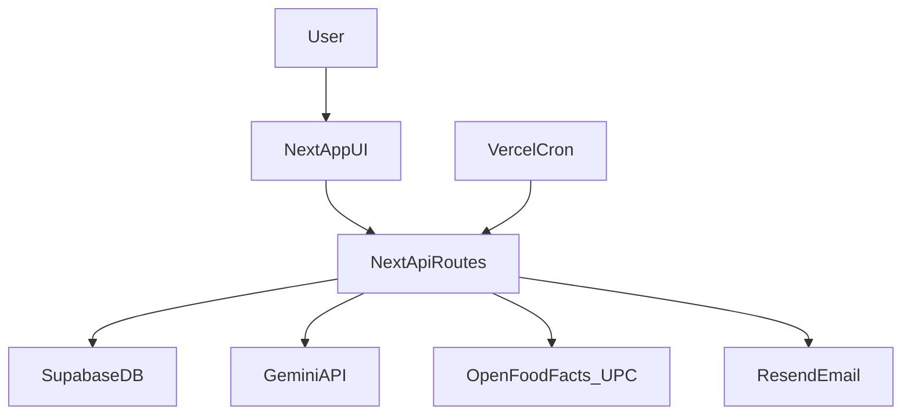

# NutriScan Master Project Context

This document is the single-source project context for future AI chats.  
Use it as the first message context when starting a new thread.

## 1) Project Identity

- Product name in code/UI: **NutriScan** (also appears as **HealthOX** in several files/strings).
- Purpose: scan packaged foods (barcode/photo), analyze health impact with Gemini AI, log meals, track nutrition, and send weekly email reports.
- Target style: mobile-first, consumer nutrition guidance, India-focused recommendations (FSSAI/ICMR/WHO references).

## 2) Tech Stack

- Framework: Next.js App Router (`next` 16) + React 18 + TypeScript.
- Auth/session: NextAuth (Google provider).
- Database/backend service: Supabase (client + service-role admin usage).
- AI: Google Gemini API wrapper in `src/lib/gemini.ts`.
- Styling: Tailwind + custom CSS variables.
- State/data fetching: TanStack React Query.
- Analytics: Google Analytics helper.
- Email: Resend API.
- Tests: Vitest + Testing Library; very limited coverage.
- Deployment assumptions: Vercel (cron endpoint configured in `vercel.json`).

## 3) High-Level Architecture



## 4) Runtime Entrypoints

- App shell: `src/app/layout.tsx` (providers, error boundary, bottom nav, service worker register).
- Root route: `src/app/page.tsx` redirects to sign-in.
- Main app pages:
  - `src/app/auth/signin/page.tsx`
  - `src/app/scan/page.tsx`
  - `src/app/dashboard/page.tsx`
  - `src/app/history/page.tsx`
  - `src/app/scan-history/page.tsx`
  - `src/app/profile-setup/page.tsx`
- API entrypoints: all `src/app/api/**/route.ts`.
- Scheduled job: `GET /api/cron/weekly-report` (called by Vercel cron).

## 5) Core User Flows

### Scan + Analyze Flow

1. User scans barcode/photo in `src/app/scan/page.tsx`.
2. Barcode lookup hits `GET /api/scan`:
   - cache (`products` table) -> Open Food Facts -> UPC Item DB fallback.
3. Product is analyzed via `POST /api/analyze`:
   - validates payload with Zod.
   - optional user profile personalization.
   - calls Gemini wrapper.
   - optionally caches AI analysis in `products`.
4. If logged in, scan summary is stored through `POST /api/scan-session`.

### Vision/Product-Photo Flow

- `POST /api/scan-vision` and `POST /api/scan-product-photo` extract data from images via Gemini.
- Extracted products may be persisted via `POST /api/products/submit`.

### Meal Logging + Dashboard Flow

1. Scan page sends meal logs to `POST /api/log`.
2. Dashboard page reads profile API + direct Supabase meal logs query.
3. Dashboard widgets call:
   - `/api/streak`
   - `/api/nutrients/summary`
   - `/api/last-scan`

### Email Flow

- New-user sign-in callback triggers `/api/welcome-email`.
- Weekly digest cron aggregates user data and sends emails via Resend.
- Unsubscribe links point to `/api/unsubscribe?userId=...&type=...`.

## 6) Data Model (Inferred from Usage)

The app strongly assumes these tables/columns exist:

- `user_profiles`:
  - identity + profile (`user_id`, `email`, `name`, health fields)
  - preferences (`weekly_report_email`, `email_unsubscribed`, `welcome_email_sent`)
- `products`:
  - barcode/product metadata and nutrition
  - AI fields (`ai_health_rating`, `ai_analysis_json`, `ai_analyzed_at`)
- `food_logs`:
  - per-user meal entries (`quantity_g`, calories/macros, `meal_type`, `logged_at`)
- `scan_sessions`:
  - recent scan snapshots and AI score/rating
- `rate_limits`:
  - request tracking per `user_id` + `action` + timestamp

## 7) Environment Contract

From `.env.local.example` and code usage:

- Auth: `NEXTAUTH_URL`, `NEXTAUTH_SECRET`, Google OAuth vars.
- Supabase: `NEXT_PUBLIC_SUPABASE_URL`, `NEXT_PUBLIC_SUPABASE_ANON_KEY`, `SUPABASE_SERVICE_ROLE_KEY`.
- AI: `GEMINI_API_KEY`.
- Email: `RESEND_API_KEY`.
- Cron security: `CRON_SECRET`.
- Analytics: `NEXT_PUBLIC_GA_MEASUREMENT_ID`.

Notes:
- Code also references Open Food Facts contribution credentials (`OFF_USERNAME`, `OFF_PASSWORD`) in product submit/scripting paths, but these are not listed in `.env.local.example`.

## 8) File-by-File Map (Authored Files)

### Root / Config

- `package.json`: scripts + dependency manifest.
- `README.md`: default Next.js boilerplate; not project-specific.
- `.env.local.example`: environment template.
- `.gitignore`: ignore patterns for local/build/env/data outputs.
- `.eslintrc.json`: relaxed rule set (many safety rules disabled).
- `next.config.mjs`: image domains + security headers + standalone output.
- `postcss.config.mjs`: Tailwind PostCSS plugin.
- `tailwind.config.ts`: theme/tailwind scanning config.
- `tsconfig.json`: strict TS with alias config.
- `vercel.json`: weekly cron schedule.
- `vitest.config.ts`: Vitest + jsdom + setup mapping.

### App Pages

- `src/app/layout.tsx`: global metadata/layout/providers/nav.
- `src/app/page.tsx`: redirect to sign-in.
- `src/app/dashboard/page.tsx`: dashboard composition + daily totals.
- `src/app/history/page.tsx`: meal history by date/meal filter.
- `src/app/scan/page.tsx`: main scanner/analyzer orchestration (very large component).
- `src/app/scan-history/page.tsx`: list of previously scanned items.
- `src/app/profile-setup/page.tsx`: profile and email preferences wizard.
- `src/app/auth/signin/page.tsx`: sign-in + guest mode.
- `src/app/privacy/page.tsx`: privacy static page.
- `src/app/terms/page.tsx`: terms static page.
- `src/app/globals.css`: global theme/layout/animation styles.

### API Routes

- `src/app/api/auth/[...nextauth]/route.ts`: NextAuth config + profile upsert + welcome-email trigger.
- `src/app/api/scan/route.ts`: barcode data retrieval with multi-source fallback.
- `src/app/api/analyze/route.ts`: AI nutrition risk analysis pipeline.
- `src/app/api/analyze/analyze.test.ts`: tests for analyze behavior.
- `src/app/api/scan-product-photo/route.ts`: full product extraction from image.
- `src/app/api/scan-vision/route.ts`: label/vision extraction for not-found products.
- `src/app/api/products/submit/route.ts`: persist extracted product + optional OFF sync.
- `src/app/api/profile/route.ts`: profile read/write and metric calculations.
- `src/app/api/profile/email-prefs/route.ts`: save email preference flags.
- `src/app/api/log/route.ts`: create food log entry.
- `src/app/api/log/delete/route.ts`: delete food log entry.
- `src/app/api/scan-session/route.ts`: save/update recent scan records.
- `src/app/api/last-scan/route.ts`: fetch latest scanned item.
- `src/app/api/streak/route.ts`: compute current/longest logging streak.
- `src/app/api/nutrients/summary/route.ts`: weekly nutrient summary and alerts.
- `src/app/api/welcome-email/route.ts`: onboarding email send endpoint.
- `src/app/api/unsubscribe/route.ts`: unsubscribe HTML + preference updates.
- `src/app/api/cron/weekly-report/route.ts`: scheduled weekly nutrition report sender.

### Components

- `src/components/Providers.tsx`: session/query/theme/toast providers.
- `src/components/BottomNav.tsx`: mobile nav with auth-aware links.
- `src/components/ErrorBoundary.tsx`: app-level React boundary.
- `src/components/ServiceWorkerRegister.tsx`: SW registration.
- `src/components/Skeleton.tsx`: loading placeholders.
- `src/components/Analytics.tsx`: GA integration.

Dashboard widgets:
- `src/components/dashboard/CalorieRing.tsx`
- `src/components/dashboard/WeeklyChart.tsx`
- `src/components/dashboard/RecentScans.tsx`
- `src/components/dashboard/MealStreak.tsx`
- `src/components/dashboard/NutrientAlerts.tsx`
- `src/components/dashboard/LastScanned.tsx`

Scanner widgets:
- `src/components/scanner/BarcodeScanner.tsx`
- `src/components/scanner/AnalysisCard.tsx`

### Lib / Types / Test Setup

- `src/lib/supabase.ts`: browser Supabase client.
- `src/lib/supabaseAdmin.ts`: server privileged Supabase client.
- `src/lib/gemini.ts`: Gemini API wrapper + retry/error mapping.
- `src/lib/rateLimit.ts`: DB-backed request limiter.
- `src/lib/analytics.ts`: analytics helper/events.
- `src/types/index.ts`: shared TS domain types.
- `src/test/setup.ts`: test environment setup.

### Scripts / Public Assets

- `scripts/import-off-india.ts`: import OFF dataset file into Supabase.
- `scripts/scrape-indian-products.ts`: scrape + persist products from OFF.
- `public/manifest.json`: PWA metadata.
- `public/sw.js`: service worker cache logic.
- `public/icon.svg`: app icon asset.

## 9) Current Gaps, Risks, and Missing Pieces

### Correctness Risks (High)

- `src/app/history/page.tsx` uses `totalMeals` but never defines it (runtime error risk).
- `src/app/dashboard/page.tsx` imports default exports from files that export named functions (`CalorieRing`, `WeeklyChart`, `RecentScans`) and passes mismatched props to `RecentScans`.

### Security/Trust Risks

- Unsubscribe endpoint uses raw `userId` query params without signed token validation.
- Several routes rely on permissive logging (`console.log`) with potentially sensitive operational context.
- CSP still permits `'unsafe-inline'` and `'unsafe-eval'` scripts.
- Mixed client-side direct DB access vs server API access increases attack surface and inconsistency.

### Reliability/Scalability Risks

- `checkRateLimit` is count-then-insert, which is not atomic (race condition under concurrency).
- Weekly report cron sends emails in serial loop; may hit timeouts as users grow.
- AI JSON parsing is brittle; structured-output safeguards are limited.
- Scan page is monolithic and state-heavy; hard to maintain and test.

### Product/Data Quality Risks

- Health scoring and nutrient thresholds are heavily prompt-based and may drift per model behavior.
- RDA assumptions in nutrient summary are static defaults and not deeply personalized.
- Client can submit nutrient values when logging meals; route validates ranges but not source authenticity.

### Engineering Process Risks

- Very limited tests (primarily analyze route scenarios).
- Lint safeguards are intentionally relaxed (`any`, unused vars, hook deps disabled).
- README lacks project-specific onboarding, architecture, and runbook.

## 10) Optimization Backlog (Priority Order)

1. Fix dashboard/history correctness issues (export/import/prop mismatches and undefined variable).
2. Standardize data access: move user data reads behind server API routes where possible.
3. Replace non-atomic rate limiting with transactional/DB-native strategy.
4. Refactor `src/app/scan/page.tsx` into feature hooks/components (scan, analyze, logging, UI tabs).
5. Add integration tests for critical API routes (`scan`, `log`, `profile`, `cron`, `unsubscribe`).
6. Harden unsubscribe links with signed expiring tokens.
7. Reduce verbose production logs and centralize error logging.
8. Improve README with architecture diagram, env setup, DB schema assumptions, and troubleshooting.
9. Add observability metrics around AI failures, latency, and parse errors.
10. Improve weekly report throughput (batching/parallelism with retry limits).

## 11) Quick Commands

- Install: `npm install`
- Dev: `npm run dev`
- Build: `npm run build`
- Lint: `npm run lint`
- Test: `npm run test`

## 12) Reusable Starter Context for New AI Chats

Paste this block at the top of a new chat:

```text
Project: NutriScan (Next.js App Router + TypeScript).
Goal: AI-powered food scanner (barcode/photo), Gemini health analysis, meal logging, dashboard tracking, and weekly email reports.

Key architecture:
- Frontend pages in src/app/*
- API routes in src/app/api/*/route.ts
- Supabase clients in src/lib/supabase.ts and src/lib/supabaseAdmin.ts
- Gemini wrapper in src/lib/gemini.ts

Critical known issues:
- src/app/history/page.tsx references totalMeals without definition.
- src/app/dashboard/page.tsx likely has import/export and prop mismatches with dashboard components.
- Rate limiter in src/lib/rateLimit.ts is non-atomic.
- Unsubscribe endpoint uses userId query params without signed tokens.

When editing:
- Keep auth/session behavior intact.
- Preserve API contracts used by scan page and dashboard widgets.
- Prefer incremental refactors with tests for affected routes/components.

Use PROJECT_CONTEXT_MASTER.md as source of truth for full file map and optimization backlog.
```

## 13) Excluded from Deep Code Reasoning

Generated/vendor artifacts should not be treated as authored project logic:

- `node_modules/`
- `.next/`
- `out/`
- `build/`
- `coverage/`
- `.vercel/`
- generated cache/artifact files (e.g., tsbuildinfo, local exports)

